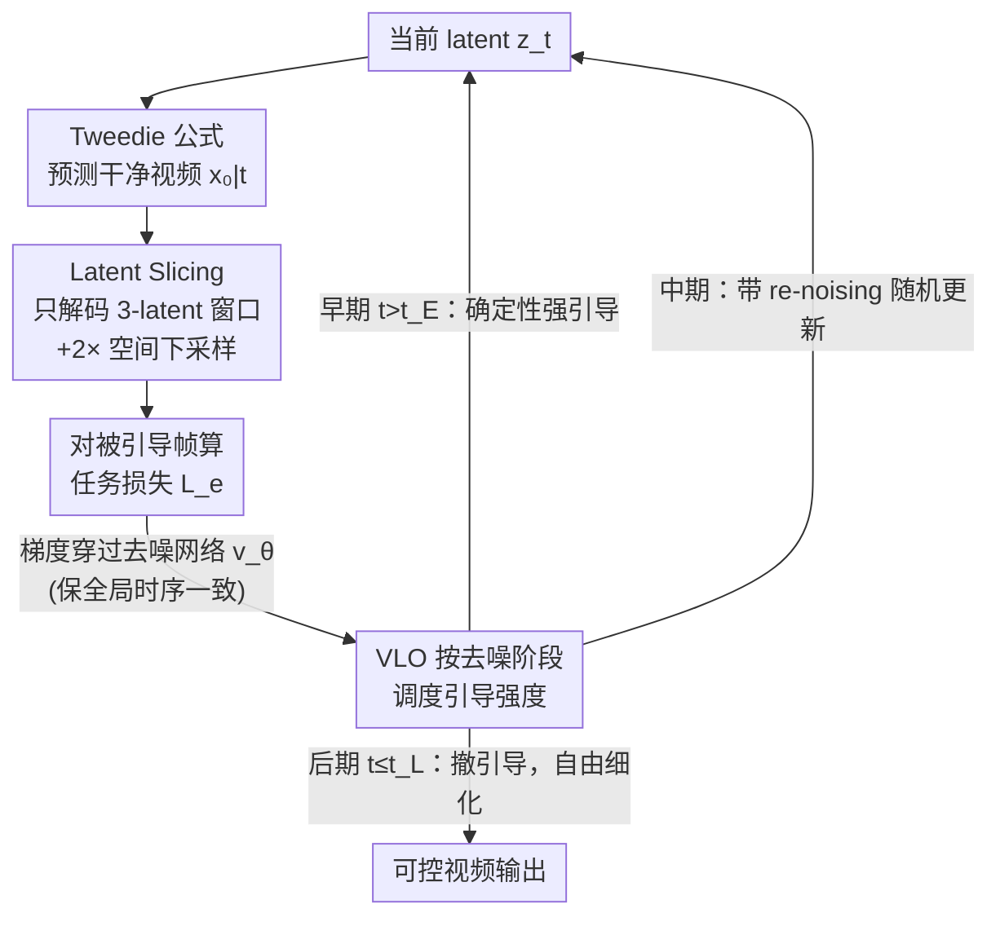

# Frame Guidance: Training-Free Guidance for Frame-Level Control in Video Diffusion Models

**会议**: ICLR 2026  
**arXiv**: [2506.07177](https://arxiv.org/abs/2506.07177)  
**代码**: [https://frame-guidance-video.github.io/](https://frame-guidance-video.github.io/)  
**领域**: 扩散模型 / 视频生成  
**关键词**: 无训练引导, 视频扩散模型, 帧级控制, 关键帧生成, 风格化视频  

## 一句话总结

提出 Frame Guidance，一种无需训练的帧级引导方法，通过 latent slicing（降低 60× 显存）和 Video Latent Optimization（VLO）两个核心组件，在不修改模型的情况下实现关键帧引导、风格化和循环视频等多种可控视频生成任务。

## 研究背景与动机

**可控视频生成需求增长**：随着视频扩散模型质量提升，用户对细粒度控制的需求日益迫切

**训练式方法不经济**：现有方法通常需要对大规模 VDM 进行微调，随着模型规模（如 Wan 14B）增长，微调成本越来越不可行

**无训练方法的通用性不足**：已有无训练方法（如 CamTrol、MotionClone）仅适用于特定任务，缺乏通用框架

**视频 CausalVAE 的显存瓶颈**：CausalVAE 的因果依赖要求解码全序列才能重建单帧，导致梯度计算显存超过 650GB

**现有引导策略对视频不适用**：图像领域的 time-travel trick 在视频早期步骤中会冲刷引导信号

**双重目标难以兼顾**：同时满足"模型无关 + 无训练"和"通用多任务"两个条件的方法尚属空白

## 方法详解

### 整体框架

Frame Guidance 不动预训练视频扩散模型（VDM）的任何参数，而是在采样的每一步做一次"引导矫正"：先按 Tweedie 公式从当前 latent $z_t$ 预测出干净视频 $x_{0\vert t}$，把用户关心的若干帧解码成像素，对这些帧算一个任务损失 $\mathcal{L}_e$，再把损失的梯度回传去微调 $z_t$，然后继续下一步去噪。整个方法的难点全在"怎么算得起这个梯度"和"什么时候算才有用"两件事上——前者靠 Latent Slicing 把解码显存压下来，后者靠 Video Latent Optimization（VLO）把引导强度集中在去噪早期；二者配合，才让大模型上的帧级引导第一次在单卡上变得可行。

### 关键设计

**1. Latent Slicing：把 CausalVAE 的全序列解码缩成一个小窗口**

视频引导卡在显存上：CausalVAE 的因果依赖意味着要重建任意一帧都得解码整条 latent 序列，对它求梯度的显存高达 650GB 以上，根本没法在单卡上跑。作者观察到一个反直觉的事实——CausalVAE 虽然设计成因果结构，实际扰动一个 latent 只会影响相邻的少数几帧，呈现出明显的时间局部性（temporal locality）。于是重建第 $i$ 帧时不必解码全序列，只取一个 3 个 latent 的窗口来解，仅此一步就把显存降到约 $15\times$ 以下；再叠加对 latent 做 $2\times$ 空间下采样后才进 VAE 算损失，两步合计把引导所需显存最多压低 **60×**，单张 GPU 就能对 Wan-14B 这种 14B 量级的模型施加帧级引导。下采样还有个意外收益：分辨率降低反而弱化了纹理细节、突出语义结构，引导信号更聚焦。

**2. 梯度穿过去噪网络：让少数引导帧管住整段视频**

即使只对切片出来的少数帧算损失，更新也不能图省事直接改那几帧的 latent。引导梯度必须通过去噪网络 $v_\theta$ 回传到 $z_t$，才能从被引导的帧扩散到整段视频、维持时序一致性；若用 shortcut 式更新（跳过网络直接改像素或 latent），影响就被锁死在被引导帧上，相邻帧跟不上、画面会在引导帧处出现时序断裂。换句话说，Latent Slicing 省的是"解码"那一段的开销，但"梯度过网络"这一段必须保留——它正是少数引导帧能控制整个视频的传导路径。

**3. Video Latent Optimization：按去噪阶段分配引导强度**

图像领域常用的 time-travel trick（反复加噪-去噪来回拉）搬到视频上会把早期引导信号冲刷掉，而视频帧的全局布局恰恰在去噪最初几步就已基本定型，早期引导对时序一致性最关键。VLO 据此把采样轨迹切成三段差异化处理：早期（$t > t_E$）用确定性更新 $z_t \leftarrow z_t - \eta \nabla_{z_t} \mathcal{L}_e$，把引导信号牢牢保住；中期（$t_E \geq t > t_L$）改用带 re-noising（重新注入噪声）的随机更新，修正前期累积的误差；后期（$t \leq t_L$）撤掉引导，让模型自由细化纹理细节。强引导只花在"决定布局"的早期，既保住了控制力又不破坏画质。

### 损失函数 / 训练策略

Frame Guidance 的通用性来自同一套引导框架可以挂不同的帧级损失 $\mathcal{L}_e$，换损失即换任务，无需为每个任务训练。其中 $x_{0\vert t}^i$ 是第 $i$ 帧的当前预测，$\mathcal{I}$ 是被引导帧集合，$\Psi$ 表示对应的特征编码器（如风格用 CSD、通用条件用深度/边缘提取器）：

| 任务 | 损失函数 |
|------|----------|
| 关键帧引导 | $\mathcal{L}_e = \sum_{i \in \mathcal{I}} \|x_*^i - x_{0\vert t}^i\|_2^2$ |
| 风格化 | $\mathcal{L}_e = -\sum_{i \in \mathcal{I}} \cos(\Psi(x_{\text{style}}), \Psi(x_{0\vert t}^i))$ |
| 循环视频 | $\mathcal{L}_e = \|x_{0\vert t}^1 - x_{0\vert t}^L\|_2^2$ |
| 通用条件（深度/边缘） | $\mathcal{L}_e = \sum_{i \in \mathcal{I}} \|\Psi(x_*^i) - \Psi(x_{0\vert t}^i)\|_2^2$ |

## 实验关键数据

### 关键帧引导（DAVIS 数据集）

| 方法 | 训练 | FID ↓ | FVD ↓ |
|------|------|-------|-------|
| CogX-I2V | ✓ | 60.36 | 890.1 |
| TRF (无训练) | ✓ | 62.07 | 923.1 |
| **Ours (CogX, I+F)** | ✓ | 57.62 | 613.4 |
| **Ours (CogX, I+M+F)** | ✓ | 55.60 | 577.1 |
| SVD-Interp (微调) | ✗ | 63.89 | 800.3 |
| CogX-Interp (微调) | ✗ | 46.59 | 506.0 |

### Pexels 数据集

| 方法 | FID ↓ | FVD ↓ |
|------|-------|-------|
| CogX-I2V | 74.98 | 1122.6 |
| **Ours (Wan-14B, I+M+F)** | 71.63 | 904.8 |
| **Ours (CogX, I+M+F)** | 68.97 | 989.3 |

**关键发现**：无训练的 Frame Guidance 在多数指标上超越训练式 SVD-Interp，仅略低于专门微调的 CogX-Interp。

## 亮点与洞察

1. **CausalVAE temporal locality 的发现**：虽然设计为因果，但实际呈现时间局部性——这一发现使显存降低 60× 成为可能
2. **VLO 的分阶段策略**：不同于图像的统一 time-travel，针对视频的时序特性设计确定性/随机性分阶段优化
3. **模型无关性**：在 CogVideoX、LTX-Video、Wan-14B 三种不同 VDM 上均有效
4. **极高的灵活性**：支持任意关键帧位置、多种条件信号、多种任务，无需为每个任务训练
5. **引导帧数可少**：仅引导少数帧即可通过网络梯度传播控制整个视频

## 局限与展望

1. 推理速度较慢（不超过基础模型 4× 的约束下工作），且引导步数和步长需手动调参
2. 关键帧引导不是像素级精确匹配，而是视觉相似性引导
3. 风格化依赖 CSD 等特定风格编码器的质量
4. 对于高动态场景（如快速运动、场景切换），早期步骤的布局确定可能不够充分
5. 尚未探索音频、文本等更多模态条件的引导

## 相关工作与启发

- **Universal Guidance (Bansal et al., 2024)**：图像领域 training-free guidance 的基础，本文将其拓展到视频
- **TRF (Feng et al., 2024)**：无训练 SVD 帧插值，但缺乏通用性；Frame Guidance 通过帧级损失设计实现更广泛的任务
- **CogX-Interp**：微调式关键帧插值方法，精度更高但需训练
- 启发：CausalVAE 的 temporal locality 特性可能被其他 training-free 方法（如编辑、修复）所利用

## 评分

- 新颖性: ⭐⭐⭐⭐ — Latent Slicing 和 VLO 都是针对视频场景的巧妙设计
- 实验充分度: ⭐⭐⭐⭐ — 多模型、多任务、多数据集验证
- 写作质量: ⭐⭐⭐⭐⭐ — 结构清晰，分析深入，图示出色
- 价值: ⭐⭐⭐⭐⭐ — 在大模型时代的实用性极强，无训练方法的重要里程碑

<!-- RELATED:START -->

## 相关论文

- [\[CVPR 2026\] FlowMotion: Training-Free Flow Guidance for Video Motion Transfer](../../CVPR2026/video_generation/flowmotion_training-free_flow_guidance_for_video_motion_transfer.md)
- [\[CVPR 2026\] When to Lock Attention: Training-Free KV Control in Video Diffusion](../../CVPR2026/video_generation/when_to_lock_attention_training-free_kv_control_in_video_diffusion.md)
- [\[ICLR 2026\] Target-Aware Video Diffusion Models](target-aware_video_diffusion_models.md)
- [\[ICML 2026\] Enhancing Train-Free Infinite-Frame Generation for Consistent Long Videos](../../ICML2026/video_generation/enhancing_train-free_infinite-frame_generation_for_consistent_long_videos.md)
- [\[ICLR 2026\] LoRA-Edit: Controllable First-Frame-Guided Video Editing via Mask-Aware LoRA Fine-Tuning](lora-edit_controllable_first-frame-guided_video_editing_via_mask-aware_lora_fine.md)

<!-- RELATED:END -->
