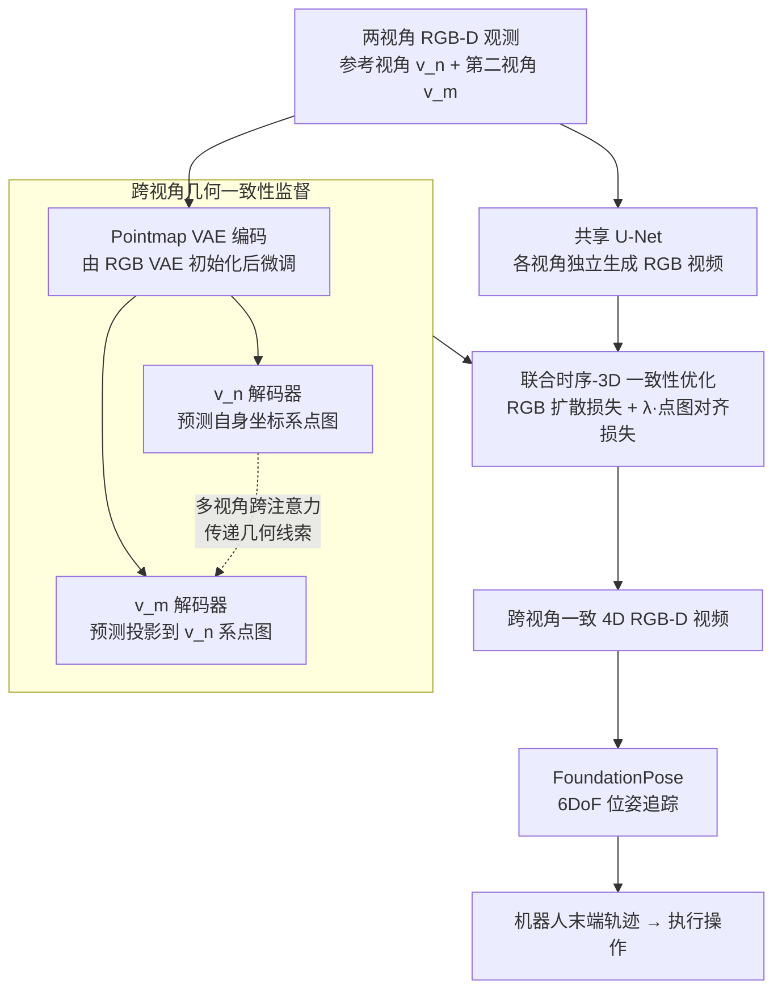

# Geometry-aware 4D Video Generation for Robot Manipulation

**会议**: ICLR 2026  
**arXiv**: [2507.01099](https://arxiv.org/abs/2507.01099)  
**代码**: [项目主页](https://robot4dgen.github.io/)  
**领域**: 视频生成  
**关键词**: 4D视频生成, 机器人操作, 跨视角一致性, 点图对齐, 位姿估计

## 一句话总结
本文提出几何感知的4D视频生成框架，通过跨视角点图对齐监督训练视频扩散模型，联合预测RGB和点图实现时空一致的多视角RGB-D视频，无需相机位姿输入即可在新视角下生成一致视频并用现成6DoF位姿追踪器恢复机器人末端轨迹。

## 研究背景与动机

1. **领域现状**: 视频生成模型（SVD等）作为视觉动力学模型用于机器人规划日益受到关注。直接从预测视频中提取机器人动作的方法包括逆动力学模型、行为克隆和基于RGB的位姿追踪。
2. **现有痛点**: (1)像素空间视频模型擅长短期运动但缺乏3D结构理解，导致闪烁/变形/物体消失；(2) 3D感知方法强制几何约束但限于简单静态背景，难以扩展到复杂多物体场景；(3)现有方法在新相机视角下性能严重退化。
3. **核心矛盾**: 时序一致性和3D一致性难以兼顾。单视角预测缺乏几何定位，多视角方法要么分别优化时空一致性要么仅处理白背景单物体。
4. **本文目标**: 如何生成同时具有时序连贯性和跨视角3D一致性的4D视频，并从中恢复机器人操作轨迹？
5. **切入角度**: 借鉴DUSt3R的跨视角点图对齐思想，将其适配到视频生成任务中，在训练时监督模型将一个视角的点图预测投影到另一个视角的坐标系。
6. **核心 idea**: 用跨视角点图对齐作为几何监督训练视频扩散模型，学习共享3D场景表示，推理时无需相机位姿即可生成跨视角一致的4D视频。

## 方法详解

### 整体框架
方法在 Stable Video Diffusion（SVD）之上扩展，让模型对每个视角同时预测 RGB 视频和点图（pointmap）序列，把"会动"的像素和"有几何"的 3D 结构绑进同一个扩散过程。RGB 这一路里各视角在自己坐标系下用同一个共享 U-Net 独立生成；几何这一路则是非对称的——参考视角 $v_n$ 预测自身坐标系下的点图 $X_t^n$，第二视角 $v_m$ 不预测自己坐标系的点图，而是预测它投影到 $v_n$ 坐标系后的点图 $X_t^{m \to n}$，训练时用这种跨视角对齐当几何监督，迫使两个视角收敛到同一套共享 3D 场景表示。两个视角的点图分支用一对独立权重的解码器，靠跨注意力把参考视角的几何线索传给第二视角。RGB 损失和点图 3D 对齐损失联合优化，最终产出跨视角一致的 4D RGB-D 视频；再把视频喂给现成的 6DoF 位姿追踪器（FoundationPose）即可恢复机器人末端轨迹，闭环到真实操作。

### 关键设计

**1. 跨视角几何一致性监督：用点图对齐把两个视角钉到同一个 3D 坐标系**

单视角视频模型最大的毛病是没有几何锚点，物体会闪烁、变形甚至消失。本文借鉴 DUSt3R 在静态重建里验证过的思路——跨视角点图对齐是强制 3D 一致性最直接的监督信号——把它搬到视频生成上。具体做法是让参考视角 $v_n$ 预测自身点图 $X_t^n$，让第二视角 $v_m$ 预测的点图直接落在 $v_n$ 的坐标系里得到 $X_t^{m \to n}$，两路都用扩散损失约束：

$$\mathcal{L}_{\text{3D-diff}}(t') = \mathbb{E}\|z_{t'}^n(0) - f_\theta(z_{t'}^n(k), k, c^n)\|^2 + \mathbb{E}\|z_{t'}^{m \to n}(0) - f_\theta(z_{t'}^{m \to n}(k), k, c^m)\|^2$$

训练阶段需要已知相机位姿来算出这个投影关系并生成监督真值，但模型一旦学会，推理时就能只凭单帧 RGB-D 输入预测另一视角在参考坐标系中的点图，**无需把相机位姿作为输入**——视角间的几何映射已经内化进了网络权重，这也是它在标定成本敏感的真实部署里很有价值的原因。

**2. 多视角跨注意力机制：用不对称的双解码器把几何线索从参考视角传过去**

RGB 预测里各视角都在自己坐标系下独立生成，共享同一个 U-Net 即可；但点图预测是非对称的——$v_n$ 预测自身、$v_m$ 却要预测 $v_n$ 坐标系下的点图，这要求 $v_m$ 分支能"看到"$v_n$ 的几何。为此点图的解码器（decoder）拆成两个架构相同、权重独立的分支，并在中间插入跨注意力层：$v_n$ 解码器的中间特征经跨注意力传到 $v_m$ 解码器的对应层，使 $v_m$ 能关注并吸收参考视角的几何信息，准确地把点图预测到 $v_n$ 坐标系里。这个不对称信息流是整个一致性的关键开关：消融里去掉跨注意力后，Task1 的跨视角一致性 mIoU 从 0.70 直接掉到 0.41。

**3. 联合时序-3D 一致性优化：让 SVD 的运动先验和点图的几何约束互补**

时序连贯和 3D 一致以往很难兼顾，本文把两者放进同一个加权损失里联合优化：

$$\mathcal{L} = \sum_{t'}[\underbrace{\mathcal{L}_{\text{diff}}^n(t') + \mathcal{L}_{\text{diff}}^m(t')}_{\text{RGB 损失}} + \lambda \cdot \underbrace{\mathcal{L}_{\text{3D-diff}}(t')}_{\text{点图损失}}]$$

取 $\lambda=1$，前两项是两个视角的 RGB 扩散损失、第三项是点图的 3D 对齐损失。点图分支单独配一个 Pointmap VAE，从预训练 RGB VAE 初始化后在点图数据上微调，再走和 RGB 同样的隐空间扩散。这样模型既能继承 SVD 大规模视频预训练带来的强时序先验（运动知识），又能被点图监督拉住几何约束，二者形成互补而非互相妥协。

### 损失函数 / 训练策略
训练为双视角配对，需要已知相机位姿来计算投影点图的 groundtruth。数据上每个任务采集 25 个演示 × 16 个相机视角 = 400 段视频，其中 12 个视角用于训练、4 个未见视角用于测试，以此检验模型是否真正学到可泛化的 3D 表示而非记忆固定视角。

## 实验关键数据

### 主实验

| 方法 | 跨视角一致性mIoU↑ | FVD-nn↓ | FVD-mm↓ | AbsRel-nn↓ | δ1-nn↑ |
|--------|------|------|----------|------|------|
| 4D Gaussian | 0.39-0.46 | 1208-1396 | 815-1192 | 0.18-0.33 | 0.43-0.80 |
| SVD | — | 370-977 | 417-743 | — | — |
| SVD w/ MV attn | — | 536-942 | 445-767 | — | — |
| Ours w/o MV attn | 0.26-0.44 | 451-597 | 302-607 | 0.10-0.15 | 0.75-0.89 |
| **Ours** | **0.64-0.70** | **378-491** | **258-561** | **0.03-0.06** | **0.95-0.98** |

### 消融实验

| 配置 | mIoU↑ | AbsRel↓ | 说明 |
|------|---------|------|------|
| Full model | 0.64-0.70 | 0.03-0.06 | 跨注意力+跨视角监督 |
| w/o MV attention | 0.26-0.44 | 0.10-0.15 | 去掉跨视角注意力，一致性大幅下降 |
| SVD baseline | — | — | 仅RGB无3D监督 |

机器人操作成功率（新视角）:

| 任务 | 本文 | 基线 |
|------|------|------|
| StoreCerealBoxUnderShelf | 较高 | 较低 |
| PutSpatulaOnTable | 较高 | 较低 |
| PlaceAppleFromBowlIntoBin | 较高 | 较低 |

### 关键发现
- 跨视角注意力是3D一致性的关键：去掉后mIoU从0.70降到0.41（Task1）
- 本文方法在新视角（训练中未见）上仍保持良好一致性，说明模型学到了泛化的3D表示
- 点图预测的深度质量极高：AbsRel仅0.03-0.06，远优于4D Gaussian的0.20+
- 推理时无需相机位姿输入这一特性对实际部署极为重要——避免了位姿标定
- 从4D视频中用FoundationPose恢复的末端轨迹可直接控制机器人执行任务

## 亮点与洞察
- **训练用位姿、推理不用位姿**的设计巧妙：模型内化了视角几何映射
- DUSt3R思想从静态重建扩展到4D视频生成的自然迁移
- 联合RGB+点图预测（而非仅RGB或仅深度）提供了最完整的4D信息
- 末端执行器位姿追踪实现了从生成到控制的完整闭环
- 双手操作任务（PlaceAppleFromBowlIntoBin）验证了长时间范围的有效性

## 局限与展望
- 仅支持双视角，未扩展到更多视角
- 每任务需25个演示+16视角，数据获取成本不低
- 基于SVD的底层模型可能限制视觉质量
- 夹爪状态推断通过简单距离阈值，不够鲁棒
- 实际机器人实验仅在仿真中完成，真实世界验证有限

## 相关工作与启发
- **vs DUSt3R**: 后者用于静态3D重建，本文将跨视角点图对齐扩展到视频生成
- **vs 4D Gaussian**: 分别优化时间/空间一致性，本文联合优化更紧密
- **vs UniPi/SuSIE**: 从视频提取动作但不考虑3D一致性
- **vs CamAnimate/CameraCtrl**: 需要相机位姿作为推理输入

## 评分
- 新颖性: ⭐⭐⭐⭐ DUSt3R→4D视频生成的迁移+训练用位姿推理不用的设计
- 实验充分度: ⭐⭐⭐⭐ 仿真3任务+真实4任务，但真实世界操作实验有限
- 写作质量: ⭐⭐⭐⭐ 问题定义清晰，方法描述详细
- 价值: ⭐⭐⭐⭐ 4D视频生成→机器人操作的完整闭环具有重要实用意义

<!-- RELATED:START -->

## 相关论文

- [\[ICLR 2026\] Learning Video Generation for Robotic Manipulation with Collaborative Trajectory Control](learning_video_generation_for_robotic_manipulation_with_collaborative_trajectory.md)
- [\[CVPR 2026\] StereoWorld: Geometry-Aware Monocular-to-Stereo Video Generation](../../CVPR2026/video_generation/stereoworld_geometry-aware_monocular-to-stereo_video_generation.md)
- [\[CVPR 2026\] SeeU: Seeing the Unseen World via 4D Dynamics-aware Generation](../../CVPR2026/video_generation/seeu_seeing_the_unseen_world_via_4d_dynamics-aware_generation.md)
- [\[CVPR 2026\] Geometry-as-context: Modulating Explicit 3D in Scene-consistent Video Generation to Geometry Context](../../CVPR2026/video_generation/geometry-as-context_modulating_explicit_3d_in_scene-consistent_video_generation_.md)
- [\[ICLR 2026\] Target-Aware Video Diffusion Models](target-aware_video_diffusion_models.md)

<!-- RELATED:END -->
