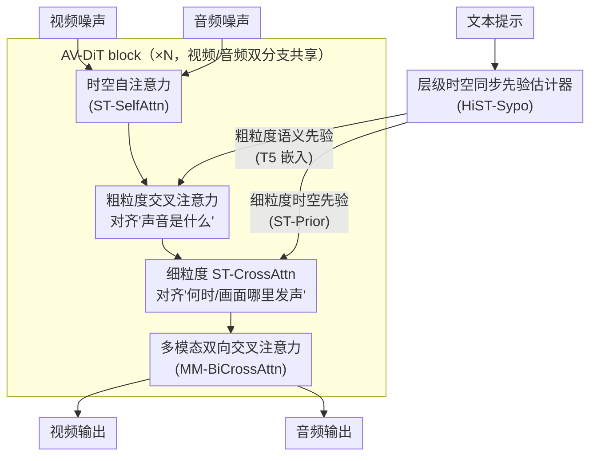

# JavisDiT: Joint Audio-Video Diffusion Transformer with Hierarchical Spatio-Temporal Prior Synchronization

**会议**: ICLR 2026  
**arXiv**: [2503.23377](https://arxiv.org/abs/2503.23377)  
**代码**: [https://javisverse.github.io/JavisDiT-page/](https://javisverse.github.io/JavisDiT-page/)  
**领域**: 扩散模型 / 视频生成  
**关键词**: 音视频联合生成, DiT, 时空同步, 对比学习, 基准数据集  

## 一句话总结

提出 JavisDiT，基于 DiT 架构的音视频联合生成模型，通过层级化时空同步先验估计器（HiST-Sypo）实现细粒度的音视频时空对齐；同时构建了新基准 JavisBench（10K 复杂场景样本）和新评估指标 JavisScore。

## 研究背景与动机

**音视频联合生成（JAVG）的兴起**：音频和视频在现实场景中天然耦合，联合生成对影视制作和短视频创作有重要价值

**异步级联方法的局限**：先生成音频再合成视频（或反之）会累积噪声，端到端方法更有前景

**现有 DiT 骨干的空间时序建模不足**：AV-DiT 和 MM-LDM 使用图像 DiT，难以建模精细时空关系

**同步对齐策略的粗糙**：现有方法仅实现粗粒度的时间对齐（参数共享）或语义对齐（嵌入对齐），缺乏空间维度的细粒度同步

**评估基准的简单性**：AIST++ 和 Landscape 等数据集场景单一，无法反映真实世界的复杂多事件场景

**评估指标的缺陷**：AV-Align 依赖光流和音频 onset 检测，在复杂场景下不可靠

## 方法详解

### 整体框架

JavisDiT 要解决的是音视频联合生成（joint audio-video generation, JAVG）里"音画对不上"的问题，尤其是空间维度的对齐。它把生成做成一个对称的双分支 DiT：视频分支和音频分支各自有独立的去噪流，但共享同一套 AV-DiT block 设计。流程上，文本提示先送进一个层级时空同步先验估计器（HiST-Sypo），同时产出"粗粒度语义先验"（直接复用 T5 嵌入）和"细粒度时空先验"（ST-Prior）。在每个 AV-DiT block 内，两路特征先各自做时空自注意力（ST-SelfAttn）建模模态内部的结构，再用粗粒度语义先验做交叉注意力对齐"声音是什么"，接着用细粒度时空先验做 ST-CrossAttn 对齐"什么时候、在画面哪里发声"，最后通过多模态双向交叉注意力（MM-BiCrossAttn）让两个模态互相注入信息。整套设计的核心是把"同步"从粗糙的参数共享，拆成层级化的语义对齐 + 细粒度时空先验对齐两层。

### 关键设计

**1. 层级时空同步先验估计器（HiST-Sypo）：解决空间维度同步缺失的问题**

以往方法只能对齐"什么时候发声"这种时间信息，缺乏"在画面哪里发声"的空间约束，导致音画在空间上对不上。HiST-Sypo 把同步先验拆成两层：粗粒度层直接复用 T5 编码器的语义嵌入描述整体声音事件；细粒度层则单独估计一组时空先验。具体做法是把 ImageBind 文本编码器的 77 个隐状态喂给一个 4 层 Transformer encoder-decoder $\mathcal{P}$，用 $N_s = 32$ 个空间查询 token 和 $N_t = 32$ 个时间查询 token 去解码，输出一个高斯分布的均值和方差，再从中采样得到随机的时空先验 $(p_s, p_t) \leftarrow \mathcal{P}_\phi(s; \epsilon)$。采样而非确定性输出是有意为之——同一段文本描述对应的发声位置和时刻本身就存在不确定性，用分布建模才能覆盖这种多样性。

为了让这组先验真正捕捉到"同步"而不是随便编码点信息，估计器用对比学习来训练：正样本是天然同步的音视频对，负样本则人为构造异步对（时间错位或空间错位），用专用的对比损失拉近同步对、推开异步对，迫使先验学到跨模态的时空一致性表征。

**2. 多模态双向交叉注意力（MM-BiCrossAttn）：解决跨模态信息单向流动的问题**

单向交叉注意力只能让一个模态去看另一个模态，信息流是不对称的。这里让视频和音频互相读取彼此：先用视频的 query $q_v$ 和音频的 key $k_a$ 算出一张注意力矩阵 $A$，然后 $A \times v_a$ 得到音频注入视频的方向，复用同一张矩阵的转置 $A^T \times v_v$ 得到视频注入音频的方向。一次注意力计算同时打通两个方向的信息流，让两路特征在每个 block 里深度耦合，而不是各管各的最后简单拼接。

### 损失函数 / 训练策略

整体走三阶段渐进式训练，逐步从单模态能力过渡到联合生成。第一阶段在 0.8M 音频-文本对上做音频预训练，并用 OpenSora 的视频分支权重来初始化音频分支，省去从零学声学结构的代价。第二阶段在 0.6M 同步音视频三元组上单独训练 HiST-Sypo 估计器，让它先学会从文本估计出可靠的时空先验。第三阶段在 0.6M 样本上做联合生成训练，此时冻结已经稳定的单模态自注意力（SA）块和 ST-Prior 估计器，只训练负责对齐与融合的 ST-CrossAttn 和 Bi-CrossAttn，既省算力又避免破坏前面学好的表征。

训练用到三类信号：扩散去噪损失（FlowMatching 或 DDPM 形式）保证生成质量，ST-Prior 估计器的对比学习损失（同步正样本 vs 异步负样本）保证先验的同步性，再配合动态时间 masking 让同一模型支持文生音视频、音频补视频等多种条件任务。

## 实验关键数据

### JavisBench 主要结果

| 方法 | FVD ↓ | FAD ↓ | TV-IB ↑ | AV-IB ↑ | JavisScore ↑ |
|------|-------|-------|---------|---------|-------------|
| TempoToken (T2A→A2V) | 539.8 | - | 0.084 | - | - |
| MM-Diffusion (JAVG) | - | - | - | - | - |
| **JavisDiT** | **Best** | **Best** | **Best** | **Best** | **Best** |

### JavisBench 数据集特点

| 维度 | 类别数 | 特点 |
|------|--------|------|
| 事件场景 | 多类 | 自然、工业、室内等 |
| 空间组成 | 2 | 单/多发声主体 |
| 时间组成 | 3 | 单事件/顺序/并发 |
| 总样本数 | 10,140 | 75% 含多事件，57% 含并发事件 |

### AIST++ 和 Landscape 对比

JavisDiT 在传统基准（FVD、KVD、FAD 指标）上也显著优于 MM-Diffusion 和级联方法。

## 亮点与洞察

1. **细粒度时空对齐**：不仅对齐"什么时候发声"，还对齐"在画面哪里发声"——这是之前工作忽略的空间维度
2. **随机化先验采样**：同一文本可对应不同的时空先验分布，建模了事件发生位置和时间的不确定性
3. **JavisBench 的挑战性**：75% 样本含多事件，57% 含并发事件，远超现有基准复杂度
4. **JavisScore 的鲁棒性**：分窗口计算 ImageBind 同步分数并选取最不同步的 40% 帧，比 AV-Align 更可靠
5. **模块化设计**：冻结单模态 SA 块，仅训练跨模态模块，参数高效

## 局限与展望

1. 视频生成分辨率较低（240P/24fps），与最新视频模型有差距
2. 依赖 OpenSora 预训练权重，独立训练的可行性未验证
3. ImageBind 的音视频嵌入空间可能在极端场景下不够精细
4. HiST-Sypo 估计器的 $N_s = 32, N_t = 32$ 的设置是否最优未深入探讨
5. 缺乏对生成音频可控性（如特定乐器音色）的讨论
6. JavisBench 虽含 10K 样本但仍需扩展到更多语言和文化场景

## 相关工作与启发

- **MM-Diffusion (Ruan et al.)**：首个端到端 JAVG 模型，使用简单参数共享对齐
- **SyncFlow (Liu et al.)**：使用 STDiT3 块但缺乏双向信息交换
- **Seeing-Hearing (Xing et al.)**：简单嵌入对齐，缺乏细粒度空间信息
- **OpenSora (Zheng et al.)**：视频分支的预训练来源，提供了动态时间 masking 技术
- 启发：音视频同步本质上是一个条件一致性问题，层级化先验估计 + 对比学习的范式可推广到其他多模态对齐场景

## 评分

- 新颖性: ⭐⭐⭐⭐ — HiST-Sypo 的细粒度时空先验估计具有创新性
- 实验充分度: ⭐⭐⭐⭐ — 新基准 + 新指标 + 多方法对比，但部分基线未开源
- 写作质量: ⭐⭐⭐⭐ — 结构完整，图示清晰，但部分细节在附录中
- 价值: ⭐⭐⭐⭐ — JAVG 是重要但尚未成熟的方向，本文推进了该领域的标准化

<!-- RELATED:START -->

## 相关论文

- [\[ICLR 2026\] JavisDiT++: Unified Modeling and Optimization for Joint Audio-Video Generation](javisdit_unified_modeling_and_optimization_for_joint_audio-video_generation.md)
- [\[ICLR 2026\] QuantSparse: Comprehensively Compressing Video Diffusion Transformer with Model Quantization and Attention Sparsification](quantsparse_comprehensively_compressing_video_diffusion_transformer_with_model_q.md)
- [\[CVPR 2026\] STCDiT: Spatio-Temporally Consistent Diffusion Transformer for High-Quality Video Super-Resolution](../../CVPR2026/video_generation/stcdit_spatio-temporally_consistent_diffusion_transformer_for_high-quality_video.md)
- [\[CVPR 2026\] CubeComposer: Spatio-Temporal Autoregressive 4K 360° Video Generation from Perspective Video](../../CVPR2026/video_generation/cubecomposer_spatio-temporal_autoregressive_4k_360_video_generation_from_perspec.md)
- [\[CVPR 2026\] FrameDiT: Diffusion Transformer with Matrix Attention for Efficient Video Generation](../../CVPR2026/video_generation/framedit_diffusion_transformer_with_matrix_attention_for_efficient_video_generat.md)

<!-- RELATED:END -->
