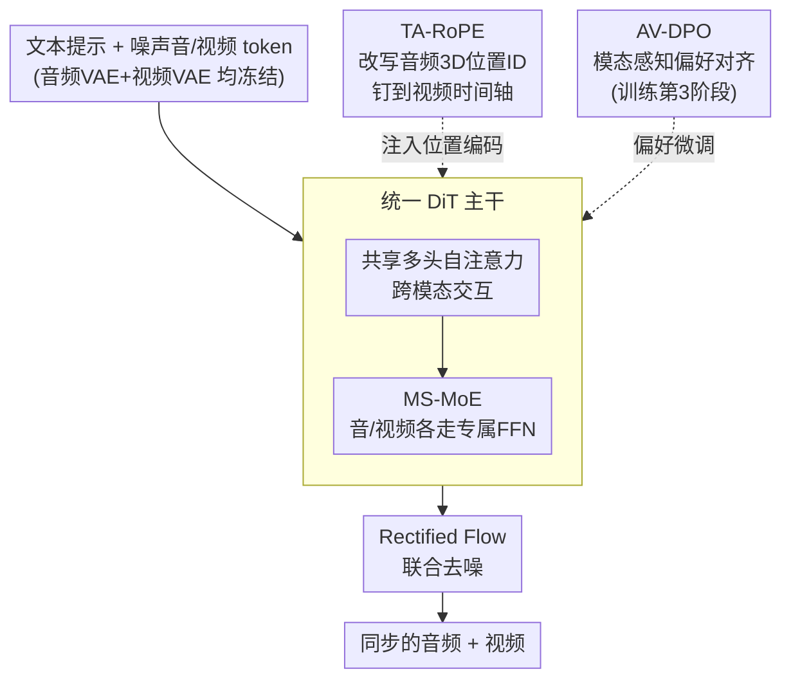

# JavisDiT++: Unified Modeling and Optimization for Joint Audio-Video Generation

**会议**: ICLR 2026  
**arXiv**: [2602.19163](https://arxiv.org/abs/2602.19163)  
**代码**: [GitHub](https://JavisVerse.github.io/JavisDiT2-page)  
**领域**: 视频生成  
**关键词**: Joint Audio-Video Generation, DiT, Mixture-of-Experts, RoPE, DPO

## 一句话总结

提出 JavisDiT++，一个面向联合音视频生成（JAVG）的简洁统一框架，通过模态特定 MoE 提升生成质量、时间对齐 RoPE 实现帧级同步、音视频 DPO 对齐人类偏好，基于 Wan2.1-1.3B 仅用约 1M 公开数据即达到 SOTA。

## 研究背景与动机

联合音视频生成（JAVG）要求模型从文本描述同时生成时间同步、语义对齐的视频和音频。当前开源方法与商业模型（如 Veo3）相比存在三方面差距：

**生成质量**：现有方法要么用统一 FFN 处理两模态（UniForm），导致模态信息损失；要么用双流 DiT（JavisDiT、UniVerse-1），架构复杂且扩展性差。

**时间同步**：JavisDiT 用 ST-Prior、UniVerse-1 用 Stitching 策略，均为隐式同步，不够精确且增加推理开销。

**人类偏好对齐**：现有 JAVG 方法未引入偏好优化，在美学和和谐度上与人类期望存在差距。JavisDiT++ 是首个将偏好对齐引入 JAVG 的工作。

## 方法详解

### 整体框架

JavisDiT++ 想解决的是联合音视频生成（JAVG）里"统一架构生成质量差、时间不同步、不对齐人类偏好"三个老问题，又不想像双流 DiT 那样把架构堆复杂。它的做法是只用一条 DiT 主干：以 Wan2.1-1.3B-T2V 为视频 backbone，把噪声音频 token 和视频 token 拼成一条序列送进同一个 DiT，用 Rectified Flow 联合去噪还原出同步的音视频。在这条主干上挂三个改动——**MS-MoE** 让两种模态在共享注意力后各走专属 FFN（解决质量），**TA-RoPE** 在送进 DiT 前给音频 token 改写位置 ID 把它钉到视频时间轴（解决同步），**AV-DPO** 在训练收尾阶段做偏好对齐（解决人类偏好）。视频 VAE（取自 Wan2.1）和音频 VAE（取自 AudioLDM2）全程冻结，整体分音频预训练、音视频 SFT、音视频 DPO 三阶段训练。

### 关键设计

**1. 模态特定 MoE（MS-MoE）：在统一架构里避免模态信息互相损害**

联合建模的两难在于：用一套共享 FFN 处理音视频会让两种异质模态的信息在聚合时互相污染，而拆成双流 DiT 又会让架构臃肿、扩展性差。MS-MoE 走折中路线——音视频 token 先经过共享的多头自注意力层做跨模态交互，再各自走自己的 FFN 做模态内聚合（按模态确定性路由，不做动态 routing），思路类似 BAGEL 但按模态而非任务分配 token。先经过充分的注意力交互、再把模态干扰隔离在各自 FFN 里，每支就能专注本模态的特征建模。它把总参数从 1.3B 抬到 2.1B，但因为每个 token 只激活自己那一支 FFN，单 token 激活参数仍是 1.3B，推理开销不增加。消融里两种朴素替代都更差：Shared-DiT + LoRA 因可训练容量太小压不住音频质量，Shared-DiT + Full-FT 则在音频预训练阶段让过多参数偏移，反过来严重拖垮了视频质量——这正说明给每个模态留独立 FFN 是必要的。

**2. 时间对齐 RoPE（TA-RoPE）：用位置 ID 而非额外模块实现帧级同步**

此前 JavisDiT 的 ST-Prior、UniVerse-1 的帧级 cross-attention 都靠隐式机制对齐时间，既不精确又徒增推理开销。TA-RoPE 换个思路：在 token 送进 DiT 之前，直接在 3D 位置 ID 的时间维（第 0 维）上把音频钉到视频的时间轴上。视频 token 位置 ID 为 $(t, h, w)$，音频 token 则映射为 $R_a(t, m) = \left(\left[t \cdot \frac{T_v}{T_a}\right], t + H, m + W\right)$，其中 $[\cdot]$ 取整把音频时间步换算到视频时间步，$H$、$W$ 的偏移则保证音视频的位置 ID 不重叠。因为对齐完全发生在位置编码层面，不需要物理重排 token 序列，就能在全注意力框架里实现绝对的帧级时间对齐，几乎零额外推理成本；消融中它的同步指标 DeSync 反而优于要额外计算开销的 ST-Prior（虽然把 TA-RoPE 与 ST-Prior/FrameAttn 叠加还能再涨一点，但作者为保持简洁高效弃用了组合）。

**3. 音视频 DPO（AV-DPO）：首次把人类偏好对齐引入联合生成**

现有 JAVG 方法都没做偏好优化，导致美学和音视频和谐度跟人类期望有差距。AV-DPO 补上这一环，关键是把奖励、数据和损失三处都做成模态感知的。奖励模型从三个维度打分——音频质量（AudioBox + ImageBind）、视频质量（VideoAlign + ImageBind）、音视频对齐（ImageBind + Syncformer）。数据上用 30K 提示各生成 3 个样本再加 ground truth，按模态分别归一化排序后挑 winner-loser 对，并强制 winner 在所有模态维度上都不劣于 loser（约 25K 对）——否则模态不一致的 winner 会让 DPO 退化。损失则把音频和视频两支分开算再加权，并加 Flow Matching 正则化防过拟合：

$$\mathcal{L}_{\mathrm{DPO}}^{av} = -\mathbb{E}\left[\log\sigma\left(-\beta_v(\mathrm{Diff}_{\mathrm{policy}}^v - \mathrm{Diff}_{\mathrm{ref}}^v) - \beta_a(\mathrm{Diff}_{\mathrm{policy}}^a - \mathrm{Diff}_{\mathrm{ref}}^a)\right)\right]$$

### 损失函数 / 训练策略

三阶段训练逐步加码：音频预训练用 780K 音频-文本对让模型先学会发声；音视频 SFT 用 330K 音视频-文本三元组、以 Flow Matching 为目标做联合生成对齐；音视频 DPO 用前述 25K 偏好对收尾，并搭配 Flow Matching 正则化防止偏好优化过拟合。整套训练支持 2-5 秒、240p-480p 的不同纵横比输出。

## 实验关键数据

### 主实验（JavisBench, 240p4s）

| 模型 | 参数量 | FVD↓ | FAD↓ | AV-IB↑ | JavisScore↑ | DeSync↓ | 推理时间 |
|------|--------|------|------|--------|-------------|---------|----------|
| JavisDiT | 3.1B | 204.1 | 7.2 | 0.197 | 0.154 | 1.039 | 30s |
| UniVerse-1 | 6.4B | 194.2 | 8.7 | 0.104 | 0.077 | 0.929 | 13s |
| **JavisDiT++** | **2.1B** | **141.5** | **5.5** | **0.198** | **0.159** | **0.832** | **10s** |

### 消融实验（JavisBench-mini）

| 配置 | FVD↓ | FAD↓ | JavisScore↑ | DeSync↓ | 说明 |
|------|------|------|-------------|---------|------|
| Shared-DiT + LoRA | 227.6 | 6.51 | 0.098 | 0.934 | LoRA 容量不足 |
| Shared-DiT + Full-FT | 269.3 | 5.66 | 0.137 | 0.945 | 视频质量下降 |
| **MS-MoE** | **221.3** | **5.51** | **0.153** | **0.807** | 最佳架构 |
| 无同步机制 | - | - | 0.142 | 0.942 | 基线 |
| ST-Prior | - | - | 0.145 | 0.863 | +6s 延迟 |
| **TA-RoPE** | - | - | **0.153** | **0.807** | 零额外成本 |
| 无 DPO | 221.3 | 5.51 | 0.153 | 0.807 | SFT 基线 |
| Modality-Micro DPO | **198.5** | 5.32 | **0.156** | **0.776** | 最佳 DPO 策略 |

### 关键发现

- MS-MoE 在保持视频质量的同时大幅提升音频质量，证明模态特定 FFN 的必要性
- TA-RoPE 以零推理成本实现的同步效果优于需要额外计算的 ST-Prior 和 FrameAttn
- AV-DPO 在客观指标上改进温和，但人类评价中 25% 以上偏好提升，捕捉到了指标难以衡量的美学偏好
- 模态感知的偏好对构建至关重要——模态不一致的 winner 选择会导致 DPO 退化

## 亮点与洞察

- 用更少参数（2.1B vs 6.4B）和更少数据（1M vs 大规模）超越了双流架构，说明统一简洁架构 + 精心设计的模块比暴力堆叠更有效
- TA-RoPE 的位置 ID 操纵思路优雅——利用全注意力框架的对称性，无需物理重排序列即可实现时间对齐
- 首次将 DPO 引入多模态联合生成，且设计了模态感知的偏好数据构建流程
- 推理仅比纯视频生成多 1.6% 开销，实用性极强

## 局限与展望

- 当前视频分辨率和时长受限（240-480p, 2-5s），离实际商用还有距离
- AV-DPO 的客观指标提升有限，奖励模型的评估能力可能是瓶颈
- 音频 VAE（AudioLDM2）不是为联合生成设计的，可能限制了音频多样性
- 仅在 Wan2.1-1.3B 上验证，更大或不同系列模型的扩展性未知
- 与 Veo3 等商业模型仍有差距，特别是在复杂场景的语义对齐上

## 相关工作与启发

- JavisDiT 和 UniVerse-1 的双流 DiT 方案被 MS-MoE 统一替代，说明共享注意力 + 模态 FFN 是更高效的范式
- AV-DPO 的模态感知偏好数据策略可推广到其他多模态对齐场景（音频+3D、视频+触觉等）
- 将 TA-RoPE 的时间对齐思路引入更多需要跨模态同步的任务

## 评分

- 新颖性: ⭐⭐⭐⭐ TA-RoPE 和 AV-DPO 有新意，MS-MoE 相对常规
- 实验充分度: ⭐⭐⭐⭐⭐ 全面的架构对比、同步机制对比、DPO 策略对比、主观评估，ablation 非常充分
- 写作质量: ⭐⭐⭐⭐ 结构清晰，图表丰富，但部分描述略冗长
- 价值: ⭐⭐⭐⭐ 为开源 JAVG 设立新 SOTA 和新标杆，AV-DPO 思路对社区有启发

<!-- RELATED:START -->

## 相关论文

- [\[ICLR 2026\] JavisDiT: Joint Audio-Video Diffusion Transformer with Hierarchical Spatio-Temporal Prior Synchronization](javisdit_joint_audio-video_diffusion_transformer_with_hierarchical_spatio-tempor.md)
- [\[ICLR 2026\] Dual-IPO: Dual-Iterative Preference Optimization for Text-to-Video Generation](dual-ipo_dual-iterative_preference_optimization_for_text-to-video_generation.md)
- [\[ICLR 2026\] Lumos-1: On Autoregressive Video Generation with Discrete Diffusion from a Unified Model Perspective](lumos-1_on_autoregressive_video_generation_with_discrete_diffusion_from_a_unifie.md)
- [\[CVPR 2026\] UniTalking: A Unified Audio-Video Framework for Talking Portrait Generation](../../CVPR2026/video_generation/unitalking_a_unified_audio-video_framework_for_talking_portrait_generation.md)
- [\[ICML 2026\] T2AV-Compass: Towards Unified Evaluation for Text-to-Audio-Video Generation](../../ICML2026/video_generation/t2av-compass_towards_unified_evaluation_for_text-to-audio-video_generation.md)

<!-- RELATED:END -->
