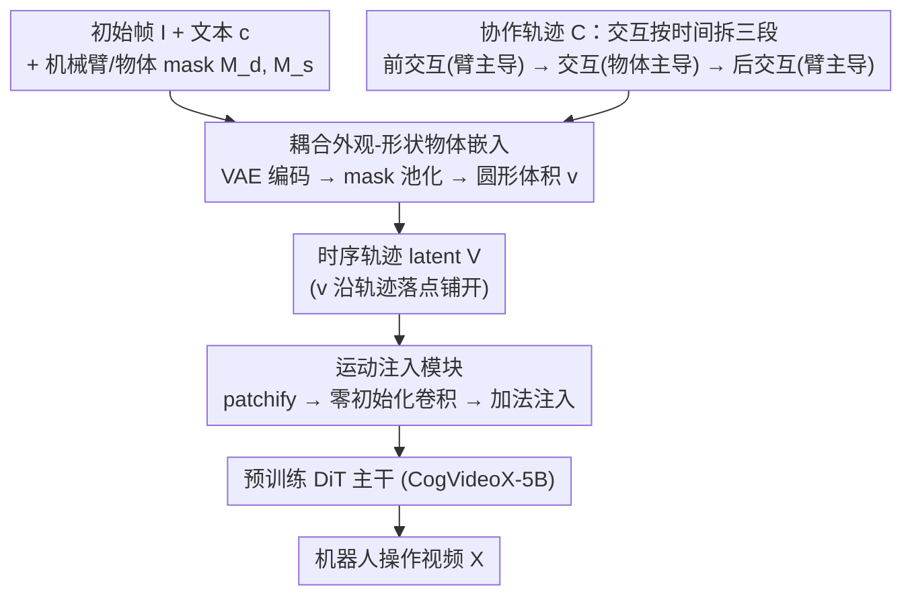

# Learning Video Generation for Robotic Manipulation with Collaborative Trajectory Control

**会议**: ICLR 2026  
**arXiv**: [2506.01943](https://arxiv.org/abs/2506.01943)  
**代码**: [项目页面](https://fuxiao0719.github.io/projects/robomaster/)  
**领域**: 视频生成  
**关键词**: 视频生成, 机器人操作, 协作轨迹, 扩散模型, 交互建模

## 一句话总结

提出RoboMaster框架，通过协作轨迹（collaborative trajectory）将机器人-物体交互过程分解为前交互、交互中、后交互三阶段，结合外观和形状感知的物体嵌入，实现高质量的机器人操作视频生成。

## 研究背景与动机

1. **领域现状**: 视频扩散模型在生成机器人决策数据方面展现出巨大潜力，轨迹条件控制能够实现对机器人运动的细粒度控制。

2. **现有痛点**: 现有轨迹控制方法（如Tora、DragAnything）主要关注单个物体的独立运动，使用分离的轨迹分别控制机械臂和被操作物体。在交互区域（重叠区域）会导致特征纠缠，生成质量下降。

3. **核心矛盾**: 机器人操作本质上是多物体交互过程，但现有方法将其简化为独立运动控制，无法捕获物理上合理的交互。如果合成视频无法准确表示交互阶段，逆动力学模型将提取不可靠的动作标签。

4. **本文目标**: 设计一种能准确建模机器人-物体交互动力学的视频生成框架，使生成的视频可作为高质量的机器人学习演示数据。

5. **切入角度**: 不分解物体，而是分解交互过程——将操作过程分为三个子阶段，每个阶段由主导主体引导，统一为单一的协作轨迹。

6. **核心 idea**: 通过分解交互过程而非分解物体，将多物体轨迹统一为协作轨迹表示，从根本上避免重叠区域的特征纠缠。

## 方法详解

### 整体框架

RoboMaster 在预训练的 CogVideoX-5B 上做条件控制：输入初始帧 $\mathbf{I}$、文本提示 $\mathbf{c}$、机械臂与被操作物体的 mask $\mathbf{M}_d, \mathbf{M}_s$ 以及一条协作轨迹 $\mathcal{C}$，输出操作视频 $\mathbf{X}$。整个流程围绕一个核心选择——不去分别控制机械臂和物体，而是把交互过程切成三段、用一条统一轨迹承载。具体走法是：协作轨迹给出每一帧的运动落点，物体嵌入在每个落点上铺成一个圆形体积、跟随轨迹移动，二者一起拼成时序的轨迹 latent；这个 latent 经运动注入模块灌进 DiT 的隐藏状态，引导预训练主干生成最终视频。

### 关键设计

**1. 耦合外观-形状物体嵌入：让被控物体在整段视频里"不走样"**

轨迹控制方法（如 Tora）通常把被控对象抽象成一个点，只告诉模型"这个像素往哪走"，却丢掉了它长什么样、占多大地方，于是生成时物体常常变形或身份漂移。这里改用 mask 来携带物体信息：先用 VAE 编码器把初始帧投影为 latent 特征 $\mathbf{z}$，把物体 mask 下采样到 latent 分辨率后抠出被覆盖区域的特征并池化，得到一个紧凑的物体嵌入 $\tilde{\mathbf{v}}$。在每个时间步，以当前轨迹点为圆心、以 mask 面积占比为半径，把 $\tilde{\mathbf{v}}$ 铺成一个圆形体积表示 $\mathbf{v} \in \mathbb{R}^{c \times h \times w}$ 跟随轨迹移动。这样一来轨迹同时编码了物体的外观（来自被 mask 区域的特征）和空间尺度（来自圆的半径），相比纯点表示既加速收敛又显著提升跨帧的身份一致性。

**2. 协作轨迹表示：把多物体交互拆成时间三段，从源头避开特征纠缠**

机器人操作里机械臂和物体的轨迹在接触区会重叠，若给两者各画一条独立轨迹，重叠处的特征就会互相纠缠、生成质量崩坏。本文不在空间上分解物体，而在时间上分解交互，把一次操作拆成三个由不同主体主导的阶段：前交互段 $\mathcal{C}_1$ 由机械臂主导（接近物体）、交互段 $\mathcal{C}_2$ 由被操作物体主导（接触并被推动）、后交互段 $\mathcal{C}_3$ 重新由机械臂主导（撤离）。三段首尾相接拼成单一的协作轨迹，任意时刻只有一个主导主体，重叠歧义自然消失。建模上用因果表示把前一时间步的 latent 传播到后续帧，使整段分布分解为三个物体感知子分布的乘积。这样做之所以成立，是因为交互段里物体的运动会隐式约束机械臂的相对运动（两者动力学被接触耦合），只需主导其一即可；而主导特征随时间从 $\mathbf{v}_d \rightarrow \mathbf{v}_s \rightarrow \mathbf{v}_d$ 的切换，本身就给模型提供了"何时该转变行为"的清晰线索。

**3. 运动注入模块：用零初始化的轻量分支把轨迹喂进 DiT，不伤预训练能力**

协作轨迹被整理成时序 latent $\mathbf{V} \in \mathbb{R}^{f \times c \times h \times w}$，先 patchify，再经过一个零初始化的 2D 空间卷积加 1D 时间卷积编码出 $\tilde{\mathbf{V}}$，最后以加法方式融入 DiT 块的隐藏状态 $\mathbf{h} = \mathbf{h} + \text{norm}(\tilde{\mathbf{V}}) + \tilde{\mathbf{V}}$。卷积的零初始化保证训练初期注入分支输出为零，DiT 的生成能力完全不被破坏，随训练逐步学到轨迹引导；加法注入则是即插即用，消融中也比交叉注意力注入更稳（FVD 147.31 对 163.56）。

### 损失函数 / 训练策略

训练目标为标准扩散去噪损失 $\mathcal{L}(\boldsymbol{\theta}) = \mathbb{E}[\|\boldsymbol{\epsilon} - \hat{\boldsymbol{\epsilon}}_{\boldsymbol{\theta}}(\mathbf{x}_t, \mathbf{c}, \mathbf{M}_d, \mathbf{M}_s, \mathcal{C}, t)\|_2^2]$，条件中同时带入双 mask 与协作轨迹。实现上用 8 块 A800、AdamW 优化器，DiT 主干学习率 $2 \times 10^{-5}$、新增的运动注入器学习率更高为 $1 \times 10^{-4}$，batch size 16 训练 30K 步；推理用 50 步 DDIM、CFG scale 6.0。

## 实验关键数据

### 主实验

视频生成质量和轨迹精度对比（Bridge数据集，所有基线在相同数据上重新训练）：

| 方法 | FVD↓ | PSNR↑ | SSIM↑ | TrajError_robot↓ | TrajError_obj↓ |
|------|------|-------|-------|------------------|----------------|
| TesserAct | 261.84 | 18.99 | 0.778 | 37.34 | 54.64 |
| IRASim | 159.04 | 20.88 | 0.782 | 19.25 | 34.39 |
| DragAnything | 158.42 | 21.13 | 0.792 | 18.97 | 27.41 |
| Tora | 152.28 | 21.24 | 0.788 | 18.14 | 26.43 |
| **RoboMaster** | **147.31** | **21.55** | **0.803** | **16.47** | **24.16** |

机器人动作规划成功率（RLBench + SIMPLER，各100次试验平均成功率）：

| 方法 | pick up cup | put knife | open microwave | close box | pick coke can |
|------|-------------|-----------|----------------|-----------|---------------|
| OpenVLA | 0.55 | 0.46 | 0.35 | 0.45 | 0.59 |
| Tora | 0.79 | 0.82 | 0.61 | 0.72 | 0.89 |
| RoboMaster | **0.83** | 0.76 | 0.54 | **0.79** | **0.91** |

### 消融实验

| 配置 | FVD↓ | PSNR↑ | TrajError_obj↓ | 说明 |
|------|------|-------|----------------|------|
| 去除因果嵌入 | 151.62 | 21.30 | 27.15 | 时序连贯性下降 |
| 点表示替代mask | 157.49 | 20.87 | 31.41 | 物体身份一致性大幅下降 |
| 分离轨迹 | 152.01 | 21.08 | 25.84 | 交互区域特征纠缠 |
| 交叉注意力注入 | 163.56 | 19.38 | 29.16 | 效果不如additive注入 |
| **完整模型** | **147.31** | **21.55** | **24.16** | 所有组件协同最优 |

### 关键发现

- 协作轨迹设计在10个机器人任务中8个优于Tora，证明交互精确建模对下游策略学习的重要性
- Mask表示在90%稀疏度下仍保持99.81% PSNR，对粗糙用户输入具有很强的鲁棒性
- 即使40%的提示被替换为不精确描述，模型仍保持96%以上的PSNR性能
- 用户研究中45.16%的偏好率远超所有基线（第二名Tora仅17.74%）

## 亮点与洞察

- **"分解交互而非分解物体"** 的核心思路简洁而有效，从根本上解决了特征纠缠问题
- 协作轨迹设计同时简化了用户交互——用户只需定义分段轨迹而非完整的多物体轨迹
- 圆形体积表示兼顾外观和形状信息，是一种优雅的设计
- 下游机器人规划实验验证了视频生成质量与策略学习效果的正相关性

## 局限与展望

- 纯2D像素空间操作，集成深度线索可能实现更精确的3D控制
- 对域外输入可能产生不完整或扭曲的物体
- 对不同机器人形态的泛化仍需扩展训练数据
- 协作轨迹需预先知道交互阶段的时间分段点，自动检测可能更实用

## 相关工作与启发

- 与Tora等分离轨迹方法形成鲜明对比，启发了"交互建模"视角在视频生成中的重要性
- 与TesserAct的4D方法相比，2D方法在数据效率上更有优势
- 视频生成作为世界模拟器的范式在机器人学习中展现出巨大潜力

## 评分

- 新颖性: ⭐⭐⭐⭐ 协作轨迹的交互分解思路新颖
- 实验充分度: ⭐⭐⭐⭐⭐ 包含视频质量、轨迹精度、机器人规划、消融和用户研究
- 写作质量: ⭐⭐⭐⭐ 结构清晰，图示精美
- 价值: ⭐⭐⭐⭐ 对机器人视频生成和数据增强具有实际指导意义

<!-- RELATED:START -->

## 相关论文

- [\[ICLR 2026\] Geometry-aware 4D Video Generation for Robot Manipulation](geometry-aware_4d_video_generation_for_robot_manipulation.md)
- [\[CVPR 2025\] PoseTraj: Pose-Aware Trajectory Control in Video Diffusion](../../CVPR2025/video_generation/posetraj_pose-aware_trajectory_control_in_video_diffusion.md)
- [\[ICML 2026\] EPiC: Efficient Video Camera Control Learning with Precise Anchor-Video Guidance](../../ICML2026/video_generation/epic_efficient_video_camera_control_learning_with_precise_anchor-video_guidance.md)
- [\[CVPR 2026\] FlashMotion: Few-Step Controllable Video Generation with Trajectory Guidance](../../CVPR2026/video_generation/flashmotion_fewstep_controllable_video_generation.md)
- [\[ICLR 2026\] Frame Guidance: Training-Free Guidance for Frame-Level Control in Video Diffusion Models](frame_guidance_training-free_guidance_for_frame-level_control_in_video_diffusion.md)

<!-- RELATED:END -->
