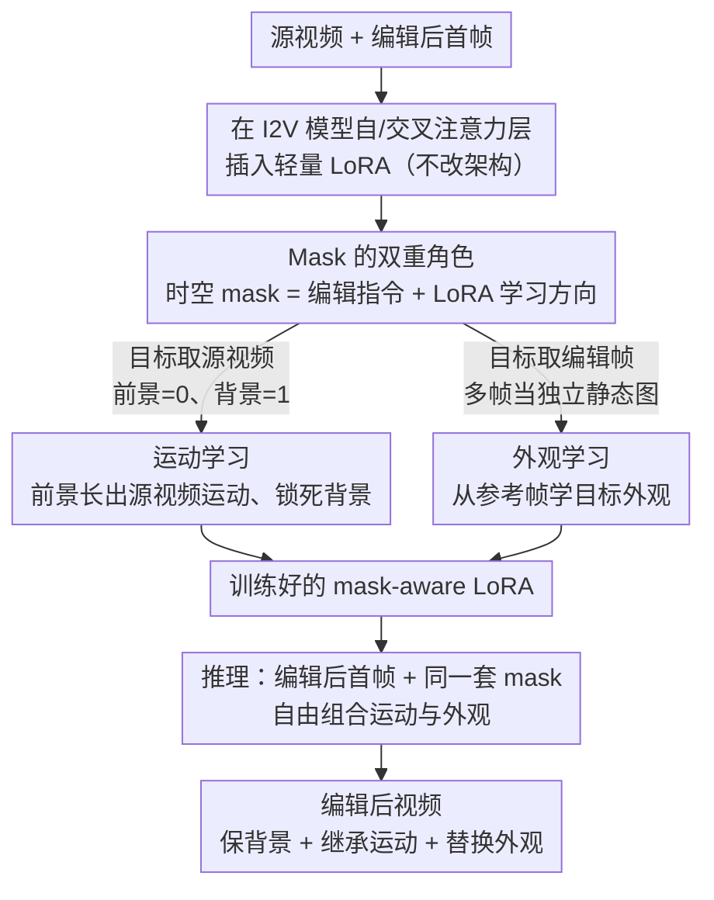

# LoRA-Edit: Controllable First-Frame-Guided Video Editing via Mask-Aware LoRA Fine-Tuning

**会议**: ICLR 2026  
**arXiv**: [2506.10082](https://arxiv.org/abs/2506.10082)  
**代码**: [项目页](https://cjeen.github.io/LoRAEdit)  
**领域**: 视频编辑  
**关键词**: 视频编辑, LoRA微调, 首帧引导, 时空mask, 外观控制

## 一句话总结
提出 LoRA-Edit，利用时空 mask 引导 LoRA 微调预训练 I2V 模型，实现可控的首帧引导视频编辑——mask 同时作为编辑区域指令和 LoRA 学习内容的引导信号，支持运动继承和外观控制。

## 研究背景与动机
- 视频编辑中大规模预训练方法成本高且灵活性受限，首帧引导编辑是更灵活的路径
- 现有首帧引导方法（AnyV2V、I2VEdit）仅控制首帧，无法控制后续帧的时间演变
- 简单的 LoRA 微调可学习运动，但缺乏精细控制——无法区分保留区域和修改区域
- I2V 模型内置的 mask conditioning 机制具有被低估的潜力

## 方法详解

### 整体框架
LoRA-Edit 不改动预训练 I2V（图像到视频）模型的任何架构，只在其自注意力与交叉注意力层插入一条轻量 LoRA，并通过两套互补的时空 mask 配置对这条 LoRA 做单视频微调：运动学习让模型从源视频前景区域学习运动模式，外观学习让模型从用户编辑的参考帧学习目标外观。两套配置共享同一套 mask conditioning（掩码条件）通道——掩码既告诉模型"改哪里、留哪里"，又决定 LoRA 该学运动还是学外观。训练完成后可在推理时自由组合两种能力，对编辑后的首帧生成视频，从而在保留背景的前提下既继承原始运动又替换目标外观。

### 关键设计

**1. Mask 的双重角色：让一张掩码同时充当编辑指令和学习方向**

LoRA-Edit 的核心洞察是把时空 mask 同时当作两件事来用。一方面它是给模型的空间指令——掩码值为 1 的区域要原样保留、为 0 的区域要重新生成，这让模型对"改哪里、不改哪里"有明确响应；另一方面它又是给 LoRA 的学习方向信号——通过往掩码后面喂不同的内容（源视频帧或参考编辑帧），引导同一条 LoRA 去关注运动模式还是目标外观。作者的探索性实验解释了为何必须配 LoRA 微调：原始 I2V 模型能处理"整帧保留 / 整帧生成"这类简单全局指令，但面对前景 mask 这种选择性空间编辑就会失败，掩码边界外的内容也被改动，所以需要 LoRA 把模型对 mask 的响应精度补足。

**2. 运动学习：用前景/背景掩码把"该改的"和"该留的"解耦**

运动学习这套配置教模型在前景区域生成符合源视频运动的新内容，同时锁死背景。训练时首帧掩码全置 1（必须保留，因为它就是编辑后的起点），后续帧则按前景/背景拆分——未编辑区域置 1、待编辑区域置 0。条件视频 $\mathbf{V}_{\text{cond}}$ 由掩码作用于输入视频得到，监督目标 $\mathbf{V}_{\text{target}}$ 取原始源视频。这样 LoRA 在掩码引导下只需学一件事：把背景照抄过去，把前景按源视频里物体的运动轨迹重新长出来。痛点在于直接微调会让模型分不清哪块该动哪块该静，而前景/背景掩码恰好把这种区分变成了显式监督信号。

**3. 外观学习：把用户编辑帧当独立静态图，避免错误的时间外推**

当被编辑物体会旋转、变形或沿自己的轨迹运动时，仅凭首帧无法推断它后续每一帧长什么样。为此 LoRA-Edit 允许用户额外编辑任意若干后续帧作为参考，并用它们作为 $\mathbf{V}_{\text{target}}$ 来训练外观。关键在于这些编辑帧被当作彼此独立的静态图像处理，而不是一段连续视频——因为它们之间往往并不构成真实的时间连续，若强行让模型学其时间动态会引入错误的外推。值得注意的是参考帧只在训练阶段使用、推理时无需输入，这让外观指导既能精细又不增加推理负担。

### 损失函数 / 训练策略
两套配置共用一个修改后的 flow matching 目标，把掩码与条件视频一并注入速度场预测：

$$\mathcal{L} = \mathbb{E}_{t,\mathbf{x}_0,\mathbf{x}_1}\left[\|v_\theta(\mathbf{x}_t, t; \mathbf{V}_{\text{cond}}, \mathbf{M}_{\text{cond}}, [p^*]+c) - (\mathbf{x}_0 - \mathbf{x}_1)\|_2^2\right]$$

其中 $p^*$ 是由 Florence-2 自动生成 caption 后加入的特殊 token、$c$ 为文本条件。实现基于 Wan2.1-I2V 480P 模型，LoRA 插入 self-attention 与 cross-attention 层：运动学习做 100 步训练（学习率 1e-4），外观学习再额外 100 步，处理 49 帧、832×480 分辨率视频仅需约 20GB GPU 内存。

## 实验关键数据

### 主实验（首帧引导编辑定量比较）

| 方法 | CLIP Score↑ | DEQA Score↑ | Input Similarity↑ |
|------|-----------|-----------|-------------------|
| AnyV2V | 0.8995 | 3.7348 | 0.7569 |
| Go-with-the-Flow | 0.9047 | 3.5622 | 0.7504 |
| I2VEdit | 0.9128 | 3.4480 | 0.7536 |
| **LoRA-Edit** | **0.9172** | **3.8013** | **0.7608** |

### 用户研究（参考引导编辑排名，低更好）

| 方法 | 运动一致性↓ | 背景保持↓ |
|------|-----------|----------|
| Kling1.6 | 1.869 | 1.806 |
| VACE (14B) | 2.511 | 2.460 |
| **LoRA-Edit** | **1.620** | **1.734** |

### 关键发现
- 在所有三个定量指标上超越现有首帧引导方法
- 用户研究中运动一致性和背景保持均排名第一
- mask 精度分析：松散 mask（bounding box）优于精确 mask（tight segmentation），因为生成实体需要轮廓变化的空间缓冲
- 仅训练单视频 LoRA（100-200步）即可实现高质量编辑
- 可在推理时自由组合运动学习和外观学习的 LoRA

## 亮点与洞察
- 发现 I2V 模型的 mask conditioning 具有超越首帧保留的通用空间控制潜力
- Mask 的"双重角色"是核心洞察：既是模型的指令也是 LoRA 学习的方向信号
- 松散 mask 优于精确 mask 的发现有趣且实用——pixel-perfect 不必要
- 参考帧仅在训练时使用（不在推理时输入），提供了外观指导的灵活性

## 局限与展望
- 每个视频需独立 LoRA 训练（100-200步），非即时生成
- 用户需手动或半自动提供 mask 和交互阶段
- 编辑帧的获取依赖外部图像编辑工具
- 继承预训练 I2V 模型的偏见
- 未与大规模训练的视频编辑模型在更复杂场景下对比

## 相关工作与启发
- AnyV2V 和 I2VEdit 的首帧引导范式启发了本工作
- AnimateDiff 的运动-外观解耦思想在 mask 引导框架中得到了新实现
- VACE 的全局训练方法在域外泛化上可能不如 per-video LoRA
- 为基于 I2V 模型的通用视频操控提供了轻量且灵活的方案

## 技术细节补充
- 基于 Wan2.1-I2V 480P 模型，也验证了 HunyuanVideo-I2V
- LoRA 插入 self-attention 和 cross-attention 层
- 使用 Florence-2 自动生成 caption，并加入特殊 token $p^*$
- 仅需 20GB GPU 内存即可训练 49 帧视频
- 参考帧仅在训练时使用，推理时不需输入，提供更大灵活性
- 自动 mask 获取工作流基于 SAM2 和分割 bounding box

## 评分
- 新颖性: ⭐⭐⭐⭐ mask引导LoRA的双重角色设计巧妙，但各组件相对简单
- 实验充分度: ⭐⭐⭐⭐ 对比全面+用户研究+消融，但测试规模有限
- 写作质量: ⭐⭐⭐⭐ 方法描述清晰，探索性实验（mask配置）有教学价值
- 价值: ⭐⭐⭐⭐ 为视频编辑提供了灵活、轻量、无需架构修改的实用方案

<!-- RELATED:START -->

## 相关论文

- [\[CVPR 2026\] PoseGen: In-Context LoRA Finetuning for Pose-Controllable Long Human Video Generation](../../CVPR2026/video_generation/posegen_in-context_lora_finetuning_for_pose-controllable_long_human_video_genera.md)
- [\[CVPR 2026\] First Frame Is the Place to Go for Video Content Customization](../../CVPR2026/video_generation/first_frame_is_the_place_to_go_for_video_content_customization.md)
- [\[ICML 2026\] Exploring Data-Free LoRA Transferability for Video Diffusion Models](../../ICML2026/video_generation/exploring_data-free_lora_transferability_for_video_diffusion_models.md)
- [\[ICLR 2026\] Frame Guidance: Training-Free Guidance for Frame-Level Control in Video Diffusion Models](frame_guidance_training-free_guidance_for_frame-level_control_in_video_diffusion.md)
- [\[ICML 2026\] MiVE: Multiscale Vision-language features for reference-guided video Editing](../../ICML2026/video_generation/mive_multiscale_vision-language_features_for_reference-guided_video_editing.md)

<!-- RELATED:END -->
