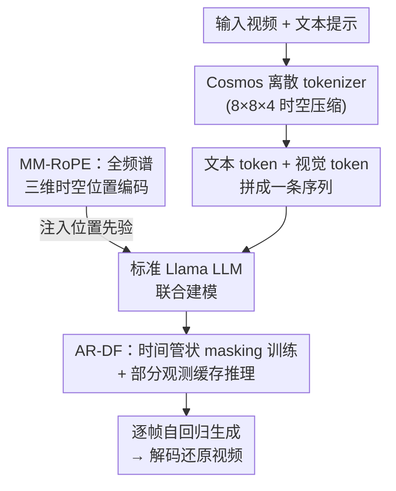

# Lumos-1: On Autoregressive Video Generation with Discrete Diffusion from a Unified Model Perspective

**会议**: ICLR 2026  
**arXiv**: [2507.08801](https://arxiv.org/abs/2507.08801)  
**代码**: [https://github.com/alibaba-damo-academy/Lumos](https://github.com/alibaba-damo-academy/Lumos)  
**领域**: 扩散模型 / 视频生成  
**关键词**: 自回归, 离散扩散, RoPE, 统一模型, 视频生成  

## 一句话总结

提出 Lumos-1，一个基于 LLM 架构的统一视频生成模型：通过 MM-RoPE（分布式多模态 RoPE）解决视觉时空编码问题，通过 AR-DF（自回归离散扩散强迫）解决帧间损失不均衡问题，仅用 48 GPU 训练即可在 GenEval、VBench-I2V 和 VBench-T2V 上达到竞争力水平。

## 研究背景与动机

**自回归视频生成的兴起**：LLM 在语言任务上的巨大成功启发了自回归式视频生成的探索

**现有 AR 视频模型的不足**：
   - 架构偏离标准 LLM（如 NOVA、Phenaki）
   - 依赖外部文本编码器（如 LlamaGen、Fluid）
   - 逐 token 解码效率极低（如 Loong）

**1D RoPE 不适合视频**：LLM 的一维位置编码无法建模视频的三维时空相关性

**3D RoPE 频谱不均衡**：朴素 3D RoPE 中时间维占据高频段，空间维被压缩到近零频率，导致空间建模能力不足

**随机 mask 预测的损失不均衡**：帧间空间信息冗余导致后续帧的 mask 预测损失远低于首帧，模型倾向于优化简单任务

**训练效率目标**：希望在有限资源（48 GPU）和有限数据下实现可竞争的性能

## 方法详解

### 整体框架

Lumos-1 是一个不偏离标准 Llama 架构的统一视频生成模型：先用 Cosmos 离散 tokenizer 以 $8\times8\times4$ 的时空压缩比把视频量化成离散 token，再把文本 token 与视觉 token 拼成一条序列交给同一个 LLM 联合建模。它在两处对标准 LLM 做了视频专属的改造——用 **MM-RoPE** 把三维时空先验注入位置编码，用 **AR-DF** 把离散扩散的训练与推理重新对齐到自回归的因果结构上。

### 关键设计

**1. MM-RoPE（分布式多模态 RoPE）：让时间和空间都能在完整频谱上被编码**

把一维 RoPE 直接扩成三维会带来一个隐蔽却致命的频谱问题。朴素 3D RoPE 的做法是把 $d/2$ 个旋转维度按 $2:3:3$ 一次性切给时间、高度、宽度三个轴，于是排在前面的低索引通道全给了时间轴——它们旋转频率最高，而高度和宽度被挤到了索引尾部、旋转频率趋近于零。结果是时间维独占高频、空间维几乎没有频率分辨率，同时本应对称的高宽两轴拿到的频段也不对称；更糟的是低索引通道转得太快会发生混叠，高索引通道转得太慢又缺乏分辨率。MM-RoPE 的解法是把维度"打散再分配"：不再一刀切，而是把整段通道拆成若干个 meta 组件（每组 16 维），在**每一组内部**都按 $2:3:3$ 重新给时间/高度/宽度分配频率。这样每个轴都在多个组里出现、覆盖从高频到低频的完整频段，时间不再霸占高频、空间也拿回了分辨率。文本 token 不参与这套机制、仍用原始 LLM 的 1D RoPE，而视觉 token 的三维 latent 坐标会先乘上压缩比映射回 RGB 像素空间，让文本与视觉的位置范围落在可比的尺度上。下表对比了它与已有方案的差异：MM-RoPE 是唯一同时做到全频谱分配与位置缩放的。

| RoPE 类型 | 兼容文本 | 3D 结构 | 全频谱分配 | 策略缩放 |
|-----------|---------|---------|-----------|---------|
| M-RoPE | ✔ | ✔ | ✗ | ✗ |
| VideoRoPE | ✔ | ✔ | ✗ | ✔ |
| **MM-RoPE** | **✔** | **✔** | **✔** | **✔** |

**2. AR-DF（自回归离散扩散强迫）：消除帧间损失不均衡，并对齐训练与推理**

直接把随机 mask 预测套到视频上会出现损失"偏科"。由于相邻帧空间信息高度冗余，后续帧只要偷看前帧中没被掩码的对应位置就能"抄答案"，于是它们的 mask 预测损失远低于首帧，模型便偷懒去优化这些简单帧、首帧反而学不好。AR-DF 在训练时用**时间管状 masking** 堵死这条捷径：先只对首帧采一个 mask 模式 $\bm{M}\sim\text{Bernoulli}(1-\rho)$，再把这同一个模式沿时间轴复制到所有帧，即 $\widetilde{\bm{X}}_v^{(t)}=\bm{M}\odot\bm{X}_v^{(t)}+(1-\bm{M})\odot[\text{MASK}]$。由于每帧被掩码的位置完全对齐，后续帧在前帧里找不到对应的可见 token，也就无法"复制"，被迫真正去预测，各帧损失随之拉平。推理时则配套**部分观测缓存**：逐帧自回归生成，每生成完一帧就随机把比例为 $\rho_{\text{inf}}$ 的 token 替换成 [MASK]，再把这个被部分掩码的帧写入 KV cache 供后续帧做条件。这样后续帧在推理时看到的也是"只露一部分"的前帧，与训练时的管状掩码情形一致，避免了推理-训练分布不匹配带来的质量退化。

### 损失函数

训练目标是标准交叉熵，但只在被 mask 的 token 位置上计算 $\mathcal{L}(\widehat{\bm{X}},\bm{X},\bm{M})$，与上面的管状 masking 配合，确保梯度只来自模型需要真正预测的位置。

## 实验关键数据

### GenEval（文本到图像）

| 模型 | 参数量 | 训练数据 | 表示 | Overall ↑ |
|------|--------|----------|------|-----------|
| EMU3 | 8B | - | 离散 | 0.66 |
| Show-o2 | 7B | 66M | 连续 | 0.76 |
| Fluid | 10.5B+4.7B | 680M | 连续 | 0.69 |
| **Lumos-1 (3.6B, 512×512)** | **3.6B** | **60M** | **离散** | **0.791** |

### VBench-I2V

| 模型 | 参数量 | 视频数据 | Total ↑ | I2V Score |
|------|--------|----------|---------|-----------|
| COSMOS | 5B+11B | 100M | 84.16 | 92.51 |
| CogVideoX | 5.6B+4.8B | - | 86.70 | 94.79 |
| VideoMAR | 1.4B+1.5B | 0.5M | 84.82 | 94.02 |
| **Lumos-1 (3.6B)** | **3.6B** | **10M** | **84.72** | **93.34** |

**关键发现**：仅用 48 GPU、60M 图像和 10M 视频训练的 Lumos-1 达到了与 EMU3（8B）相当甚至更好的水平，证明了 MM-RoPE 和 AR-DF 设计的有效性。

## 亮点与洞察

1. **3D RoPE 频谱分析**：首次系统分析了 3D RoPE 在视频生成中的频率分配不均衡问题，并给出优雅的分布式解法
2. **损失不均衡问题的归因**：清晰解释了空间信息冗余导致的帧间损失不均衡，而非简单的数据不平衡
3. **推理-训练一致性**：AR-DF 推理时引入部分观测 mask 来对齐训练条件，思路简洁有效
4. **极低训练资源**：48 GPU 训练达到竞争力水平，验证了设计效率
5. **纯 LLM 架构**：无需外部文本编码器，标准 Llama 架构直接处理多模态 token

## 局限与展望

1. 使用离散 tokenizer（Cosmos），重建质量不及连续 tokenizer，限制了生成细节
2. 训练数据规模（60M 图 + 10M 视频）远小于商业模型，性能差距部分来自数据
3. 位置缩放策略（乘压缩比）较为启发式，作者也承认可能不是最优方案
4. 视频分辨率和时长受限（672×384×25），未验证在长视频或高分辨率上的扩展性
5. 推理速度虽优于 next-token，但具体延迟数据未充分报告

## 相关工作与启发

- **Chameleon / EMU3**：统一多模态 LLM 的先驱，Lumos-1 在此基础上专门优化了视频生成
- **M-RoPE (Qwen2-VL)**：将 RoPE 扩展到 3D 的早期工作，MM-RoPE 改进了其频率分配
- **Diffusion Forcing (Chen et al.)**：原始双向依赖不存在损失不均衡；AR-DF 针对因果依赖场景
- 启发：频率分配是任何基于 RoPE 的多模态模型的关键设计点；tube masking 可推广到其他 AR+mask 预测范式

## 评分

- 新颖性: ⭐⭐⭐⭐⭐ — MM-RoPE 和 AR-DF 均具有独创性，且有深入分析支撑
- 实验充分度: ⭐⭐⭐⭐ — T2I/I2V/T2V 三任务验证，但受限于资源，绝对性能有差距
- 写作质量: ⭐⭐⭐⭐⭐ — 问题分析透彻，图示精美，公式清晰
- 价值: ⭐⭐⭐⭐⭐ — 开源且实用性强，为 LLM 统一视频生成提供了重要的技术路线

<!-- RELATED:START -->

## 相关论文

- [\[ICLR 2026\] JavisDiT++: Unified Modeling and Optimization for Joint Audio-Video Generation](javisdit_unified_modeling_and_optimization_for_joint_audio-video_generation.md)
- [\[CVPR 2026\] CubeComposer: Spatio-Temporal Autoregressive 4K 360° Video Generation from Perspective Video](../../CVPR2026/video_generation/cubecomposer_spatio-temporal_autoregressive_4k_360_video_generation_from_perspec.md)
- [\[ICLR 2026\] Streaming Autoregressive Video Generation via Diagonal Distillation](streaming_autoregressive_video_generation_via_diagonal_distillation.md)
- [\[ICML 2025\] How Far is Video Generation from World Model: A Physical Law Perspective](../../ICML2025/video_generation/how_far_is_video_generation_from_world_model_a_physical_law_perspective.md)
- [\[ICLR 2026\] QuantSparse: Comprehensively Compressing Video Diffusion Transformer with Model Quantization and Attention Sparsification](quantsparse_comprehensively_compressing_video_diffusion_transformer_with_model_q.md)

<!-- RELATED:END -->
