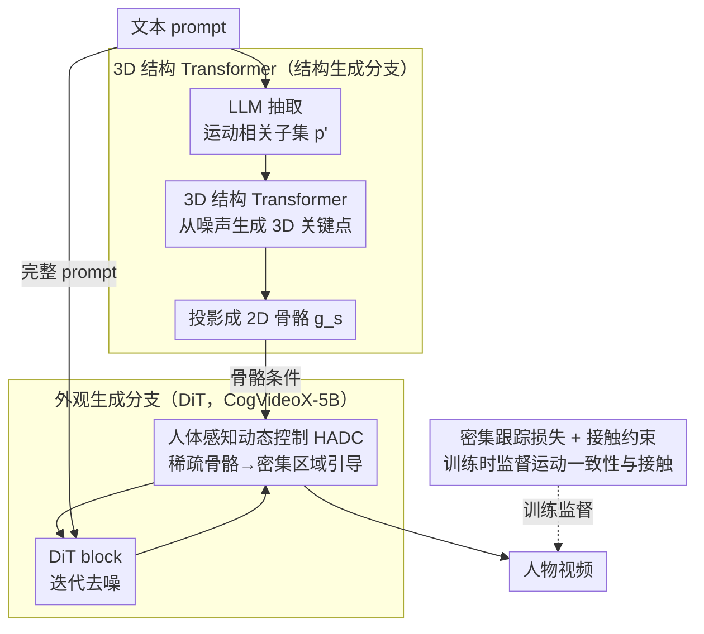

# MoSA: Motion-Coherent Human Video Generation via Structure-Appearance Decoupling

**会议**: ICLR 2026  
**arXiv**: [2508.17404](https://arxiv.org/abs/2508.17404)  
**代码**: 无（将开源）  
**领域**: 视频生成  
**关键词**: 人物视频生成, 结构-外观解耦, 3D运动生成, DiT, 密集跟踪损失

## 一句话总结

提出 MoSA 框架，将人体视频生成拆分为"结构生成"（3D Transformer 先生成物理合理的运动骨骼）和"外观生成"（DiT 在骨骼引导下合成视频），并设计人体感知动态控制（HADC）模块将稀疏骨骼信号扩展到整个运动区域，配合密集跟踪损失和接触约束，在 FVD、CLIPSIM 等指标上全面超越 HunyuanVideo、Wan 2.1 等 SOTA。

## 研究背景与动机

**领域现状**：当前主流通用视频生成模型（HunyuanVideo、CogVideoX、Wan 2.1 等）在自然场景上视觉质量已经很高，但生成人物视频时频繁出现肢体畸变、运动不自然等结构崩坏问题。专门针对人物视频的方法（如 AnimateAnyone 系列）大多局限于面部/上半身或需要额外 pose 驱动输入，难以应对全身复杂运动。

**现有痛点**：第一，纯噪声重建的训练目标天然偏向外观保真而忽略结构一致性——模型倾向于"画得好看"但运动不合理；第二，一些方法尝试直接在 2D 空间生成骨骼序列作为引导，但当肢体发生遮挡时 2D 表示缺少深度信息，生成的骨骼结构经常出错（如腿部位置穿插）；第三，骨骼本身是稀疏的关键点表示，即使生成正确，对后续像素级外观生成的控制力也非常有限。

**核心矛盾**：人体外观和运动携带完全不同的信号——外观需要像素级的纹理细节，运动需要满足物理约束和解剖合理性——但现有方法把两者耦合在同一个生成过程中，导致顾此失彼。

**本文目标** (1) 如何生成物理合理的复杂人体运动？(2) 如何让稀疏骨骼信号有效指导密集像素生成？(3) 如何建模人与环境的接触交互？

**切入角度**：作者观察到人体运动在 3D 空间有很好的先验（大规模 MoCap 数据集），而外观则适合用预训练 DiT 生成。因此将问题拆成两步：先利用 3D 先验生成结构合理的运动序列，再在骨骼引导下生成外观。这样运动合理性由 3D Transformer 保证，视觉质量由 DiT 保证。

**核心 idea**：先在 3D 空间用运动先验生成物理合理的骨骼序列，再通过人体感知动态控制模块将稀疏骨骼引导扩展到整个运动区域以指导 DiT 生成高保真外观。

## 方法详解

### 整体框架

MoSA 把"人物视频该怎么动"和"画面该长什么样"拆成两条独立的分支来解决。**结构生成分支**只关心运动：它从文本 prompt 里挑出与动作相关的语义，用一个预训练的 3D 结构 Transformer 生成一段 3D 人体关键点序列，再投影成 2D 骨骼序列。**外观生成分支**则以完整文本 prompt 加上这段骨骼为条件，在 DiT backbone 上迭代去噪生成最终视频。两条分支不是各做各的——骨骼信号要经过 HADC 模块加工后才注入外观分支，从稀疏关键点扩展成覆盖整个人体的密集引导。训练阶段直接用 GT 视频提取的骨骼当条件、固定结构分支只训外观分支；推理阶段才让结构分支自己从文本生成骨骼。这样运动的物理合理性交给 3D 先验来保证，像素级的视觉质量交给 DiT 来保证，两件事互不拖累。

### 关键设计

**1. 3D 结构 Transformer：在 3D 空间生成运动，绕开 2D 骨骼的遮挡崩坏**

直接在 2D 平面生成骨骼有个致命问题——肢体一旦发生遮挡，2D 表示缺少深度信息，腿部位置很容易穿插错位。MoSA 的做法是先把运动建在 3D 空间里。具体来说，先用一个 LLM 从完整 prompt 中抽出运动相关的子集 $p'$，把背景描述等无关信息过滤掉；3D 结构 Transformer $\mathcal{G}_s^m$ 以 $p'$ 为条件、从高斯噪声 $z_T^s$ 出发生成 3D 关键点序列，最后经 Projection 操作渲染成 2D 骨骼 $g_s$。这个 Transformer 是自回归架构，在百万级 MoCap 数据集上预训练，因此天然带有人体解剖结构的先验。在 3D 里生成再投影到 2D，一方面靠 3D 人体先验保证关节的解剖合理性，另一方面靠深度信息在遮挡时维持正确的前后关系——消融里把它换成直接生成 2D 骨骼，遮挡处就会复现腿部穿插的老毛病。

**2. 人体感知动态控制（HADC）：把稀疏骨骼"点引导"放大成覆盖全身的"区域引导"**

骨骼只有 K 个关键点，信息太稀疏，直接塞进 DiT 对像素的控制力非常弱。HADC 的思路是让骨骼信号自己扩散到整个人体区域。模块插在外观分支相邻 DiT block 之间，第 $k$ 个 HADC 接收骨骼特征 $s^k$ 和视频 latent $a_i^k$，用一个可学习的权重预测器 $\mathcal{P}^k$ 生成空间上变化的动态权重图 $w^k = \mathcal{P}^k(s^k, a_i^k)$，再把加权后的骨骼信号融回 latent：

$$a_o^k = a_i^k \oplus (w^k \odot s^k)$$

光让网络自由学权重还不够，权重图可能跑偏到背景上。为此又加了一个可学习网络 $\mathcal{U}^k$ 把 $w^k$ 转成 mask latent，和 GT mask 做 L2 约束 $\mathcal{L}_m$，逼着权重集中在人体所在区域。这样一来，原本只在关键点处有效的"骨骼引导"就升级成了铺满整个人体的"区域引导"，DiT 拿到的控制信号密度大大增加。

**3. 密集跟踪损失与接触约束：补上运动一致性和人-环境交互这两块监督**

纯噪声重建的训练目标天生偏向把画面画好看，对"动得对不对"几乎没有约束。密集跟踪损失 $\mathcal{L}_{track}$ 用 CoTracker3 分别在生成视频和 GT 视频上提取 2D 轨迹点，计算加权 L1 距离；权重取 $e^{|t_v - t_v'|/2}$，时间跨度越大的帧对赋予越高权重，等于显式鼓励模型去学长距离的运动依赖，而不是只对齐相邻帧。接触约束 $\mathcal{L}_{cont}$ 则在 3D 空间建模人体与地面/物体的接触关系，专治"脚陷进地面"或"整个人浮空"这类物理上说不通的现象。两个损失一个管时序连贯、一个管空间交互，正好补上重建目标缺失的运动监督。

### 损失函数 / 训练策略

总损失为 $\mathcal{L} = \mathcal{L}_d + \lambda_m \mathcal{L}_m + \lambda_{track} \mathcal{L}_{track} + \lambda_{cont} \mathcal{L}_{cont}$。训练时固定预训练的 3D 结构 Transformer $\mathcal{G}_s^m$，直接用 GT 视频提取的骨骼序列作为结构条件。外观生成分支以 CogVideoX-5B 为 backbone。还构建了 MoVid 数据集（30K 人物运动视频），覆盖走路、跑步、跳跃、滑冰等多种复杂全身动作，远超现有人物视频数据集的运动多样性。

## 实验关键数据

### 主实验

与通用视频生成模型在 300+ 文本 prompt 上的定量对比：

| 方法 | FVD↓ | CLIPSIM↑ | 主体一致性↑ | 背景一致性↑ | 运动平滑↑ | 动态程度↑ | 画质↑ |
|------|------|----------|-----------|-----------|---------|---------|------|
| ModelScope | 1945 | 0.2739 | 90.87% | 93.41% | 96.22% | 48.57% | 60.12% |
| VideoCrafter2 | 1959 | 0.2801 | 93.43% | 97.01% | 97.31% | 35.71% | 60.32% |
| LaVie | 1778 | 0.2895 | 93.80% | 95.51% | 97.21% | 53.73% | 62.57% |
| Mochi 1 | 1207 | 0.2903 | 94.67% | 95.32% | 97.75% | 51.14% | 54.65% |
| CogVideoX | 1360 | 0.2899 | 93.75% | 94.02% | 97.78% | 51.42% | 62.98% |
| HunyuanVideo | 1235 | 0.2948 | 94.41% | 95.17% | 98.95% | 50.42% | 58.13% |
| Wan 2.1 | 1251 | 0.2951 | 94.43% | 95.55% | 98.36% | 51.71% | 65.21% |
| **MoSA** | **1093** | **0.3035** | **96.83%** | **97.43%** | **99.25%** | **52.86%** | **65.43%** |

### 消融实验

各模块的贡献（FVD↓ / CLIPSIM↑）：

| 消融配置 | FVD | CLIPSIM | 说明 |
|---------|-----|---------|------|
| 完整 MoSA | 1093 | 0.3035 | 所有组件 |
| 无结构分支 | 1262 | 0.2971 | 直接 finetune base 模型，FVD +169 |
| 2D 骨骼生成替代 3D | 1230 | 0.2998 | 遮挡场景结构崩坏 |
| 无 HADC 模块 | 1188 | 0.2973 | 稀疏骨骼控制力不足 |
| HADC w/o mask loss | 1112 | 0.3009 | 权重图缺少人体区域约束 |
| 无密集跟踪损失 | 1172 | 0.3009 | 运动一致性下降 |
| 静态权重替代时序加权 | 1114 | 0.3016 | 长距离依赖学习不充分 |
| 无接触约束 | 1108 | 0.3021 | 人-环境交互不自然 |
| HumanVid 数据集 | 1217 | 0.2949 | 运动多样性不足 |
| 无额外人物数据 | 1360 | 0.2899 | 退化为 base 模型 |

MoSA 框架迁移到 Wan 2.1 后也有显著提升：Wan 2.1 原始 FVD=1251 / CLIPSIM=0.2951 → 加 MoSA 后 FVD=1108 / CLIPSIM=0.3044，验证了框架的通用性。

### 关键发现

- **结构-外观解耦是最大功臣**：无结构分支时 FVD 从 1093 升到 1262（+15.5%），说明显式结构引导对运动质量至关重要
- **3D 优于 2D**：3D→2D 投影比直接 2D 生成好 137 FVD，主要因为深度信息在肢体遮挡场景下保持了结构正确性（可视化中 2D 方案出现腿部穿插）
- **HADC 模块效果显著**：去掉 HADC 后 FVD +95，且 mask loss 贡献了额外 19 FVD 的提升，说明空间权重约束确实让引导信号覆盖了人体区域
- **密集跟踪损失中的时序加权很重要**：静态权重 vs 指数时序加权差 21 FVD，长距离运动依赖的学习需要显式鼓励
- **MoVid 数据集不可替代**：相比 HumanVid，MoVid 贡献了 124 FVD 的提升，因为覆盖了更复杂多样的全身运动

## 亮点与洞察

- **解耦范式的系统性**：运动 = 结构信号（需物理约束），外观 = 纹理信号（需视觉质量）→ 两类信号天然应由不同模型生成。这种"先生成结构再填充外观"的两阶段设计既合理又高效，比端到端方法更容易分别优化
- **从稀疏到密集的 HADC 设计**：骨骼是极度稀疏的表示（仅 K 个点），但 HADC 通过可学习权重预测器把引导信号从关键点扩散到整个人体区域，再用 mask loss 约束覆盖范围。这个"稀疏→密集"的信号传播思路可以迁移到任何需要用稀疏控制信号引导密集生成的场景
- **跟踪损失用时序加权很巧妙**：$e^{|t_v - t_v'|/2}$ 让时间跨度越大的帧对贡献越多梯度，迫使模型学习长距离运动一致性而非只关注相邻帧。这个 trick 可以直接用于任何需要时序一致性的视频生成任务

## 局限与展望

- **手部运动仍是瓶颈**：3D 结构 Transformer 训练数据只有 SMPL body joints，不包含手指关键点，因此精细手部动作仍会出现畸变。作者也指出加入手部 3D 标注是直接的改进方向
- **单人限制**：虽然论文中展示了一些多人交互的结果，但总体框架设计以单人为主，多人场景缺少系统的交互建模
- **MoVid 规模偏小**：30K 视频相比通用视频数据集（百万级）仍然有数量级差距，可能限制了方法在更广泛场景下的泛化
- **计算开销**：结构分支 + HADC 模块 + 跟踪损失（需前向 CoTracker3）增加了显著的训练和推理开销

## 相关工作与启发

- **vs AnimateAnyone2**：AnimateAnyone2 也用骨骼引导但需要用户提供driving pose 序列，且只支持舞蹈等简单场景；MoSA 的核心优势是自动从文本生成结构合理的骨骼，且支持跑步、滑冰等复杂全身运动
- **vs VideoJAM**：VideoJAM 也关注运动-外观的联合表示，但是在同一个模型内做联合学习；MoSA 更激进地完全解耦两个分支，让结构分支专注物理合理性，外观分支专注视觉质量
- **vs 直接 2D 骨骼方法（MotionMaster/DreamDance 等）**：这些方法在 2D 空间生成或使用骨骼，遮挡场景下容易崩坏；MoSA 通过 3D→2D 投影从根本上解决了这个问题

## 评分

- 新颖性: ⭐⭐⭐⭐ 结构-外观解耦的想法直觉上合理且在人物视频领域是首次系统实现，但"先生成结构再生成外观"的两阶段范式在其他领域已有先例
- 实验充分度: ⭐⭐⭐⭐⭐ 与 7 个通用视频模型定量对比 + 6 个维度的 VBench 评估 + 详细消融每个模块 + 跨 backbone 迁移验证 + 定性可视化，非常全面
- 写作质量: ⭐⭐⭐⭐ 逻辑清晰、图表丰富，但部分公式符号定义偏冗余
- 价值: ⭐⭐⭐⭐ 为人体视频生成提供了一个系统性的解耦范式，MoVid 数据集也有社区价值；但 30K 数据集规模和单人限制使得实际落地还需扩展

<!-- RELATED:START -->

## 相关论文

- [\[CVPR 2026\] PAM: A Pose-Appearance-Motion Engine for Sim-to-Real HOI Video Generation](../../CVPR2026/video_generation/pam_a_pose-appearance-motion_engine_for_sim-to-real_hoi_video_generation.md)
- [\[CVPR 2026\] SymphoMotion: Joint Control of Camera Motion and Object Dynamics for Coherent Video Generation](../../CVPR2026/video_generation/symphomotion_joint_control_of_camera_motion_and_object_dynamics_for_coherent_vid.md)
- [\[AAAI 2026\] MotionCharacter: Fine-Grained Motion Controllable Human Video Generation](../../AAAI2026/video_generation/motioncharacter_fine-grained_motion_controllable_human_video_generation.md)
- [\[CVPR 2026\] 3D-Aware Implicit Motion Control for View-Adaptive Human Video Generation](../../CVPR2026/video_generation/3d-aware_implicit_motion_control_for_view-adaptive_human_video_generation.md)
- [\[ICLR 2026\] MotionStream: Real-Time Video Generation with Interactive Motion Controls](motionstream_real-time_video_generation_with_interactive_motion_controls.md)

<!-- RELATED:END -->
