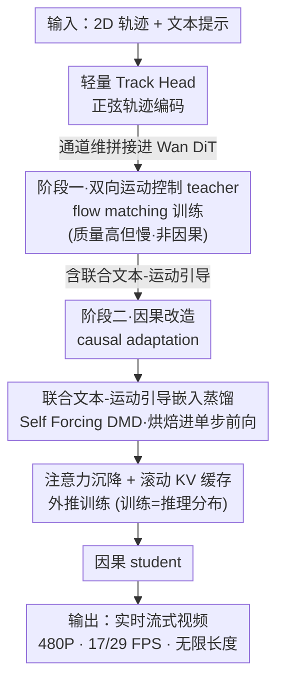

# MotionStream: Real-Time Video Generation with Interactive Motion Controls

**会议**: ICLR 2026  
**arXiv**: [2511.01266](https://arxiv.org/abs/2511.01266)  
**代码**: 无  
**领域**: 视频生成  
**关键词**: streaming video generation, motion control, causal distillation, attention sink, distribution matching distillation, real-time interaction

## 一句话总结
提出MotionStream——首个运动控制的实时流式视频生成系统：先训练轻量track head的双向运动控制teacher，再通过Self Forcing + DMD蒸馏为因果student，引入注意力沉降（attention sink）+滚动KV缓存（rolling KV cache）实现训练-推理分布完全匹配，单H100 GPU上480P达17FPS/29FPS（+Tiny VAE），支持无限长度恒速生成。

## 研究背景与动机

**领域现状**：运动控制视频生成（Motion Prompting等）已能生成高质量的轨迹跟踪视频，但推理极慢（5秒视频需12分钟）、非因果（需完整控制信号）、且只能生成有限长度。

**现有痛点**：
- 扩散模型双向注意力→必须知道未来所有轨迹才能开始生成，无法实时交互
- CausVid等因果蒸馏方法在训练时域外（>81帧）严重漂移——颜色偏移和质量退化
- ControlNet式架构使FLOPs翻倍，进一步拖慢推理速度
- 滑动窗口注意力的RoPE位置无界增长 → 延迟和吞吐量波动大

**核心矛盾**：交互式创作体验要求"实时+因果+无限长度"，三者与扩散模型的"慢+双向+有限长度"范式根本冲突。

**本文目标** 将运动控制视频生成从"渲染等待"模式变为"实时创作"模式——用户画轨迹即时看到结果。

**切入角度**：从三个层面同时突破——(1) 轻量化teacher架构降低baseline开销；(2) 联合引导嵌入蒸馏消除多次NFE；(3) 注意力沉降+训练时模拟推理分布消除长视频漂移。

**核心 idea**：通过"高效teacher → 因果蒸馏 → 注意力沉降外推训练"的流水线，实现运动控制视频的实时无限流式生成。

## 方法详解

### 整体框架

MotionStream 要把运动控制视频生成从"画完轨迹等十几分钟渲染"变成"画轨迹即时出画面"，难点在于扩散模型天生是慢、双向、有限长度的，而交互创作需要快、因果、可无限延伸。论文用一条两阶段流水线拆解这个矛盾：**阶段一**在 Wan DiT 上挂一个轻量 track head，训练出一个质量高但仍然双向、慢的运动控制 teacher；**阶段二**先把它做因果改造（causal adaptation），再用 Self Forcing 风格的 DMD 把它蒸馏成单步前向的因果 student，并在蒸馏训练里就引入注意力沉降 + 滚动 KV 缓存，让训练时看到的上下文分布和真实流式推理时一模一样。最终 student 在单张 H100 上 480P 跑到 17/29 FPS，且生成速度不随视频变长而下降。

### 关键设计

**1. 轻量 Track Head 与正弦轨迹编码：把 2D 轨迹喂进模型而不让算力翻倍**

ControlNet 式的控制分支会让 FLOPs 翻倍，对追求实时的系统是不可接受的开销。MotionStream 换了一条更省的路：给每条轨迹分配一个唯一的 $d$ 维正弦位置编码 $\phi_n$ 作为身份标识，再按它在每帧的落点把这个编码写到对应空间位置上，即 $c_m[t, \lfloor y_t^n/s \rfloor, \lfloor x_t^n/s \rfloor] = v[t,n] \cdot \phi_n$。这张稀疏的运动图经过 4× 时间压缩和一个 $1\times1\times1$ 卷积后，直接和视频 latent 在通道维拼接，模型侧只需把 DiT 的 patchify 层输入通道改宽一点，不引入额外分支。这样编码运动条件比走 RGB-VAE 的方式快 40×（24.8ms vs 1053ms），轨迹跟踪反而更准（EPE 6.54 vs 8.57）——正弦编码给每条轨迹提供了比 RGB 像素更清晰的身份信号，模型更容易分辨"这是哪条轨迹"。

**2. 联合文本-运动引导嵌入蒸馏：把 teacher 三次前向的引导成本烘焙进 student 一次前向**

teacher 为了同时听轨迹和听文本，用的是联合引导

$$\hat{v} = v_{\text{base}} + w_t\big(v(c_t,c_m) - v(\emptyset,c_m)\big) + w_m\big(v(c_t,c_m) - v(c_t,\emptyset)\big),$$

其中 $w_t=3.0,\ w_m=1.5$，每步要算三次速度场，慢且无法实时。蒸馏时论文不让 student 去模仿这三次前向，而是把 teacher 的联合引导整体定义成 DMD 的 $s_{\text{real}}$ 目标，对应的 $s_{\text{fake}}$ 则不用 CFG、只走一次 $f_\psi(c_t,c_m)$。这样 student 单次前向输出就被拉向 teacher 联合引导后的分布，等于把三次引导的质量直接"烘焙"进一次推理里。之所以要保留文本这一路：纯运动引导会产生僵硬的 2D 平移（物体像被硬拖），而文本引导补上自然的次要运动（大象走动时背景顺势出现彩虹），两者互补；通过蒸馏融合后，这份互补性在推理时不再付任何额外成本。

**3. 注意力沉降 + 滚动 KV 缓存的外推训练：让无限长生成恒速且不漂移**

因果蒸馏方法（如 CausVid）在超出训练时长（>81 帧）后会严重漂移——颜色偏移、质量退化，根源是训练时模型从没见过"只有滚动窗口上下文"的推理分布。MotionStream 维护一个固定大小的 KV 缓存：$S$ 个 sink chunk（始终保留的初始帧）加 $W$ 个 local window chunk，新 token 生成时窗口向前滚动、缓存总量恒定，RoPE 按缓存内位置而非绝对时间来分配，于是推理延迟和吞吐量不随视频变长而抖动。真正的关键在于**训练时就用完全相同的注意力沉降 + 滚动 KV 缓存来做 self-rollout**，让 student 在训练阶段看到的上下文就是推理时的样子，彻底抹平 train-test 分布差距。保留初始帧作为锚点的依据来自注意力分析（Figure 3）：很多 head 会持续盯着初始帧 token，这和 StreamingLLM 在语言模型里观察到的"初始 token 吸附注意力"如出一辙，把初始帧当全局锚点能压住颜色/内容漂移。最优配置是 c3s1w1（chunk=3, sink=1, window=1）；反直觉的是把 window 调大反而更差，因为去 attend 很久以前的历史会让误差在上下文里不断累积。

### 损失函数 / 训练策略

Teacher训练：Flow matching loss $\mathcal{L}_{\text{FM}} = \mathbb{E}_{z_0,z_1,t}[w_t \| v_\theta(z_{t'},t',c_t,c_m) - (z_1-z_0) \|^2]$，两阶段（OpenVid-1M 4.8K steps → synthetic finetune 800 steps）。Causal adaptation：用teacher生成4000个ODE轨迹做回归，2000 steps。Self Forcing DMD蒸馏：生成器和critic 1:5更新比，梯度截断到随机采样的单个denoising step，仅~400 steps收敛。总训练：32×A100约3天（teacher）+20小时（蒸馏）。

## 实验关键数据

### 运动迁移——重建质量对比

| 方法 | Backbone | FPS | PSNR↑ | LPIPS↓ | EPE↓ |
|------|----------|-----|-------|--------|------|
| Go-With-The-Flow | CogVideoX-5B | 0.60 | 15.62 | 0.490 | 41.99 |
| Diffusion-As-Shader | CogVideoX-5B | 0.29 | 15.80 | 0.483 | 40.23 |
| ATI | Wan 2.1-14B | 0.23 | 15.33 | 0.473 | 17.41 |
| **MotionStream Teacher** | Wan 2.1-1.3B | 0.79 | **16.61** | **0.427** | **5.35** |
| **MotionStream Causal** | Wan 2.1-1.3B | **16.7** | 16.20 | 0.443 | 7.80 |

### 新视角合成（LLFF数据集）

| 方法 | 分辨率 | FPS | PSNR↑ | LPIPS↓ |
|------|--------|-----|-------|--------|
| DepthSplat | 576P | 1.40 | 13.9 | 0.30 |
| ViewCrafter | 576P | 0.26 | 14.0 | 0.30 |
| SEVA | 576P | 0.20 | 14.1 | 0.29 |
| **MotionStream Teacher** | 480P | 0.79 | **16.0** | **0.21** |
| **MotionStream Causal** | 480P | **16.7** | 15.7 | 0.23 |

### 消融实验——注意力配置

| 配置 | LPIPS↓ | EPE↓ | 延迟波动 | 吞吐量 |
|------|--------|------|---------|--------|
| c3s1w1（标准） | **0.464** | **25.34** | 0.70±0.01 | 16.92±0.80 |
| c3s0w1（去sink） | 0.501 | 26.64 | 0.68±0.005 | 17.43±0.88 |
| c1s1w1（chunk=1） | 0.597 | 76.21 | 0.30±0.01 | 13.26±1.36 |
| Sliding window | 0.480 | 28.09 | 0.80±**0.08** | 14.96±**1.42** |

### 关键发现
- MotionStream Causal比所有baselines快20-70×，同时在DAVIS/Sora的运动跟踪指标上达SOTA
- 在相机控制（3D新视角合成）上零样本超越专门的3D方法（DepthSplat/ViewCrafter/SEVA）——PSNR +1.6, LPIPS -0.07
- 注意力沉降至关重要：去掉sink chunk后LPIPS从0.464恶化到0.501，长视频生成出现明显颜色漂移（Figure A3）
- 反直觉发现：更大的attention window反而降低质量——attending to long-past history让errors在context中累积
- 滑动窗口方法延迟波动±0.08s（vs c3s1w1的±0.01s），因为无界RoPE位置导致计算不稳定
- Tiny VAE将Wan 2.1的FPS从16.7提升到29.5，延迟从0.69s降至0.39s，质量损失可忽略（PSNR: 16.67→16.68）

## 亮点与洞察
- **从"渲染等待"到"实时创作"的范式转变**：2个数量级的速度提升（分钟→亚秒）首次使运动控制视频生成达到交互式创作的速度门槛
- **注意力沉降的跨领域迁移**：从StreamingLLM观察到的"初始token吸引注意力"现象成功迁移到视频扩散模型——初始帧作为anchor防止无限生成的content/color drift
- **训练时模拟推理分布**：与TalkingMachines等方法的关键区别——self-rollout中使用与推理完全相同的rolling KV cache + attention sink，消除train-test mismatch，这是长视频稳定性的核心保证
- **联合引导的互补性**：纯轨迹引导→僵硬2D平移；纯文本引导→跟不上轨迹；$w_t=3.0, w_m=1.5$ 的联合引导→自然运动+精确跟踪

## 局限与展望
- 固定attention sink锚定初始帧→不适合场景完全切换的应用（如游戏世界探索），需要动态refresh anchor
- 极速/物理不合理轨迹导致时间不一致或外观扭曲
- Wan 2.1 (1.3B)比Wan 2.2 (5B)在保持源结构方面更好——更大backbone未必更robust
- 轨迹消失问题：用户释放控制时模型无法区分occlusion和"无指定"（都是零值），mid-frame masking仅部分缓解

## 相关工作与启发
- **vs Motion Prompting**：同样用2D轨迹控制，但Motion Prompting是离线双向扩散（12min/5s），MotionStream是实时因果流式（29FPS）
- **vs Self Forcing (Huang et al.)**：Self Forcing提出了因果蒸馏框架但使用无界滑动窗口→延迟波动+长视频漂移；MotionStream引入attention sink+外推训练解决这两个问题
- **vs TalkingMachines**：也用attention sink，但同步去噪+因果mask不能完全模拟自回归推理；且sink帧和后续帧间的时间不连续性让teacher评分不准

## 评分
- 新颖性: ⭐⭐⭐⭐⭐ 首个实时运动控制的流式视频生成，多个系统级创新协同工作
- 实验充分度: ⭐⭐⭐⭐ 运动迁移+相机控制+用户拖拽+多分辨率+消融全面覆盖
- 写作质量: ⭐⭐⭐⭐ 系统设计层次清晰，消融实验设计精到（特别是注意力配置分析）
- 价值: ⭐⭐⭐⭐⭐ 对交互式视频创作的工程实现和学术理解都有重要推进

<!-- RELATED:START -->

## 相关论文

- [\[NeurIPS 2025\] Autoregressive Adversarial Post-Training for Real-Time Interactive Video Generation](../../NeurIPS2025/video_generation/autoregressive_adversarial_posttraining_for_realtime_interac.md)
- [\[CVPR 2026\] StreamDiT: Real-Time Streaming Text-to-Video Generation](../../CVPR2026/video_generation/streamdit_real-time_streaming_text-to-video_generation.md)
- [\[ICLR 2026\] TTOM: Test-Time Optimization and Memorization for Compositional Video Generation](ttom_test-time_optimization_and_memorization_for_compositional_video_generation.md)
- [\[CVPR 2026\] U-Mind: A Unified Framework for Real-Time Multimodal Interaction with Audiovisual Generation](../../CVPR2026/video_generation/u-mind_a_unified_framework_for_real-time_multimodal_interaction_with_audiovisual.md)
- [\[CVPR 2025\] Teller: Real-Time Streaming Audio-Driven Portrait Animation with Autoregressive Motion Generation](../../CVPR2025/video_generation/teller_real-time_streaming_audio-driven_portrait_animation_with_autoregressive_m.md)

<!-- RELATED:END -->
