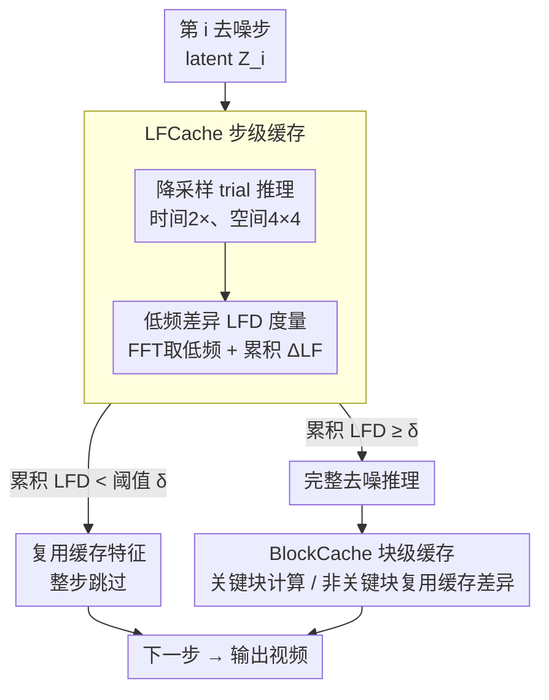

# PreciseCache: Precise Feature Caching for Efficient and High-fidelity Video Generation

**会议**: ICLR 2026  
**arXiv**: [2603.00976](https://arxiv.org/abs/2603.00976)  
**代码**: 无  
**领域**: 视频生成/推理加速  
**关键词**: 特征缓存, 视频扩散, 低频差异, 步级缓存, 块级缓存

## 一句话总结

提出 PreciseCache——精确检测并跳过视频生成中真正冗余计算的即插即用加速框架，由 LFCache（步级，基于低频差异 LFD 度量）和 BlockCache（块级，基于输入输出差异度量）组成，在 Wan2.1-14B 等主流模型上实现平均 2.6× 加速且无明显质量损失。

## 背景与动机

**领域现状**：视频扩散模型（如 Sora、HunyuanVideo、CogVideoX、Wan2.1）的生成质量不断提升，但推理极其缓慢——Wan2.1-14B 在 4 张 A800 上生成单个 720P 视频需要约 907 秒。特征缓存（feature caching）是目前免训练加速的主流方法，通过复用前序去噪步的缓存特征来跳过部分步骤的网络推理。

**现有痛点**：

- **均匀缓存策略（如 PAB）**：每隔 $n$ 步缓存一次，忽略了不同去噪步对最终生成质量的不同贡献——高噪声步建立视频的结构和内容信息（不可跳过），低噪声步精修高频细节（可安全跳过）
- **现有自适应缓存方法**：需要复杂的额外拟合或大量超参调优，且缓存决策标准仍不够精确
- **直接使用相邻步预测差异作为缓存指标**（如 TeaCache）：该指标与最终生成质量的关联性不强，导致次优的缓存策略

**核心矛盾**：如何设计一个运行时自适应的缓存判据，能够精确区分"真正冗余的计算"和"对生成质量至关重要的计算"，从而在最大化加速的同时保持视频质量？

**本文方案**：提出低频差异（Low-Frequency Difference, LFD）作为步级冗余的精确度量指标——基于关键洞察：扩散过程在高噪声阶段建模低频结构信息（重要），在低噪声阶段精修高频细节（可缓存）。LFD 与缓存对最终质量的影响高度一致。

## 方法详解

### 整体框架

视频扩散模型推理慢的根源是几十步去噪每步都跑满网络，但其中相当一部分计算是冗余的。PreciseCache 的思路是把"冗余"拆成两个层级、分别精确检测并跳过：**步级**——某些去噪步对成片几乎没有新贡献，可以整步复用上一步缓存的特征，这由 LFCache 负责，判据是低频差异（Low-Frequency Difference, LFD）；**块级**——即便一个步必须跑，DiT 内部也有不少 Transformer 块对特征改动微弱，可以用缓存的差异近似，这由 BlockCache 负责。

具体到一个去噪步：先把 latent 降采样做一次廉价的 trial 推理，估出该步的 LFD；若累积 LFD 低于阈值就整步跳过、直接复用缓存（LFCache），否则执行完整推理，并在这一步内部再用 BlockCache 把非关键块的计算省掉。两级级联叠出双层加速，而且全程只用 FFT、降采样、hook 这类标准算子，不碰基础模型的参数与结构、需要调的超参极少，因此能即插即用地挂到 Wan2.1、HunyuanVideo 等不同 DiT 架构上，也能与 DSP 等并行策略正交叠加。

### 关键设计

**1. 低频差异（LFD）度量：把"该不该缓存"换成和成片质量真正相关的判据**

均匀缓存（如 PAB 每隔 $n$ 步缓存一次）和直接拿相邻步预测差异当指标（如 TeaCache）都不够准，因为它们没区分去噪过程在干什么——高噪声阶段在搭建视频的低频结构（不可跳），低噪声阶段只在精修高频细节（可安全跳）。本文据此把网络预测 $\bm{F}_i$ 经 FFT 拆成低频分量 $\bm{F}_i^{LF}$ 与高频分量 $\bm{F}_i^{HF}$，低频区域取以最小空间维度 $\frac{1}{5}$ 为半径的圆形 mask，再以相邻步低频分量的 L2 距离 $\Delta_i^{LF} = \| \bm{F}_i^{LF} - \bm{F}_{i+1}^{LF} \|_2$ 作为步级冗余度量。实验证实 $\Delta_i^{LF}$ 与"该步复用缓存对成片质量的影响"高度一致：高噪声步 LFD 大、低噪声步 LFD 小，正好对应不可缓存与可缓存的步，比相邻步原始预测差异更能反映质量损失。

**2. 降采样 trial 推理：绕开"算缓存指标本身就要先推理"的死循环**

LFD 虽好却有个尴尬：要算它就得先把当前步完整推理一遍，反而违背了加速初衷。关键观察是 LFD 对 latent 分辨率并不敏感，于是先把 latent 降采样再跑一次廉价的 trial 推理来估计它——$\widetilde{\bm{Z}}_i = \text{Downsample}(\bm{Z}_i)$，$\widetilde{\bm{F}}_i = \epsilon_\theta(\widetilde{\bm{Z}}_i, t_i)$，降采样比例取时间 2×、空间 4×4，trial 推理开销可忽略。决策时用累积 LFD $\sum_{i=a}^{b} \widetilde{\Delta}_i^{LF}$ 而非单步值，避免误差逐步累积越界：累积值超过阈值 $\delta$ 才执行完整推理、否则整步复用缓存。阈值按相对因子设定 $\delta = \widetilde{\Delta}_{max}^{LF} \times \alpha$，$\alpha$ 越大越激进——$0.5$ 对应 Base、$0.7$ 对应 Turbo。

**3. BlockCache：在保留下来的步里继续抠块级冗余**

对 LFCache 没跳过、必须完整跑的时间步，BlockCache 进一步看 DiT 内部每个 Transformer 块到底改了多少特征。它先算块的输入输出差异 $\bm{D}_{k_i}^j = \bm{F}_{k_i}^j - \bm{F}_{k_i}^{j-1}$，取差异最大的前 $c\%$ 块为关键块（pivotal blocks），其余视为非关键块；随后 $L$ 个步里，关键块照常计算，非关键块则直接用上一次缓存的差异近似输出：

$$\bm{F}_{k_{i-l}}^j = \begin{cases} \mathcal{B}^j(\bm{F}_{k_{i-l}}^{j-1}, t_{k_{i-l}}), & j \in \mathcal{I}_i \text{（关键块）} \\ \bm{F}_{k_{i-l}}^{j-1} + \bm{D}_{k_i}^j, & j \notin \mathcal{I}_i \text{（非关键块）} \end{cases}$$

这样就在 LFCache 的整步跳过之上再压一层块级算力。Flash 配置取缓存率 40%（即 60% 的块被跳过）、$L=3$，把加速比推到最高。

## 实验结果

### 主实验：4 种主流模型上的效率与质量对比（4 A800 GPU）

| 方法 | 模型 | MACs (P) ↓ | 加速比 ↑ | VBench ↑ | LPIPS ↓ | PSNR ↑ |
|:-----|:-----|:----------|:---------|:---------|:--------|:-------|
| 基线 | Wan2.1-14B | 329.2 | 1× | 83.62% | - | - |
| PAB | Wan2.1-14B | 233.5 | 1.38× | 82.91% | 0.1853 | 26.18 |
| TeaCache | Wan2.1-14B | 166.3 | 1.94× | 83.24% | 0.1012 | 27.22 |
| FasterCache | Wan2.1-14B | 183.9 | 1.73× | 83.47% | 0.0741 | 28.45 |
| **Ours-base** | Wan2.1-14B | 204.5 | **1.59×** | **83.56%** | **0.0451** | **29.12** |
| **Ours-turbo** | Wan2.1-14B | 151.0 | **2.15×** | **83.52%** | **0.0633** | **28.98** |
| **Ours-flash** | Wan2.1-14B | 122.4 | **2.63×** | **83.43%** | 0.0812 | 28.76 |
| 基线 | HunyuanVideo | 14.92 | 1× | 80.66% | - | - |
| TeaCache | HunyuanVideo | 8.93 | 1.64× | 80.51% | 0.0911 | 28.15 |
| **Ours-turbo** | HunyuanVideo | 7.49 | **1.95×** | **80.49%** | 0.0884 | 29.06 |
| **Ours-flash** | HunyuanVideo | 6.04 | **2.44×** | 80.02% | 0.0902 | 28.64 |

核心结论：PreciseCache-flash 在 Wan2.1-14B 上达到 2.63× 加速，VBench 仅下降 0.19%（83.62% → 83.43%），而 PAB 在 1.38× 加速时 VBench 已下降 0.71%。在 LPIPS/PSNR 指标上，PreciseCache-base 始终最优（LPIPS 0.0451 vs. 竞品最佳 0.0741）。

### 消融实验：降采样率与 GPU 数量影响

| 降采样因子 (T×H×W) | 延迟 (s) | VBench ↑ | LPIPS ↓ |
|:-------------------|:---------|:---------|:--------|
| 基线（无缓存） | 907 (1×) | 83.62% | - |
| 1×2×2 | 918 (0.98×) | 83.57% | 0.0797 |
| 1×4×4 | 525 (1.73×) | 83.49% | 0.0801 |
| **2×4×4（默认）** | **416 (2.18×)** | **83.52%** | **0.0793** |
| 1×8×8 | 401 (2.26×) | 83.18% | 0.1946 |
| 4×4×4 | 403 (2.25×) | 83.02% | 0.1875 |

2×4×4 为最佳平衡点：过小的降采样率无法有效加速（1×2×2 仅 0.98×），过大则 LFD 估计不准导致质量下降（4×4×4 VBench 降至 83.02%）。

| GPU 数量 | Wan2.1 基线 | + PreciseCache | 加速比 |
|:---------|:-----------|:--------------|:-------|
| 1 | 3326s | 1330s | 2.50× |
| 2 | 1732s | 753s | 2.30× |
| 4 | 907s | 416s | 2.18× |
| 8 | 459s | 229s | 2.00× |

PreciseCache 在不同 GPU 数量下均有效，单 GPU 时加速比最高（2.50×），与 DSP 并行策略正交互补。

## 评价

**评分**: ⭐⭐⭐⭐

**优点**：

- LFD 指标的设计优雅且有物理直觉支撑——扩散过程的低频→高频生成顺序决定了步级冗余的分布
- 降采样 trial 推理的巧妙设计解决了"计算缓存指标本身需要推理"的鸡生蛋问题，实际开销可忽略
- 双层缓存架构（步级+块级）互补，加速效果叠加
- 实验覆盖 4 种主流视频生成模型、多种分辨率和 GPU 配置，验证了泛化性
- 即插即用，无需训练，超参极少且跨模型稳定

**不足**：

- LFD 的低频/高频划分比例（$\frac{1}{5}$ 半径）缺乏理论推导，依赖经验
- Flash 配置在部分指标（如 LPIPS）上有一定质量损失，说明激进加速存在边界
- 与蒸馏加速方法（如 consistency distillation）的对比缺失——两类方法可互补但未讨论
- BlockCache 的关键块选择是静态的（基于上一次完整推理），在去噪过程中块的重要性可能动态变化

<!-- RELATED:START -->

## 相关论文

- [\[CVPR 2026\] DisCa: Accelerating Video Diffusion Transformers with Distillation-Compatible Learnable Feature Caching](../../CVPR2026/video_generation/disca_accelerating_video_diffusion_transformers_wi.md)
- [\[ECCV 2024\] MagDiff: Multi-Alignment Diffusion for High-Fidelity Video Generation and Editing](../../ECCV2024/video_generation/magdiff_multi-alignment_diffusion_for_high-fidelity_video_generation_and_editing.md)
- [\[CVPR 2026\] Soul: Breathe Life into Digital Human for High-fidelity Long-term Multimodal Animation](../../CVPR2026/video_generation/soul_breathe_life_into_digital_human_for_high-fidelity_long-term_multimodal_anim.md)
- [\[ICML 2026\] EPiC: Efficient Video Camera Control Learning with Precise Anchor-Video Guidance](../../ICML2026/video_generation/epic_efficient_video_camera_control_learning_with_precise_anchor-video_guidance.md)
- [\[NeurIPS 2025\] LeMiCa: Lexicographic Minimax Path Caching for Efficient Diffusion-Based Video Generation](../../NeurIPS2025/video_generation/lemica_lexicographic_minimax_path_caching_for_efficient_diffusion-based_video_ge.md)

<!-- RELATED:END -->
