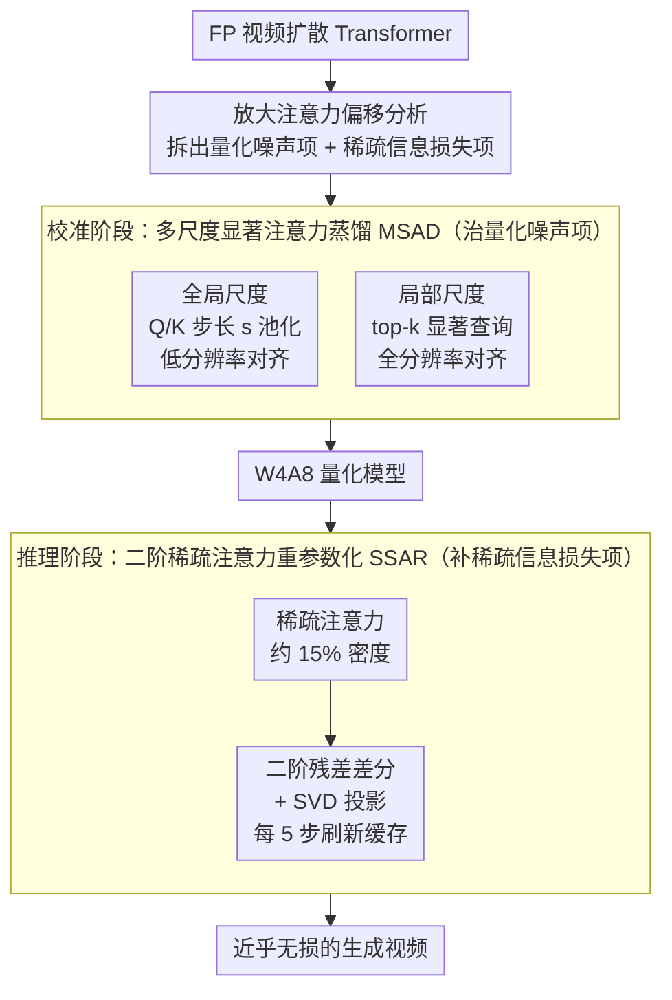

# QuantSparse: Comprehensively Compressing Video Diffusion Transformer with Model Quantization and Attention Sparsification

**会议**: ICLR 2026  
**arXiv**: [2509.23681](https://arxiv.org/abs/2509.23681)  
**代码**: [GitHub](https://github.com/wlfeng0509/QuantSparse)  
**领域**: 视频生成  
**关键词**: video-generation, model-compression, quantization, sparse-attention, diffusion-transformer

## 一句话总结

本文提出 QuantSparse 框架，首次将模型量化（quantization）与注意力稀疏化（attention sparsification）协同整合用于视频扩散 Transformer 压缩，通过多尺度显著注意力蒸馏（MSAD）和二阶稀疏注意力重参数化（SSAR）解决两者朴素结合导致的"放大注意力偏移"问题，在 HunyuanVideo-13B 上以 W4A8 + 15% 注意力密度实现 3.68× 存储压缩和 1.88× 推理加速，同时几乎无损保持生成质量。

## 背景与动机

1. **视频扩散模型计算代价高昂**：Wan2.1-14B 等 SOTA 模型生成一段高清视频需要 20GB+ GPU 内存和近 1 小时推理时间，严重制约实际部署，尤其在资源受限场景。

2. **量化和稀疏化是两种互补的压缩方向**：量化通过低比特整数表示减少存储和计算，稀疏注意力通过剪枝冗余的注意力计算降低复杂度，二者正交互补，理论上可以叠加收益。

3. **单一方法极限下退化严重**：量化到极低比特（如二值化）导致表征能力崩塌，极端稀疏化丢弃关键上下文信息，各自单独推到极限都会导致严重质量退化。

4. **朴素结合反而效果更差**：实验发现简单地将量化和稀疏化组合会引发"放大注意力偏移"（amplified attention shift）——稀疏化移除低幅值注意力权重后，量化对剩余注意力积的系统性扰动被放大，两种误差相互强化，严重损害视频生成的细粒度依赖建模。

5. **现有方法各自为战**：量化方法（Q-VDiT、ViDiT-Q）和稀疏方法（SparseVideoGen、Jenga）分别独立发展，尚未有工作系统探索二者的协同整合策略。

6. **注意力蒸馏面临内存瓶颈**：对于 HunyuanVideo 等模型，序列长度 $L > 10^4$，全注意力矩阵存储需要 $O(L^2)$ 内存，直接做注意力蒸馏不可行。

## 方法详解

### 整体框架

QuantSparse 要解决的是：单独把视频扩散 Transformer 量化或稀疏化都能压一点，但推到极限各自质量崩塌，而朴素地把两者叠在一起反而比单用更差。论文先把这个"越叠越差"的失效机制刻画清楚——量化噪声和稀疏掩码会交互放大注意力偏移（amplified attention shift），再据此把整条压缩流水线拆成两段、各治一项：**校准阶段**用多尺度显著注意力蒸馏（MSAD）把量化后的注意力分布拉回全精度（FP）模型，压住偏移里的量化噪声项；**推理阶段**用二阶稀疏注意力重参数化（SSAR）补回稀疏掩码丢掉的上下文，填上偏移里的信息损失项。整条链路从一个 FP 模型出发，经 MSAD 校准得到 W4A8 量化模型，再在推理时叠加稀疏注意力 + SSAR 修正，最终在约 15% 注意力密度下产出几乎无损的视频。

### 关键设计

**1. 放大注意力偏移的形式化：找出朴素结合失效的根因**

直接把量化和稀疏化叠在一起反而比单用更差，QuantSparse 把原因归结到一个交叉项上。量化会向 QK 点积注入噪声 $\epsilon$，稀疏掩码 $\mathbf{M}$ 又移除了低幅值权重，二者交互产生的复合偏移可以写成 $\Delta_{\text{total}} = \Delta_{\text{sparse}} + \Delta_{\text{quant}} + O(\|\epsilon\|_F \cdot \|\mathbf{M}\|_0)$。前两项是各自单独使用就有的误差，真正棘手的是第三项交叉项——稀疏化把注意力质量集中到剩下的少数权重上，量化噪声对这些权重的扰动随之被成比例放大，两种误差相互强化，细粒度时空依赖首先崩坏。把这个项单独拎出来，后面两个模块就有了明确的攻击目标：一个压量化噪声 $\epsilon$（MSAD），一个补稀疏掩码 $\mathbf{M}$ 带来的信息损失（SSAR）。

**2. 多尺度显著注意力蒸馏 MSAD：在 $O(L^2)$ 内存约束下对齐量化注意力**

想用蒸馏把量化注意力拉回 FP 分布，最直接的办法是对齐整张注意力矩阵，但 HunyuanVideo 的序列长度 $L > 10^4$，全矩阵的 $O(L^2)$ 存储根本放不下。MSAD 用全局加局部两个尺度绕开这个瓶颈。全局尺度利用视频的空间局部性，对 Q、K 做步长 $s$ 的平均池化降采样，在 $\tilde{L} = L/s^2$ 的低分辨率上算蒸馏损失 $\mathcal{L}_{\text{global}} = \text{MSE}(\mathbf{A}_{\text{global}}^{\text{FP}} \| \mathbf{A}_{\text{global}}^{\text{quant}})$，复杂度直接降到全注意力的 $1/s^2$，保住了粗粒度的全局结构。局部尺度则针对注意力分布的高度偏斜——不到 10% 的 token 占据了绝大部分注意力质量，于是只挑 top-$k$ 显著查询在全分辨率上做 $\mathcal{L}_{\text{local}} = \text{MSE}(\mathbf{A}_{\text{local}}^{\text{FP}} \| \mathbf{A}_{\text{local}}^{\text{quant}})$，以极低成本把校准火力集中到最影响输出的区域。两者与量化损失一起联合优化 $\mathcal{L}_{\text{distill}} = \mathcal{L}_{\text{quant}} + \lambda_{\text{global}} \mathcal{L}_{\text{global}} + \lambda_{\text{local}} \mathcal{L}_{\text{local}}$，粗看全貌、细看热点，正好压住偏移公式里的量化噪声项。

**3. 二阶稀疏注意力重参数化 SSAR：用时间稳定的二阶残差补回稀疏丢失**

推理时稀疏掩码会丢掉一部分上下文，缓存类方法的常规思路是缓存一阶残差 $\Delta^{(t)} = \mathbf{A}_{\text{full}}^{(t)} - \mathbf{A}_{\text{sparse}}^{(t)}$ 并假设它跨时间步几乎不变。但在量化条件下这个假设站不住：量化噪声 $\epsilon^{(t)}$ 本身随时间步波动，把一阶残差搅得不稳定，复用旧缓存就会带进过时的误差。SSAR 的关键观察是改看二阶残差 $\hat{\Delta}^{(t)} = \Delta^{(t)} - \Delta^{(t-1)}$——相邻时间步的量化噪声分布相近，做一次差分后噪声大半抵消，时间变化远小于一阶残差，于是又重新变得可缓存。在此之上再对二阶残差做 SVD，投影到前 $r$ 个主成分 $\tilde{\Delta}_{\text{quant}} = \mathbf{S}_{:,:r} \mathbf{U}_{:r,:r} \mathbf{V}_{:,:r}^\top$，进一步把残余的时间方差滤掉。推理时每隔 5 步刷新一次缓存，用这个二阶修正项高效近似全注意力输出，几乎不增加额外存储，正好补上偏移公式里稀疏掩码带来的信息损失项。

## 实验结果

### 实验设置

- **模型**：HunyuanVideo-13B、Wan2.1-1.3B、Wan2.1-14B
- **量化设置**：W6A6、W4A8，通道级权重量化 + 动态逐 token 激活量化
- **基线**：量化方法（PTQ4DiT, Q-DiT, SmoothQuant, QuaRot, ViDiT-Q, Q-VDiT）；稀疏方法（DiTFastAttn, Jenga, SparseVideoGen）；及其组合

### 表1：HunyuanVideo-13B 主要结果（W4A8）

| 方法 | 密度 | VQA↑ | PSNR↑ | SSIM↑ | LPIPS↓ | 加速比 |
|------|------|------|-------|-------|--------|--------|
| Full Prec. | 100% | 81.23 | - | - | - | 1.00× |
| Q-VDiT | 100% | 67.95 | 16.85 | 0.605 | 0.461 | 1.09× |
| Q-VDiT+SVG | 15% | 76.30 | 16.66 | 0.591 | 0.460 | 1.84× |
| **QuantSparse** | **15%** | **81.19** | **20.88** | **0.678** | **0.273** | **1.88×** |

QuantSparse 在 15% 注意力密度下 VQA 达 81.19（接近全精度 81.23），PSNR 大幅领先 Q-VDiT+SVG（20.88 vs 16.66），同时实现 1.88× 加速和 3.68× 存储压缩。

### 表2：消融实验——各模块贡献（Wan2.1-14B, W4A8, 25% 密度）

| 模块 | VQA↑ | PSNR↑ | SSIM↑ | LPIPS↓ |
|------|------|-------|-------|--------|
| 无蒸馏 | 81.92 | 14.35 | 0.486 | 0.425 |
| + Global 引导 | 85.26 | 16.01 | 0.547 | 0.349 |
| + Local 引导 | 86.95 | 16.82 | 0.561 | 0.325 |
| + MSAD（全局+局部） | **91.98** | **18.72** | **0.630** | **0.240** |
| 无缓存 | 68.00 | 14.16 | 0.470 | 0.445 |
| + 一阶残差 | 70.82 | 17.08 | 0.572 | 0.285 |
| + 二阶残差 | 89.73 | 18.68 | 0.616 | 0.258 |
| + SSAR（二阶+SVD） | **91.98** | **18.72** | **0.630** | **0.240** |

MSAD 将 PSNR 从 14.35 提升至 18.72（+4.37），SSAR 从 14.16 提升至 18.72（+4.56），两个模块贡献相当且互补。

### 效率分析

| 配置 | 模型存储 | 显存消耗 | DiT时间 | 加速比 |
|------|---------|---------|---------|--------|
| Full Prec. | 23.88GB | 35.79GB | 1264s | 1.00× |
| QuantSparse W4A8 15% | **6.49GB** (↓3.68×) | 27.02GB (↓1.32×) | **671s** | **1.88×** |

## 亮点与创新

- **首次系统性整合量化+稀疏化**：提出"放大注意力偏移"的数学分析和统一解法，填补了两种正交压缩技术协同应用的空白
- **内存高效的注意力蒸馏**：MSAD 通过全局降采样+局部显著 token 选择巧妙避开了 $O(L^2)$ 内存瓶颈
- **二阶残差的关键洞察**：发现一阶残差在量化下不稳定但二阶残差稳定，这是一个优雅的数学观察，加上 SVD 投影进一步降噪
- **几乎无损的激进压缩**：在 15% 注意力密度 + W4A8 下仍能接近全精度质量，远超所有基线

## 局限性

- **校准阶段成本**：MSAD 在 PTQ 校准时需要同时运行 FP 模型和量化模型，对校准阶段的内存和计算有一定要求
- **缓存刷新间隔需手动设定**：cache-refresh interval=5 是经验值，不同模型和分辨率可能需要重新调参
- **SVD 分解的额外开销**：虽然论文称"negligible overhead"，在极长序列或极大模型上 SVD 分解的实际开销需进一步验证
- **评估指标局限**：主要依赖 PSNR/SSIM 等参考指标和 VQA/CLIPSIM 等无参考指标，缺乏大规模人类主观评测

## 相关工作对比

### vs. Q-VDiT (Feng et al., 2025) — 当前 SOTA 量化方法

Q-VDiT 引入时间蒸馏进行量化校准，是此前视频 DiT 量化的 SOTA。但 Q-VDiT 仅关注量化不涉及稀疏化，在 HunyuanVideo W4A8 上 PSNR 仅 16.85。即使将 Q-VDiT 与 SVG 稀疏方法简单组合，PSNR 也仅 16.66（甚至略降），说明朴素结合无效。QuantSparse 以 20.88 PSNR 大幅领先，证明了协同设计的必要性。

### vs. SparseVideoGen (Xi et al., 2025) — 静态稀疏注意力

SVG 使用预定义的时空稀疏掩码降低注意力计算量，在全精度下效果良好。但与量化组合后（QuaRot+SVG 在 HunyuanVideo W4A8 15% 密度下 VQA 仅 41.40），性能严重退化。QuantSparse 通过 MSAD+SSAR 有针对性地修复量化-稀疏交互导致的注意力偏移，在相同压缩率下质量几乎无损。

### vs. DiTFastAttn (Yuan et al., 2024) — 基于缓存的一阶残差

DFT 利用一阶残差跨时间步的稳定性做注意力近似。QuantSparse 的 SSAR 指出在量化条件下一阶残差不再稳定（Proposition 3.2），二阶残差才具有时间稳定性（Proposition 3.3），这是理论上更严谨的推广，在 W4A8 设定下大幅超越 DFT。

## 评分

- ⭐⭐⭐⭐⭐ 创新性：首次将量化与稀疏化协同设计，理论分析扎实，两个核心模块设计巧妙
- ⭐⭐⭐⭐⭐ 实验充分度：覆盖 1.3B-14B 三个模型、两种量化设置、多种基线和组合、详细消融
- ⭐⭐⭐⭐ 写作质量：数学推导清晰，图表丰富，但符号较密集，部分推导细节在附录
- ⭐⭐⭐⭐⭐ 实用价值：3.68× 存储压缩 + 1.88× 加速 + 近乎无损质量，对视频生成部署有直接价值

<!-- RELATED:START -->

## 相关论文

- [\[ICLR 2026\] JavisDiT: Joint Audio-Video Diffusion Transformer with Hierarchical Spatio-Temporal Prior Synchronization](javisdit_joint_audio-video_diffusion_transformer_with_hierarchical_spatio-tempor.md)
- [\[ICLR 2026\] Lumos-1: On Autoregressive Video Generation with Discrete Diffusion from a Unified Model Perspective](lumos-1_on_autoregressive_video_generation_with_discrete_diffusion_from_a_unifie.md)
- [\[CVPR 2025\] Tora: Trajectory-Oriented Diffusion Transformer for Video Generation](../../CVPR2025/video_generation/tora_trajectory-oriented_diffusion_transformer_for_video_generation.md)
- [\[ICML 2026\] VEDA: Scalable Video Diffusion via Distilled Sparse Attention](../../ICML2026/video_generation/veda_scalable_video_diffusion_via_distilled_sparse_attention.md)
- [\[CVPR 2026\] MoVieDrive: Urban Scene Synthesis with Multi-Modal Multi-View Video Diffusion Transformer](../../CVPR2026/video_generation/moviedrive_urban_scene_synthesis_with_multi-modal_multi-view_video_diffusion_tra.md)

<!-- RELATED:END -->
