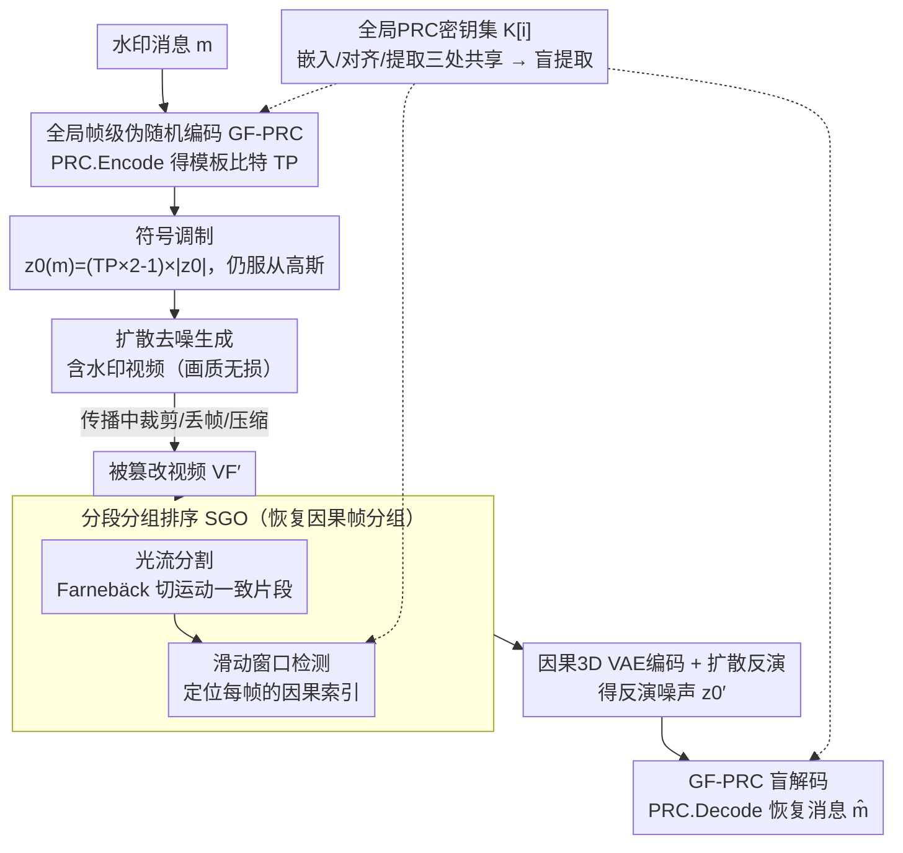

# SIGMark: Scalable In-Generation Watermark with Blind Extraction for Video Diffusion

**会议**: ICLR 2026  
**arXiv**: [2603.02882](https://arxiv.org/abs/2603.02882)  
**代码**: [https://github.com/JeremyZhao1998/SIGMark-release](https://github.com/JeremyZhao1998/SIGMark-release)  
**领域**: 视频生成/水印  
**关键词**: 视频扩散模型, 水印, 盲提取, 伪随机编码, 因果3D VAE, 可扩展性

## 一句话总结
SIGMark提出首个针对现代视频扩散模型的盲提取生成内水印框架，通过全局帧级伪随机编码(GF-PRC)实现常数级提取开销的盲水印，并设计分段分组排序(SGO)模块增强因果3D VAE下的时序鲁棒性，在HunyuanVideo和Wan-2.2上以512×16位容量达到90%+比特精度。

## 研究背景与动机

1. **领域现状**：视频扩散模型（如HunyuanVideo、Wan-2.2）快速发展，AI生成内容的版权保护和溯源需求日益迫切。不可见水印是关键技术，分为后处理水印和生成内水印两类。

2. **现有痛点**：
    - 后处理水印（如DCT、DT-CWT）不可避免地降低视频质量
    - 现有生成内方法（如VideoShield、VideoMark）是非盲的：提取时需维护所有消息-密钥对进行模板匹配，开销随生成视频数量线性增长
    - 现代视频扩散模型采用因果3D VAE，时序扰动（如帧丢失）会破坏因果分组，导致水印反演极不准确

3. **核心矛盾**：可扩展性（盲提取 vs 非盲模板匹配）与时序鲁棒性（因果3D VAE的帧分组敏感性）是两个未被同时解决的关键挑战。

4. **本文目标**：(1) 如何实现常数复杂度的盲水印提取？(2) 如何在时序扰动下恢复正确的因果帧分组？

5. **核心 idea**：使用全局共享的帧级PRC密钥编码水印消息到初始噪声实现盲提取，并通过光流分割+滑动窗口检测恢复因果帧分组保证时序鲁棒性。

## 方法详解

### 整体框架
SIGMark 沿用"生成内水印"（in-generation watermark）的范式——不在生成完的视频上做后处理，而是把水印写进扩散模型的初始噪声里，再让模型正常去噪生成。整条链路分两端：**嵌入端**把水印消息 $m$ 经全局帧级伪随机编码（GF-PRC）写进初始噪声，扩散模型去噪后得到一段携带水印、画质几乎无损的视频；**提取端**拿到一段可能被裁剪、丢帧、压缩过的视频，先用分段分组排序模块（SGO）把被打乱的因果帧分组拼回来，再经因果 3D VAE 编码 + 扩散反演拿回噪声，最后用同一套全局密钥把消息盲解码出来。整个框架的关键在于两端**共享同一组全局 PRC 密钥** $K$——嵌入用它编码、SGO 用它对齐帧序、提取用它解码，无需为每个请求单独存 message-key，这正是它做到"盲提取"（提取开销与视频数量无关）的根。

### 关键设计

**1. 全局帧级伪随机编码（GF-PRC）：一套全局密钥同时完成嵌入与盲解码**

非盲方法扩展不动，是因为它们给每个生成请求存一对独立的 message-key，提取时要拿候选视频去和库里所有模板逐一匹配，开销随请求数 $O(N)$ 线性涨。GF-PRC 的做法是放弃 per-request 密钥，改成给 latent 的每个时序维度（一组 $d_t$ 帧）固定分配一个**全局共享**的伪随机纠错码（PRC）密钥 $K[i]$，密钥总数设成系统支持的最大帧容量即可覆盖任意长度视频。嵌入时，水印消息 $m[i] \in \{0,1\}^M$ 先编码成模板比特 $\mathrm{TP}[i] = \mathrm{PRC.Encode}(m[i]; K[i])$，再通过逐元素符号调制写进初始噪声：

$$z_0(m) = (\mathrm{TP} \times 2 - 1) \times |z_0|$$

由于幅值 $|z_0|$ 来自高斯采样、符号由模板比特决定，调制后的噪声仍服从 $z_0(m) \sim \mathcal{N}(0, \mathbf{I})$，因此生成画质理论上无损。这里能成立的关键是 PRC（Christ & Gunn 2024）的伪随机映射——即便同一条消息、同一把密钥，每次也会编出不同的随机模板比特，从而在全局密钥下仍保住噪声的随机性与多样性；这正是传统流密码（如 ChaCha20）做不到的：固定密钥材料会让相同消息映射到固定输出，多样性丢失。提取端因为密钥全局已知，对反演噪声 $z_0'$ 的符号位直接解码即可拿回消息：

$$\hat{m[i]} = \mathrm{PRC.Decode}\Big(\frac{\mathrm{Sgn}(z_0'[i])+1}{2}; K[i]\Big)$$

全程不碰原始消息库、不做模板匹配，系统只需保存这一组全局密钥，提取复杂度从 $O(N)$ 压到 $O(1)$——这就是"盲提取"，也是可扩展性的来源。

**2. 分段分组排序模块（SGO）：先把被打乱的因果帧分组拼回来，再谈解码**

现代视频扩散用的因果 3D VAE 会把连续 $d_t$ 帧一起编码成一个时序维度的 latent 特征（即 $f = f_l \times d_t$）。这意味着只要时序被动过手脚（丢帧、插帧、裁剪），帧的分组边界就错位，VAE 编出来的 latent 与原始的对不上，水印自然反演不出来——这是非盲方法在现代模型上鲁棒性骤降的真正病灶。SGO 用两步把分组找回来。第一步**光流分割**：对相邻帧算 Farnebäck 双向光流，综合中值流幅值、前后一致性、运动补偿残差三个指标算出不连续分数，平滑后用滞后阈值找时序切点，把视频切成内部运动一致的片段。第二步**滑动窗口检测**：每个片段只需定位"某个因果组的第一帧"，后续帧便能正确归组。具体做法是在片段开头补足 $d_t-1$ 帧再滑窗，对窗口位置 $j$ 反演出 latent，借助全局密钥做 PRC 检测来判定它到底是第几帧：

$$\hat{\mathrm{Idx}[j]} = \mathrm{argmax}\big(\mathrm{PRC.Detect}(z_0'[j]; K[0,...,f_l])\big)$$

当相邻窗口检测结果连续（$\hat{\mathrm{Idx}[j]}+1 = \hat{\mathrm{Idx}[j+1]}$）时即锁定正确的组起点，缺失槽位用就近可用帧补齐。这一步能成立，正是因为 GF-PRC 给每个时序维度分配独立密钥，本身就让"帧索引可检测"，SGO 把这个能力复用过来做对齐，不需额外训练或额外存储，对插帧、换序、丢帧、裁剪都鲁棒。

### 训练与推理细节
SIGMark 是 training-free 方法，不微调任何模型参数，嵌入纯靠上面的符号调制这一数学变换、提供可证明的画质无损。提取端的反演对 HunyuanVideo 和 Wan-2.2 采用流匹配（flow matching）的 Euler 离散反演（一般扩散模型则用 DDIM 反演），并以空提示（empty prompt）作为条件——因为盲设置下拿不到原始生成信息。

## 实验关键数据

### 主实验（HunyuanVideo T2V/I2V，VBench-2.0评测）

| 方法 | 类别 | 512位Bit Acc | V-score | 512×16位Bit Acc | V-score |
|------|------|-------------|---------|----------------|---------|
| No-mark | - | - | 0.490 | - | 0.490 |
| DCT | 后处理 | 0.889 | 0.424 | 0.862 | 0.423 |
| VideoMark | 非盲 | 0.873 | 0.507 | 0.758 | 0.502 |
| VideoShield | 非盲 | 1.000 | 0.497 | 0.991 | 0.506 |
| **SIGMark** | **盲** | **0.958** | **0.506** | **0.885** | **0.499** |

### 鲁棒性实验（HunyuanVideo I2V，512位/512×16位）

| 方法 | 空间(无扰动/高斯噪声/压缩/模糊) | 时序(无扰动/丢帧/插帧/裁剪) |
|------|------|------|
| VideoMark | 0.85/0.64/0.63/0.64 | 0.71/0.52/0.51/0.51 |
| VideoShield | 1.00/1.00/0.99/1.00 | 0.99/0.89/0.84/0.83 |
| **SIGMark** | **0.98/0.89/0.84/0.95** | **0.91/0.81/0.87/0.85** |

### 消融实验

| 配置 | Bit Acc | 说明 |
|------|---------|------|
| Single PRC (非盲) | 0.707 | 去掉GF-PRC后退化到VideoMark策略 |
| **GF-PRC (Ours)** | **0.905** | 完整嵌入方案 |
| w/o SGO | 0.534 | 去掉分组排序后时序扰动下大幅下降 |
| w/o OF-seg | 0.762 | 去掉光流分割 |
| w/o SW-det | 0.823 | 去掉滑动窗口检测 |
| **SGO (Ours)** | **0.869** | 完整提取方案 |

### 关键发现
- SIGMark的提取时间为常数级，而VideoShield随视频数量线性增长（百万级视频不可行）
- GF-PRC不仅实现盲提取，还通过帧间冗余纠错提升了比特精度
- SGO的两个子模块（光流分割和滑动窗口检测）缺一不可
- 后处理水印（DCT）的V-score显著低于生成内方法，验证了生成内水印的质量无损特性

## 亮点与洞察
- **盲提取的范式突破**：首次在视频扩散水印中实现真正的盲提取，提取复杂度从$O(N)$降到$O(1)$，对大规模视频平台至关重要
- **PRC的精妙应用**：利用PRC的伪随机特性在全局密钥下保持噪声多样性，这是传统流密码无法实现的
- **因果3D VAE的专用设计**：SGO模块是针对现代视频扩散模型的专用设计，对该架构的时序特性有深刻理解

## 局限与展望
- 比特精度未达100%，这与PRC编码的纠错能力和扩散反演精度有关
- 仅在HunyuanVideo和Wan-2.2上评测，对其他视频模型的泛化性需进一步验证
- 高压缩率（如极低比特率视频压缩）下的鲁棒性有待探索
- 可以尝试结合多帧投票等策略进一步提升时序鲁棒性

## 相关工作与启发
- **vs VideoShield/VideoMark**: 这些非盲方法提取时需全量匹配，SIGMark通过全局PRC实现常数级开销
- **vs Gaussian Shading**: 图像水印方法，SIGMark将其扩展到视频并解决了因果3D VAE的特有挑战
- **vs DCT/DT-CWT**: 后处理方法不可避免降低质量，SIGMark保持生成质量不变

## 评分
- 新颖性: ⭐⭐⭐⭐ 首个盲提取视频扩散水印，GF-PRC和SGO设计巧妙
- 实验充分度: ⭐⭐⭐⭐ 两个主流模型、多种扰动、消融实验、可扩展性分析
- 写作质量: ⭐⭐⭐⭐ 问题定义清晰，方法展开逻辑严密
- 价值: ⭐⭐⭐⭐⭐ 对AI视频安全领域具有重要实用价值

<!-- RELATED:START -->

## 相关论文

- [\[ICML 2026\] VEDA: Scalable Video Diffusion via Distilled Sparse Attention](../../ICML2026/video_generation/veda_scalable_video_diffusion_via_distilled_sparse_attention.md)
- [\[CVPR 2025\] DynamicScaler: Seamless and Scalable Video Generation for Panoramic Scenes](../../CVPR2025/video_generation/dynamicscaler_seamless_and_scalable_video_generation_for_panoramic_scenes.md)
- [\[ECCV 2024\] VFusion3D: Learning Scalable 3D Generative Models from Video Diffusion Models](../../ECCV2024/video_generation/vfusion3d_learning_scalable_3d_generative_models_from_video_diffusion_models.md)
- [\[ICLR 2026\] Target-Aware Video Diffusion Models](target-aware_video_diffusion_models.md)
- [\[ICCV 2025\] STiV: Scalable Text and Image Conditioned Video Generation](../../ICCV2025/video_generation/stiv_scalable_text_and_image_conditioned_video_generation.md)

<!-- RELATED:END -->
