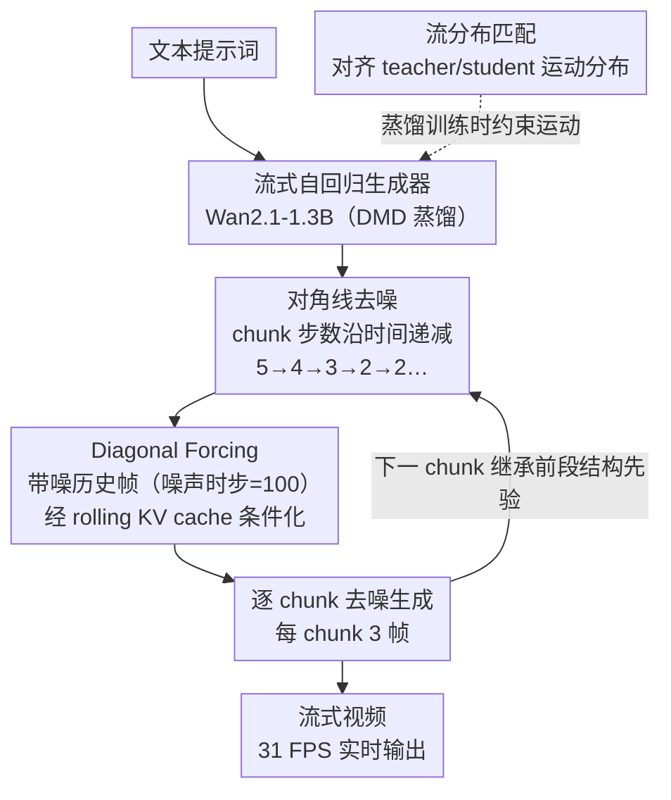

# Streaming Autoregressive Video Generation via Diagonal Distillation

**会议**: ICLR 2026  
**arXiv**: [2603.09488](https://arxiv.org/abs/2603.09488)  
**代码**: [项目页面](https://SphereLab.ai/diagdistill)  
**领域**: 视频生成  
**关键词**: 视频生成, 自回归生成, 蒸馏, 流式生成, 实时视频

## 一句话总结

提出Diagonal Distillation（DiagDistill），通过对角线去噪策略（前段多步、后段少步）和流分布匹配损失，实现流式自回归视频生成的277.3倍加速，达到31 FPS实时生成。

## 研究背景与动机

1. **领域现状**: 扩散模型在视频生成质量上取得显著进展，但全局双向注意力机制要求一次性生成整个视频，不适用于流式/实时场景。自回归模型天然适合流式生成，但需要多步去噪以保证质量。

2. **现有痛点**: 现有视频蒸馏方法（如CausVid、Self-Forcing）主要从图像蒸馏技术改编而来，忽视了时序维度的特殊性。减少去噪步数会导致运动连贯性下降、长序列误差累积和过饱和问题。

3. **核心矛盾**: 自回归视频生成中，预测下一chunk本质上隐含了预测下一噪声级别。这引入暴露偏差（训练时用干净帧条件化，推理时用生成帧），导致质量随时间逐步退化。同时，如果前段chunk已建立结构先验，后段chunk理应需要更少的去噪步骤，但现有方法未利用这一特性。

4. **本文目标**: 在保持视频质量的前提下大幅降低流式视频生成延迟。

5. **切入角度**: 利用自回归生成的时序结构——前段chunk提供的结构先验可以"接力"给后续chunk，因此设计"前多后少"的非均匀去噪步骤分配策略。

6. **核心 idea**: 通过对角线去噪轨迹（前段多步、后段逐步减少至2步）和流分布匹配损失，在时间和去噪步骤两个维度上联合优化，实现质量与效率的最佳平衡。

## 方法详解

### 整体框架

DiagDistill以Wan2.1-T2V-1.3B为基座、在DMD（Distribution Matching Distillation）蒸馏框架下训练一个流式自回归生成器：视频按3帧一个chunk逐段生成，每个chunk通过rolling KV cache条件化在已生成的历史上。它的关键观察是，自回归生成天然存在"时间—去噪步数"的对角线结构——前段chunk需要多步去噪来打牢结构基础，后段chunk则可以继承这份结构先验、用更少步数搭便车，于是把去噪步数沿时间轴递减、把条件帧带上噪声对齐推理、再补一项运动分布约束三者结合起来，在质量几乎不掉的前提下把流式生成推到实时。

### 关键设计

**1. 对角线去噪：让后段chunk继承前段的结构先验，省去重复步数**

均匀给每个chunk分配相同去噪步数是次优的：前段chunk要从零建立画面的结构与外观，后段chunk其实站在已经处理充分的历史之上，没必要重复同样的去噪量。DiagDistill据此让前3个chunk分别用5、4、3步的蒸馏模型生成，从第4个chunk起固定为2步。沿时间轴看，每个chunk所处的去噪步数在递减，连起来形成一条"对角线"轨迹——前段把视觉基础做厚，后段从充分去噪的邻近chunk继承丰富的外观信息，因此即便只跑2步也能出清晰画面。消融显示去掉这一策略时序质量反而略升、但帧质量与文本对齐下降，说明它是在用极小的质量代价换来近2倍的吞吐。

**2. Diagonal Forcing：用带噪历史帧条件化，对齐训练与推理**

自回归生成里"预测下一个chunk"隐式地也在"预测下一个噪声级别"，于是出现暴露偏差：训练时拿干净帧做KV cache条件，推理时拿的却是自己生成、带误差的帧，质量随时间逐步退化、并出现过饱和。Diagonal Forcing的做法是不再用干净的前一chunk输出 $\mathbf{X}_{k-1}$ 做条件，而是注入受控噪声 $\tilde{\mathbf{X}}_{k-1} = \sqrt{\alpha_{k-1}}\,\mathbf{X}_{k-1} + \sqrt{1-\alpha_{k-1}}\,\bm{\epsilon}$ 后再喂进当前chunk的KV cache。噪声强度需要精挑：在0到1000步的尺度上（0为干净帧、1000为纯噪声），最优噪声时步为100步——干净帧条件（0步）会让模型把后续chunk过度去噪、走向过饱和，适量噪声则与推理时真实拿到的带噪条件对齐，从而压住误差沿时间的累积传播。

**3. 流分布匹配：在步数压缩后补回被削弱的运动**

步数一旦压低，运动幅度会随之衰减——标准DMD的回归损失只盯帧的外观分布，对时序动态视而不见，于是画面清晰但动起来发飘。DiagDistill额外定义了一项流分布匹配损失，其梯度记作 $\nabla_\phi\mathcal{L}_{\text{DMD}}^{\text{flow}}$，在运动流场 $\mathcal{F}(\mathbf{x})$ 上对齐teacher与student的分布，把"该有多大运动"也纳入蒸馏目标。运动特征不依赖外部光流估计器，而是用一个轻量可学习模块（对相邻latent做差分后接卷积加MLP）提取，既省去额外推理开销、也能随训练自适应。它主要在少步去噪的regime里起作用：消融中多步设定下增益有限，但在2步这种压缩档位下是保住运动一致性的关键。

### 损失函数 / 训练策略

总损失把空间项与流向项联合起来：$\mathcal{L}_{\text{Total}} = \lambda_{\text{spatial}}\mathcal{L}_{\text{DMD}} + \mathcal{L}_{\text{reg}} + \gamma(\lambda_{\text{flow}}\mathcal{L}_{\text{DMD}}^{\text{flow}} + \mathcal{L}_{\text{reg}}^{\text{flow}})$，其中 $\lambda_{\text{spatial}}=4$、$\lambda_{\text{flow}}=4$，前两项管帧外观、后两项管运动分布。推理时采用rolling KV cache（chunk size 为3帧）滚动生成，显存占用固定在17.5GB，不随视频长度增长。

## 实验关键数据

### 主实验

VBench评测对比（5秒视频生成，单H100 GPU）：

| 方法 | 吞吐量(FPS)↑ | 首帧延迟↓ | 加速比 | 总分↑ | 质量↑ | 语义↑ |
|------|------------|---------|--------|------|------|------|
| Wan2.1 | 0.78 | 103s | 1× | 84.26 | 85.30 | 80.09 |
| CausVid | 17.0 | 0.69s | 149.3× | 81.20 | 84.05 | 69.80 |
| Self-Forcing | 17.0 | 0.69s | 149.3× | 84.31 | 85.07 | 81.28 |
| **DiagDistill** | **31.0** | **0.37s** | **277.3×** | **84.48** | **85.26** | **81.73** |

### 消融实验

| 配置 | 时序质量↑ | 帧质量↑ | 文本对齐↑ | 总分↑ |
|------|---------|--------|---------|------|
| 去除Diagonal Forcing | 92.1 | 60.1 | 26.9 | 83.58 |
| 去除Flow Loss | 92.5 | 60.8 | 27.8 | 84.18 |
| 去除Diagonal Denoising | 95.1 | 63.2 | 28.6 | 84.46 |
| **完整方法** | 94.9 | 63.4 | 28.9 | **84.48** |

### 关键发现

- DiagDistill相比Self-Forcing进一步实现**1.88倍加速**（277.3× vs 149.3×），质量不降反升
- Diagonal Forcing最优噪声时步为100步——过多噪声模糊结构先验，过少噪声导致过饱和
- Flow Loss主要在少步去噪regime下发挥作用，在多步设定下增益有限
- 45秒长视频生成中，DiagDistill明显优于CausVid和Self-Forcing（后两者出现饱和失真）

## 亮点与洞察

- **"前多后少"的直觉简洁有效**: 利用自回归生成的时序结构，前段建基础后段省步数
- **暴露偏差的创新解决方案**: 用适量噪声的条件化对齐训练和推理时的差异
- **流分布匹配**: 首次在视频蒸馏中显式考虑运动分布对齐
- **实用性极强**: 31 FPS超过16 FPS播放速率，真正实现实时生成

## 局限与展望

- 基于Wan2.1-1.3B模型，在更大模型上的效果需要验证
- 固定的步数递减策略（5/4/3/2/2/...）可能不是所有场景的最优
- 运动特征提取模块的可学习设计可能不如专用光流模型精确
- 可探索自适应步数分配（根据场景复杂度动态决定每个chunk的步数）

## 相关工作与启发

- CausVid和Self-Forcing为流式视频生成奠定基础，DiagDistill在其上进一步提速
- DMD框架提供了蒸馏的理论基础，流分布匹配是对其时序维度的自然扩展
- 启发: 视频生成的蒸馏需要专门考虑时序结构，不能简单照搬图像蒸馏方法

## 评分

- 新颖性: ⭐⭐⭐⭐ 对角线去噪策略新颖，流分布匹配首创
- 实验充分度: ⭐⭐⭐⭐ VBench全面评测，消融详细，长视频对比有说服力
- 写作质量: ⭐⭐⭐⭐ 图示清晰，直觉解释到位
- 价值: ⭐⭐⭐⭐⭐ 实用价值极高，31 FPS实时生成具有里程碑意义

<!-- RELATED:START -->

## 相关论文

- [\[CVPR 2025\] Teller: Real-Time Streaming Audio-Driven Portrait Animation with Autoregressive Motion Generation](../../CVPR2025/video_generation/teller_real-time_streaming_audio-driven_portrait_animation_with_autoregressive_m.md)
- [\[ICML 2026\] AAD-1: Asymmetric Adversarial Distillation for One-Step Autoregressive Video Generation](../../ICML2026/video_generation/aad-1_asymmetric_adversarial_distillation_for_one-step_autoregressive_video_gene.md)
- [\[ICLR 2026\] Lumos-1: On Autoregressive Video Generation with Discrete Diffusion from a Unified Model Perspective](lumos-1_on_autoregressive_video_generation_with_discrete_diffusion_from_a_unifie.md)
- [\[CVPR 2026\] StreamDiT: Real-Time Streaming Text-to-Video Generation](../../CVPR2026/video_generation/streamdit_real-time_streaming_text-to-video_generation.md)
- [\[CVPR 2026\] LottieGPT: Tokenizing Vector Animation for Autoregressive Generation](../../CVPR2026/video_generation/lottiegpt_vector_animation_generation.md)

<!-- RELATED:END -->
