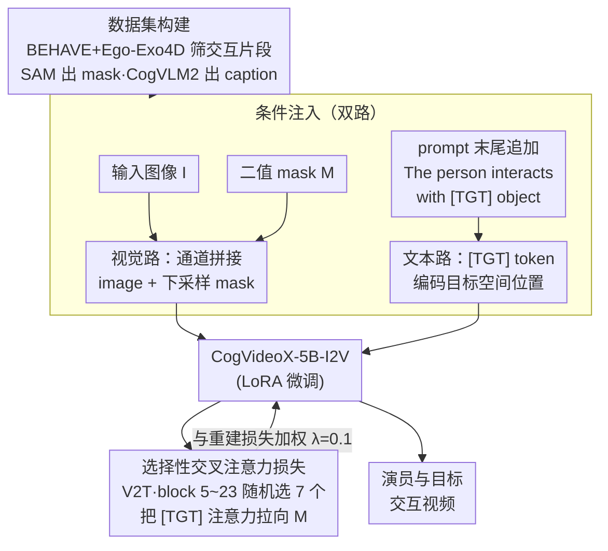

# Target-Aware Video Diffusion Models

**会议**: ICLR 2026  
**arXiv**: [2503.18950](https://arxiv.org/abs/2503.18950)  
**代码**: [taeksuu.github.io/tavid](https://taeksuu.github.io/tavid/)  
**领域**: 视频生成 / 人物-物体交互  
**关键词**: 视频扩散模型, 目标感知, 交叉注意力损失, 人物交互, 动作规划

## 一句话总结
提出 target-aware 视频扩散模型，仅需一张输入图像和目标物体的分割 mask，即可生成演员与指定目标交互的视频；核心创新是引入 [TGT] 特殊 token 并设计选择性交叉注意力损失，使模型关注目标的空间位置，在目标对齐和视频质量上全面超越基线。

## 研究背景与动机
视频扩散模型已展现出模拟复杂场景的显著能力，但要在实际应用中发挥作用，需要对内容和动作进行精确控制。现有的可控视频生成方法通常依赖密集的结构或运动线索（深度图、边缘图、光流、拖拽等）来引导演员的运动。这些方法对简单平移或视角变化有效，但对于**演员-目标交互场景**则存在根本困难——为演员提供结构性动作引导（如怎样伸手去拿桌上的杯子）非常困难。

另一个重要动机是：将视频扩散模型用作**高层动作规划器**。不同于将视频模型当"渲染器"（需密集运动输入），本文将其定位为"规划器"——仅给定目标位置就能生成合理的交互动作。这对机器人操控等下游应用具有重要意义。

核心 idea：仅用一个分割 mask 标记目标物体，让视频扩散模型的生成先验自主推断演员的合理交互动作。

## 方法详解

### 整体框架
这篇论文要解决的是：现有可控视频生成方法都靠密集的结构/运动线索（深度图、边缘、光流、拖拽）来引导演员动作，可一旦遇到"演员去拿桌上某个杯子"这类人物-物体交互，逐帧画出"手该怎么伸"几乎不可能。本文反过来只给一张图像、一张标出目标物体的二值 mask 和一句文本 prompt，让视频扩散模型自己推断合理的交互动作。

整体怎么转：先离线构建一批"从不接触到接触目标"的训练片段；训练时把目标的空间信息**同时塞进两条路**——视觉路（mask 与图像在通道维拼接）和文本路（prompt 里追加一个 [TGT] token）；底座是 CogVideoX-5B-I2V，只用 LoRA 微调。光把 mask 喂进去模型可能当它不存在，所以再加一个交叉注意力损失，把 [TGT] token 的注意力图直接拉向 mask，逼模型"真的去看"目标；这个损失还只挑最语义对齐的层和注意力区域施加。最终输出一段演员准确与 mask 所指目标交互的视频。

### 关键设计

**1. 数据集构建：筛"交互发生"的片段并自动标注**

[TGT] 损失要对齐的，是"演员从不接触到接触目标"这一过程，所以监督信号里必须真的包含一次清晰的交互。本文从 BEHAVE（简单人物-物体交互）和 Ego-Exo4D（烹饪、修车等复杂场景）中提取 1290 个片段，每个片段都满足两个条件：初始帧演员已在场但尚未与目标交互、后续帧演员与目标发生交互。目标 mask 用 SAM 获取，文本 caption 用 CogVLM2 自动生成。这样每条训练样本都自带一次"伸手去够"的完整动作，正是后面对齐损失需要的东西。

**2. Mask 条件注入：让视觉分支在像素层面知道目标在哪**

最直接的注入方式是走视觉路。本文把二值 mask $M$ 下采样后与输入图像 $I$ 在通道维拼接，作为额外通道送进扩散模型；为容纳新通道，image projection layer 的输入维度被扩展，新增权重**初始化为零**，于是训练初期完全保留预训练参数、不破坏原有生成先验。这一步给了模型感知目标位置的机会，但单凭它并不够——模型完全可能忽略这条 mask 通道，把它当摆设，所以还需要下面的显式约束把注意力拽过去。

**3. [TGT] token 与交叉注意力损失：用文本 token 携带空间信息并强制对齐**

这是全文的核心。本文在 prompt 末尾追加 "The person interacts with [TGT] object."，引入特殊 token [TGT] 专门编码目标的空间位置；再设计一个交叉注意力损失，把 [TGT] 的注意力图直接拉向输入 mask：

$$\mathcal{L}_{\text{attn}} = \mathbb{E}\big[\,\|A(\mathbf{z}_t^0, [\text{TGT}]) - M\|_2^2\,\big]$$

其中 $A(\mathbf{z}_t^0, [\text{TGT}])$ 是第一帧视频潜变量与 [TGT] token 之间的交叉注意力权重。它与重建损失加权组合成总目标 $\mathcal{L}_{\text{total}} = \mathcal{L}_{\text{rec}} + \lambda_{\text{attn}} \mathcal{L}_{\text{attn}}$（取 $\lambda_{\text{attn}} = 0.1$）。推理时只需把 [TGT] 前置到 prompt 中指代目标的词语前，模型就会顺着这个 token 去利用 mask 提供的空间线索。这样空间信号不再依赖架构改动，仅靠一个 text token 加一项损失就接管了"看哪里"。

**4. 选择性交叉注意力损失：只在最语义对齐的层和注意力区域施压**

如果对所有 transformer block、所有注意力区域无差别施加 $\mathcal{L}_{\text{attn}}$，反而会污染那些与空间定位无关的层。本文做两层筛选。block 层面：经实验评估发现第 5~23 个 block（共 42 个）的注意力图与分割 mask 语义对齐最好，每个训练步只在这一区间内**随机选 7 个 block** 施加损失。注意力区域层面：MM-DiT 把注意力拆成 text-to-text、T2V、V2T、video-to-video 四类，本文选 V2T（video-to-text）cross-attention，因为它通过 value 的点积**直接影响**视频潜表示的取值，而 T2V 虽也编码语义但作用更间接、效果更弱。有原则地挑层挑区域，比无差别施压或随机选层都更稳。

### 损失函数 / 训练策略
训练时冻结底座、仅更新 LoRA 层（rank=128、$\alpha$=64）和扩展后的 image projection layer，跑 2000 步，AdamW，学习率 1e-4，batch size=4，在 4 张 A100 上约 6 小时。推理用 DPM 采样器、50 步、CFG=6，单张 A100 约 4 分钟生成一段视频。

## 实验关键数据

### 主实验 — 目标对齐与视频质量

| 方法 | Hum. Eval. ↑ | User Pref. ↑ | Contact Score ↑ | SS | BC | DD | MS |
|------|-------------|-------------|----------------|----|----|----|----|
| CogVideoX | 0.592 | 0.456 | 28.4% | 0.914 | 0.903 | 0.950 | 0.988 |
| CogVideoX w. data | 0.692 | 0.596 | 36.2% | 0.915 | 0.900 | 0.956 | 0.990 |
| Attn. Mod. | 0.613 | 0.508 | 22.2% | 0.878 | 0.887 | 0.827 | 0.984 |
| **Ours** | **0.896** | **0.892** | **最高** | **0.938** | **0.914** | 0.956 | 0.905 |

### 消融实验

| 配置 | Contact Score | 说明 |
|------|--------------|------|
| $\lambda_{\text{attn}} = 0.0$（无注意力损失） | 0.688 | ≈ CogVideoX w. data，证明注意力损失至关重要 |
| $\lambda_{\text{attn}} = 0.01$ | 0.756 | 有改善但不充分 |
| $\lambda_{\text{attn}} = 0.1$（ours） | **0.896** | 最优平衡 |
| $\lambda_{\text{attn}} = 1.0$ | 0.904 | Contact 微升但视频质量下降 |
| 随机 Block 选择 | 0.840 | 不如语义选择 |
| 等间距 Block 选择 | 0.839 | 不如语义选择 |
| T2V Cross-Attn. | 0.784 | 不如 V2T |
| V2T Cross-Attn.（ours） | **0.896** | V2T 直接影响视频潜表示 |

### 关键发现
- 交叉注意力损失是实现目标感知的关键：$\lambda=0$ 时性能几乎等于仅用数据微调的 baseline
- V2T cross-attention 是正确的施加位置：它直接通过 value 的点积影响视频潜表示
- 语义选择 block（第 5-23 block 中每 3 个取 1 个）效果最好
- 场景中有多个同类物体时，mask 的优势尤为明显（文本无法区分，mask 可以精确指定）
- 模型泛化到非人类主体（如动物）的交互

## 亮点与洞察
- **最小化控制输入，最大化生成先验**: 仅用一个分割 mask（不需要密集轨迹或多帧引导）就能让模型自主推断合理的交互动作，充分利用了视频扩散模型的生成能力
- **[TGT] token 设计优雅**: 巧妙地利用 text token 来携带空间信息，不需要修改模型架构，只需加一个额外训练损失
- **选择性损失的分析很深入**: 系统性地分析了 MM-DiT 中不同 block 和注意力区域的语义特性，不是黑盒调参而是有原则的设计
- **两个下游应用亮眼**: 视频内容创作（导航+交互组合）和零样本 3D HOI 运动合成，展示了模型作为"动作规划器"的潜力

## 局限与展望
- 视频质量受限于基础开源模型（CogVideoX），闭源商业模型可能更好
- 训练数据的摄像机都是静态的，生成的视频倾向于固定机位
- 数据集仅 1290 个片段，扩大数据规模可能进一步提升泛化
- 当前只支持单个目标的 mask，多目标同时交互的扩展（虽有 [SRC]+[TGT] 的初步探索）仍需完善
- 生成的运动虽合理但可能在物理精确性上不足（如接触力学）
- 物理仿真学习部分的 3D pose 和场景尺度未完全对齐

## 相关工作与启发
- **与 ControlNet 系 方法的区别**: ControlNet 类方法需要每帧的密集条件（深度/边缘），适合精确控制简单运动；本文用单帧 mask 适合 HOI 场景
- **与 DragDiffusion 的比较**: 拖拽式方法对大幅运动失效，且无法生成复杂交互
- **与 Direct-a-Video 的区别**: 注意力调制方法不需训练但效果差——MM-DiT 中 softmax 的行归一化导致交叉注意力值的放大会破坏自注意力，产生时间不一致
- **启发**: 视频扩散模型内在蕴含了丰富的物理世界交互先验，关键是如何用最少的信号（一个 mask）来释放这些先验

## 评分
- 新颖性: ⭐⭐⭐⭐
- 实验充分度: ⭐⭐⭐⭐⭐
- 写作质量: ⭐⭐⭐⭐⭐
- 价值: ⭐⭐⭐⭐

<!-- RELATED:START -->

## 相关论文

- [\[ICLR 2026\] Frame Guidance: Training-Free Guidance for Frame-Level Control in Video Diffusion Models](frame_guidance_training-free_guidance_for_frame-level_control_in_video_diffusion.md)
- [\[CVPR 2026\] TEAR: Temporal-aware Automated Red-teaming for Text-to-Video Models](../../CVPR2026/video_generation/tear_temporal-aware_automated_red-teaming_for_text-to-video_models.md)
- [\[CVPR 2025\] InterDyn: Controllable Interactive Dynamics with Video Diffusion Models](../../CVPR2025/video_generation/interdyn_controllable_interactive_dynamics_with_video_diffusion_models.md)
- [\[CVPR 2026\] Content-Aware Dynamic Patchification for Efficient Video Diffusion](../../CVPR2026/video_generation/content-aware_dynamic_patchification_for_efficient_video_diffusion.md)
- [\[ICLR 2026\] Geometry-aware 4D Video Generation for Robot Manipulation](geometry-aware_4d_video_generation_for_robot_manipulation.md)

<!-- RELATED:END -->
