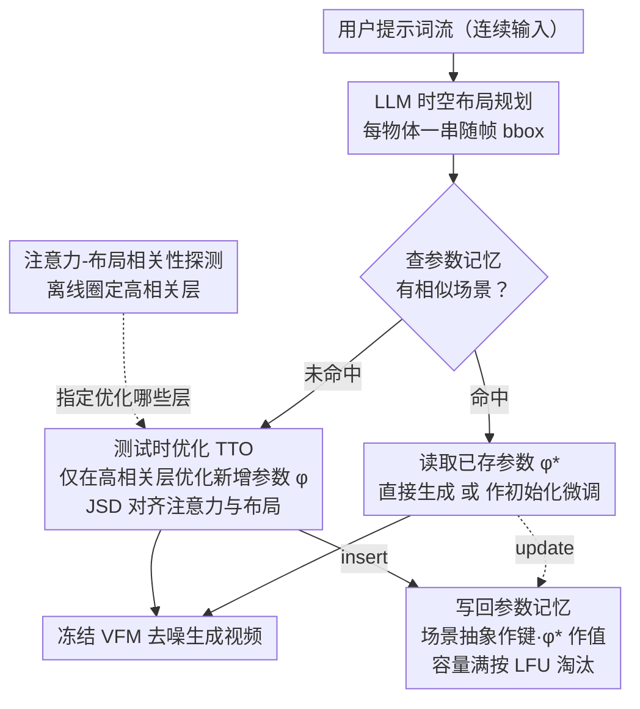

# TTOM: Test-Time Optimization and Memorization for Compositional Video Generation

**会议**: ICLR 2026  
**arXiv**: [2510.07940](https://arxiv.org/abs/2510.07940)  
**代码**: [https://ttom-t2v.github.io/](https://ttom-t2v.github.io/)  
**领域**: 视频生成 / 组合推理  
**关键词**: 测试时优化, 组合视频生成, 参数记忆, 时空布局, 注意力对齐

## 一句话总结
提出 TTOM 框架，在推理时通过优化新增参数将视频生成模型的注意力与 LLM 生成的时空布局对齐，并用参数记忆机制保存历史优化上下文支持复用，在 T2V-CompBench 上相对提升 34%（CogVideoX）和 14%（Wan2.1）。

## 研究背景与动机

**领域现状**：文本到视频（T2V）模型在单物体场景表现优秀，但在组合场景（多物体+属性+运动+空间关系）中仍严重对齐不足。现有方法用 LLM 生成时空布局，再通过修改潜变量/注意力来引导生成。

**现有痛点**：(a) 直接干预潜变量/注意力会破坏特征分布→闪烁、坍塌；(b) 逐样本独立处理，不利用历史上下文；(c) 对一个样本的干预无法泛化到其他样本。

**核心矛盾**：需要精细控制组合布局，但不能破坏预训练模型的特征分布。

**本文目标** 以模型无关的方式在测试时对齐组合布局，同时复用历史优化结果。

**切入角度**：不修改潜变量，而是插入并优化新参数使注意力与布局对齐——优化后的参数保存到记忆中供未来复用。

**核心 idea**：优化参数而非潜变量来对齐布局，并用参数记忆实现跨样本的知识积累与复用。

## 方法详解

### 整体框架

TTOM 想解决的是组合视频生成里"既要精细控制布局、又不能破坏预训练模型特征分布"的两难。它把这个问题放进一个**流式服务**的场景：用户连续地输入提示词，系统逐条处理并把经验沉淀下来。

整个方法先有一步**离线准备**：通过一次「注意力-布局相关性探测」量出 DiT 里哪些层的注意力真正决定了物体布局，圈定一小撮高相关层，告诉后续优化"只动这些层就够了"。准备好后进入**在线流式处理**：每来一条提示词，pipeline 大致这样转——先用 LLM 把提示词翻译成**时空布局**（每个物体一串随帧变化的 bbox 序列）；然后去**参数记忆**里查有没有相似场景，命中就把存好的参数加载进来（必要时再微调几步），没命中就进入**测试时优化（TTO）**，只在那撮高相关层上插入并优化一组新增参数、让模型注意力贴合 LLM 给的布局；最后把优化好的参数连同场景的抽象描述写回记忆，供后续相似请求复用。整个过程不碰潜变量，模型本体保持冻结。

### 关键设计

**1. 注意力-布局相关性探测：先找准该优化哪些层**

DiT 里有很多层注意力，盲目地全优化既浪费又容易互相干扰。TTOM 先做一次离线探测：正常生成一段视频，用 GroundingDINO + SAM2 把视频里的物体分割出来作为"真实布局"，再逐层把该层的注意力图和分割结果算 mIoU。结果发现不同层的相关性差异很大——只有一部分层的注意力真正决定了最终的物体布局。后续的 TTO 就只优化这些高相关层的参数，把优化集中在真正起作用的地方。

**2. 测试时优化（TTO）：优化新参数，而不是改潜变量**

这是 TTOM 区别于"latent guidance"类方法的核心。以往做法直接去改潜变量 $z_t$ 或注意力图，强行把生成往布局上拽，结果常常破坏特征分布、引发闪烁和坍塌。TTOM 换了个落点：在 VFM 里插入一组轻量的新参数 $\phi$，推理时只优化 $\phi$，让模型注意力自己学会对齐布局。对齐的目标用 JSD 损失衡量——把注意力图 $\bar{A}_i$ 和高斯平滑后的布局掩码 $\bar{B}_i$ 当成两个分布去拉近：

$$L_{align} = \frac{1}{N}\sum_i JSD(\bar{A}_i \| \bar{B}_i)$$

因为优化的是外挂参数而非潜变量本身，模型的特征分布不被破坏，对齐和画质就能同时保住；论文也观察到 JSD 比直接 L2 对齐更稳定。

**3. 参数记忆机制：把一次性的优化变成可复用的知识**

逐样本独立优化的另一个问题是：每条提示词都从头优化一遍，历史经验全扔了。TTOM 给系统配了一块参数记忆 $\mathcal{M} = \{g(C): \phi^*_C\}$，把"场景抽象 $C$ 经过编码 $g(C)$ 得到的文本嵌入"当键、把那次优化收敛的参数 $\phi^*_C$ 当值存起来。这块记忆支持 insert / read / update / delete 四种操作，容量满了用 LFU（最不常用优先淘汰）腾空间。新请求进来时，相似场景的参数既可以直接加载、跳过优化省时间，也可以当作一个好的初始化、让后续微调更快收敛——前者偏效率、后者偏质量，记忆让流式推理越用越顺手。

### 损失函数 / 训练策略

整个过程**无监督**：测试时只用对齐损失 $L_{align}$（JSD）优化新增参数，不需要任何标注。LLM 生成布局时自带一个验证步骤来保证布局自洽。一旦记忆命中，可以直接加载参数跳过优化、立即推理。

## 实验关键数据

### 主实验

T2V-CompBench（7类组合视频生成）：

| 模型 | 平均分 | 运动 | 数量 | 空间 |
|------|-------|------|------|------|
| CogVideoX-5B | baseline | 低 | 低 | 低 |
| CogVideoX + TTOM | **+34%** | 显著提升 | 显著提升 | 显著提升 |
| Wan2.1-14B | baseline | 中 | 中 | 中 |
| Wan2.1 + TTOM | **+14%** | 提升 | 提升 | 提升 |

VBench 上也有一致的改进。

### 消融实验

| 配置 | 说明 |
|------|------|
| 优化潜变量 vs 优化参数 | 优化参数质量更好、不坍塌 |
| 有记忆 vs 无记忆 | 记忆显著提升效率和质量 |
| 层选择 | 仅优化高相关性层效果最好 |
| 记忆命中时跳过优化 | 效率大幅提升，质量仅微降 |
| 迁移性 | TTOM 在一个场景优化的参数可迁移到类似场景 |

### 关键发现
- TTOM 解耦了组合世界知识——优化后的参数展现出强迁移性和泛化性
- 参数记忆使流式推理越用越好——历史积累的组合模式可被新场景复用
- 模型无关——在 CogVideoX 和 Wan2.1 两种不同架构上都有效
- JSD 损失比直接 L2 损失更稳定

## 亮点与洞察
- **优化参数而非潜变量**：避免了直接干预导致的特征分布破坏，是比"latent guidance"更优雅的控制方式
- **参数记忆的"越用越好"性质**：将测试时优化从一次性消耗变为知识积累，概念上类似于人类的经验学习
- **流式设置的前瞻性**：将视频生成放在连续服务而非独立请求的框架下，更贴合实际部署
- **注意力-布局相关性探测**：首次系统量化 DiT 各层注意力与最终布局的对应关系，有独立的分析价值

## 局限与展望
- TTO 需要额外优化步骤——首次（cold start）推理速度较慢
- LLM 生成的时空布局可能不准确——布局错误会传播到生成结果
- 记忆的场景抽象（"<object A> drifts above <object B>"）可能过于粗糙
- 仅在 T2V 上验证，未扩展到图像生成或3D场景
- 记忆容量管理和 LFU 策略可能不是最优

## 相关工作与启发
- **vs LLM-grounded Diffusion (Lian et al., 2023b)**: 它们优化潜变量导致质量退化。TTOM 优化新参数避免此问题
- **vs TTT layers (Sun et al., 2024)**: TTT 记忆是样本内（帧间），TTOM 是跨样本的参数记忆
- **vs Attend-and-Excite**: 该方法用于图像级注意力控制。TTOM 扩展到视频的时空注意力
- **对视频生成的启发**：参数级控制+跨样本记忆的范式可推广到其他生成控制场景

## 评分
- 新颖性: ⭐⭐⭐⭐⭐ TTO+参数记忆的组合非常新颖，流式设置有前瞻性
- 实验充分度: ⭐⭐⭐⭐ 两个基准+多种VFM+消融充分
- 写作质量: ⭐⭐⭐⭐⭐ 动机层层递进，框架设计优雅
- 价值: ⭐⭐⭐⭐⭐ 对组合视频生成有实质性推进，参数记忆范式有广泛应用前景

<!-- RELATED:START -->

## 相关论文

- [\[CVPR 2025\] One-Minute Video Generation with Test-Time Training](../../CVPR2025/video_generation/one-minute_video_generation_with_test-time_training.md)
- [\[ICLR 2026\] JavisDiT++: Unified Modeling and Optimization for Joint Audio-Video Generation](javisdit_unified_modeling_and_optimization_for_joint_audio-video_generation.md)
- [\[ICLR 2026\] Dual-IPO: Dual-Iterative Preference Optimization for Text-to-Video Generation](dual-ipo_dual-iterative_preference_optimization_for_text-to-video_generation.md)
- [\[ICLR 2026\] MotionStream: Real-Time Video Generation with Interactive Motion Controls](motionstream_real-time_video_generation_with_interactive_motion_controls.md)
- [\[CVPR 2026\] Training-free Motion Factorization for Compositional Video Generation](../../CVPR2026/video_generation/training-free_motion_factorization_for_compositional_video_generation.md)

<!-- RELATED:END -->
