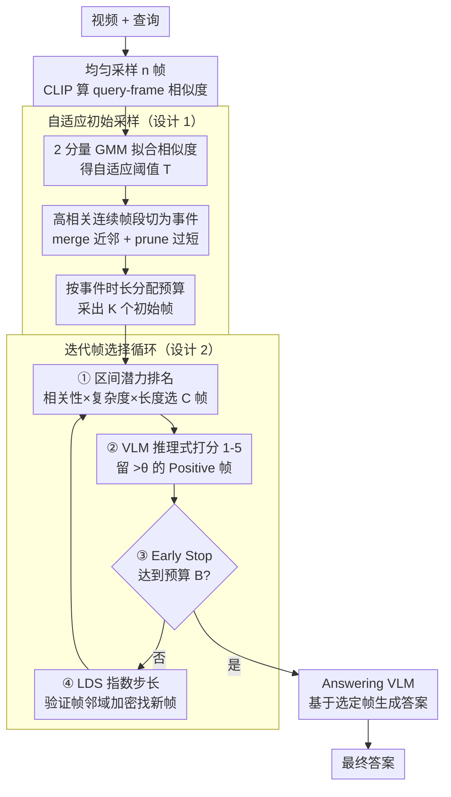

# A.I.R.: Adaptive, Iterative, and Reasoning-based Frame Selection For Video Question Answering

**会议**: ICLR 2026  
**arXiv**: [2510.04428](https://arxiv.org/abs/2510.04428)  
**代码**: [https://ucf-air.github.io/](https://ucf-air.github.io/)  
**领域**: 视频理解  
**关键词**: video QA, frame selection, VLM, iterative search, computational efficiency

## 一句话总结
提出 A.I.R.，一种无需训练的自适应-迭代-推理驱动帧选择框架，通过两阶段策略（GMM 自适应初始采样 + 迭代式 VLM 精细分析）解决 VideoQA 中轻量模型（CLIP）相似度不准确和 VLM 分析成本爆炸的双重困境，在最坏情况下也仅需分析 72 帧（vs 基线 128 帧），同时显著提升多个长视频 benchmark 性能。

## 研究背景与动机
**领域现状**：VideoQA 中帧选择是关键——完整视频太长无法全部处理。现有方法分两类：(1) 轻量模型（CLIP）计算相似度后选帧，快但对复杂查询不准确；(2) VLM 逐帧分析，准但计算成本爆炸（128 帧 ≈162 秒）。

**现有痛点**：CLIP 将查询当作关键词袋，无法理解时序推理（如"在介绍豆腐之后"）和复杂语义，导致相似度分数不反映真实相关性。而 VLM 分析所有帧则不可行。

**核心矛盾**：准确的帧选择需要深度语义理解（VLM），但 VLM 的逐帧分析成本与帧数线性增长。如何在不牺牲质量的前提下降低 VLM 调用次数？

**本文目标** 让 VLM 的深度分析在计算上可行——只分析最有潜力的少量帧，而非全部帧。

**切入角度**：两阶段——先用 CLIP 做粗粒度筛选（快但粗），再用 VLM 对少量高潜力帧做精细分析（准但贵），迭代式发现新帧。

**核心 idea**：用迭代循环让 VLM 只分析小批量最有潜力的帧，配合局部密集采样发现相邻重要帧。

## 方法详解

### 整体框架
A.I.R. 要解决的是 VideoQA 里帧选择的两难：CLIP 又快又粗、看不懂时序语义，VLM 又准又贵、逐帧分析撑不住。它的思路是让两者各司其职——先用 CLIP 在整段视频上做一次廉价的粗筛，把 VLM 的昂贵分析只投到"最有潜力的少量帧"上。整个流程分三段：**自适应初始采样**用 GMM 拟合 CLIP 相似度分布、按事件区间挑出 K 个初始帧；**迭代帧选择**是一个"区间潜力排名→VLM 推理打分→Early Stop 判断→局部加密"的循环，逐轮把候选帧池收紧、把真正相关的帧捞出来；最后把选定帧送进 Answering VLM 出答案。分析和回答复用同一个 VLM，全程无需训练。

### 关键设计

**1. 自适应初始采样：让起点帧自动贴合查询相关区域，而不是均匀撒点**

均匀采样的问题是把预算平摊给所有时刻，长视频里大量冗余帧会稀释掉关键事件。A.I.R. 先对 n 个均匀采样帧算 CLIP 相似度，再用一个 2 分量 GMM 把这些分数拟合成"高相关"和"低相关"两簇，并据此定一个随视频自适应的阈值 $T = \max(\mu_1,\mu_2) - \gamma \cdot \max(\sigma_1,\sigma_2)$ 来切分两类帧。阈值是从每个视频自己的分数分布里长出来的，所以不同视频的判定标准会自动伸缩。被判为高相关的连续帧段被当作"事件"，再做两步清理——把间隔很短的相邻事件 merge、把太短的事件 prune 掉——最后按各事件的时长比例分配采样预算，挑出 K 个初始帧。这样起点就密集落在查询相关的区域，而不是平均铺满整条时间轴。

**2. 迭代帧选择：用一个四步循环让 VLM 只在小批量高潜力帧上做深度推理**

这是把"VLM 太贵"这个痛点直接拆解掉的核心机制，每一轮做四件事。第一步**区间潜力排名（Interval Potential Ranking）**：以当前已选帧为界把视频切成若干区间，用相关性×复杂度×长度（Relevance×Complexity×Length）三个因子算每个区间的"潜力"——相关性高、内容复杂、跨度长的区间更可能藏着没被覆盖的关键帧——从中选出 C 个最高潜力的帧作为本轮候选。第二步**推理式 VLM 分析（Reasoning-Based VLM Analysis）**：让 VLM 对这 C 个帧做推理式分析，给出理由并打 1-5 分，只保留得分高于阈值 $\theta$ 的 Positive 帧。第三步 **Early Stop**：一旦累计已选帧数达到自适应预算 B 就立刻收手，不再多调一次 VLM。第四步**局部密集采样（Localized Density Sampling, LDS）**：在每个被 VLM 验证过的帧的时间邻域里、以指数增长的步长去发现新帧（离验证帧越近采得越密、越远越稀，假设关键内容在时间上是局部聚集的），把这些新帧补进下一轮候选池。LDS 正是这套设计能补回 CLIP 漏判的关键——比如某个"佛寺"帧 CLIP 分数只有 0.4 会被初筛丢掉，但它在时间上紧挨着一个已被 VLM 确认的相关帧，LDS 就会把它重新捞回来交给 VLM 复核。

**3. 效率保证：把最坏开销写死在一个可控上界内**

因为 VLM 只在每轮的 C 个候选上运行，开销不再随视频长度线性膨胀。最好情况下一轮迭代就够、只分析 C 帧；最坏情况跑满 I_max 轮、共分析 $C \times I_{max}$ 帧。默认 C=12、I_max=6，最坏也只有 72 帧，仍低于 Frame-Voyager / VideoTree 这类固定分析 128 帧的方法；而且 Early Stop 在实际中通常 2-3 轮就触发，真实开销远小于这个上界。

### 损失函数 / 训练策略
无需训练（training-free）。即插即用，与 VILA、Qwen-VL、InternVL-3、LLaVA-OneVision 等 VLM 兼容，用同一个 VLM 同时承担分析和回答两项任务。

## 实验关键数据

### 主实验（多 benchmark, 与帧选择方法对比）

| VLM | 方法 | #帧 | Video-MME | MLVU | LVB |
|-----|------|-----|-----------|------|-----|
| VILA-1.5-8B | 均匀 | 8 | 48.9 | 44.7 | 47.9 |
| | MDP3 | 8 | 53.3 | 52.3 | 52.3 |
| | **A.I.R.** | 8 | **53.7** | **54.2** | **52.9** |
| QwenVL-2.5-7B | 均匀 | 32 | 60.8 | 59.3 | 58.1 |
| | MDP3 | 32 | 63.8 | 66.2 | 60.0 |
| | **A.I.R.** | 32 | **高** | **高** | **高** |

### 效率对比

| 方法 | VLM 分析帧数 | 适应性 |
|------|------------|--------|
| Frame-Voyager | 128 (固定) | 无 |
| VideoTree | 128 (固定) | 无 |
| **A.I.R.** | **12-72 (自适应)** | **有** |

### 关键发现
- A.I.R. 在 Video-MME、MLVU、LVB 上一致优于所有帧选择基线，且与 4 种不同 VLM backbone 兼容
- 在长视频上优势最明显（MLVU +10% vs 均匀采样），因为长视频中有更多冗余帧需要跳过
- LDS 步骤是关键：它能发现 CLIP 分数低但 VLM 认为相关的帧（如"佛寺"帧 CLIP 分数 0.4 但是正确答案）
- 即使在短视频 benchmark（EgoSchema、NextQA）上也有提升，说明方法的通用性

## 亮点与洞察
- **"粗筛+精炼"的两阶段哲学**：用便宜的 CLIP 做第一轮过滤，用昂贵的 VLM 做精确验证——经典但有效的多级过滤思想
- **Interval Potential Ranking 的信号处理视角**：用 Relevance×Complexity×Length 三因子评估区间而非单帧，捕获了时间区域的信息密度
- **LDS 的指数步长设计**：离验证帧越近采样越密，越远越稀——符合时间局部性假设

## 局限与展望
- CLIP 的初始相似度仍然是基础——如果 CLIP 完全漏掉某个事件区域，即使 LDS 也很难补回
- 多个超参数（γ, d_min, l_min, C, I_max, α, β, D, c_len）需要调节
- 分析 VLM 和回答 VLM 使用同一个模型，可能不是最优选择（分析任务和回答任务的需求不同）
- 仅在多选 QA 上评估，开放式生成任务的适用性未验证

## 相关工作与启发
- **vs MDP3/Q-Frame（CLIP 方法）**: A.I.R. 用 VLM 精细分析弥补 CLIP 的不准确性，在复杂查询上优势明显
- **vs Frame-Voyager/VideoTree（VLM 方法）**: 它们一次性分析 128 帧，A.I.R. 最坏仅 72 帧，且通常通过 Early Stop 提前终止
- **vs 训练方法（SeViLA）**: A.I.R. 不需要训练，可即插即用于任何 VLM

## 评分
- 新颖性: ⭐⭐⭐⭐ 迭代帧选择 + LDS 的组合设计有创意
- 实验充分度: ⭐⭐⭐⭐⭐ 4 个 VLM、5 个 benchmark、多基线、效率分析
- 写作质量: ⭐⭐⭐⭐⭐ 动机清晰，pipeline 图示直观，效率分析严谨
- 价值: ⭐⭐⭐⭐ 实用的帧选择框架，但帧选择本身可能被未来更长上下文的 VLM 淘汰

<!-- RELATED:START -->

## 相关论文

- [\[ACL 2026\] CRAFT: Critic-Refined Adaptive Key-Frame Targeting for Multimodal Video Question Answering](../../ACL2026/video_understanding/craft_critic-refined_adaptive_key-frame_targeting_for_multimodal_video_question_.md)
- [\[CVPR 2026\] CaST-Bench: Benchmarking Causal Chain-Grounded Spatio-Temporal Reasoning for Video Question Answering](../../CVPR2026/video_understanding/cast-bench_benchmarking_causal_chain-grounded_spatio-temporal_reasoning_for_vide.md)
- [\[CVPR 2026\] Efficient Frame Selection for Long Video Understanding via Reinforcement Learning](../../CVPR2026/video_understanding/efficient_frame_selection_for_long_video_understanding_via_reinforcement_learnin.md)
- [\[NeurIPS 2025\] Tool-Augmented Spatiotemporal Reasoning for Streamlining Video Question Answering Task](../../NeurIPS2025/video_understanding/toolaugmented_spatiotemporal_reasoning_for_streamlining_vide.md)
- [\[CVPR 2026\] Wavelet-based Frame Selection by Detecting Semantic Boundary for Long Video Understanding](../../CVPR2026/video_understanding/wavelet-based_frame_selection_by_detecting_semantic_boundary_for_long_video_unde.md)

<!-- RELATED:END -->
