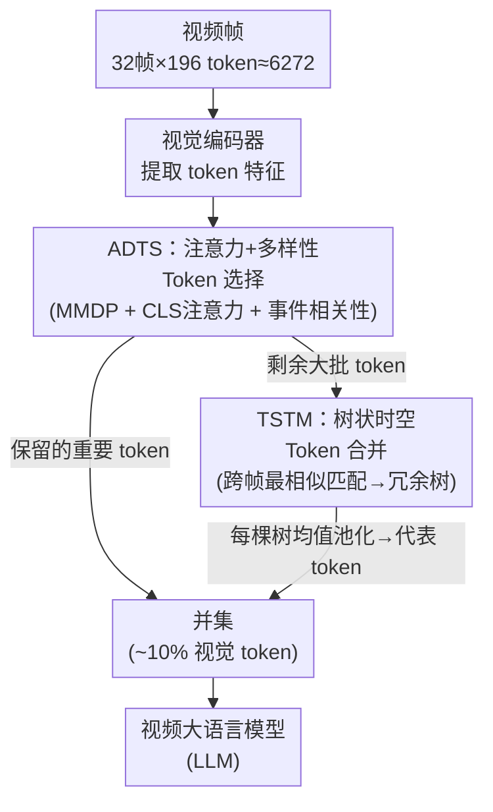

# FlashVID: Efficient Video Large Language Models via Training-free Tree-Based Spatiotemporal Token Merging

**会议**: ICLR 2026 Oral  
**arXiv**: [2602.08024](https://arxiv.org/abs/2602.08024)  
**代码**: [https://github.com/Fanziyang-v/FlashVID](https://github.com/Fanziyang-v/FlashVID)  
**领域**: 视频理解 / LLM效率 / 多模态VLM  
**关键词**: 视觉token压缩, 时空冗余, token合并, 视频大语言模型, 免训练加速

## 一句话总结
提出 FlashVID，一个免训练的视频大语言模型推理加速框架，通过树状时空 token 合并（TSTM）联合建模空间和时间冗余，仅保留 10% 的视觉 token 就能保持 LLaVA-OneVision 99.1% 的性能，并能将 Qwen2.5-VL 的输入帧数提升 10 倍。

## 研究背景与动机

**领域现状**：视频大语言模型（VLLMs）在视频理解任务上表现优秀，但需要处理大量视觉 token（如 32帧 x 196 token/帧 = 6272 个 token），attention 计算复杂度与序列长度平方成正比，推理开销巨大。

**现有痛点**：现有加速方法（FastV, VisionZip, PruneVID）通常独立压缩空间冗余和时间冗余，忽视了时空关系的内在耦合。特别是 Temporal Token Merging（TTM）假设相邻帧中语义相似的 token 位于相同空间位置，但视频中目标会移动、变形、缩放。

**核心矛盾**：TTM 的固定空间对应关系在动态视频中不成立——最相关的视觉特征在相邻帧中可能不在同一空间位置，强行合并会引入噪声，扭曲视频表征。

**本文目标** 如何在不训练的前提下，联合建模空间和时间冗余进行高效压缩，同时适应视频的动态特性？

**切入角度**：观察到空间冗余和时间冗余是耦合的（某帧的冗余区域往往在多帧中持续存在），以及时间冗余不绑定于固定空间位置。

**核心 idea**：用层次化的时空冗余树替代固定空间位置的帧间 token 对应，匹配最相似而非同位置的 token 进行合并。

## 方法详解

### 整体框架
FlashVID 想解决的是视频 VLLM 在长序列视觉 token 上的推理瓶颈：32 帧 × 196 token/帧 ≈ 6272 个视觉 token 喂进 LLM，attention 的平方复杂度让推理变得很贵。它的做法是在视觉 token 进 LLM 之前先做一遍免训练的压缩，分两步走——先用 ADTS 从每帧里挑出一小撮"既重要又互不冗余"的 token 原封保留，再让剩下的大批 token 进入 TSTM，跨帧找到语义最相似的同伴、聚成一棵棵冗余树，每棵树塌缩成一个 token。最后把"保留的重要 token"和"聚合出的代表 token"并在一起，送进 LLM。两个模块一个管"挑出该留的"，一个管"压掉该并的"，互补协同。

### 关键设计

**1. 注意力 + 多样性 Token 选择（ADTS）：先挑出每帧里既重要又多样的代表 token**

ADTS 放在整条流水线最前面，原因是如果直接拿原始视频特征去构建冗余树，那些噪声大、信息量低却占多数的 token 会把树带偏，反而漏掉真正关键的视觉信息。所以要先把每帧里"该保住的"代表 token 筛出来。它把"选哪些 token"建模成一个 Max-Min Diversity Problem（MMDP），在每帧的 token 余弦距离矩阵 $D^{(f)}$ 上求解，目标是让选出的子集彼此尽量分散、覆盖多样的特征。

但纯 MMDP 只保证多样性，容易漏掉信息量最大的那几个 token，所以 ADTS 又叠了两个校准项来纠偏：一是 CLS 注意力权重 $A_{[CLS]}$，标记出被视觉 encoder 关注最多的 token；二是事件相关性 $\bar{S}_e$，先对全帧做全局平均池化得到一个帧级嵌入，再算每个 token 与"整段视频事件"的相关性。最终求解 $\mathcal{I}=\text{MMDP}(D, A_{[CLS]}, \bar{S}_e)$ 得到的子集既铺得开又不漏关键信息，这批 token 被标记为"保留"、不再进入后续合并。消融实验印证了这套组合：ADTS 大幅优于只用注意力（ATS）或只用多样性（DTS）的选择，两个校准项缺一不可。

**2. 树状时空 Token 合并（TSTM）：用全局最相似匹配替代固定空间位置的帧间对应**

ADTS 留下重要 token 后，每帧剩下的大批 token 才交给 TSTM 压缩。这一步针对的是已有时间合并方法（TTM）的核心假设缺陷：TTM 默认相邻帧里语义相似的 token 落在同一空间位置，于是按位置一对一合并。但视频里目标会移动、变形、缩放，最相关的特征往往已经挪到了别处，强行按位置合并就把噪声混了进来，扭曲视频表征。

TSTM 改成让 token 在空间里自由匹配：对相邻两帧计算 token 间的余弦相似度矩阵 $S^{(f)}$，每个 token 连接到**前一帧中与它最相似**（而非同位置）的 token，且相似度要超过阈值 $T_\tau$ 才连边。逐帧滚动下来，这些连边渐进地长成一棵棵跨帧的冗余树，同一棵树里的所有 token 用均值池化聚合成一个代表 token。因为匹配不再被空间位置锁死，目标运动带来的位移就被自然吸收。实验侧也印证了这点：相同阈值下，TSTM 比 TTM 能合并掉更多 token，而且合并时 token 之间的平均相似度更高——既压得更狠，又并得更准。

### 一个完整示例
拿 LLaVA-OneVision 的 32 帧输入走一遍：原始约 6272 个视觉 token，目标只保留 10%（约 627 个）。第一阶段 ADTS 在每帧上求解 MMDP 并用 CLS 注意力、事件相关性校准，挑出一小批最具代表性的重要 token，这批 token 标记为"保留"、后续不再动。第二阶段，每帧剩下的大批 token 进入 TSTM：跨相邻帧按最相似（超阈值）连边，渐进长出冗余树，每棵树均值池化塌缩成一个代表 token。最后把两阶段的产物——"各帧保留的重要 token"与"冗余树聚合出的代表 token"——取并集送进 LLM。一个在多帧中持续存在的冗余背景区域，会被归进同一棵树压成一个 token；而一个随镜头移动的前景目标，则靠 TSTM 的自由匹配跟住、或被 ADTS 当作重要 token 留下，不会因为换了位置就被错误合并。

### 训练策略
无需任何训练，整套压缩作为即插即用模块直接嵌入现有 VLLM 的推理流程。

## 实验关键数据

### 主实验
在 LLaVA-OneVision（32帧）上，5 个视频理解基准的平均表现：

| 方法 | 保留比例 | VideoMME | EgoSchema | LongVideoBench | MVBench | 平均 | 相对准确率 |
|------|---------|----------|-----------|----------------|---------|------|-----------|
| Vanilla | 100% | 58.5 | 60.3 | 56.6 | 58.3 | 58.4 | 100.0% |
| FastV | 10% | 51.5 | 51.2 | 52.3 | 52.3 | 51.8 | 88.7% |
| VisionZip | 10% | 51.6 | 55.6 | 50.1 | 50.3 | 51.9 | 88.9% |
| FastVID | 10% | 55.5 | 56.1 | 55.5 | 57.7 | 56.2 | 96.2% |
| **FlashVID** | **10%** | **57.2** | **59.5** | **56.0** | **57.7** | **57.9** | **99.1%** |

### Qwen2.5-VL 帧数扩展实验

| 设置 | 帧数 | VideoMME | MLVU | 相对提升 |
|------|------|----------|------|---------|
| Vanilla | 16帧 | 65.7 | 67.6 | baseline |
| FlashVID | 160帧 | 69.9 | 74.5 | +8.6% |

### 消融实验

| 配置 | VideoMME | EgoSchema | 平均 |
|------|----------|-----------|------|
| Full FlashVID (ADTS+TSTM) | 57.2 | 59.5 | 57.9 |
| w/o TSTM (仅 ADTS) | 56.2 | 58.0 | 56.7 |
| w/o ADTS (仅 TSTM) | 56.5 | 59.1 | 57.0 |
| TTM 替代 TSTM | 55.5 | 57.8 | 56.5 |

### 关键发现
- TSTM 贡献最大，从仅 ADTS 到加入 TSTM 提升约 1.2 个点
- 用 TTM 替代 TSTM 后性能明显下降，验证了动态空间对应的重要性
- 10% token 保留率下 FlashVID 保持 99.1% 性能，远超 FastV（88.7%）和 VisionZip（88.9%）
- 在 Qwen2.5-VL 上延长输入帧数到 10 倍，同等计算预算下性能提升 8.6%

## 亮点与洞察
- **树状动态匹配**：核心洞察简单但有效——相邻帧的相关 token 不在同一位置，用全局最相似匹配替代固定位置匹配。这个思路可迁移到任何涉及跨帧对应的任务。
- **免训练即插即用**：无需重新训练，理论上可适配任何 VLLM，工程价值高。
- **帧数扩展应用**：通过压缩 token 节省的计算量"交换"为更多输入帧，巧妙地将效率提升转化为能力提升。

## 局限与展望
- 合并阈值是超参数，不同视频的最优阈值可能不同，自适应阈值策略值得探索
- TSTM 对超长视频和高分辨率输入，构建相似度矩阵的开销不可忽略
- 仅在 VLLM 的推理阶段压缩，未考虑训练时的效率提升
- 对静态场景（冗余极高）和高动态场景（冗余极低）的压缩效果差异未充分分析

## 相关工作与启发
- **vs FastV (Chen et al., 2024)**: FastV 在 LLM 内部用 text-to-visual attention 剪枝，属于 Inner-LLM 方法；FlashVID 是混合策略
- **vs PruneVID (Huang et al., 2025)**: PruneVID 也做时空合并，但用固定空间位置对应的 TTM；FlashVID 用动态匹配
- **vs ToMe (Bolya et al., 2023)**: ToMe 是图像 token 合并的开创工作，FlashVID 将其扩展到视频时空域

## 评分
- 新颖性: ⭐⭐⭐⭐ 树状时空合并思路简洁有效，但整体框架是已有组件的组合
- 实验充分度: ⭐⭐⭐⭐⭐ 3个VLLM x 5个基准 x 多个压缩比例，非常全面
- 写作质量: ⭐⭐⭐⭐ 动机清晰，图示直观，算法描述完整
- 价值: ⭐⭐⭐⭐⭐ 免训练、即插即用、性能损失极小，实用价值很高

<!-- RELATED:START -->

## 相关论文

- [\[CVPR 2026\] Token Reduction via Local and Global Contexts Optimization for Efficient Video Large Language Models](../../CVPR2026/video_understanding/token_reduction_via_local_and_global_contexts_optimization_for_efficient_video_l.md)
- [\[ICML 2026\] OmniSIFT: Modality-Asymmetric Token Compression for Efficient Omni-modal Large Language Models](../../ICML2026/video_understanding/omnisift_modality-asymmetric_token_compression_for_efficient_omni-modal_large_la.md)
- [\[CVPR 2026\] Unified Spatiotemporal Token Compression for Video-LLMs at Ultra-Low Retention](../../CVPR2026/video_understanding/unified_spatiotemporal_token_compression_for_video-llms_at_ultra-low_retention.md)
- [\[CVPR 2025\] Video-Panda: Parameter-efficient Alignment for Encoder-free Video-Language Models](../../CVPR2025/video_understanding/video-panda_parameter-efficient_alignment_for_encoder-free_video-language_models.md)
- [\[CVPR 2025\] On the Consistency of Video Large Language Models in Temporal Comprehension](../../CVPR2025/video_understanding/on_the_consistency_of_video_large_language_models_in_temporal_comprehension.md)

<!-- RELATED:END -->
