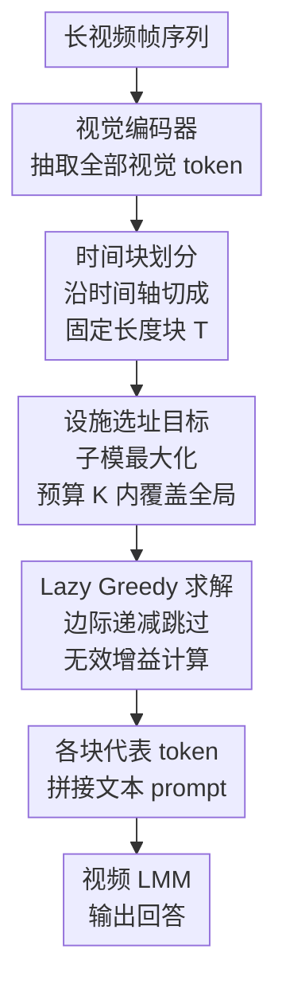

# FLoC: Facility Location-Based Efficient Visual Token Compression for Long Video Understanding

**会议**: ICLR 2026  
**arXiv**: [2511.00141](https://arxiv.org/abs/2511.00141)  
**代码**: 无  
**领域**: 视频理解 / 视觉 Token 压缩  
**关键词**: 长视频理解, Token压缩, 设施选址, 子模函数优化, 无训练

## 一句话总结

提出 FLoC，基于设施选址函数（facility location function）的视觉 token 压缩框架，通过子模优化在给定预算下快速选择兼具代表性和多样性的 token 子集，实现无训练、模型无关、查询无关的长视频理解 token 压缩。

## 研究背景与动机

**长视频 token 爆炸**：随着视频长度增加，视觉 token 数量爆炸性增长，远超 LMM 的上下文窗口限制（通常 4K-32K tokens），严重制约长视频理解能力

**现有压缩方法的不足**：
   - 采样/池化方法忽略语义重要性，一刀切地丢弃信息
   - 聚类方法（k-means）主要选择密集区域的代表元素，容易遗漏稀疏但重要的 token（如画面中的小物体、细节文字）
   - 查询感知方法需要预知查询，对通用场景不灵活，且每次查询需重新压缩
   - 可训练方法依赖特定模型架构和大量标注数据

**代表性 vs 多样性矛盾**：简单场景中大量 token 冗余，但关键但稀疏的视觉线索（如找钥匙场景中的钥匙 token）出现少却至关重要，需要同时保证代表性和多样性

**实用性需求**：CCTV 监控、智能眼镜、移动机器人等应用需要高效、通用、可即插即用的压缩方案

## 方法详解

### 整体框架

FLoC 想解决的是长视频喂进视频大模型（video-LMM）时视觉 token 爆炸的问题：在给定 token 预算 $K$ 下，挑出一个既覆盖全局画面、又不漏掉稀疏关键线索的代表子集。整条流水线只看 token 嵌入之间的余弦相似度，与上游视觉编码器、下游 LMM 完全解耦，因此无训练、模型无关、查询无关，可即插即用地挂在任意编码器和任意 LMM 之间。

具体怎么转：视频帧先经视觉编码器抽出全部视觉 token；这些 token 沿时间轴被切成固定长度 $T$ 的时间块；在每个块内，把"选哪些 token"写成一个设施选址（facility location）子模最大化目标，用 lazy greedy 算法在预算 $K$ 内快速求出代表子集；最后把各块选中的 token 与文本 prompt 拼接，送进视频 LMM 出答案。

整条链路无训练、模型无关、查询无关——这一组"零要求"既是 FLoC 最直接的实用价值，也反过来约束了上面每一步的设计（只能用嵌入相似度、只能在推理时运行）。

### 关键设计

**1. 时间块划分：缩小搜索空间并为流式处理留接口**

长视频里相隔很远的帧通常互不相关，把它们丢进同一个池子争 token 名额既浪费算力又破坏时间局部性。FLoC 因此不在整段视频上做一次全局选择，而是先沿时间轴把 token 切成固定长度 $T$ 的小块，后续的代表子集选择都在每个块内独立进行。这样每次优化面对的候选规模被压到一个块大小，计算量大幅下降；块内独立处理也天然契合流式场景——缓冲区累积满一个块的 token 就能立即压缩并送出，无需等整段视频到齐。块长 $T$ 是唯一关键超参：$T$ 太小（如 $T \leq 4$）时时间窗口太窄、识别不出相邻块间的冗余，性能反而下降；$T$ 增大则让后面的设施选址目标在更宽的时间上下文里优化，性能趋于饱和，论文取 $T=32$ 作为稳健默认值，几乎不必逐视频调参。

**2. 设施选址目标：用一个子模函数同时压住代表性和多样性**

聚类方法（如 k-means）倾向于把名额都分给密集区域的代表元素，画面里稀疏但关键的线索——找钥匙场景里那枚钥匙、角落的小字——往往被整体淹没。FLoC 改用设施选址目标来选 token，把块内选择写成一个在预算约束下的子模最大化问题 $S^* = \arg\max_{S \subseteq V,\, |S| \leq K} f(S)$，其中目标 $f(S) = \sum_{v \in V} \max_{u \in S} \mathrm{sim}(v, u)$，$\mathrm{sim}$ 取余弦相似度。它的含义是：对每个原始 token $v$，在已选子集 $S$ 里找一个最像它的代表，把这些"最佳匹配相似度"加起来。只有当 $S$ 真正覆盖到画面各个角落、包括稀疏区域时这个和才会大，于是代表性（覆盖所有 token）和多样性（避免重复选近邻）被同一个目标自然平衡。该目标的子模性还保证贪心解有 $(1-1/e) \approx 0.632$ 的近似比下界，这是聚类方法给不出的理论保障。

**3. Lazy Greedy 求解：靠边际递减跳过绝大多数无效计算**

设施选址目标的精确最优解是 NP-hard，朴素贪心每加一个 token 都要把所有候选的边际增益重算一遍，复杂度 $O(nK)$，在动辄上万 token 的长视频上无法实时。FLoC 利用子模函数边际收益单调递减的性质做 lazy greedy：对任意 $A \subseteq B \subseteq V$ 和 token $v$，加入 $v$ 的边际增益满足 $f(A \cup \{v\}) - f(A) \geq f(B \cup \{v\}) - f(B)$，即上一轮算出的增益是本轮增益的合法上界。于是维护一个按边际增益上界排序的优先队列，每步只弹出上界最大的候选重新计算其精确增益；若重算后的值仍不小于队列中其余所有候选的上界，子模性保证它就是本轮最优选择，可直接选它、跳过对其余候选的评估，否则用新值更新上界重新入队。由于绝大多数候选的上界根本不会被触及，实际加速常达一个数量级，且单次前向选择即可完成、无需聚类那样的迭代细化或特征值分解，使长视频的在线压缩成为可能。

**4. 三重"零要求"：无训练、模型无关、查询无关**

上面三步合起来只看 token 嵌入间的余弦相似度，与上游视觉编码器、下游 LMM 完全解耦，因此不需要任何训练或标注，也不绑定特定架构。它同样不需要预知用户查询——压缩出的子集是查询无关的，一段视频只压一次就能复用于任意后续提问，省下查询感知方法每次都要重新压缩的开销与显存。整个方法只在推理时运行，压缩比可灵活设置（实验覆盖 $2^{-3}$ 到 $2^{-5}$，即 1/8 到 1/32），不涉及损失函数或反向传播，这正是它能即插即用的根本原因。

## 实验关键数据

### 主实验

Qwen2.5-VL-7B 上的压缩比较（压缩比 $2^{-3}$）：

| 方法 | Video-MME | MLVU | LVB | EgoSchema | 平均 |
|------|-----------|------|-----|-----------|------|
| 无压缩 (ratio=1) | 66.33 | 70.31 | 60.51 | 61.40 | 64.64 |
| TS-LLaVA | 61.15 | 67.57 | 55.20 | 59.60 | 60.88 |
| LongVU | 62.19 | 66.61 | 55.42 | 59.40 | 60.91 |
| DyCoke | 62.11 | 67.53 | 55.12 | 59.60 | 61.09 |
| **FLoC (Ours)** | **63.33** | **68.81** | **58.12** | **60.00** | **62.57** |

InternVL3-8B 上（压缩比 $2^{-3}$）：

| 方法 | Video-MME | MLVU | LVB | EgoSchema | 平均 |
|------|-----------|------|-----|-----------|------|
| 无压缩 | 66.63 | 72.68 | 59.39 | 70.00 | 67.18 |
| LongVU | 64.70 | 69.50 | 55.35 | 69.20 | 64.69 |
| **FLoC (Ours)** | **64.93** | **71.57** | **56.69** | **69.40** | **65.65** |

### 消融实验

扩展时间输入场景（1 FPS，最多 7200 帧，Qwen2.5-VL-7B）：

| 最大帧数 | 方法 | Video-MME | MLVU | LVB | 平均 |
|----------|------|-----------|------|-----|------|
| 768 | 无压缩 | 66.33 | 70.31 | 60.51 | 65.82 |
| 7200 | TS-LLaVA | 65.07 | 72.40 | 62.08 | 66.52 |
| 7200 | DyCoke | 65.78 | 71.30 | 62.98 | 66.69 |

更高压缩比（$2^{-4}$）下 FLoC 仍保持最佳性能：平均准确率 60.09%（Qwen2.5-VL），超越所有对比方法。

### 关键发现

1. **FLoC 在所有压缩比下均显著优于聚类方法和其他压缩方法**，尤其在 LongVideoBench 上的优势最为突出（8倍压缩下 58.12% vs 次优 55.42%）
2. **处理速度远超传统聚类**：如图1所示，FLoC 在精度和速度上同时优于 k-means、谱聚类等方法，处理时间常低一个数量级
3. **跨模型通用性**：在 Qwen2.5-VL-7B、InternVL3-8B、Qwen2-VL、LLaVA-Next-Video 上均一致领先
4. **与扩展时间输入互补**：在 7200 帧输入场景下仍能有效工作，保持与不压缩相当甚至更好的效果
5. **多样性保障的重要性**：与聚类方法（倾向于密集区域）形成鲜明对比，FLoC 的 facility location 目标确保稀疏但重要的 token 被保留

## 亮点与洞察

- **将经典组合优化引入视频 token 压缩**：facility location function 在文档摘要和视频摘要中已有成功应用，本文首次将其应用于 LMM 的视觉 token 选择，理论保证和实践效果兼具
- **无训练 + 模型无关 + 查询无关**的三重"零要求"设计，使 FLoC 成为最易部署的压缩方案
- **一次压缩多次查询**的特性在实际应用中非常重要：不同于查询感知方法需要每次查询都重新压缩，FLoC 只需压缩一次即可应对任意查询
- Lazy greedy 的实际加速效果使实时长视频处理成为可能

## 局限与展望

1. **纯基于相似度的选择可能遗漏语义重要但嵌入不显著的 token**：facility location 仅考虑嵌入空间的覆盖，不关注语义重要性
2. **时间块划分引入的边界效应**：跨块的长程时序依赖可能被切断
3. **余弦相似度可能不是最优的相似度度量**：不同 token 类型（物体、动作、文字等）可能需要不同的距离函数
4. **固定预算 K 的选择**：最优压缩比可能因视频内容复杂度而异，自适应预算选择可能进一步提升
5. **仅评估了 QA 类型任务**：对生成类任务（视频描述、视频摘要）的效果有待验证

## 相关工作与启发

- **TS-LLaVA / LongVU**：基于时序冗余过滤的压缩方法——FLoC 的 diversity 机制更好地保留稀疏关键信息
- **DyCoke**：动态聚类压缩——FLoC 通过 facility location 的全局覆盖目标超越简单聚类
- **PruneVid / Scissor**：可训练的压缩方法——性能反而不如 FLoC，说明训练带来的模型偏差可能负面影响通用性
- 子模优化思路可推广到图像 token 压缩（高分辨率图像理解）和多模态检索（从大量候选中选择代表性子集）

## 评分

- **新颖性**: ⭐⭐⭐⭐ 将 facility location 引入 token 压缩是巧妙的跨领域迁移，但 lazy greedy 本身是经典算法
- **实验充分度**: ⭐⭐⭐⭐⭐ 4个 benchmark、4个模型、多种压缩比、详细速度对比，实验设计周全
- **写作质量**: ⭐⭐⭐⭐ 问题定义清晰，与聚类方法的对比论述有说服力，算法描述规范
- **价值**: ⭐⭐⭐⭐⭐ 无训练、即插即用的特性使其具有极高实用价值，对长视频理解社区贡献显著

<!-- RELATED:START -->

## 相关论文

- [\[CVPR 2026\] An Efficient Token Compression Framework for Visual Object Tracking](../../CVPR2026/video_understanding/an_efficient_token_compression_framework_for_visual_object_tracking.md)
- [\[CVPR 2026\] StreamingTOM: Streaming Token Compression for Efficient Video Understanding](../../CVPR2026/video_understanding/streamingtom_streaming_token_compression_for_efficient_video_understanding.md)
- [\[CVPR 2026\] Question-guided Visual Compression with Memory Feedback for Long-Term Video Understanding](../../CVPR2026/video_understanding/question-guided_visual_compression_with_memory_feedback_for_long-term_video_unde.md)
- [\[AAAI 2026\] APVR: Hour-Level Long Video Understanding with Adaptive Pivot Visual Information Retrieval](../../AAAI2026/video_understanding/apvr_hour-level_long_video_understanding_with_adaptive_pivot.md)
- [\[CVPR 2026\] EarlyTom: Early Token Compression Completes Fast Video Understanding](../../CVPR2026/video_understanding/earlytom_early_token_compression_completes_fast_video_understanding.md)

<!-- RELATED:END -->
