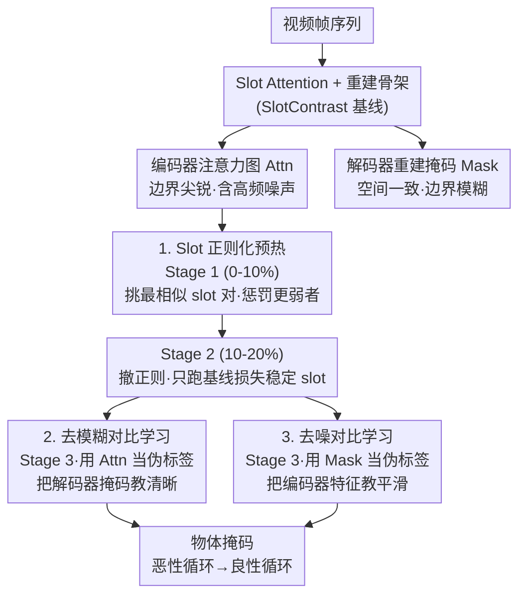

# From Vicious to Virtuous Cycles: Synergistic Representation Learning for Unsupervised Video Object-Centric Learning

**会议**: ICLR 2026  
**arXiv**: [2602.03390](https://arxiv.org/abs/2602.03390)  
**代码**: [https://github.com/hynnsk/SRL](https://github.com/hynnsk/SRL)  
**领域**: 视频理解 / 自监督学习 / 目标发现  
**关键词**: 以目标为中心的学习, slot attention, 对比学习, 编码器-解码器对齐, 无监督分割

## 一句话总结
发现 slot-based 目标中心学习中编码器（产生尖锐但有噪声的注意力图）与解码器（产生空间一致但模糊的重建掩码）之间的恶性循环，提出同步对比学习目标和 slot 正则化预热策略将其转化为良性循环，在 MOVi 和 YouTube-VIS 上大幅提升物体发现性能。

## 研究背景与动机

**领域现状**：以目标为中心的学习（Object-Centric Learning）旨在无监督地将视频分解为独立对象的表征（slot），主流方法基于 slot attention + 重建范式。近期工作利用 DINOv2 特征提升对象分割质量。

**现有痛点**：编码器和解码器之间存在恶性循环——(a) 编码器（DINOv2）产生的注意力图虽然尖锐但包含高频噪声，导致解码器面临病态重建任务，只能产生模糊的重建掩码；(b) MSE 重建损失相当于低通滤波器，反馈给编码器的梯度缺乏高频信息，无法帮助去噪。

**核心矛盾**：编码器的噪声问题和解码器的模糊问题互相强化——"谁都不知道对方在说什么，但又只能从对方那里学习"。

**本文目标** 如何打破编码器-解码器之间的恶性循环，让两者互相改进而非互相退化？

**切入角度**：利用编码器和解码器各自的优势——编码器的注意力图虽有噪声但边界尖锐，解码器的重建掩码虽模糊但空间一致——设计交叉对比学习目标让各自取长补短。

**核心 idea**：用解码器的空间一致掩码去"去噪"编码器注意力，同时用编码器的尖锐注意力去"去模糊"解码器重建，形成良性循环。

## 方法详解

### 整体框架
这篇论文要打破的是 slot 目标中心学习里编码器和解码器之间的恶性循环：编码器（DINOv2）给出的注意力边界尖锐但带高频噪声，解码器被迫做病态重建只能吐出模糊掩码，而 MSE 损失又像低通滤波器把高频信息滤掉，反馈回编码器的梯度帮不上去噪的忙。SRL 以标准 slot attention + 重建基线（SlotContrast）为骨架，不改网络结构，只在训练目标上动手，让编码器和解码器互相拿对方的优势当伪标签去补自己的短板。具体落在一个三阶段调度上：先用 slot 正则化预热让每个 slot 各自特化、避免坍缩，再留一段只跑基线损失的过渡期让 slot 稳定下来，最后才开启双向对比学习，把恶性循环扭成"你帮我去噪、我帮你去模糊"的良性循环。

### 关键设计

**1. Slot 正则化预热：先让 slot 各管各的，别挤到同一个物体上**

对比学习的前提是不同 slot 真的对应不同对象——如果两个 slot 抢同一个物体，后续构造的正负样本划分就会失真，对比目标直接学歪。而 slot 坍缩恰恰是目标中心学习的老毛病。SRL 在前 10% 训练（Stage 1）里迭代地找出当前余弦相似度最高的 slot 对 $(i,j)$，再用各自注意力分布到均匀分布的 KL 散度判断谁更"不特化"（越接近均匀说明越没抓住具体对象），对这个更弱的 slot 的注意力施加正则化惩罚，把它推开。这个挑对—惩罚的过程每步重复 $M=\lfloor S/2 \rfloor$ 次（$S$ 为 slot 数），相当于一轮把所有 slot 两两梳理一遍，逼它们分散到不同对象上。

**2. 去模糊对比学习（Deblurring CL）：拿编码器的尖锐注意力当伪标签，把解码器掩码教清楚**

标准 MSE 只盯着重建像素准不准，对掩码的空间分辨率毫无约束，所以解码器掩码一直糊。SRL 反过来利用编码器注意力虽有噪声但边界尖锐这一点，在 Stage 3 用它当伪标签来监督解码器，构建一个三级层次化对比目标：正样本是 patch 自身的编码器—解码器对，半正样本是被编码器注意力标记为同一 slot 的那一批 patch，负样本是其余 patch。排序式对比损失让解码器特征在同一 slot 内聚拢、跨 slot 推开，等于直接优化掩码的判别性，而不是绕着重建精度间接逼近。

**3. 去噪对比学习（Denoising CL）：拿解码器的空间一致掩码当伪标签，把编码器特征教平滑**

这一项和去模糊 CL 完全对称，只是方向反过来。解码器掩码虽然模糊，但胜在空间一致——它不会把孤立的噪声 patch 误标成前景，这种一致性正好能压住编码器的高频噪声。同样在 Stage 3 激活，结构和去模糊 CL 一致：正样本改从 DINOv2 特征空间的 Top-K 近邻里选，半正样本改从被解码器掩码标记为同一 slot 的 patch 里选，再走相同的层次化对比损失。两项合起来，编码器和解码器各自把对方的长处当老师，恶性循环就被掉了个头。

### 训练策略
三阶段调度对应上面三个设计的开关：Stage 1（0–10%）只做 slot 正则化预热，Stage 2（10–20%）撤掉正则化、只跑基线损失让 slot 稳定，Stage 3（20–100%）同时打开去模糊和去噪两个对比损失。两个对比损失的权重均设为 0.1。

## 实验关键数据

### 主实验

| 方法 | MOVi-C FG-ARI | MOVi-C mBO | MOVi-E FG-ARI | YTVIS FG-ARI | YTVIS mBO |
|------|-------------|-----------|-------------|-------------|----------|
| STEVE | 36.1 | 26.5 | 50.6 | 15.0 | 19.1 |
| VideoSAUR | 64.8 | 38.9 | 73.9 | 28.9 | 26.3 |
| SlotContrast | 70.4 | 31.7 | 80.9 | 36.2 | 32.9 |
| **SRL (本文)** | **74.3** | **34.5** | **81.9** | **42.9** | **35.6** |

### 消融实验

| 去模糊CL | 去噪CL | Slot正则化 | FG-ARI | mBO |
|---------|--------|----------|--------|-----|
| - | - | - | 70.8 | 31.4 |
| Y | - | - | 70.0 | 33.2 |
| - | Y | - | 72.2 | 31.2 |
| - | - | Y | 70.7 | 35.1 |
| Y | Y | Y | **74.2** | **33.2** |

### 关键发现
- 相比 SlotContrast 基线，在 YouTube-VIS 上 FG-ARI 提升 18.5%（36.2 -> 42.9），说明这不纯是合成数据的收益
- 三个组件互补——单独使用去模糊 CL 反而降低 FG-ARI（70.0 vs 70.8），必须配合去噪 CL 或正则化
- Slot 正则化对 mBO 贡献最大（31.4 -> 35.1），说明 slot 坍缩是 mBO 低的主因
- 在 DAVIS 2017 的跨数据集迁移中，Jaccard 提升 11.7 个点

## 亮点与洞察
- **恶性循环的诊断**：清晰地识别出编码器噪声与解码器模糊之间的因果反馈循环，这种对问题根源的深入分析值得学习。
- **对称设计**：去模糊和去噪是对称的——各自利用对方的伪标签，形成互教互学。这种"你帮我去噪，我帮你去模糊"的设计范式非常优雅。
- **三阶段训练调度**：先稳定 slot，再引入对比学习，避免了训练初期 slot 坍缩导致对比学习产生错误梯度的问题。
- **迁移到静态图像**：在 COCO 上也有提升，说明方法不仅适用于视频。

## 局限与展望
- 算法增加两个层次化对比损失，计算开销可能不低，但论文未报告训练时间对比
- 三阶段训练引入了额外的超参数（阶段划分比例、正则化强度），敏感性分析显示对训练比例有一定依赖
- 在极多目标场景（如 MOVi-E 有 23 个物体）中，slot 正则化的性能提升有限
- 伪标签质量直接影响对比学习效果，训练早期的伪标签可能不够准确

## 相关工作与启发
- **vs SlotContrast**: 本文的直接基线，SRL 在其上增加了双向对比学习和 slot 正则化
- **vs VideoSAUR**: 使用 DINO 特征做 slot 的先驱工作，SRL 进一步解决了 DINO 特征噪声问题
- **vs STEVE**: 像素空间重建的slot方法，SRL 在特征空间操作性能远超

## 评分
- 新颖性: ⭐⭐⭐⭐⭐ 恶性循环的诊断和对称互学设计非常深刻
- 实验充分度: ⭐⭐⭐⭐⭐ MOVi-C/E + YTVIS + DAVIS + COCO, 消融全面
- 写作质量: ⭐⭐⭐⭐⭐ 恶性/良性循环的叙事清晰有说服力
- 价值: ⭐⭐⭐⭐ 为自监督目标发现提供了有效的方法论

<!-- RELATED:START -->

## 相关论文

- [\[CVPR 2025\] Temporally Consistent Object-Centric Learning by Contrasting Slots](../../CVPR2025/video_understanding/temporally_consistent_object-centric_learning_by_contrasting_slots.md)
- [\[CVPR 2026\] Reconstruction-Guided Slot Curriculum: Addressing Object Over-Fragmentation in Video Object-Centric Learning](../../CVPR2026/video_understanding/reconstruction-guided_slot_curriculum_addressing_object_over-fragmentation_in_vi.md)
- [\[CVPR 2025\] H-MoRe: Learning Human-centric Motion Representation for Action Analysis](../../CVPR2025/video_understanding/h-more_learning_human-centric_motion_representation_for_action_analysis.md)
- [\[AAAI 2026\] SUGAR: Learning Skeleton Representation with Visual-Motion Knowledge for Action Recognition](../../AAAI2026/video_understanding/sugar_learning_skeleton_representation_with_visual-motion_knowledge_for_action_r.md)
- [\[CVPR 2026\] SlotVTG: Object-Centric Adapter for Generalizable Video Temporal Grounding](../../CVPR2026/video_understanding/slotvtg_object-centric_adapter_for_generalizable_video_temporal_grounding.md)

<!-- RELATED:END -->
