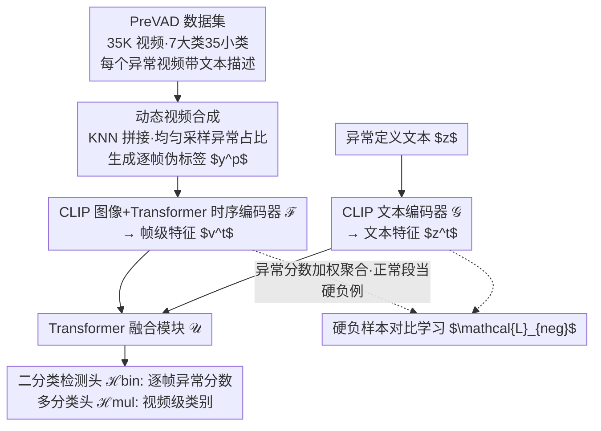

# Language-guided Open-world Video Anomaly Detection under Weak Supervision

**会议**: ICLR 2026  
**arXiv**: [2503.13160](https://arxiv.org/abs/2503.13160)  
**代码**: [GitHub](https://github.com/Kamino666/LaGoVAD-PreVAD)  
**领域**: 视频生成  
**关键词**: 视频异常检测, 开放世界, 语言引导, 概念漂移, 弱监督

## 一句话总结

提出语言引导的开放世界视频异常检测范式LaGoVAD，通过将异常定义建模为随机变量并以自然语言形式输入，结合动态视频合成和对比学习正则化策略，在七个数据集上实现零样本SOTA性能。

## 研究背景与动机

1. **领域现状**: 视频异常检测（VAD）旨在识别偏离预期模式的视频帧，广泛应用于智能监控等领域。近年来弱监督方法在封闭集设定下取得了不错的性能。

2. **现有痛点**: 现有方法假设异常定义是固定不变的，无法应对开放世界中异常定义可能随需求变化的情况。例如，不戴口罩在流感期间是异常行为，但平时是正常的——这构成了概念漂移（concept drift）问题。

3. **核心矛盾**: 开放集和领域泛化方法虽然能检测训练集之外的新类别异常，但仍假设异常定义不变，无法处理同一行为在不同场景下标签改变的情况（如行人在公路上行走在犯罪数据集中是正常的，但在高速公路监控中是异常的）。

4. **本文目标**: 提出一种允许用户在推理时通过自然语言动态定义异常的开放世界VAD范式，从根本上避免概念漂移。

5. **切入角度**: 将异常定义 $Z$ 显式建模为随机变量，将预测条件化为视频 $V$ 和定义 $Z$ 的联合函数 $\Phi:(V,Z)\rightarrow Y$，使 $P(Y|V,Z)$ 恒定不变，从而理论上消除概念漂移。

6. **核心 idea**: 通过将异常定义作为输入条件，学习视频-文本-标签三元组的联合映射，并以大规模多样化数据集支撑泛化能力。

## 方法详解

### 整体框架

LaGoVAD 把异常定义 $z$ 当成和视频 $v$ 并列的输入，用一个双分支网络去学三元组 $(v,z,y)$ 的联合映射。视频经 CLIP 图像编码器加 Transformer 时序编码器得到帧级特征 $v^t = \mathcal{F}(v)$，异常定义文本经 CLIP 文本编码器得到 $z^t = \mathcal{G}(z)$，两者在 Transformer 融合模块 $\mathcal{U}$ 中交互后送入二分类检测头 $\mathcal{H}^{\text{bin}}$ 和多分类头 $\mathcal{H}^{\text{mul}}$，分别输出逐帧异常分数和视频级类别。围绕这条主干，作者再用动态视频合成解决异常时长分布偏差、用硬负样本对比学习解决帧级判别模糊，并构建 PreVAD 数据集提供足够多样的训练三元组。

### 关键设计

**1. 动态视频合成：让模型见过各种异常时长比例**

弱监督 VAD 的一个隐患是训练分布偏差——网络爬来的异常视频里，异常往往占了大半时长，而真实监控中异常通常只是一闪而过的几秒。模型若只见高异常占比的样本，就容易把"长时间都在报警"当成默认行为，迁移到真实场景时过拟合。动态视频合成在训练中实时拼接视频来打破这种偏差：先随机决定本次合成正常还是异常样本，再确定要拼几段，然后从 K 近邻里挑语义相近的片段缝合成不同长度的新视频，使异常占比在 0 到 1 之间被均匀采样。拼接时异常段所在的锚点位置被转写成逐帧二值伪标签 $y^p \in \{0,1\}^L$，由动态视频合成损失 $\mathcal{L}_{\text{dvs}}$ 直接监督帧级预测，从而强制模型在各种时长比例下都能定位到真正异常的那几帧。

**2. 硬负样本对比学习：把异常视频里的"正常段"当反例对齐**

异常视频里正常帧和异常帧的边界本就模糊，加上视频-文本联合空间样本稀疏，简单对齐很难学出细粒度判别力。作者先用异常分数当权重把帧级特征加权聚合成视频级表示，让真正异常的帧主导这条向量；关键之处在于，同一条异常视频中评分较低的正常段被显式当作硬负样本，去和这段视频对应的异常描述做对比——即"这段画面不该匹配这条异常定义"。对比损失 $\mathcal{L}_{\text{neg}}$ 同时跑文本→视频和视频→文本两个方向，逼模型在最容易混淆的同源样本上拉开正常与异常的距离，而不是只在不同视频之间做粗粒度对齐。

**3. PreVAD 大规模预训练数据集：撑起语言引导范式的数据底座**

语言引导范式要泛化，前提是见过足够多样的 $(v,z,y)$ 三元组，而已有数据集最大也才约 5K 视频、领域窄、且几乎没有语义描述标注。作者搭了一条可扩展的数据管线，从视频文本数据集、网络资源和监控流里聚合视频，再用多模态大模型（MLLM）自动清洗和标注，最终得到 35,279 个视频、覆盖 7 大类 35 小类异常，且每个异常视频都配有文本描述。正是这份在规模、领域和语义标注三个维度都更丰富的数据，才让模型在推理时能对没见过的异常定义文本做出合理响应。

### 损失函数 / 训练策略

训练用四项损失联合优化：$\mathcal{L} = \mathcal{L}_{\text{MIL}} + \mathcal{L}_{\text{MIL-align}} + \mathcal{L}_{\text{dvs}} + \mathcal{L}_{\text{neg}}$。其中 $\mathcal{L}_{\text{MIL}}$ 是多实例学习损失，负责时序二分类检测；$\mathcal{L}_{\text{MIL-align}}$ 是 MIL 对齐损失，负责视频级多类分类；$\mathcal{L}_{\text{dvs}}$ 用合成视频的逐帧伪标签监督检测头；$\mathcal{L}_{\text{neg}}$ 则是带硬负样本挖掘的双向对比损失。四项分别对应"检测什么时刻异常 / 是哪类异常 / 各种时长都能定位 / 帧级特征可分"四个目标，缺一项都会在消融中带来明显掉点。

## 实验关键数据

### 主实验

Protocol 1：零样本跨数据集二分类异常检测（AUC/AP）

| 数据集 | 指标 | 本文(LaGoVAD) | 之前SOTA | 提升 |
|--------|------|------|----------|------|
| UCF-Crime | AUC | 82.81 | 82.42 (OVVAD) | +0.39 |
| XD-Violence | AP | 76.28 | 63.74 (OVVAD) | +12.54 |
| MSAD | AUC | 88.09+ | — | — |
| DoTA | AUC | 优于所有基线 | — | — |
| TAD | AUC | 优于所有基线 | — | — |

Protocol 2：概念漂移评估（drift@5），LaGoVAD在不同异常定义下均表现稳定，优于VadCLIP和LLM-based方法。

### 消融实验

| 配置 | 关键指标 | 说明 |
|------|---------|------|
| 完整模型 | 最佳 | 所有组件协同工作 |
| 去除动态视频合成 | 下降 | 异常持续时间多样性不足导致overfitting |
| 去除对比学习 | 下降 | 特征对齐质量降低 |
| 去除文本分支 | 大幅下降 | 退化为固定定义模式，无法处理概念漂移 |

### 关键发现

- 在XD-Violence上检测和分类分别提升20%和32%，体现了语言引导范式在跨域泛化上的巨大优势
- PreVAD的规模和多样性对模型性能至关重要，35K视频的多样化训练集是泛化的关键
- 概念漂移评估协议（drift@5）证明模型能有效应对异常定义的动态变化

## 亮点与洞察

- **理论贡献扎实**: 通过概率论形式化了概念漂移问题，证明了将异常定义作为条件输入可以消除概念漂移，理论与实践紧密结合
- **范式创新**: 从固定异常定义到动态语言引导定义的转变，开创了VAD领域的新范式
- **大规模数据集**: PreVAD是目前最大最多样的视频异常检测数据集，具有独立的评估价值
- **实用性强**: 用户可通过自然语言灵活定义异常，适应不同场景需求

## 局限与展望

- 依赖CLIP作为骨干网络，可能继承其在细粒度视觉理解上的局限
- 数据集虽大但仍以网络视频为主，与真实监控场景存在域差距
- 推理时需要用户提供合适的异常定义文本，定义质量直接影响检测效果
- 可考虑引入更强的视频理解模型（如VideoLLM）替代CLIP特征提取

## 相关工作与启发

- OVVAD等开放词汇方法虽能检测新类别但假设定义固定，本文的"定义作为输入"思路更灵活
- 与LAVAD等LLM-based方法相比，LaGoVAD在保持轻量级的同时实现了更好的性能
- 动态视频合成的思路可推广到其他视频理解任务的数据增强中

## 评分

- 新颖性: ⭐⭐⭐⭐⭐ 开创性地将概念漂移问题形式化并提出语言引导VAD范式
- 实验充分度: ⭐⭐⭐⭐ 七个数据集的零样本评估+两个评估协议，非常全面
- 写作质量: ⭐⭐⭐⭐ 逻辑清晰，理论推导严谨
- 价值: ⭐⭐⭐⭐⭐ 范式级贡献，PreVAD数据集也具有独立价值

<!-- RELATED:START -->

## 相关论文

- [\[ICCV 2025\] TOGA: Temporally Grounded Open-Ended Video QA with Weak Supervision](../../ICCV2025/video_understanding/toga_temporally_grounded_open-ended_video_qa_with_weak_supervision.md)
- [\[ICLR 2026\] Steering and Rectifying Latent Representation Manifolds in Frozen Multi-Modal LLMs for Video Anomaly Detection](steering_and_rectifying_latent_representation_manifolds_in_frozen_multi-modal_ll.md)
- [\[CVPR 2026\] Text-guided Fine-Grained Video Anomaly Understanding](../../CVPR2026/video_understanding/text-guided_fine-grained_video_anomaly_understanding.md)
- [\[CVPR 2026\] No Need For Real Anomaly: MLLM Empowered Zero-Shot Video Anomaly Detection](../../CVPR2026/video_understanding/no_need_for_real_anomaly_mllm_empowered_zero-shot_video_anomaly_detection.md)
- [\[AAAI 2026\] RefineVAD: Semantic-Guided Feature Recalibration for Weakly Supervised Video Anomaly Detection](../../AAAI2026/video_understanding/refinevad_semantic-guided_feature_recalibration_for_weakly_supervised_video_anom.md)

<!-- RELATED:END -->
