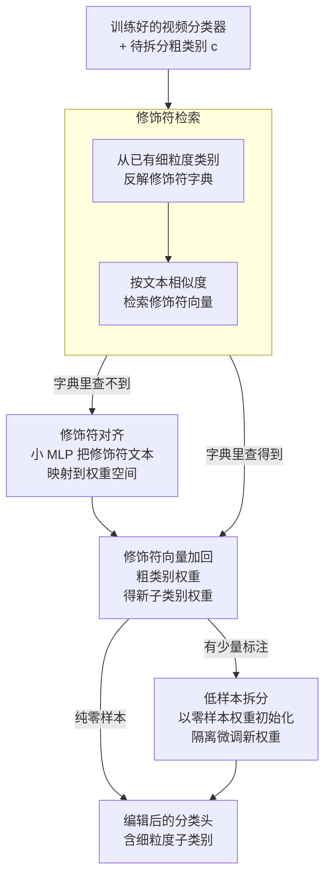

# Let's Split Up: Zero-Shot Classifier Edits for Fine-Grained Video Understanding

**会议**: ICLR 2026  
**arXiv**: [2602.16545](https://arxiv.org/abs/2602.16545)  
**代码**: [有](https://kaitingliu.github.io/Category-Splitting/)  
**领域**: 视频理解  
**关键词**: 类别拆分, 零样本编辑, 细粒度视频识别, 分类器修改, 组合结构

## 一句话总结

提出了"类别拆分"(Category Splitting)新任务，通过挖掘视频分类器权重中的潜在组合结构，在零样本条件下将粗粒度动作类别拆分为细粒度子类别，无需重训或额外数据。

## 研究背景与动机

视频识别模型通常在固定的分类体系上训练，但这些分类体系往往过于粗糙。例如，一个"open"标签可能涵盖"open cupboard"、"open by pushing"、"open quickly"、"open halfway"等截然不同的情况。随着应用场景的演化，需要更细粒度的区分。

现有解决方案有三类缺陷：
- **重新标注+重训**：代价昂贵，需要大量标注数据和完整训练周期
- **视觉-语言模型 (VLMs)**：依赖海量视频-文本语料，专业领域数据稀缺，难以捕捉细粒度时序线索
- **持续学习**：需要每个新类的训练数据，且关注全新类别而非已有类别的细化

核心洞察：现代视频backbone已经在其特征空间中编码了丰富的潜在结构，可以被分解以区分细粒度变化，即便没有直接的监督信号。

## 方法详解

### 整体框架

方法的核心是**仅编辑分类头**（classification head），保持 backbone 不变，把一个粗粒度类别 $c$ 拆分为多个细粒度子类别 $\mathcal{S}^c = \{s_1^c, s_2^c, \dots, s_k^c\}$，更新后的标签空间为 $\mathcal{Y}' = (\mathcal{Y} \setminus \{c\}) \cup \mathcal{S}^c$。整条流水线零视频数据：先从已有分类器权重里**反解出一本修饰符字典**，再为目标子类别凑出它的修饰符向量——字典里查得到就直接**检索**，查不到就用一个小 MLP 从文本**对齐**生成；拿到修饰符向量后加回粗类别权重，就得到新子类别的分类权重。若现实中能拿到一两个标注样本，再走一步**低样本隔离微调**把结果往上推。

整个编辑方法 $E$ 始终要满足两个性质：**泛化性 (Generality)**——编辑后能正确分类未见过的新子类别样本；**局部性 (Locality)**——编辑不能干扰其他原有类别的预测。

### 关键设计

**1. 修饰符检索（Modifier Retrieval）：把子类别权重当作"粗粒度概念 + 修饰符"的向量加法**

要在零样本下凭空造出一个新子类别的分类权重，关键观察是：一个细粒度子类别本质上就是"粗粒度概念套上一个修饰符"，例如 "pushing left to right" = "pushing" + "left to right"。如果能把"left to right"这个修饰符对应的权重偏移量找出来，加到粗类别 "pushing" 的权重上，就得到了新子类别的权重，整个过程不碰任何视频。问题落到两步：先攒一本修饰符字典，再从字典里检索合适的修饰符迁移过来。

字典是从分类器里已有的细粒度类别"反解"出来的。把共享同一基础概念的细粒度类别分到一组，构成一个"伪粗粒度类别" $\tilde{c}$，它的权重用组内子类别权重的均值近似：

$$v_{\tilde{c}} = \frac{1}{|\mathcal{S}^{\tilde{c}}|} \sum_{y \in \mathcal{S}^{\tilde{c}}} w_y$$

每个子类别权重减掉这个共享基础，剩下的就是纯修饰符向量 $v_m = w_y - v_{\tilde{c}}$。检索时对目标子类别用文本编码器 $\phi$ 算余弦相似度，且同时看修饰符文本和完整标签两路相似性，避免只匹配修饰符字面而忽略语境：

$$v_m^* = \arg\max_{(t_y, t_m, v_m) \in \mathcal{M}_{mod}} \text{sim}(\phi(t_y), \phi(t_s^*)) + \text{sim}(\phi(t_m), \phi(t_m^*))$$

检索到的修饰符直接加回粗类别权重，新子类别权重即 $w_{s_j^c} = w_c + v_m^*$。

**2. 修饰符对齐（Modifier Alignment）：字典里查不到的修饰符，用一个小 MLP 直接从文本造权重**

检索的前提是字典里恰好有语义接近的修饰符，但很多新修饰符在已有分类器里压根没出现过，检索会失效。对齐模块解决的就是这个泛化缺口：训练一个轻量映射 $g_\psi: \mathbb{R}^n \to \mathbb{R}^m$，把任意修饰符的文本嵌入直接映射到分类器权重空间，从而绕开"字典里必须有"的限制。

它的监督信号同样从已有分类器里挖，分两路配对：修饰符级别对 $\mathcal{D}_{mod} = \{(\phi(t_m), v_m)\}$ 教它把修饰符文本对到修饰符向量，类别级别对 $\mathcal{D}_{cat} = \{(\phi(t_y), w_y)\} \cup \{(\phi(t_{\tilde{c}}), v_{\tilde{c}})\}$ 教它把完整标签/伪粗类文本对到对应权重。用 MSE 损失训练，模块只是一个 384 维的单隐层 MLP，训练时只更新 $\psi$，分类器和文本编码器全程冻结——所以这一步仍是零样本，依旧不需要任何视频数据。

**3. 低样本拆分（Low-Shot Category Splitting）：拿到一两个标注样本时，只动新子类别权重的隔离微调**

真实场景里偶尔能拿到极少量标注（低至每个子类别 1 个视频），这一步把零样本结果再往上推一截，但必须防止少量样本把整个分类器带偏、破坏对其他类别的局部性。做法是隔离微调：只微调新添加的子类别权重 $\theta_{head}'$，backbone 和原始分类头全部冻结，且用零样本方法算出的权重作为初始化。实验里这种初始化明显优于直接拿粗粒度类别权重起步，因为零样本权重已经把修饰符方向编码进去了，微调只需在它附近做小幅修正。

### 损失函数 / 训练策略

- 零样本阶段无需训练数据
- 对齐模块：MSE损失，AdamW优化器，学习率 $1 \times 10^{-3}$，余弦退火，batch size 10
- 低样本微调：交叉熵损失，AdamW，学习率 $1 \times 10^{-3}$，weight decay $1 \times 10^{-3}$，batch size 16
- EMA早停（$\beta=0.95$，patience=5，$\delta=1\times10^{-3}$）

## 实验关键数据

### 主实验

基线设置：ViT-Small + MVD预训练，CLIP ViT-L/14文本编码器。数据集：SSv2-Split（54个粗类别）和FineGym-Split（42个粗类别）。

| 方法 | SSv2-A Gen. | SSv2-A Loc. | FineGym-A Gen. | FineGym-A Loc. |
|------|:-:|:-:|:-:|:-:|
| CLIP | 27.6 | 100.0 | 12.1 | 100.0 |
| FG-CLIP | 30.9 | 100.0 | 19.4 | 100.0 |
| VideoPrism | 28.2 | 100.0 | 21.7 | 100.0 |
| **Ours** | **46.3** | **98.9** | **34.2** | **97.8** |

VLMs泛化性极低，本文方法在SSv2上泛化性提升近20个百分点。

| 微调策略 | 初始化 | Generality | Locality | Mean |
|---------|-------|:-:|:-:|:-:|
| 全模型 one-shot | 粗类别 | 33.6 | 0.0 | 16.8 |
| 仅 $\theta_{head}'$ one-shot | 粗类别 | 48.4 | 98.4 | 73.4 |
| 仅 $\theta_{head}'$ one-shot | modifier alignment | **52.8** | **98.2** | **75.5** |
| 全数据微调 | 粗类别 | 86.7 | 19.2 | 52.9 |

### 消融实验

- 修饰符检索(45.0%) vs. 修饰符对齐(46.3%)：对齐提升1.3%泛化性
- zero-shot初始化 vs. 随机初始化：提升 +7.8% 泛化性
- 预训练影响：MVD(46.3%) > SIGMA(44.1%) > VideoMAE(42.9%) > 从头训练(37.0%)
- 文本编码器：CLIP(46.3%) ≈ VideoPrism(46.5%) > RoBERTa(40.9%)

### 关键发现

- 方向型拆分效果最好，涉及物体数量、意图/成功的拆分最困难
- 全数据微调反而不如one-shot微调（75.5 vs. 52.9），因为全数据对新类别产生强偏置严重破坏局部性
- 当原始标签空间中存在相同修饰符的类似类别时效果更好，但没有也有效

## 亮点与洞察

1. **任务定义创新性强**：类别拆分是一个自然但被忽视的真实场景问题
2. **VLM不如内在结构**：VLM在细粒度视频理解方面远不如挖掘视频分类器的权重结构
3. **极简但有效**：仅编辑分类头、无需backbone更新、零样本即可运行
4. **反直觉发现**：全数据微调反而不如one-shot，隔离微调+零样本初始化是最佳策略

## 局限与展望

- 依赖文本标签来识别修饰符，难以处理纯视觉差异（如速度快慢）
- 零样本泛化性仍有提升空间（46% vs. 理想的86%+）
- 仅在分类任务上验证，未探索检测/分割等下游任务
- 需要原始分类器已有一些细粒度类别来构建修饰符字典

## 相关工作与启发

- 与NLP中的模型编辑（Model Editing）概念直接关联，借用泛化性/局部性评价框架
- 与组合动作识别(Compositional Action Recognition)有天然联系
- 修饰符的"可迁移性"假设值得在更多领域验证
- 可扩展到其他视觉任务的分类细化场景

## 评分

- 新颖性：⭐⭐⭐⭐⭐ — 任务定义和零样本编辑思路均为首创
- 技术深度：⭐⭐⭐⭐ — 方法简洁优雅但技术含量适中
- 实验充分度：⭐⭐⭐⭐⭐ — 构建了专用benchmark，消融全面
- 实用价值：⭐⭐⭐⭐ — 低成本分类器更新有实际应用前景

<!-- RELATED:START -->

## 相关论文

- [\[CVPR 2026\] Text-guided Fine-Grained Video Anomaly Understanding](../../CVPR2026/video_understanding/text-guided_fine-grained_video_anomaly_understanding.md)
- [\[CVPR 2026\] Frame2Freq: Spectral Adapters for Fine-Grained Video Understanding](../../CVPR2026/video_understanding/frame2freq_spectral_adapters_for_fine-grained_video_understanding.md)
- [\[CVPR 2026\] Mistake Attribution: Fine-Grained Mistake Understanding in Egocentric Videos](../../CVPR2026/video_understanding/mistake_attribution_fine-grained_mistake_understanding_in_egocentric_videos.md)
- [\[AAAI 2026\] FineVAU: A Novel Human-Aligned Benchmark for Fine-Grained Video Anomaly Understanding](../../AAAI2026/video_understanding/finevau_a_novel_human-aligned_benchmark_for_fine-grained_video_anomaly_understan.md)
- [\[CVPR 2026\] UFVideo: Towards Unified Fine-Grained Video Cooperative Understanding with Large Language Models](../../CVPR2026/video_understanding/ufvideo_towards_unified_fine-grained_video_cooperative_understanding_with_large_.md)

<!-- RELATED:END -->
