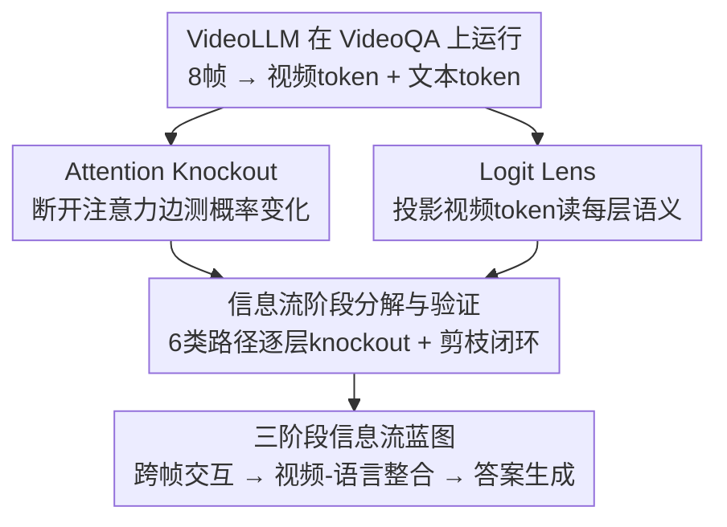

# Map the Flow: Revealing Hidden Pathways of Information in VideoLLMs

**会议**: ICLR 2026  
**arXiv**: [2510.13251](https://arxiv.org/abs/2510.13251)  
**代码**: [项目页面](https://map-the-flow.github.io)  
**领域**: 视频理解 / 可解释AI  
**关键词**: VideoLLM, 信息流分析, 机制可解释性, 注意力剪枝, 时序推理

## 一句话总结

首次用机制可解释性工具（Attention Knockout + Logit Lens）系统逆向工程VideoLLM的时序推理过程，揭示出"早中层跨帧交互→中层视频-语言整合→中后层答案生成"的三阶段信息流蓝图，并证明仅保留42%注意力边即可几乎无损保持VideoQA性能。

## 研究背景与动机

**领域现状**：VideoLLM的标准范式是将视频帧通过视觉编码器patch化为token序列，与文本token拼接后送入因果注意力的LLM进行自回归生成。研究社区的工作主要集中在模型的"外部设计"上——包括扩大视频指令微调数据集、关键帧选择策略、以及视频token压缩方法。但对于模型内部"如何"从扁平化的帧token序列中提取时序信息、"在哪里"完成视频和语言的语义整合，几乎没有系统研究。

**现有痛点**：图像MLLM的可解释性研究（如Neo 2025）已发现了一些结构化行为模式，但这些发现能否推广到视频场景完全未知。视频与图像有根本区别——VideoQA需要从多帧中聚合时间维度的信息。具体而言有三个核心问题：(1) VideoLLM如何从扁平化的帧token序列中编码时间顺序？(2) 时间概念（如"先""后"）怎样从视频token传播到文本token？(3) 模型在哪一层"准备好"生成正确答案？

**核心矛盾**：视频帧经过patchify后变成一维token序列，时间结构被隐式编码在位置中。模型必须通过某种内部机制重新发现和利用这些时序关系，而现有研究只关注提升性能，对这个"黑箱内部发生了什么"一无所知。这阻碍了有针对性的架构改进和推理加速。

**本文目标**：提供一张VideoLLM时序推理的完整蓝图：信息从哪里提取、在哪些层整合、在哪个阶段准备好答案。进而验证这些关键路径是否sufficiently代表了模型的推理过程。

**切入角度**：作者从机制可解释性（mechanistic interpretability）出发，使用因果干预工具（Attention Knockout断开特定注意力边测影响）和探针工具（Logit Lens投影中间层到词汇空间读语义），将VideoLLM的推理过程分解为可检验的阶段。

**核心 idea**：用Attention Knockout和Logit Lens逆向工程VideoLLM的注意力路径，发现时序推理遵循"跨帧交互→时间关键词对齐→答案生成"三阶段pattern，且大部分注意力边是冗余的。

## 方法详解

### 整体框架

这篇论文不提新模型，而是给 VideoLLM 的时序推理做一次"逆向工程"：让一个已经会答 VideoQA 的模型照常跑，再用机制可解释性工具撬开它的注意力，看清信息从哪里来、在哪一层完成视频与语言的整合、又在哪个阶段"准备好"答案。实验基座是 LLaVA-NeXT-7B 在 VideoChat2-IT 上微调 3 个 epoch 得到的 LLaVA-NeXT-7B-Video-FT（8 帧采样、每帧 144 个 token），分析覆盖 TVBench 的 5 类时序任务（动作反义、动作顺序、场景转换、运动方向、物体计数）。

整条分析链路这样转：先用 **Attention Knockout** 主动断开特定类型的注意力边、测概率变化，定位"哪条路径不可或缺"；同时用 **Logit Lens** 把视频 token 每一层投影到词表、读出"这一层它看起来像什么词"，看清路径上流动的是什么语义；再把注意力按语义角色切成 6 类逐层 knockout，**归纳出一张三阶段信息流蓝图**，最后用"只保留关键路径、剪掉其余"的端到端实验反过来验证蓝图。得到的蓝图是：时序推理在**早中层**由跨帧注意力把多帧拼成时空表示，到**中层**这些视频信息整合进问题里的时间关键词，再在**中后层（约第 20 层之后）**汇聚到最后一个 token、启动答案生成——三段一旦走完，正确选项就迅速压倒其他选项。

### 关键设计

**1. Attention Knockout：用因果干预量化每条注意力路径的贡献**

直接观察注意力权重只能看到"哪里注意力大"，但大不等于重要——这是相关而非因果。Attention Knockout 改用主动干预：选择性地断开特定 token 对之间的注意力连接（把注意力 mask 的对应位置设为 $-\infty$），再测量这条边被切断后模型预测的概率变化。具体做法是对每一层 $l$，以窗口 $k=9$ 为中心同时断开目标类型的注意力边（如跨帧的 video-to-video attention），并用相对概率变化 $((p_{\text{knockout}} - p_{\text{base}})/p_{\text{base}}) \times 100$ 度量影响。窗口取 9 是因为窗口太窄时，被切断的信息会通过残差连接绕过干预、导致测不出真实贡献。相比观察性分析，这种因果干预能直接回答"如果没有这条信息路径，模型行为会怎么变"，是机制可解释性领域的标准方法（源自 Geva et al. 2023）。

**2. Logit Lens：读出视频 token 每层"看起来像什么词"**

Attention Knockout 能告诉我们哪些路径重要，却不告诉我们路径上流动的是什么信息，Logit Lens 正是用来填补这个 gap。它把视频 token 在每一层的 hidden state 直接投影到语言模型的 LM head 上得到 logits，从而读出该 token 在这一层"最像哪些词"。在 LLaVA-NeXT-13B-Video-FT 的 Action Sequence 任务上，作者据此统计空间关键词（物体、颜色）与时间关键词（before/after/first 等）出现的频率和位置分布，进而揭示视频 token 中的时间概念在哪一层、哪些位置上开始涌现。

**3. 信息流阶段分解与验证：把注意力切成 6 类路径，分析与剪枝形成闭环**

要画出完整蓝图，先得把纷繁的注意力边按语义角色归类。作者将路径分为 6 类——跨帧 video→video、video→question、video→last、question→last、last→last、question→video——再分别对每一类、每一层的注意力边做 knockout，绘出层–概率变化曲线，看清各类路径分别在哪些层段起作用。角色清晰之后，作者用一个端到端实验反过来验证分析：只保留关键层段内的关键路径（如 L6–15 保留跨帧交互、L6–20 保留 video→question、L16–25 保留 question→last），禁用其余全部路径。如果蓝图正确，这样剪枝应当几乎无损——"先分析出哪些路径关键、再证明只留它们就够"构成了发现到验证的完整闭环。

## 实验关键数据

### 有效信息路径剪枝——多模型验证

| 模型 | 视频Token数 | 注意力边保留比例 | TVBench | TOMATO | vs Full Causal |
|------|------------|----------------|---------|--------|----------------|
| LLaVA-NeXT-7B-Video-FT | 8×12×12 | **42%** (10.8M/25.7M) | 51.2 | 29.2 | -0.3 / -1.0 |
| LLaVA-NeXT-7B-Video-FT (随机剪枝) | 同上 | 42% | 40.1 | 23.1 | -11.4 / -7.1 |
| LLaVA-NeXT-13B-Video-FT | 8×12×12 | **37%** (14.3M/32.2M) | 54.6 | 27.4 | -0.5 / +0.2 |
| Mini-InternVL-4B-Video-FT | 8×16×16 | **40%** (29.6M/74.6M) | 56.0 | 31.2 | 0.0 / -1.0 |
| VideoLLaMA3-7B | 8×12×12 | **58%** (11.4M/19.9M) | 57.2 | 28.7 | +2.0 / +0.7 |

保留有效路径的剪枝在4个不同架构/规模的模型上一致生效。VideoLLaMA3甚至剪枝后反超baseline，说明部分注意力边是干扰性噪声。

### 跨帧注意力禁用消融——按任务

| 任务 | 禁用前半层跨帧注意力后准确率下降 | 典型错误 |
|------|-------------------------------|---------|
| Action Antonym | -24.1% | "stand up" → "sit on chair"（语义相反） |
| Action Sequence | -20.2% | "open bag" → "put bag in microwave"（顺序完全错误） |
| Scene Transition | -18.0% | "bedroom→street" → "street→different location"（方向颠倒） |
| Moving Direction | -44.8% | "move right" → "move left"（方向相反） |
| Object Count | -60.8% | "zero moving objects" → "three"（数量完全错误） |

此表清晰展示跨帧注意力的不可或缺——禁用后模型不是"不确定"而是给出语义相反的答案，说明没有跨帧交互时模型回退到了静态偏置。

### 关键发现

- **VideoQA微调的独特贡献**：通过对比同架构的ImageLLM和VideoLLM，证实跨帧注意力交互是视频微调独有的习得能力，早中层的跨帧交互模式仅在视频微调后出现。这回答了"视频微调到底教了什么"这个基本问题
- **时间概念的"涌现"特性**：视频token中的时间概念不是视觉编码器直接产出的，而是在LLM的中间层自发涌现。空间概念先稳定（前景token），时间概念后涌现（剩余token），两类概念在token空间上互不覆盖
- **时间关键词的"信息检查站"角色**：问题中的时间关键词（选项中的动作词、时间副词）充当信息整合检查站。在不同任务中，视频信息到达这些检查站的路径不同：简单任务走直接路径(video→option)，需要目标识别的任务走间接路径(video→non-option question→option)
- **失败案例的机制诊断**：分析错误预测样本发现，跨模态整合路径（中层→后层）的模式与正确样本一致，说明失败源头在更早的视频表示阶段——要么是虚假的跨帧注意力带偏了表示(Case 1)，要么是模型回退到了静态场景偏置(Case 2)

## 亮点与洞察

- **完整的三阶段推理蓝图**：将VideoLLM的黑箱推理过程分解为可检验、可操作的三个阶段。这不只是描述性分析——通过"只保留关键路径"的端到端验证形成了分析→假设→验证的闭环，增强了发现的可信度
- **58%注意力边可安全剪枝**：这一发现直接指向实际应用——可以构建更高效的VideoLLM推理pipeline。不同于启发式的token压缩方法，本文从机制层面解释了为什么这些token交互是冗余的，为注意力稀疏化提供了理论依据
- **"时间概念涌现"的发现特别精彩**：视频经过空间编码器处理后，token本身不直接包含时间语义。但在LLM处理过程中，时间概念在中间层自发涌现在非前景token位置上。这暗示LLM的自注意力机制具有从位置编码序列中"发明"时间语义的能力
- **失败模式的两种机制**：Case 1（虚假跨帧注意力）和Case 2（静态偏置回退）的区分，为针对性改进提供了方向——前者需要改进跨帧交互质量，后者需要减少训练数据的静态场景偏置

## 局限与展望

- **任务覆盖有限**：主要分析在TVBench（多选QA）上进行，虽Appendix补充了开放式QA和长视频，但信息流模式在视频描述、视频摘要等生成任务中可能有本质不同
- **模型规模局限**：最大分析模型是13B参数。70B+级别模型是否也遵循同样的三阶段模式？更深的网络可能有更复杂的信息路由
- **Attention Knockout的窗口粒度**：使用$k=9$的层窗口是为了防止残差绕过，但这使得分析的层精度较粗。更细粒度的因果干预（如单层+MLP分析）可能揭示更精细的机制
- **剪枝层范围是人工经验设定的**：有效路径的层范围（如L6-15用于跨帧交互）基于分析观察人工确定。自适应地学习每个样本的最优路径范围可能进一步提升剪枝效率
- **静态分析缺乏动态自适应**：当前分析是数据集级别的统计模式，但每个视频样本的最优路径可能不同。开发sample-adaptive的路径选择可能是有价值的研究方向

## 相关工作与启发

- **vs 图像MLLM可解释性 (Neo 2025, Zhang 2025c)**：他们发现图像MLLM有结构化的视觉-语言信息流模式，本文将分析范式扩展到视频域并发现了全新的能力——跨帧时序交互。本文的关键贡献是证明视频微调引入了图像预训练中不存在的新计算路径
- **vs Token压缩方法 (FastV, LLaVA-PruMerge等)**：这些方法从效率角度启发式地删减视频token，本文从机制层面解释了为什么某些token交互可以安全删除——它们不在关键信息路径上。二者可以结合：用本文发现指导更有原则的token/attention压缩
- **vs 早退策略 (Elbayad 2020, Schuster 2022)**：本文发现答案在中层之后就准备好了，直接暗示了early exit的可行性——中后层的计算有很大比例是冗余的。与传统基于confidence的early exit不同，本文提供了基于信息流完成度的structural early exit依据

## 评分

- 新颖性: ⭐⭐⭐⭐⭐ 首个VideoLLM时序推理的完整机制分析，填补了视频领域可解释性的空白
- 实验充分度: ⭐⭐⭐⭐ 5种任务、4个模型验证、分析→假设→验证闭环完整，但任务类型主要限于多选QA
- 写作质量: ⭐⭐⭐⭐⭐ 研究问题分解清晰，图示直观（尤其Fig.1的流程蓝图），发现递进式展现有很强的叙事逻辑
- 价值: ⭐⭐⭐⭐ 对VideoLLM架构设计、注意力稀疏化、推理加速有直接指导意义，失败模式分析指出了改进方向

<!-- RELATED:START -->

## 相关论文

- [\[AAAI 2026\] ReaSon: Reinforced Causal Search with Information Bottleneck for Video Understanding](../../AAAI2026/video_understanding/reason_reinforced_causal_search_with_information_bottleneck_for_video_understand.md)
- [\[CVPR 2025\] Video Streaming Thinking: VideoLLMs Can Watch and Think Simultaneously](../../CVPR2025/video_understanding/video_streaming_thinking_videollms_can_watch_and_think_simultaneously.md)
- [\[AAAI 2026\] Causality Matters: How Temporal Information Emerges in Video Language Models](../../AAAI2026/video_understanding/causality_matters_how_temporal_information_emerges_in_video_language_models.md)
- [\[AAAI 2026\] APVR: Hour-Level Long Video Understanding with Adaptive Pivot Visual Information Retrieval](../../AAAI2026/video_understanding/apvr_hour-level_long_video_understanding_with_adaptive_pivot.md)
- [\[ICCV 2025\] PriOr-Flow: Enhancing Primitive Panoramic Optical Flow with Orthogonal View](../../ICCV2025/video_understanding/prior-flow_enhancing_primitive_panoramic_optical_flow_with_orthogonal_view.md)

<!-- RELATED:END -->
