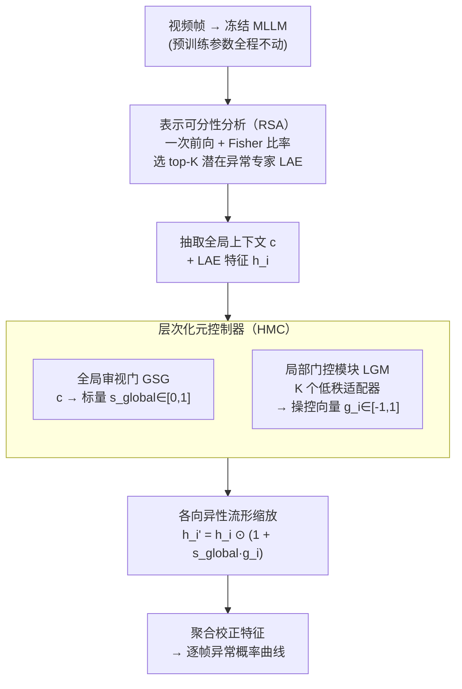

# Steering and Rectifying Latent Representation Manifolds in Frozen Multi-Modal LLMs for Video Anomaly Detection

**会议**: ICLR 2026  
**arXiv**: [2602.24021](https://arxiv.org/abs/2602.24021)  
**代码**: 待发布  
**领域**: Multimodal / Video Understanding  
**关键词**: 视频异常检测, 多模态大语言模型, 表示流形操控, 免调优, 注意力头分析

## 一句话总结

提出 SteerVAD 框架，在完全冻结的多模态大语言模型 (MLLM) 内部，通过识别"潜在异常专家"注意力头并用层次化元控制器动态操控其表示流形，仅用 1% 训练数据即实现免调优视频异常检测的 SOTA。

## 研究背景与动机

视频异常检测 (VAD) 旨在识别偏离正常模式的事件，在智能监控、工业质检、自动驾驶等场景中至关重要。传统 VAD 方法（有监督/弱监督/无监督）依赖大规模训练数据，计算和标注成本高，泛化能力有限。

近期研究转向利用冻结的多模态大语言模型 (MLLM) 进行免调优 VAD，但这些方法存在两个根本性缺陷：

**表示偏差 (Representational Bias)**：MLLM 在网页规模语料上预训练，其特征空间针对频繁的原型概念进行优化，对异常事件这类罕见、微妙的模式敏感度低

**上下文歧义 (Contextual Ambiguity)**：被动依赖孤立特征会产生混淆表示——视觉上相似但语义不同的事件（如正常跑步 vs. 逃跑）无法被有效区分

作者从流形假设出发，将这两个问题重新诠释为几何问题：正常事件和异常事件的表示流形在高维特征空间中过于接近甚至局部纠缠，被动读取特征无法解决这一结构性缺陷。

## 方法详解

### 整体框架

SteerVAD 把免调优 VAD 从"被动读取冻结 MLLM 的特征"改造成"主动干预其内部表示流形"：先无梯度地从所有注意力头里挑出最能区分正常/异常的少数几个"潜在异常专家"（LAE），再用一个轻量级层次化元控制器根据当前视频的全局上下文，动态对这几个头的特征做各向异性几何变换，最后把校正后的特征聚合成异常概率曲线。整个过程不改动 MLLM 的任何预训练参数，可训练量只有约 52 万。

### 关键设计

**1. 表示可分性分析（RSA）：免梯度地定位最会判异常的注意力头**

难点在于 MLLM 内部有上百个注意力头，但只有少数对异常敏感，逐头微调既贵又破坏预训练。RSA 借用 Fisher 判别比率的思路，把"判别力"定义成每个头里正常/异常样本的类间散度与类内方差之比 $S_{RSA}(l,k) = \frac{\|\boldsymbol{\mu}_{anom}^{(l,k)} - \boldsymbol{\mu}_{norm}^{(l,k)}\|_2^2}{\sigma_{anom}^2(l,k) + \sigma_{norm}^2(l,k)}$，只需一次前向传播即可在全部 784 个头中排序并取 top-K。这个度量纯线性、对数据量极不敏感：1% 与 100% 数据选出的 LAE 完全一致，10 个随机种子也稳定锁定同样的 4 个头（L18H4、L23H24、L21H21、L22H7），从而保证了下游干预对象的可复现性。

**2. 层次化元控制器（HMC）：把"要不要校正"和"怎么校正"解耦成两层**

单一轻量模型若直接吐出高维操控向量极易过拟合局部噪声，HMC 因此分成两级。上层"全局审视门（GSG）"读取 MLLM 第一个生成 token 的隐状态 $\mathbf{c}$，经一个小 MLP 压成标量 $s_{global}\in[0,1]$ 表示整段视频的异常可能性——接近 0 时保持静默，接近 1 时触发强校正。下层"局部门控模块（LGM）"由 K 个并行低秩适配器组成，每个适配器同样以全局上下文 $\mathbf{c}$ 为输入，经低秩瓶颈为对应 LAE 生成逐维度的操控向量 $\mathbf{g}_i\in[-1,1]^{d_{head}}$。全局决定强度、局部决定方向，既保留了上下文感知能力，又压住了参数量。

**3. 各向异性流形缩放：用残差调制重塑而非破坏特征流形**

真正的几何干预发生在 $\mathbf{h}_i' = \mathbf{h}_i \odot (1 + s_{global} \cdot \mathbf{g}_i)$ 这一步：当 $s_{global}\approx 0$ 时整体退化为恒等变换、不扰动正常场景；当 $s_{global}\approx 1$ 时，$\mathbf{g}_i$ 的正分量放大、负分量抑制相应维度，从而把过于接近的正常/异常流形在高维空间里推开。乘性残差形式带来一个理论好处：所有缩放因子非零时该变换是微分同胚，保拓扑地重塑流形；某些因子为零时则退化成奇异投影，相当于上下文感知的特征选择，可直接抹掉与预训练偏差强相关的维度。

### 损失函数 / 训练策略

训练目标只有两项。主损失是逐帧二元交叉熵 $\mathcal{L}_{BCE} = -[y \log(p_t) + (1-y) \log(1-p_t)]$；为防止控制器在正常视频上乱动，再对正常样本的全局信号加 L2 稀疏惩罚 $\mathcal{L}_{reg} = \frac{1}{|\mathcal{B}_{norm}|} \sum_{j \in \mathcal{B}_{norm}} (s_{global}^{(j)})^2$，逼它在正常输入上输出接近 0、减少误报。两者合成 $\mathcal{L}_{total} = \mathcal{L}_{BCE} + \lambda_{reg} \mathcal{L}_{reg}$，取 $\lambda_{reg}=0.1$。由于只训练约 52 万参数，整个训练在单张 RTX A6000 上跑 1000 个 epoch 仅需约 27 秒。

## 实验关键数据

### 主实验

| 数据集 | 指标 | SteerVAD | HiProbeVAD | VERA | Holmes-VAD (Fine-tuned) |
|--------|------|----------|------------|------|------------------------|
| UCF-Crime | AUC (%) | **87.15** | 86.72 | 86.55 | 89.51 |
| XD-Violence | AP (%) | **83.02** | 82.15 | 70.54 | 90.67 |

- 在免调优方法中达到 SOTA，且可训练参数仅约 52 万（~1MB）
- 与需要全量微调 7B 参数的 Holmes-VAD 相比，UCF-Crime 上仅差 2.36%

### 消融实验

| 配置 | AUC (%) | 说明 |
|------|---------|------|
| 完整模型 | 87.15 | 全部组件 |
| 无全局门 | 85.94 | -1.21%，缺少全局信号控制 |
| 加法操控替代乘法 | 85.02 | 各向异性缩放优于加法 |
| 无 LGM（静态缩放） | 84.21 | -2.94%，需要动态上下文 |
| 线性探测（无校正） | 81.33 | -5.82%，证明校正的必要性 |
| 随机选头 | 69.57 | RSA 远优于随机基线 |

### 关键发现

1. **数据效率极高**：1% 数据 (约 16 个视频) 到 100% 数据仅提升 0.27% AUC，但训练时间从 <1 分钟增长到 49 分钟
2. **跨数据集泛化**：UCF 训练 → XD 评估 AP 71.31%，XD 训练 → UCF 评估 AUC 81.04%
3. **跨模型泛化**：对 LLaVA-OV (81.52%)、Qwen2.5-VL (84.11%) 同样有效
4. **类别表现差异**：Assault (95.17%) 最高，Abuse (68.84%) 最低——后者因"上下文模仿"问题，视觉上与正常行为高度相似

## 亮点与洞察

1. **范式创新**：首次将"被动特征读取"转为"主动几何干预"，不修改任何预训练参数即实现特征空间重塑
2. **理论基础扎实**：从流形假设出发，严格论证了表示流形的拓扑性质（紧致性、分段路径连通性、局部欧几里得结构），为干预操作提供数学支撑
3. **RSA 的优雅稳定性**：简单的线性度量（Fisher 比率）与昂贵的非线性指标（Silhouette、k-NN Purity）识别出完全相同的专家头，速度快 49 倍
4. **实用性强**：52 万参数、27 秒训练、1% 标注数据，对部署友好
5. **可解释性**：通过事后重新提交异常帧给 MLLM 生成文本解释，增强可信度

## 局限与展望

1. **"上下文模仿"类异常仍困难**：如入室盗窃与正常进入在视觉上几乎无法区分，可能需要引入更长程的时序推理
2. **依赖 MLLM 骨架的视频理解能力**：如果 MLLM 本身对视频内容理解有限，校正可能无法弥补
3. **仅验证了 VAD 任务**：框架的通用性有待在其他视频理解任务上验证
4. **异常定义局限**：强烈依赖少量标注数据定义"异常"，对全新类型异常的开集检测能力虽然理论上有保证 (72.21% AUC on UBnormal)，但仍有提升空间

## 相关工作与启发

- **机制可解释性方向**：本文将 LLM 内部的注意力头视为"功能电路"进行分析和干预，与 mechanistic interpretability 的思路一脉相承
- **模型编辑**：与知识编辑不同，本方法不修改权重，而是在推理时动态校正
- **启发**：该框架的核心思想——"识别关键内部模块 + 动态上下文感知校正"——可推广到其他需要适配冻结大模型的下游任务

## 评分

- 新颖性: ⭐⭐⭐⭐⭐ — 范式创新，首次将几何干预引入冻结 MLLM 的 VAD
- 实验充分度: ⭐⭐⭐⭐⭐ — 消融全面，稳定性分析详尽，10 种子/跨数据集/跨模型
- 写作质量: ⭐⭐⭐⭐⭐ — 理论与实验叙述清晰，附录极其详细
- 价值: ⭐⭐⭐⭐ — 实用性强但目前仅限 VAD 场景

<!-- RELATED:START -->

## 相关论文

- [\[CVPR 2026\] Alert-CLIP: Abnormality-aware Latent-Enhanced Representation Tuning of CLIP for Video Anomaly Detection](../../CVPR2026/video_understanding/alert-clip_abnormality-aware_latent-enhanced_representation_tuning_of_clip_for_v.md)
- [\[ICLR 2026\] Language-guided Open-world Video Anomaly Detection under Weak Supervision](language-guided_open-world_video_anomaly_detection_under_weak_supervision.md)
- [\[ICCV 2025\] AIM: Adaptive Inference of Multi-Modal LLMs via Token Merging and Pruning](../../ICCV2025/video_understanding/aim_adaptive_inference_of_multi-modal_llms_via_token_merging_and_pruning.md)
- [\[CVPR 2026\] No Need For Real Anomaly: MLLM Empowered Zero-Shot Video Anomaly Detection](../../CVPR2026/video_understanding/no_need_for_real_anomaly_mllm_empowered_zero-shot_video_anomaly_detection.md)
- [\[AAAI 2026\] HeadHunt-VAD: Hunting Robust Anomaly-Sensitive Heads in MLLM for Tuning-Free Video Anomaly Detection](../../AAAI2026/video_understanding/headhunt-vad_hunting_robust_anomaly-sensitive_heads_in_mllm_.md)

<!-- RELATED:END -->
