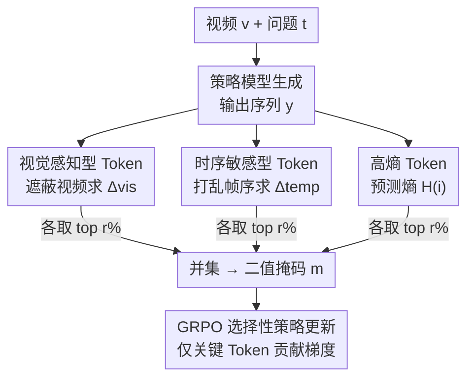

# Video-KTR: Reinforcing Video Reasoning via Key Token Attribution

**会议**: ICLR 2026  
**arXiv**: [2601.19686](https://arxiv.org/abs/2601.19686)  
**领域**: 视频理解  
**关键词**: 视频推理, 强化学习, Token归因, 多模态LLM, GRPO

## 一句话总结

提出 Video-KTR，一种模态感知的策略塑造框架，通过反事实分析识别视觉感知型、时序敏感型和高熵 Token 三类关键 Token，仅对这些 Token 执行选择性强化学习更新，在多个视频推理基准上达到 SOTA（Video-Holmes 42.7%，超越 GPT-4o）。

## 研究背景与动机

强化学习（RL）在提升多模态 LLM 推理能力方面展现出强大潜力，但现有视频推理方法存在三个关键缺陷：

**粗粒度奖励**：依赖序列级奖励，无法精确指导哪些 Token 需要重点学习

**单一因素选择**：仅基于信息熵选择 Token，忽略模态特异性依赖

**语言先验过度依赖**：缺乏视觉输入与输出 Token 的细粒度语义对齐，导致幻觉风险增加

现有方法如 T-GRPO 虽引入时序约束（惩罚帧打乱后的预测），但属于全局粗糙假设，忽略了某些任务可仅靠静态线索解决的事实。

## 方法详解

### 整体框架

Video-KTR 把模态感知的 Token 级塑造机制嫁接到 GRPO 之上：先让策略模型对视频和问题生成一段输出，再对每个输出 Token 做多视角重要性分析，判断它到底依赖视觉、依赖时序、还是处在推理的不确定关口；接着从三路信号里各取 top $r\%$ 的 Token 求并集，构成一个二值掩码；最后只让落在掩码里的关键 Token 参与策略梯度更新，把奖励信号从粗糙的序列级精确滴灌到真正该学的位置上。

### 关键设计

**1. 视觉感知型 Token：用反事实遮蔽分离出"看图才说得出"的词**

序列级奖励的一个老毛病是分不清模型究竟是看了视频还是靠语言先验在硬编。Video-KTR 用反事实遮蔽把这件事量化出来：保留完整输入跑一遍前向，再把视频特征置零跑一遍，对比同一个目标 Token $y_i$ 在两次前向下的对数概率落差，$\Delta^{\text{vis}}_i = |\log \text{softmax}(\mathbf{z}^{\text{full}}_i)_{y_i} - \log \text{softmax}(\mathbf{z}^{\text{masked}}_i)_{y_i}|$。如果遮掉视频后这个 Token 的置信度大幅下降，说明它的预测强烈依附在视觉证据上，比如"person""door""blue"这类描述画面内容的词；反过来落差很小的词靠纯语言就能补出来。把 $\Delta^{\text{vis}}_i$ 高的 Token 挑出来重点学，等于直接对齐视觉输入与输出语义，从源头压住幻觉。

**2. 时序敏感型 Token：用帧顺序打乱抓出"调了顺序就说错"的词**

很多视频问题的难点不在单帧而在事件的先后与因果，但纯粹按帧重要性选 Token 会漏掉这层结构。这里换一种扰动——把帧序打乱后再跑一遍前向，对比正序与乱序下目标 Token 的对数概率差 $\Delta^{\text{temp}}_i = |\log \text{softmax}(\mathbf{z}^{\text{ordered}}_i)_{y_i} - \log \text{softmax}(\mathbf{z}^{\text{shuffled}}_i)_{y_i}|$。打乱后置信度掉得多的词（如"first""then""appear"）才是真正承载时序判断的位置。这比 T-GRPO 那种"只要帧序打乱就整体惩罚"的全局假设更细：它承认有些问题靠静态线索就能答，只把惩罚精确落到对顺序敏感的那几个 Token 上，不误伤其余。

**3. 高熵 Token：用预测不确定性锁定推理的决策关口**

视觉和时序两路抓的是"依赖什么输入"，但推理过程里还有一类词标记着模型自己在犹豫、在转折。用 Token 分布的信息熵 $\mathcal{H}(i) = -\sum_w p(z_i = w) \log p(z_i = w)$ 来衡量这种不确定性：熵高意味着模型在多个候选间摇摆，往往正是"however""wait"这类语篇转折或决策点。这些位置是推理链条最容易走偏也最值得优化的地方，把它们纳入更新集合，相当于在关键岔路口加大学习力度。三路信号各有侧重又互补——视觉、时序回答"凭什么说"，熵回答"哪里在想"。

### 损失函数 / 训练策略

三类信号各自给出一个重要性排序，从每一路里取 top $r\%$ 的 Token，再取并集 $\mathcal{S} = \mathcal{S}_{\text{vis}} \cup \mathcal{S}_{\text{temp}} \cup \mathcal{S}_{\text{ent}}$，据此构建二值掩码 $m_{i,t}$（命中关键 Token 为 1，其余为 0）。把掩码插进 GRPO 的目标函数，

$$\mathcal{J}_{\text{Video-KTR}}(\theta) = \mathbb{E}\left[\frac{1}{G}\sum_{i=1}^G \frac{1}{|o_i|}\sum_{t=1}^{|o_i|} m_{i,t} \cdot \min(r_{i,t}\hat{A}_{i,t}, \text{clip}(r_{i,t})\hat{A}_{i,t})\right]$$

只有 $m_{i,t}=1$ 的关键 Token 才贡献梯度，功能词、助动词这类低信息 Token 被自动滤掉，奖励信号不再被稀释。这里刻意用硬选择（二值掩码）而非软加权：实验里 top-20% 的硬掩码一致优于 Softmax/Sigmoid/线性/指数加权，比例定在 20% 也是甜点——再高会把噪声 Token 拉进来，再低则有效信号不足。整套机制不改 GRPO 主干，可即插即用地接到任何基于 GRPO 的 RL 训练里。

## 实验关键数据

### 主实验：跨基准性能对比

| 模型 | 规模 | Video-Holmes | VideoMMMU | MMVU(mc) | TempCompass | VideoMME |
|------|------|-------------|-----------|----------|-------------|---------|
| GPT-4o | — | 42.0 | 61.2 | 75.4 | 73.8 | 71.9 |
| GPT-5 | — | 46.7 | 84.6 | 82.6 | 83.3 | 86.7 |
| Video-R1 | 7B | 36.5 | 52.3 | 63.8 | 73.2 | 59.3 |
| TW-GRPO | 7B | 32.9 | 51.3 | 65.8 | 73.3 | 55.1 |
| **Video-KTR** | **7B** | **42.7** | **53.1** | **66.6** | **73.5** | **62.5** |

### 消融实验：归因信号组合

| 策略 | E | V | T | Video-Holmes | VideoMMMU | MMVU | 平均 |
|------|---|---|---|-------------|-----------|------|------|
| Vanilla GRPO | ✗ | ✗ | ✗ | 38.8 | 49.8 | 64.8 | 51.1 |
| 仅 T | ✗ | ✗ | ✓ | 42.1 | 50.1 | 65.5 | 52.6 |
| 仅 V | ✗ | ✓ | ✗ | 40.5 | 51.9 | 65.1 | 52.5 |
| V+E+T | ✓ | ✓ | ✓ | **41.6** | **52.6** | **65.9** | **53.4** |

### 关键发现

1. **三种信号互补**：单独使用任一信号均优于 vanilla GRPO，但完整组合效果最佳
2. **硬选择优于软加权**：top-20% 二值掩码一致优于 Softmax/Sigmoid/线性/指数加权
3. **语言学分布差异化**：视觉 Token 以名词为主（24.8%），时序 Token 以动词为主（21.2%），熵 Token 副词比例更高（8.8%）
4. **最优更新比例为 20%**：更高比例引入噪声，过低则信号不足

## 亮点与洞察

1. **反事实分析的巧妙应用**：通过视觉遮蔽和帧打乱两种扰动，自然地解耦了视觉和时序依赖
2. **即插即用设计**：Video-KTR 可无缝集成到任何基于 GRPO 的 RL 训练中
3. **7B 模型超越 GPT-4o**：在 Video-Holmes 上 42.7% vs 42.0%，证明精细的 Token 级优化可弥补模型规模差距
4. **未选中 Token 的分析**：被过滤的低信息 Token 主要是功能词（助动词、代词、介词等），验证了归因机制能有效过滤冗余

## 局限性

1. 反事实分析需要额外的前向传播（遮蔽视觉 + 打乱帧序），增加训练开销
2. 仅在 7B 规模模型上验证，更大规模模型是否仍有同等收益未知
3. Token 选择比例 $r$ 作为固定超参数，未能根据样本难度自适应调整
4. 帧数限制为 16-64 帧，对超长视频的处理能力未验证

## 评分 ⭐⭐⭐⭐⭐

精巧的方法设计、扎实的实验分析、显著的性能提升。将 RL 从粗粒度序列级奖励转向细粒度模态感知 Token 级更新，是视频推理 RL 训练的重要进步。

<!-- RELATED:START -->

## 相关论文

- [\[CVPR 2026\] Video-CoE: Reinforcing Video Event Prediction via Chain of Events](../../CVPR2026/video_understanding/video-coe_reinforcing_video_event_prediction_via_chain_of_events.md)
- [\[CVPR 2026\] Incentivizing Versatile Video Reasoning in MLLMs via Data-Efficient Reinforcement Learning](../../CVPR2026/video_understanding/incentivizing_versatile_video_reasoning_in_mllms_via_data-efficient_reinforcemen.md)
- [\[ICLR 2026\] FLoC: Facility Location-Based Efficient Visual Token Compression for Long Video Understanding](floc_facility_location-based_efficient_visual_token_compression_for_long_video_u.md)
- [\[ICLR 2026\] A.I.R.: Adaptive, Iterative, and Reasoning-based Frame Selection For Video Question Answering](air_enabling_adaptive_iterative_and_reasoning-based_frame_selection_for_video_qu.md)
- [\[CVPR 2026\] VideoAuto-R1: Video Auto Reasoning via Thinking Once, Answering Twice](../../CVPR2026/video_understanding/videoauto-r1_video_auto_reasoning_via_thinking_once_answering_twice.md)

<!-- RELATED:END -->
