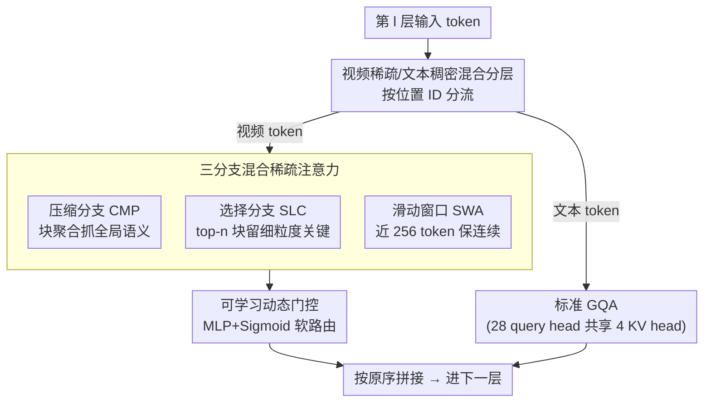

# VideoNSA: Native Sparse Attention Scales Video Understanding

**会议**: ICLR 2026  
**arXiv**: [2510.02295](https://arxiv.org/abs/2510.02295)  
**代码**: 无  
**领域**: 视频理解  
**关键词**: sparse attention, video understanding, long context, multimodal LLM

## 一句话总结

本文提出 VideoNSA，将 Native Sparse Attention（NSA）引入视频语言模型，通过压缩、选择和滑动窗口三分支动态门控的混合稀疏注意力机制，在仅使用 3.6% 注意力预算的条件下实现 128K token 的视频理解，在长视频理解、时序推理和空间理解任务上全面超越 token 压缩和无训练稀疏注意力基线。

## 背景与动机

1. **视频理解受限于上下文长度**：现有多模态大语言模型（MLLM）在处理长视频时受限于上下文窗口，往往遗漏关键转折帧，难以维持长时间尺度上的一致性。例如足球比赛中决定胜负的瞬间仅持续数秒，但整场比赛长达 90 分钟。

2. **Token 压缩方法存在不可逆信息损失**：现有 token 压缩方法（FastV、VScan、VisionZip 等）虽能减少冗余，但在复杂推理任务上性能显著下降，压缩策略限制了感知和推理能力的泛化性。

3. **无训练稀疏注意力缺乏硬件对齐**：现有训练无关的稀疏注意力方法（Tri-Shape、MInference 等）通常不与硬件对齐，施加静态邻接矩阵，限制了信息流的灵活性，且无法提升训练效率。

4. **视频 token 具有高度时间冗余性**：连续视频帧之间存在大量冗余，适合使用稀疏注意力机制；但视频的复杂性（时空依赖）使得 LLM 中已有的稀疏注意力方法不能直接适用于视频场景。

5. **NSA 在 LLM 中已被验证有效**：Native Sparse Attention 在纯文本长上下文建模中已展现出可学习的、硬件感知的稀疏注意力优势，但尚未被应用于视频多模态场景。

6. **增加采样帧数可提升准确率但代价高昂**：直觉上增加视频帧采样能提高精度，但额外 token 带来的计算复杂度呈二次增长，迫切需要高效的注意力机制来突破这一限制。

## 方法详解

### 整体框架

VideoNSA 以 Qwen2.5-VL-7B 为底座，在 LLM 解码器的每一层做一件关键区分：先按位置 ID 把输入分成视频 token 和文本 token，视频 token 走 Native Sparse Attention 的三分支稀疏路径并由门控动态加权，文本 token 仍走标准 GQA，最后两路输出按原序拼回去继续前向。这样视频侧拿到稀疏注意力的效率和可学习的归纳偏置，文本侧保留指令跟随能力，整套机制端到端训练而非外挂的无训练 mask。

### 关键设计

**1. 视频稀疏 / 文本稠密的混合分层：在同一层内按模态分流，兼顾效率与指令理解**

视频 token 高度冗余、适合稀疏化，文本 token 数量少且语义密集、一旦被稀疏化就会伤指令跟随，所以 VideoNSA 不对全序列一刀切。每一层 $l$ 先按位置 ID 把输入分成视频 token $\mathbf{X}_\mathcal{V}$ 和文本 token $\mathbf{X}_\mathcal{T}$，视频侧送入下面的三分支稀疏注意力，文本侧走标准 GQA（28 个 query head 共享 4 个 KV head 的全连接），最后两路输出按原顺序拼接 $\mathbf{o}^{(l)} = [\mathbf{o}_\mathcal{V}^{(l)}; \mathbf{o}_\mathcal{T}^{(l)}]$ 再进下一层。把稀疏只施加在冗余的视频 token 上、对文本 token 保留全连接，是混合设计能效率与理解两头都不丢的关键。

**2. 三分支混合稀疏注意力：用互补视角覆盖长视频的不同时间尺度**

单一稀疏模式很难同时照顾全局语义、关键瞬间和局部连续性，所以在视频侧 NSA 把每个 query $q_t$ 的注意力拆给三条互补分支：压缩分支（CMP）把连续 token 块经可学习 MLP 聚合成粗粒度块表示来抓全局语义，块大小取每帧 token 数 64、用帧内均值池化得到块向量；选择分支（SLC）给每个 KV 块算重要性分数、只保留 top-$n$ 个最显著块来留住细粒度关键信息；滑动窗口分支（SWA）固定保留最近 $w=256$ 个 KV 对来覆盖局部时间连续性。三者分别对应"看全局、抓重点、保连续"，恰好填补长视频里被 token 压缩方法不可逆丢掉的那部分依赖，再由下面的门控汇总：

$$\mathbf{o}_t = \sum_{c \in \{\text{cmp}, \text{slc}, \text{win}\}} g_t^c \cdot \text{Attn}(q_t, \tilde{\mathbf{K}}_t^c, \tilde{\mathbf{V}}_t^c)$$

**3. 可学习动态门控：让注意力预算随内容自适应分配，而非静态邻接矩阵**

无训练稀疏方法施加固定的稀疏结构，信息流不灵活也无法提效；VideoNSA 改用一个两层 MLP + Sigmoid 产出门控 $g_t^c$，对上面三分支做数据依赖的软路由。门控随 query 内容和所在层动态变化——分析显示压缩分支在所有层保持主导，选择与滑动窗口分支在深层逐渐减弱，说明模型确实学会了按层、按任务调整稀疏分配。正是这种可学习路由让 VideoNSA 在仅 3.6% 注意力预算下还能稳定扩展到 128K token。

### 训练策略

训练数据从 LLaVA-Video-178K 中筛 350–550 帧的视频构成 216K 问答对子集，每帧上限 50,176 像素、单实例上下文上限 36K token。稀疏结构超参取块大小 $s=64$、块数 $b=32$、滑动窗口 $w=256$，整套在 SWIFT 框架下端到端训练并适配 FLA 的 NSA kernel 实现，总开销约 4600 H100 GPU 小时。

## 实验结果

### 主实验：多任务全面评估

| 模型 | LongVideoBench | MLVU_test | TimeScope | LongTimeScope | Tomato | VSIBench |
|------|:-:|:-:|:-:|:-:|:-:|:-:|
| Qwen2.5-VL-7B (基线) | 58.7 | 51.2 | 81.0 | 40.7 | 22.6 | 29.7 |
| + FastV (token压缩) | 57.3 | 41.8 | 46.5 | 35.6 | 21.6 | 32.0 |
| + VisionZip (token压缩) | 52.4 | 33.1 | 43.5 | 40.4 | 23.6 | 32.1 |
| + MInference (稀疏注意力) | 59.2 | 49.2 | 82.7 | 44.4 | 23.0 | 36.5 |
| + XAttention (稀疏注意力) | 59.1 | 50.2 | 83.1 | 41.1 | 21.4 | 36.6 |
| **VideoNSA** | **60.0** | **51.8** | **83.7** | **44.4** | **26.5** | **36.1** |

**关键发现**：
- 稀疏注意力方法整体优于 token 压缩方法
- VideoNSA 在时序推理（Tomato +3.9）和长视频理解上优势明显
- 在空间理解（VSIBench）上与最强稀疏基线持平，显著超越压缩方法

### 消融实验：分支组合分析

| CMP | SLC | SWD | LongVideoBench | MLVU | TimeScope | LongTimeScope | Tomato | VSIBench |
|:-:|:-:|:-:|:-:|:-:|:-:|:-:|:-:|:-:|
| ✓ | | | 48.1 | 43.9 | 41.5 | 25.1 | 23.3 | 29.2 |
| | ✓ | | 48.4 | 47.7 | 63.7 | 37.1 | 24.0 | 27.6 |
| | | ✓ | 49.1 | 40.2 | 59.3 | 29.8 | 24.0 | 29.8 |
| ✓ | ✓ | ✓ | **60.0** | **51.8** | **83.7** | **44.4** | **26.5** | **36.1** |

三分支组合显著优于任何单分支或双分支组合，证明了动态门控整合三分支的必要性。

### 缩放分析六大发现

1. **稀疏权重可迁移至稠密注意力**：Dense-NSA（使用 VideoNSA 权重但用稠密注意力推理）在多数任务上超越基线，说明稀疏训练提供了有效的注意力归纳偏置
2. **可靠扩展至 128K token**：超越训练长度（36K）后性能持续提升
3. **最优注意力分配高度任务依赖**：LongVideoBench 偏好更多每帧 token，Tomato 偏好更高帧率
4. **门控分布随层演化**：压缩分支在所有层保持主导，选择和滑动窗口分支在深层逐渐减弱
5. **压缩分支是效率瓶颈**：随上下文增长，压缩分支的推理延迟占据主导
6. **可学习稀疏注意力诱导动态 attention sink**：选择分支几乎无 sink，压缩分支 sink 最多但被门控机制有效抵消，整体 sink 比率仅 0.3%

## 亮点与创新

- **首个可学习+硬件感知的视频稀疏注意力**：不同于静态稀疏模式，VideoNSA 通过端到端训练实现数据依赖的稀疏连接
- **混合注意力设计精妙**：视频用稀疏、文本用稠密，兼顾效率与指令跟随
- **仅 3.6% 注意力预算即达最优**：极致的计算效率
- **系统性的缩放分析**：六大发现深入揭示了稀疏注意力在视频理解中的行为特性

## 局限性

- 训练数据质量有限（LLaVA-Video-178K 子集），SFT 后在部分基准上反而略有下降
- 压缩分支仍是推理瓶颈，kernel 和内存效率有待优化
- 仅在 7B 级别模型上验证，缺乏更大规模模型的实验
- 块大小固定为每帧 token 数，未探索自适应块划分策略

## 相关工作对比

### vs. MInference (Jiang et al., 2024)
MInference 是无训练的稀疏注意力方法，使用预定义的稀疏模式（A-shape, Vertical-Slash 等），不需要额外训练。VideoNSA 通过端到端训练学习数据依赖的稀疏模式，在 Tomato（26.5 vs 23.0）和 VSIBench（36.1 vs 36.5 持平）上表现更优，代价是 4600 H100 GPU 小时的训练成本。

### vs. FastV / VisionZip（Token 压缩方法）
Token 压缩方法直接丢弃或合并 token，导致不可逆的信息损失。FastV 在 TimeScope 上仅 46.5（vs VideoNSA 83.7），VisionZip 在 MLVU 上仅 33.1（vs 51.8）。VideoNSA 保留所有 token 但通过稀疏注意力聚焦关键依赖，在复杂推理任务上优势巨大。

### vs. XAttention (Xu et al., 2025)
XAttention 也是无训练稀疏注意力，使用与 VideoNSA 相同的配置但不训练。VideoNSA 在 LongTimeScope（44.4 vs 41.1）和 Tomato（26.5 vs 21.4）上均显著领先，说明端到端训练对学习有效的稀疏模式至关重要。

## 评分

- ⭐⭐⭐⭐ 新颖性：首次将可学习稀疏注意力系统性引入视频理解，混合注意力设计独到
- ⭐⭐⭐⭐ 技术质量：实验全面，六大发现分析深入透彻，消融实验充分
- ⭐⭐⭐⭐ 实用性：直接适用于现有 VLM 架构，代码和模型已开源
- ⭐⭐⭐ 写作质量：结构清晰但部分符号定义分散，Figure 描述可更精炼

<!-- RELATED:START -->

## 相关论文

- [\[CVPR 2026\] Towards Sparse Video Understanding and Reasoning](../../CVPR2026/video_understanding/towards_sparse_video_understanding_and_reasoning.md)
- [\[CVPR 2026\] VecAttention: Vector-wise Sparse Attention for Accelerating Long Context Inference](../../CVPR2026/video_understanding/vecattention_vector-wise_sparse_attention_for_accelerating_long_context_inferenc.md)
- [\[CVPR 2026\] Attend Before Attention: Efficient and Scalable Video Understanding via Autoregressive Gazing](../../CVPR2026/video_understanding/autogaze_attend_before_attention_efficient_video.md)
- [\[AAAI 2026\] Predicting Video Slot Attention Queries from Random Slot-Feature Pairs](../../AAAI2026/video_understanding/predicting_video_slot_attention_queries_from_random_slot-feature_pairs.md)
- [\[ACL 2026\] APB-V: Accelerating Long-Video Understanding via Sequence-Parallelism-aware Approximate Attention](../../ACL2026/video_understanding/apb-v_accelerating_long-video_understanding_via_sequence-parallelism-aware_appro.md)

<!-- RELATED:END -->
