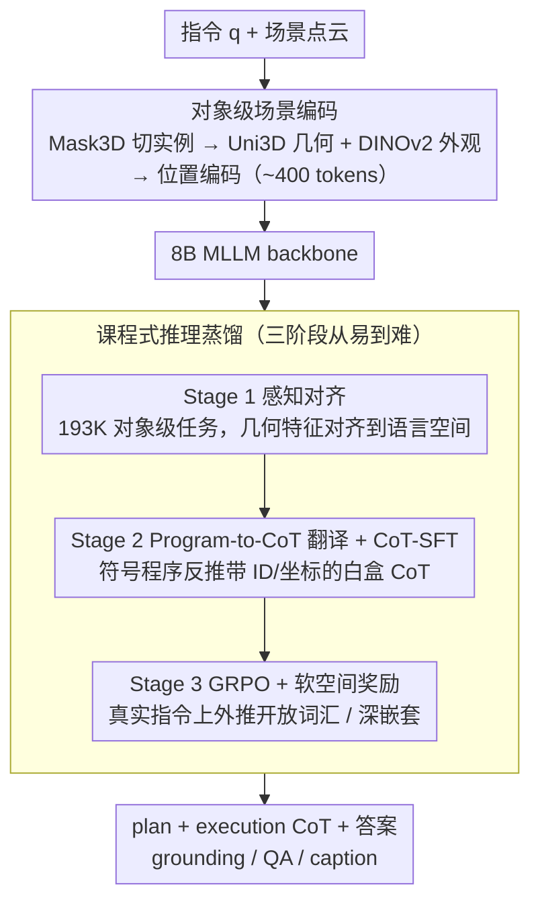

# APEIRIA: Distilling Neuro-Symbolic Programs into 3D Multi-modal LLMs

**会议**: ICML 2026  
**arXiv**: [2606.01215](https://arxiv.org/abs/2606.01215)  
**代码**: https://github.com/oceanflowlab/APEIRIA  
**领域**: 3D视觉 / 多模态VLM  
**关键词**: 神经符号、3D 空间推理、链式思维、GRPO、课程学习

## 一句话总结
本文提出 APEIRIA，把神经符号 3D 概念学习器的程序执行轨迹蒸馏成 3D MLLM 的自然语言 chain-of-thought，再通过 GRPO 强化学习把这种推理模式推广到开放词汇与深层嵌套指令，在 ScanRefer、Multi3DRefer、SQA3D、Scan2Cap 上同时超越传统 NS3D 方法和当前最强的 3D MLLM，并保留了符号系统的可解释性与模块可替换性。

## 研究背景与动机
**领域现状**：3D 空间推理（grounding、QA、captioning）目前由两条路线主导。一是神经符号 3D（NS3D）概念学习器（NS3D、LARC 等），把指令解析成由 `scene/filter/relate` 等原语构成的程序，逐步执行；二是端到端 3D MLLM（Chat-Scene、Inst3D-LMM、Video-3D LLM、LLaVA-3D 等），直接把场景 token 和语言喂给 LLM 做指令到答案的黑盒映射。

**现有痛点**：NS3D 可解释、可组合，但有两个硬约束——(i) `filter(chair)` 这类原语依赖固定的概念专网，没法处理 "cozy chair"、"messy desk" 等开放词汇；(ii) 训练每个原语都需要稠密的中间步骤监督，因此只能在 Sr3D 这种模板生成、最多两层嵌套的合成数据上跑。反过来，3D MLLM 虽然能处理自由语言，但推理是黑盒——失败时无法定位到底是物体识别错、空间关系错还是组合逻辑错。

**核心矛盾**：可解释性 vs. 语义灵活性看似不可兼得。作者识别到一个解耦机会：**符号程序编码的是"推理的语法"（如何分解、如何核验），而 MLLM 拥有的是"开放世界的语义知识"**——这两件事可以分开学。

**本文目标**：(1) 把 NS 程序的推理模式（分解 + 逐步空间核验）蒸馏进 3D MLLM；(2) 让推理能力突破合成数据的封闭词汇与浅嵌套约束，推广到 ScanRefer/Multi3DRefer 这类真实指令；(3) 保留 NS 的可解释 trace 和模块可替换性。

**切入角度**：Sr3D 这类合成集天然提供了**完整中间监督**——每个 `filter` 的输入输出、每个 `relate` 的中间集合都能从标注 ground-truth 反推出来。先用这种"白盒监督"把推理模板灌进 MLLM，再用结果监督的 RL 把模板向开放概念外推。

**核心 idea**：把符号程序的执行轨迹序列化成自然语言 CoT 做 SFT（教会"怎么想"），再用 GRPO + 软空间奖励做 RL（把模板推广到 open-vocabulary 与深嵌套），从而用一个端到端 MLLM 同时拥有 NS3D 的系统性与 LLM 的灵活性。

## 方法详解

### 整体框架
APEIRIA 要解决的是"如何让一个端到端 3D MLLM 既能像符号程序那样系统地分解、逐步核验空间关系，又能处理符号系统搞不定的开放词汇与深层嵌套指令"。它的思路是：先把神经符号程序的执行轨迹翻译成自然语言 CoT 来教模型"怎么想"，再用强化学习把这套推理模板向真实指令外推。

整个系统建立在一个 8B MLLM backbone 上。输入是一段自然语言指令 $q$ 加一组**对象级**场景表征 $\mathcal{O}$，输出是一段含"plan + execution"标签的 CoT 加最终答案 $A$（grounding box / QA 答案 / caption）。场景侧不走 video token 的路子，而是用 object-centric 表征把整个场景压到约 400 tokens（video-based 方法通常要 10k–40k）：先用 Mask3D 把场景切成对象实例，每个实例用 Uni3D 提 3D 几何特征、用 DINOv2 提 2D 外观特征，再用可学习位置编码注入坐标和尺寸，最后把每个对象的视觉+空间特征当成 token 与指令 token 交错喂进 LLM。

训练把"看 → 想 → 适应"拆成一个三阶段课程，从易到难逐级堆能力：Stage 1 先做感知对齐，把 3D 几何特征对齐到 LLM 的语言空间；Stage 2 把符号程序翻译成 CoT 做监督微调（CoT-SFT），灌进"系统化分解"的推理模式；Stage 3 用 GRPO 强化学习（CoT-RL）把这套模式推广到开放集与复杂指令。因为 plan 和 perception 在设计上是解耦的，推理时可以把 plan 换成 GPT-4/Claude 的输出，或把 `scene()` 原语换成 SegDINO3D 等更强分割器，全程不用重训。

### 关键设计

**1. 课程式推理蒸馏：把感知、推理、泛化拆成三个互不重叠的训练目标，避免一次学不会**

3D 推理同时要"看得见物体""会拆解指令""能拆得够深"，硬塞进一次训练既不收敛也容易顾此失彼，所以 APEIRIA 把它切成三段课程逐级加码。Stage 1 在约 193K 对象级感知任务（识别、定位、captioning）上做 vision-language 预训练，目的是把 3D 几何特征对齐到 LLM 的 embedding 空间，先让模型"看得见"。Stage 2 在两级程序上做 CoT-SFT——Level-1（78K，单步 `filter`，来自 ScanNet/MMScan 的属性标注）和 Level-2（66K，两步 `relate`/`relate_triple`，来自 Sr3D），优化目标是对 CoT 与答案的联合似然 $\mathcal{L}_{\text{CoT-SFT}} = -\mathbb{E}\,[\log p_\theta(\text{CoT}, A \mid q, \mathcal{O})]$，把"分解 + 逐步核验"的推理模板灌进去。Stage 3 再在 ScanRefer/Multi3DRefer 的真实指令上做 GRPO。三阶段的必要性能从消融里读出来：直接跳过 Stage 2 冲到 RL，探索空间太大、没有 warm start，ScanRefer Acc@0.25 从 58.4% 暴跌到 48.2%；而只跑到 Stage 2 又会被合成数据的封闭词汇和 ≤2 层嵌套卡死，去掉 Stage 3 掉 6.9%。换句话说，三段课程分别治的是"看不见""不会拆""拆不深"三种病。

**2. Program-to-CoT 翻译：把符号程序反推成带 ground-truth 的白盒 CoT，作为 Stage 2 的监督源**

Stage 2 的监督不是让 LLM 凭空写 CoT，而是从 NS3D 的 `scene/filter/relate/relate_triple` 程序反向翻译出来。对每个程序先解析 AST 成执行序列 $\mathcal{S} = \{s_1, \ldots, s_n\}$，每一步 $s_i$ 序列化成两段：plan 描述子目标（如 "Find all objects of category 'vase'"），execution 则把输入输出对象用 **ID + 坐标 + 尺寸** 显式写出——例如 `relate(filter(desk), filter(wall), left)` 会展开成先列出所有 desk 的 ID、再列出所有 wall 的 ID、最后给出满足"左侧"关系的 desk ID。最终的 CoT 把所有 plan 拼在前、所有 execution 拼在后，形成一条从 query 到答案的透明 trace。这条 trace 的关键性质是 **spatially grounded**：每个物体都用唯一 ID 引用，避免"到底哪个椅子"这种同类歧义。这样做有两层意义。一是打破开放词汇瓶颈——传统 NS3D 用 $f_{\text{chair}}$、$f_{\text{left}}$ 这种概念专网来执行原语，原语数量和词汇被网络结构锁死；APEIRIA 把每个原语改成"让 LLM 用自然语言执行"，原语和概念词汇就不再受限。二是抑制幻觉——相比 3D-R1 那种直接让 LLM prompting 生成 CoT 的方案，从符号程序反推的每一步都有 ground-truth 可验证，CoT 不会乱编。

**3. GRPO + 软空间奖励：在没有中间步骤监督的真实数据上，把推理模板外推到开放概念与深层嵌套**

ScanRefer、Multi3DRefer 这类真实指令没有可解析的程序，给不出中间步骤监督，只能靠结果信号把 Stage 2 的模板往 open-vocabulary（"comfortable"、"cozy"）和深嵌套（"on the kitchen counter AND besides the white fridge"）上推。Stage 3 用 GRPO 优化策略 $\pi_\theta$：对每条指令采样 $N$ 条响应，按组归一化优势 $A_i = (r_i - \text{mean})/\text{std}$，再用截断比 + KL 惩罚更新。奖励由两项相加。一是 **Soft Grounding Reward**，对位置和尺寸各取指数衰减相似度

$$R_{\text{grounding}} = e^{-\alpha \|\bm{x}_{\text{pred}} - \bm{x}_{\text{gt}}\|_2} + e^{-\alpha \|(\bm{s}_{\text{pred}} - \bm{s}_{\text{gt}})/\bm{s}_{\text{gt}}\|_1},\quad \alpha = 2$$

它的好处是即便预测框和 GT 完全不重叠也能给出稠密梯度，绕开了 IoU 在 disjoint 时恒为零的稀疏问题。二是 **Format Reward**：响应里必须含合法的 plan / thinking 标签且长度不退化，否则记 0，防止模型为了快速拿分直接吐答案。两项各有针对性：消融显示把 Soft 换成稀疏 IoU 奖励掉 0.5–0.7%（稀疏反馈探索效率低），而去掉 Format Reward 会出现 "structure collapse"——模型要么复述指令、要么跳过推理直接给答案。合在一起既保住了空间精度，又保住了 CoT 的可解释结构。

### 损失函数 / 训练策略
Stage 1/2 都是标准的 next-token language modeling 损失；Stage 3 用 GRPO clipped surrogate loss（即上面的组归一化优势 + 截断比 + KL 惩罚）。8B backbone 用 LoRA + AdamW/Muon 微调，所有阶段共享同一组 LoRA 权重的演化。CoT 总监督量：Stage 2 有 144K 条 verified CoT 样本（78K Level-1 + 66K Level-2）；Stage 3 直接在下游任务的指令-答案对上跑 RL，每条指令采样 $N$ 条响应做组内对比。

## 实验关键数据

### 主实验

ScanRefer & Multi3DRefer（3D 空间 grounding）主结果：

| 方法 | 类型 | ScanRefer Acc@0.25 | ScanRefer Acc@0.5 | M3DRef F1@0.25 | M3DRef F1@0.5 |
|------|------|--------------------|-------------------|----------------|---------------|
| NS3D (Hsu 2023) | NS3D | 22.4 | – | – | – |
| LARC (Feng 2024) | NS3D | 32.9 | – | – | – |
| LaSP (Mi 2025) | NS3D | 49.2 | – | – | – |
| Chat-Scene | 3D MLLM | 55.5 | 50.2 | 57.1 | 52.4 |
| Inst3D-LMM | 3D MLLM | 57.8 | 51.6 | 58.3 | 53.5 |
| Video-3D LLM | 3D MLLM | 58.1 | 51.7 | 58.0 | 52.7 |
| **APEIRIA** | 3D MLLM | **58.4** | 51.2 | **59.2** | **53.8** |
| **APEIRIA†**（外挂 SegDINO3D） | 3D MLLM | **60.5** | **53.2** | **60.9** | **55.2** |

跨任务泛化（同一三阶段课程，只换 Stage 3 outcome reward 为 EM / CIDEr）：Scan2Cap C@0.25 = 90.6（前 SOTA LEGO 84.7）、SQA3D EM = 58.6（前 SOTA Video-3D LLM 58.6 持平）。

零样本开放概念（仅 Sr3D 训 Stage 2，直接迁到 Nr3D）：APEIRIA 36.5% > 在 Nr3D 上**全监督**的 NS3D 33.9%，验证"vocabulary bottleneck"被打破。

### 消融实验

| 配置 | ScanRefer Acc@0.25 | M3DRef F1@0.25 | 说明 |
|------|--------------------|----------------|------|
| APEIRIA full | 58.4 | 59.2 | 完整三阶段 |
| w/o Stage 3（CoT-RL→Direct SFT） | 51.5 | 55.3 | 跌 6.9 / 3.9，证明 RL 对真实指令外推必要 |
| w/o Stage 2（直接跳到 CoT-RL） | 48.2 | 36.7 | 跌 10.2 / 22.5，无 warm start RL 探不动 |
| w/o Format Reward | 55.7 | 57.1 | 出现 structure collapse |
| w/o Soft Grounding（换稀疏 IoU） | 57.7 | 58.7 | 稀疏奖励探索效率低 |
| w/o Thinking（推理时强制直接答） | 56.8 | 58.2 | 显式 CoT 仍贡献约 1–2% |

按推理复杂度分桶的 RL 收益（ScanRefer Acc@0.5）：≤4 步时 SFT-only 47.2 > CoT-RL 45.4（−1.8）；=5 步时 RL +1.5；≥6 步时 RL +2.7。

### 关键发现
- **三阶段缺一不可，但权重不同**：Stage 2 是"地基"，去掉它 RL 直接探不动（−22.5 F1）；Stage 3 是"屋顶"，去掉它合成模板撑不起真实指令（−6.9 Acc）。两者顺序不能颠倒。
- **RL 收益与推理深度正相关**：步数 ≤4 时 RL 反而引入噪声，≥6 步时 RL +2.7%——这恰好印证作者的设计意图，即 RL 是在 Stage 2 监督**覆盖不到**的长链上做补全，不是在短链上做精修。
- **瓶颈在感知不在 planning**：把 plan 换成 Claude 4.5 Opus 只 +0.2%，但把 `scene()` 原语换成 SegDINO3D +2.0%，距离 oracle GT 上限（61.3）仅差 0.9%。这也意味着模块化设计真的能"白嫖"未来更强的 3D 分割器。
- **涌现的新原语**：CoT-RL 后模型会自发发明 `intersection`、`union` 等 Stage 2 没教过的逻辑原语，并在 `filter(beige chair)` 这种开放词汇上自洽运行——说明它学到的是 syntax 而不是模板。

## 亮点与洞察
- **"蒸馏推理模式而非概念知识"是一个干净的解耦**：传统蒸馏多半把"老师知道什么"灌进学生，这里反过来——只灌"老师怎么想"，"知道什么"完全交给底座 LLM 的预训练语义。这让符号方法和 MLLM 的优点不再 mutually exclusive。
- **从合成数据反推白盒 CoT 是个可推广的 trick**：任何能用程序生成指令的合成集（CLEVR、Sr3D、BabyAI 等）都能自动得到每一步带 ground-truth 的 CoT，比 LLM-as-annotator 路线（如 3D-R1）幻觉风险低得多。可以直接迁到 2D 视觉推理、机器人 task planning 等任意"程序生成监督"的场景。
- **Soft Grounding Reward 解决 grounding-RL 稀疏问题**：把 IoU 这种"非零即零"的二元信号换成位置/尺寸的指数相似度，让早期完全不重叠的预测也能拿到梯度。这条思路适用于所有 3D/2D 检测/分割的 RL 后训练。
- **plan/perception 显式解耦带来的可热插拔性**：消融里直接把 `scene()` 换成 SegDINO3D 就能拿 +2.0%，意味着系统能持续随 3D 感知社区进步而升级——这是黑盒 MLLM 拿不到的"复利"。

## 局限与展望
- 作者承认（隐含）：**感知是当前瓶颈**——SegDINO3D 加进来已经逼近 Oracle 上限，说明 LLM 推理能力已经基本饱和，但 3D 分割本身的天花板还不高。
- 训练课程依赖于 Sr3D 这种"程序-可解析"的合成数据；如果换到没有对应符号程序生态的领域（如 ego-centric video、driving scene），如何重建 Level-1/Level-2 程序集还是开放问题。
- Format Reward 是必要但"权宜"的——它强制模型保留 CoT 结构，但没有真正激励 CoT 内容的正确性；如果未来想做更严格的"step-level verifier"，可能需要 process reward model 而非二元 format 检查。
- 评测仍集中在 ScanNet 系（ScanRefer / Multi3DRefer / Nr3D / SQA3D / Scan2Cap），都是 indoor 静态场景；动态场景、室外（驾驶/无人机）、多视图融合等 setting 还未验证。
- 8B backbone 已足够强，但 RL 单卡成本仍不低；针对 GRPO 在 3D grounding 任务的样本效率，论文没有给出 wall-clock 训练曲线。

## 相关工作与启发
- **vs NS3D / LARC（传统神经符号 3D）**：他们把每个原语实现为概念专网（$f_{\text{chair}}$ 等），所以训练要稠密中间监督、推理被封闭词汇卡住；本文把所有原语都改成 LLM 用自然语言执行，既继承了 systematic decomposition，又拿到了开放词汇。在 Nr3D 零样本设置下，本文 36.5% > NS3D 全监督 33.9%。
- **vs 3D-R1 / Scene-R1（并发的 3D RL 工作）**：3D-R1 直接让 LLM prompting 出 CoT，容易幻觉、物体引用模糊；Scene-R1 干脆不要 trace 监督直接跑 RL，探索极不稳定。本文用"符号程序反推的、带 ID/坐标的可验证 trace"先做 SFT warm start，再做 RL，明显更稳。
- **vs Chat-Scene / Inst3D-LMM / Video-3D LLM（主流 3D MLLM）**：它们都是直接 instruction-to-answer 的黑盒；本文显式产出"plan + execution"trace，可解释、可调试、可热插拔，且在所有主榜上小幅但一致地领先。
- **启发**：这篇可以视为"符号方法 + LLM"在 3D 域的一个干净答卷。同样的范式可以套到——(a) 视觉数学推理（程序 = Wolfram-like solver trace）；(b) 机器人 task planning（程序 = PDDL plan）；(c) 视频时序推理（程序 = event-graph traversal）。关键前提是能找到"程序可枚举 + 每步可验证"的合成数据来 bootstrap Stage 2。

## 评分
- 新颖性: ⭐⭐⭐⭐ 把 NS3D 的程序当 CoT 监督源是干净的新组合，但 program-as-CoT 在 2D（如 ViperGPT、NS-CL）已有先例，3D 落地 + RL 外推是真正的增量。
- 实验充分度: ⭐⭐⭐⭐⭐ 覆盖 4 个 benchmark、3 类任务（grounding / QA / captioning）、零样本 open-set、复杂度分桶 RL 收益、模块替换 oracle 上限——消融做得相当彻底。
- 写作质量: ⭐⭐⭐⭐ 动机清晰、图 2 的 program-to-CoT 翻译图一目了然；但 method 部分公式排版偶有混乱，Stage 2 数据量、CoT 模板细节都丢到附录有点可惜。
- 价值: ⭐⭐⭐⭐⭐ 同时解决了 NS3D 的封闭词汇和 3D MLLM 的不可解释两个老大难，且模块化设计能持续随感知进步升级，是 3D embodied AI 的一个有力 baseline。

<!-- RELATED:START -->

## 相关论文

- [\[CVPR 2026\] Foundry: Distilling 3D Foundation Models for the Edge](../../CVPR2026/3d_vision/foundry_distilling_3d_foundation_models_for_the_edge.md)
- [\[AAAI 2026\] STMI: Segmentation-Guided Token Modulation with Cross-Modal Hypergraph Interaction for Multi-Modal Object Re-Identification](../../AAAI2026/3d_vision/stmi_segmentation-guided_token_modulation_with_cross-modal_hypergraph_interactio.md)
- [\[CVPR 2025\] Neuro-3D: Towards 3D Visual Decoding from EEG Signals](../../CVPR2025/3d_vision/neuro-3d_towards_3d_visual_decoding_from_eeg_signals.md)
- [\[AAAI 2026\] Multi-Modal Assistance for Unsupervised Domain Adaptation on Point Cloud 3D Object Detection](../../AAAI2026/3d_vision/multi-modal_assistance_for_unsupervised_domain_adaptation_on_point_cloud_3d_obje.md)
- [\[ICLR 2026\] pySpatial: Generating 3D Visual Programs for Zero-Shot Spatial Reasoning](../../ICLR2026/3d_vision/pyspatial_generating_3d_visual_programs_for_zero-shot_spatial_reasoning.md)

<!-- RELATED:END -->
