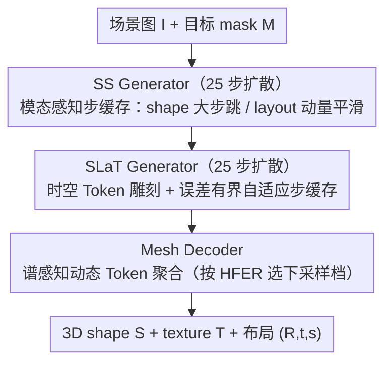

# Fast-SAM3D: 3Dfy Anything in Images but Faster

**会议**: ICML 2026  
**arXiv**: [2602.05293](https://arxiv.org/abs/2602.05293)  
**代码**: https://github.com/wlfeng0509/Fast-SAM3D  
**领域**: 3D视觉  
**关键词**: SAM3D加速, 单视图3D重建, 训练无关推理优化, 扩散步缓存, Token剪枝

## 一句话总结
针对 SAM3D 单视图 3D 重建模型推理太慢的问题，本文做了第一份模块级时延剖析，发现性能瓶颈来自三种异质性（形状/布局动力学差异、纹理稀疏性、几何谱差异），并据此提出训练无关的 Fast-SAM3D 框架，用模态感知步缓存、时空 Token 雕刻与谱感知 Token 聚合三件套，在几乎不损质量的前提下把对象级速度推到 2.67×，重建 F-Score 反而从 92.34 微升到 92.59。

## 研究背景与动机

**领域现状**：以 SAM3D 为代表的单视图、开放世界、mask 条件下的 3D 资产生成模型，已成为 3D 感知与内容创作的关键基础。其标准 pipeline 是「Sparse Structure (SS) generator → Sparse Latent (SLaT) generator → Mesh Decoder」的两阶段「粗到细」扩散架构，能从一张图直接重建多物体 3D 模型并解耦布局信息。

**现有痛点**：SAM3D 推理代价极高。论文给出的模块级剖析显示，单场景端到端耗时约 462 s，其中 SLaT generator（9.7 s/object，FLOPs 219.8 T）与 Mesh Decoder（13.8 s/object，FLOPs 324 T）占主导，SS generator 也有 4.1 s。如此延迟让 SAM3D 几乎无法用于交互式部署。

**核心矛盾**：通用的扩散加速技巧（uniform step skipping、random token pruning、Fast3DCache 这类多视图缓存）一搬到 SAM3D 上就失灵——Random Drop 把 3D-IoU 从 0.403 直接砍到 0.094，Fast3DCache 只能换来 1.03× 提速。失败的根因不是技巧本身差，而是 SAM3D 内部存在「多层异质性」：(i) SS 阶段的 shape token 在去噪轨迹上是平滑的，而 layout token（控制 R/t/s）高频抖动，对其做相同缓存策略会引发系统性 pose drift；(ii) SLaT 阶段的细化更新在空间上极其稀疏——大部分 token 早就稳定，只有边缘/接缝/薄结构在持续更新；(iii) Mesh decoder 阶段，不同几何复杂度的物体对 token 下采样的容忍度差异巨大，instance-agnostic 的均匀下采样会抹掉复杂物体的高频细节。

**本文目标**：拆解成三个子问题——(1) 如何让 SS generator 跳步而不引起布局漂移；(2) 如何让 SLaT generator 既跨时间复用又跨空间裁剪 token；(3) 如何让 Mesh decoder 按物体复杂度自适应地聚合 token。

**切入角度**：作者将「异质性」抬升为一条统一设计原则——**算力应非均匀分配**，按阶段难度与实例复杂度匹配。这意味着对同一阶段内的不同语义角色（shape vs layout）、同一时间步的不同空间位置、同一模型的不同输入实例，都要用不同的计算预算。

**核心 idea**：用三个针对性、即插即用、训练无关的模块在三个阶段同时榨干冗余——形成统一的「heterogeneity-aware」加速框架，把对象级延迟压到原来的 37%。

## 方法详解

### 整体框架
要解决的是 SAM3D 这条「SS generator → SLaT generator → Mesh decoder」三段式扩散重建跑得太慢的问题。Fast-SAM3D 的核心思路是：不动 SAM3D 的任何权重，而是在这三个原生阶段各塞进一个即插即用的加速模块，让算力按「阶段难度 + 实例复杂度」非均匀地花出去。

整条 pipeline 接收一张场景图 $I$ 和目标物体 mask $M$，输出该物体的 3D shape $S$、texture $T$ 与布局参数 $(R,t,s)$。第一阶段 SS generator 跑 25 步扩散，这里 shape token 与 layout token 被解耦成两套缓存规则，避免跳步把 pose 带偏；第二阶段 SLaT generator 同样 25 步，但在空间上只重算少数高显著 token、在时间上按轨迹曲率自适应决定何时跳步；最后一阶段 Mesh decoder 先用 mask 与粗 voxel 的频谱能量给当前实例挑一个下采样力度，再对 sparse 3D token 做坐标量化加 max-pool 聚合。三个模块叠在一起，把对象级时间从 31.04 s 压到 11.60 s（2.67×），场景级从 462.3 s 压到 229.7 s（2.01×）。

### 关键设计

**1. 模态感知步缓存（SS Generator）：让 shape 大步跳、layout 保守走，避免 pose drift**

SS 阶段的痛点是 shape token 和 layout token 的去噪动力学完全不同——作者画 update trajectory 发现 shape token 在轨迹上是 short-range 近线性的，而控制 $(R,t,s)$ 的 layout token 却高频抖动；如果对两者用同一套缓存策略，小误差会在全局坐标系上被放大成系统性的 pose drift。所以这里把二者拆开处理。对平滑的 shape token，做一阶有限差分 $\nabla \mathbf{v}^{\text{shape}}_t = (\mathbf{v}^{\text{shape}}_t - \mathbf{v}^{\text{shape}}_{t+k})/k$，跳步时直接 Taylor 外推 $\hat{\mathbf{v}}^{\text{shape}}_{t-i} = \mathbf{v}^{\text{shape}}_t + (-i)\nabla \mathbf{v}^{\text{shape}}_t$，敢大步跨。对高频的 layout token，先做同样的线性外推得到 $\mathbf{v}^{\text{layout}}_{\text{lin}}(t-i)$，再拿最近一次全量评估的 anchor 做动量平滑：

$$\hat{\mathbf{v}}^{\text{layout}}_{t-i} = \beta \cdot \mathbf{v}^{\text{layout}}_{\text{lin}}(t-i) + (1-\beta) \cdot \mathbf{v}^{\text{layout}}_{\text{anchor}},\quad \beta \in [0,1)$$

anchor 项相当于给外推套了根「橡皮筋」，把发散的风险拽回来。消融定下 cache stride $k=3$、动量 $\beta$ 取 0.5～0.7；这也是「token 角色感知 > 步级感知」这条思路最直接的体现。

**2. 时空 Token 雕刻 + 自适应步缓存（SLaT Generator）：空间和时间冗余一起砍**

SLaT 做的是细化，作者把 token-wise 的真实更新画成 heatmap 后发现它极其稀疏——大片低熵区域早就收敛了，只剩边缘、接缝、薄结构这些高熵 token 还在改。纯空间剪枝会漏掉时间冗余，纯时间缓存又会在轨迹高曲率突变处累积漂移，所以这里把两条机制并联。空间维度上构造一个统一显著度

$$\mathcal{J}_i(t) = \tfrac{1}{2}\big(\mathcal{M}_i(t)+\gamma \mathcal{A}_i(t)\big)+\tfrac{1}{2}\mathcal{S}_{\text{freq}}(i)$$

其中 $\mathcal{M}_i(t) = \|\mathbf{v}_{t,i}\|_2$ 衡量更新幅度、$\mathcal{A}_i(t) = \|\mathbf{v}_{t,i}-\mathbf{v}_{t+1,i}\|_2$ 衡量突变量、$\mathcal{S}_{\text{freq}}(i)$ 是基于 FFT 的高频结构强度；每步只放 top-K（消融选 top-10%）token 进 backbone，相当于顺手当了个空间滤波器。时间维度上用曲率代理 $\kappa_t = \|\mathbf{v}_t-\mathbf{v}_{t-1}\|_2 / \|\mathbf{x}_t-\mathbf{x}_{t-1}\|_2$ 估计轨迹非线性，缓存切线增量 $\Delta_i := \mathbf{v}_i - \mathbf{x}_i$，跳步时直接 $\hat{\mathbf{v}}_t = \mathbf{x}_t + \Delta_i$。为了防止跳步误差爆炸，这里还累计相对变化 $E_t = \sum \varepsilon_n$，一旦越过阈值 $\mathcal{E}$ 就强制做一次全量评估刷新 anchor——这种 error-bounded switching 让方法在「敢跳」与「不爆」之间有了明确护栏。

**3. 谱感知动态 Token 聚合（Mesh Decoder）：按实例复杂度决定压多狠**

Mesh decoder 是 SAM3D 的真正瓶颈，但不同物体对 token 下采样的容忍度天差地别——可视化显示简单物体的频谱能量集中在低频边缘，复杂物体的高频能量散布到整个表面；用 instance-agnostic 的均匀下采样会把复杂物体的细节抹平。这里改成按实例自适应路由：对 mask $\mathbf{M}_{2D}$ 和粗 voxel $\mathbf{V}_{3D}$ 分别做 FFT，定义高频能量比（HFER）

$$\mathcal{H}(\mathbf{X}) = \frac{\sum_{\omega \in \Omega_{\text{high}}} \|\mathcal{F}(\mathbf{X})[\omega]\|_2^2}{\sum_{\omega \in \Omega_{\text{total}}} \|\mathcal{F}(\mathbf{X})[\omega]\|_2^2}$$

再融合成 $\mathcal{H}_{\text{joint}} = w\mathcal{H}(\mathbf{M}_{2D}) + (1-w)\mathcal{H}(\mathbf{V}_{3D})$，按阈值 $\tau_{\text{low}}, \tau_{\text{high}}$ 选下采样因子 $\mathcal{S} \in \{1.25, 1.5, 2.0\}$：简单物体激进压、复杂物体保细节。聚合本身是坐标量化 $\hat{\mathbf{p}}_i = \lfloor \mathbf{p}_i / \mathcal{S} \rfloor$ 加 bin 内 max-pool，token 数大约缩到 $1/\mathcal{S}^3$。HFER 计算几乎零成本又闭式可算，正好做轻量的实例级复杂度代理。

### 训练策略
全套方法**训练无关**——不改 SAM3D 权重，不做蒸馏也不做量化，所有模块都是推理时插入。超参靠在小验证集上 grid search 挑出来：SS 阶段 cache stride $k=3$、momentum $\beta$ 取 0.7 附近；SLaT 阶段 carving 比例 top-10%、误差阈值 $\mathcal{E}$ 控制 anchor 刷新频率；Mesh 阶段 $w$ 与 $\tau$ 按数据集校准。因为不碰权重，它还能和蒸馏/量化方案叠加使用。

## 实验关键数据

### 主实验
在 Toys4K、Aria Digital Twin (ADT) 与 ISO3D 上对比 SOTA 加速方案，base 模型为 SAM3D：

| 方法 | Uni3D↑ | CD↓ | $F_1$@0.05↑ | vIoU↑ | 3D-IoU↑ | 场景时间(s)↓ | 对象时间(s)↓ | 对象加速 |
|------|--------|-----|-------------|-------|---------|--------------|--------------|----------|
| SAM-3D (base) | 0.369 | 0.022 | 92.34 | 0.543 | 0.403 | 462.3 | 31.04 | 1.00× |
| Random Drop | 0.264 | 0.030 | 83.52 | 0.327 | 0.094 | 402.2 | 15.93 | 1.95× |
| Uniform Merge | 0.329 | 0.023 | 91.48 | 0.540 | 0.367 | 366.8 | 15.43 | 2.01× |
| Fast3DCache | 0.348 | 0.022 | 91.31 | 0.505 | 0.051 | 443.3 | 30.14 | 1.03× |
| TaylorSeer | 0.344 | 0.028 | 90.95 | 0.504 | 0.374 | 265.6 | 22.93 | 1.35× |
| EasyCache | 0.342 | 0.028 | 87.06 | 0.432 | 0.186 | 244.9 | 23.11 | 1.34× |
| **Fast-SAM3D** | **0.350** | **0.022** | **92.59** | **0.552** | 0.375 | **229.7** | **11.60** | **2.67×** |

Fast-SAM3D 对象级 2.67× 加速远超 TaylorSeer/EasyCache 的 1.35×/1.34×，且 $F_1$ 与 vIoU 略优于 base 模型；Fast3DCache 在单视图设定下基本失效（1.03×），说明它依赖的多视图冗余在此场景没用。

### 消融实验
三模块的两两 / 全开比较（场景级时间，Toys4K-style 评测）：

| SS | SLaT | Mesh | CD↓ | $F_1$@0.05↑ | vIoU↑ | 场景时间(s)↓ |
|----|------|------|-----|-------------|-------|--------------|
| ✗ | ✗ | ✗ | 0.022 | 92.34 | 0.543 | 462.3 |
| ✓ | ✗ | ✗ | 0.022 | 92.34 | 0.543 | 408.6 |
| ✗ | ✓ | ✗ | 0.022 | 92.50 | 0.540 | 365.9 |
| ✗ | ✗ | ✓ | 0.022 | 92.43 | 0.557 | 320.4 |
| ✓ | ✓ | ✗ | 0.021 | 92.88 | 0.534 | 310.5 |
| ✓ | ✗ | ✓ | 0.022 | 92.58 | 0.553 | 289.9 |
| ✗ | ✓ | ✓ | 0.022 | 92.43 | 0.554 | 301.3 |
| ✓ | ✓ | ✓ | 0.022 | 92.59 | 0.552 | **229.7** |

cache stride 与 carving 比例的关键拐点：$k=3$ 兼顾 vIoU 与速度，$k\ge 4$ 时 3D-IoU 从 0.375 骤降到 0.241（pose drift）；carving 选 top-10% 比 top-20% 更稳，top-5% 速度收益边际下降。

### 关键发现
- **Mesh 模块单独贡献最大**：单开 Mesh 就把时间从 462 s 砍到 320 s，说明 mesh decoder 才是 SAM3D 的真正瓶颈，谱感知 instance-aware 聚合是必要的。
- **加速反而提质**：SLaT 模块单开把 $F_1$ 从 92.34 提到 92.50；作者解释为 saliency-based carving 作为「空间滤波器」，把低置信度噪声 token 顺便剪掉了。
- **SS 模块对 layout 至关重要**：Random Drop 让 3D-IoU 跌 75%、TaylorSeer 让蓝鲨鱼变橙色（语义漂移）——都是因为没保护 layout token 的高频性。Fast-SAM3D 的 momentum anchor 是稳定全局坐标系的关键。
- **超参敏感性**：$\beta$ 在 0.5–0.9 区间表现稳定，cache stride 一旦越过局部线性区（$k\ge 4$）布局准确率会断崖式下跌；这强烈支持「按动力学分配步长」而非均匀跳步。

## 亮点与洞察
- **「异质性即加速线索」是个可迁移的设计原则**。本文把它拆成 modality（shape vs layout）、spatiotemporal（哪些 token / 哪些步）、spectral（哪些实例）三层，每层都对应一个观察→指标→机制的闭环。这种「先剖析后下刀」的方法学比一上来就堆 trick 健康得多，适用于任何多阶段扩散生成模型。
- **error-bounded switching 是 training-free 缓存的灵魂**。$E_t = \sum \varepsilon_n$ 累积量超阈值就强制刷新 anchor，让方法在「敢跳」与「不爆」之间有明确的安全护栏，省去靠人工调步表的麻烦——这套思路可以直接迁到视频扩散、3D 高斯生成等场景。
- **频谱代理用作路由信号便宜又有效**。FFT 的 HFER 计算几乎零成本，却能稳定区分简单/复杂物体，并把它映射到离散的下采样档位。这种 instance-level adaptive routing 在端侧推理场景特别值得借鉴。
- **「加速 ≠ 必然掉点」的反例**。Fast-SAM3D 在保几何质量、保布局、保纹理的同时拿到 2.67× 加速，提示在大模型推理中存在大量「计算与质量正交」的冗余等着被识别和剪掉。

## 局限与展望
- 作者承认方法是 training-free 推理层、不替代 backbone 改进；峰值显存未改善但也未恶化（Appendix B）。
- 评测全部围绕 SAM3D 与一个 TRELLIS transfer 实验，没系统验证在其他单视图 3D 扩散基座（如 Hunyuan3D, TripoSR）上的通用性。
- 三个模块都引入了若干阈值/系数（$k, \beta, K, \mathcal{E}, w, \tau_{\text{low}}, \tau_{\text{high}}$），跨数据集是否需要重新调参未给出明确指南。
- HFER 的 high-frequency cutoff 是手动设定，对于训练分布外的极端复杂几何（如毛发、流体）能否稳定路由值得进一步实证。
- 可改进方向：把 carving 比例 K 与 cache stride k 也做成 instance-adaptive（由轻量 controller 根据当前去噪状态预测），有望把 2.67× 再往上推一档。

## 相关工作与启发
- **vs TaylorSeer / EasyCache**：他们都是均匀的时间步缓存方案，本文证明在 SAM3D 这种 shape-layout 解耦的扩散里，对所有 token 用同一套缓存策略必然出 pose drift；本文的解法是 modality-aware 解耦，告诉社区「token 角色感知 > 步级感知」。
- **vs Fast3DCache**：那是为多视图重建设计、依赖跨视图冗余的缓存机制；单视图场景里它退化到几乎没用（1.03×）。本文把缓存焦点从「视图间」迁到「模态间 + 时间内」，更适配单视图扩散。
- **vs Bolya & Hoffman ToMe (Token Merging)**：ToMe 在 2D ViT 里基于相似度均匀合并，本文则用 FFT 频谱信号做 instance-level 自适应聚合，更贴 3D 几何的 spectral variance。
- **vs 蒸馏 / 量化路线**：那条路线要重训，且对 SAM3D 这种 1.7B 参数的多阶段大模型很贵。本文给出的训练无关方案对工业部署友好，可以与蒸馏/量化叠加（作者也鼓励组合使用）。

## 评分
- 新颖性: ⭐⭐⭐⭐ 「heterogeneity-aware」原则统领三模块，三个观察（kinematic / sparsity / spectral）都有可视化支撑，组合方式新；但单个模块（step caching、token pruning、token merging）的雏形在 2D 扩散里已较多。
- 实验充分度: ⭐⭐⭐⭐ 三个数据集、6 类指标、6 个强基线、完整 ablation + 超参扫；transfer 仅 TRELLIS 一个略薄。
- 写作质量: ⭐⭐⭐⭐ 三模块逻辑清晰（观察→指标→机制），公式与图配合到位，符号统一；少量缩写在引入前已使用。
- 价值: ⭐⭐⭐⭐ 直接把 SAM3D 推到接近实时的对象级延迟，且不需重训权重，对工业级 3D 生成产品落地价值明显。

<!-- RELATED:START -->

## 相关论文

- [\[CVPR 2026\] SAM 3D: 3Dfy Anything in Images](../../CVPR2026/3d_vision/sam_3d_3dfy_anything_in_images.md)
- [\[CVPR 2026\] UIKA: Fast Universal Head Avatar from Pose-Free Images](../../CVPR2026/3d_vision/uika_fast_universal_head_avatar_from_pose-free_images.md)
- [\[CVPR 2026\] Simple but Effective Triplet-Based Compression Strategies for Compact Visual Localization](../../CVPR2026/3d_vision/simple_but_effective_triplet-based_compression_strategies_for_compact_visual_loc.md)
- [\[ICLR 2026\] UFO-4D: Unposed Feedforward 4D Reconstruction from Two Images](../../ICLR2026/3d_vision/ufo-4d_unposed_feedforward_4d_reconstruction_from_two_images.md)
- [\[CVPR 2026\] Faster-GS: Analyzing and Improving Gaussian Splatting Optimization](../../CVPR2026/3d_vision/faster-gs_analyzing_and_improving_gaussian_splatting_optimization.md)

<!-- RELATED:END -->
