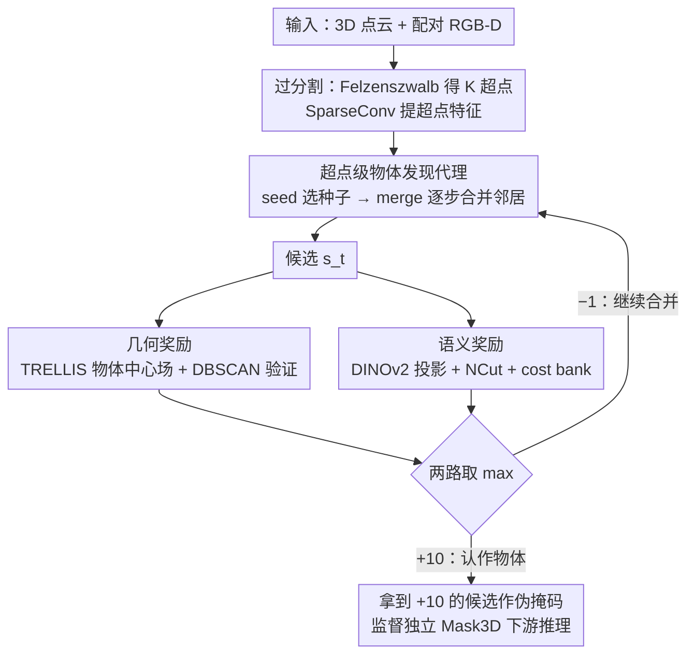

# FoundObj: Self-supervised Foundation Models as Rewards for Label-free 3D Object Segmentation

**会议**: ICML 2026  
**arXiv**: [2605.27178](https://arxiv.org/abs/2605.27178)  
**代码**: https://github.com/vLAR-group/FoundObj  
**领域**: 3D视觉 / 无监督学习 / 强化学习  
**关键词**: 标签无关3D分割, 超点合并, RL奖励, DINOv2, TRELLIS

## 一句话总结
本文提出 FoundObj，把 2D/3D 自监督基础模型（DINOv2 + TRELLIS）当作奖励器，用一个"超点合并 + PPO"的 RL 代理在无任何场景级人工标注下完成复杂室内场景的多类 3D 物体分割，在 ScanNet/S3DIS/ScanNet200 上将无监督 SOTA 的 AP 从 19.6 提到 24.2。

## 研究背景与动机

**领域现状**：3D 场景物体分割主流仍依赖密集点级标注（Mask3D 等）或多模态对齐数据（CLIP/SAM 派生的开放词汇方法）。为了摆脱标注，最近出现两条无监督路线：一类把 DINO/v2 的 2D 自监督语义投影到 3D（UnScene3D、Part2Object）；另一类用 3D 物体重建/生成模型提供几何先验（EFEM、GrabS、EvObj）。

**现有痛点**：纯语义路线（DINO 系）擅长区分类间差异，但因为 DINO 特征里没有"对象性（objectness）"，难以把同类相邻物体（比如几把挨着的椅子）切开；纯几何路线（GrabS/EFEM）能精准抠出形状清晰的物体，却只能处理单类（椅子）且依赖动态圆柱体作为代理，无法适应墙边扁平柜子这类形状任意的物体。

**核心矛盾**：到底"什么是一个物体"——认知科学指出物体感知由几何（形状/结构）和语义（身份/与背景的区分）两面共同定义。目前的无监督方法只用了其中一面，自然各有盲区。

**本文目标**：在不使用任何 3D 场景标注的前提下，能同时分割出（a）同类相邻多实例（多把椅子）与（b）类间形状各异的物体（扁柜子、桌、门），并具备跨数据集和长尾泛化能力。

**切入角度**：让 RL 代理在场景的超点图上自底向上地"长"出物体候选，再用两个互补的基础模型奖励——TRELLIS（3D 物体几何先验）+ DINOv2（2D 语义先验）——分别从几何一致性和语义独特性两条独立轴打分。

**核心 idea**：把"什么是物体"从手工设计的规则或单一先验，改成"语义 + 几何两个基础模型给出的可微反馈"，用 PPO 训练一个超点合并策略。

## 方法详解

### 整体框架
FoundObj 要解决的是：在没有任何 3D 场景标注的情况下，让模型自己判断"什么算一个物体"，并把它从复杂室内场景里抠出来。它的整体思路是把分割改写成一个强化学习问题——一个小代理在场景的超点图上自底向上地"长"出物体候选，由两个互不参与梯度的基础模型来当裁判打分。

具体地，输入一个 3D 场景点云 $\bm{P}$（外加配对的 RGB-D 图像，用来把 2D DINOv2 特征投回 3D）。Felzenszwalb 算法先把场景过分割成 $K$ 个初始超点，SparseConv 给每个超点提一份特征。接着一个 seed 策略网络挑一个起点，一个 merge 策略网络反复挑邻居把它们并进来，每一步都得到一个越长越大的候选 $\bm{s}_0, \bm{s}_1, \cdots, \bm{s}_T$。每个候选会同时送进几何奖励模块（TRELLIS + 物体中心场，看点云是否在几何上汇聚成单一物体）和语义奖励模块（DINOv2 + 语义一致性 NCut，看它语义上是否和背景显著区分）。两路奖励取 max——只要任一模态认它是物体就给 +10 并结束这一回合，否则 −1 让代理继续合并。整个代理用 PPO 训练；最终把所有拿到 +10 的候选当伪掩码，监督一个独立的 Mask3D 做下游推理。

### 关键设计

**1. 超点级物体发现代理：用可学习的层次合并取代 GrabS 的圆柱代理**

GrabS 这类几何派方法用一个动态圆柱体当物体代理，天然假设物体接近规则形状，碰到扁平的墙边柜子、L 形沙发就束手无策，而且只能处理椅子这样的单一类别。FoundObj 把物体发现重写成超点图上的两步离散动作。seed 策略对所有 $K$ 个超点特征做自注意力，输出 softmax 概率 $\bm{p}_{seed} = \bm{\pi}_{seed}([\bm{f}_1, \dots, \bm{f}_K])$，采样出种子 $\bm{s}_0$；merge 策略再对种子和它 0.1m 范围内的 $Q$ 个邻居做自注意力 + sigmoid，给每个邻居算一个合并概率 $\bm{p}_{merge} = \bm{\pi}_{merge}(\bm{f}_0, [\bm{f}_0^1, \dots, \bm{f}_0^Q])$，按概率采样把它们并进候选，如此循环直到拿到 +10 奖励或触达步数上限 $T$。这样动作空间被离散到 $K$ 个超点上，既保留了表达任意形状的能力，又把搜索规模从原始点级压到超点级，RL 才变得可解；而逐步合并相比一次切完的图算法，还让代理有机会绕开局部错误。

**2. 几何奖励：TRELLIS 的物体中心场 + DBSCAN 验证**

TRELLIS 本身是个 auto-encoder，并不能直接回答"这是不是一个物体"。FoundObj 在它的预训练编码器上加一个 Transformer 解码器 head $\bm{g}_{center}$，把"物体即点云向单一中心收敛"这条几何先验显式化：该 head 回归每个点指向物体质心的向量 $\bm{v}_m = \bm{o}_c - \bm{o}_m$（质心 $\bm{o}_c = \frac{1}{M}\sum \bm{o}_m$），离线在 ABO + 3D-Future 家具数据上用 $\ell_2$ loss 训好。推理时把候选 $\bm{s}_t$ 喂进去得到位移 $\bm{v}_t$，对平移后的点云 $(\bm{s}_t + \bm{v}_t)$ 跑 DBSCAN（半径 $r=0.05$）：若主簇覆盖率 $\geq \alpha=30\%$，说明这堆点确实收敛到一个中心，奖励 +10，否则 −1。这样既避开了直接做重建对比的高代价，DBSCAN 也让验证对部分遮挡和噪点更鲁棒。几何奖励的真正价值在于补语义之短——DINO 特征里没有"对象性"，对几把挨着的同类椅子完全无法拆分，而中心场是这种场景下唯一的拆分信号。

**3. 语义奖励：DINOv2 投影 + 语义一致性 NCut + 自适应 cost bank**

这一路负责判定候选区域语义上是否和背景显著不同。FoundObj 先把 DINOv2 的 2D 特征沿深度图投影到 3D、按超点取平均，构造场景级 $K \times K$ 的余弦相似度矩阵 $\mathcal{S}$ 与 0.1m 邻接矩阵 $\mathcal{A}$，二者逐元素相乘得到的 $(\mathcal{S} * \mathcal{A})$ 同时编码了空间邻接与语义相似。把候选的 one-hot 掩码 $O_t$ 看成对这张场景图的一刀切，借鉴 Normalized Cut 计算切分代价 $\mathcal{C} = \mathcal{C}_{boundary} / \mathcal{C}_{vol}$（边界相似度越低、被切出的体积越饱满，cost 越小，越像一个独立物体）。关键在于不用固定阈值判定——家具密集和稀疏的房间 cost 分布差异很大，硬阈值无法跨场景泛化。FoundObj 改为给每个场景维护一个"top-20 最低 cost bank"，候选 cost 只要落进当前场景这 20 个最像物体的名额里就 +10，否则 −1。这种自适应既鼓励代理探索多样物体，又不至于被低质量噪声候选淹没，是该方法跨 ScanNet/S3DIS/ScanNet200 零样本不掉点的关键。

### 损失函数 / 训练策略
代理本身用标准 PPO 训练，监督信号就是两路奖励取 max 后的 +10/−1。几何中心场 head $\bm{g}_{center}$ 离线在 ABO + 3D-Future 上用 $\ell_2$ 预训练；语义模块零可训练参数，只是一个基于 DINOv2 投影 + cost bank 的纯奖励器。训练完成后，把所有得 +10 的候选当作伪掩码，监督训练一个独立的 Mask3D（沿用 GrabS 的两阶段配方），benchmark 时只跑这个轻量的 Mask3D 推理。

## 实验关键数据

### 主实验

ScanNet 验证集（18 类，class-agnostic AP）：

| 方法 | AP | AP@50 | AP@25 |
|------|----|----|----|
| EFEM (几何派) | 8.0 | 16.7 | 22.3 |
| GrabS (几何派, 单类) | 14.0 | 27.2 | 39.4 |
| UnScene3D (DINO 派) | 18.5 | 37.8 | 63.7 |
| Part2Object (DINOv2 派, 此前 SOTA) | 19.6 | 38.4 | 64.9 |
| Concerto+DINOv2 (强基线) | 19.8 | 41.2 | 72.2 |
| **FoundObj (本文)** | **24.2** | **46.2** | **74.7** |
| Mask3D (有监督上限) | 61.2 | 83.0 | 93.0 |

跨数据集零样本（在 ScanNet 训练，直接测）：S3DIS-Area5 AP 从 Part2Object 的 10.4 升到 12.8（已接近有监督 Mask3D 的 13.0）；S3DIS 6-fold AP 从 8.6 升到 11.4；长尾 ScanNet200 AP 从 15.2 升到 18.1（+19% 相对提升）。

### 消融实验

| 配置 | AP | AP@50 | AP@25 | 说明 |
|------|----|----|----|------|
| Full FoundObj | 24.2 | 46.2 | 74.7 | 完整模型 |
| w/o 几何奖励 | 19.5 | 40.2 | 72.7 | 退化为 DINO-only，掉 4.7 AP |
| w/o 语义奖励 | 15.3 | 37.2 | 67.6 | 掉 8.9 AP，比 GrabS 还高 |
| DBSCAN $r=0.02$ | 21.9 | 43.6 | 76.8 | 太严苛，少识别 |
| DBSCAN $r=0.1$ | 22.5 | 43.6 | 72.5 | 太松，假阳性多 |
| Bank size = 10 | 20.9 | 41.8 | 72.1 | 反复盯显著物体 |
| Bank size = 40 | 21.1 | 41.4 | 73.3 | 低质量候选混入 |

公平条件下的孤立先验对照（Table 6 DINO-only）：FoundObj 仅用 DINO 也拿到 19.5 AP，已和 Part2Object（19.6）持平，AP@50（40.2 vs 38.4）和 AP@25（72.7 vs 64.9）反超，说明 RL 代理本身就比 NCut/projection 派 pipeline 更会用同一份特征。

### 关键发现
- 语义奖励比几何奖励重要（去掉后掉 8.9 AP vs 4.7 AP），作者归因于 DINOv2 训练数据规模远大于 TRELLIS，特征更可判别。
- 几何奖励的真正价值在补语义之短：在同类相邻物体（多把椅子）的拆分上 DINO 完全无能为力，几何中心场是唯一的拆分信号；这也是 ScanNet AP@50 比之前 SOTA 暴涨 7.8 个点（38.4→46.2）的主要原因。
- Cost bank 这个看似工程化的细节其实是关键：把全局阈值换成场景自适应的 top-20，使方法跨 ScanNet/S3DIS/ScanNet200 零样本不掉点；超参敏感性消融显示偏离 20 都明显下降。
- S3DIS-Area5 上无监督 FoundObj (12.8) 已经追平有监督 Mask3D (13.0)，反映在分布外场景里有监督方法过拟合训练域，而基础模型先验更稳。

## 亮点与洞察
- "把基础模型当奖励器"这一框架值得迁移：传统做法是用基础模型的特征作输入或对比目标，本文证明把它们当成 RL 奖励的"裁判"更优雅——基础模型不参与梯度，但通过 +10/−1 的离散信号引导小代理学，避免了特征对齐的复杂工程。
- 两个奖励模块的"互补 max"组合很巧妙：取 max 而非加权和，等价于"任一模态认这是物体就接受"，让代理在语义模糊时靠几何救场、几何不清时靠语义救场，鲁棒性远超单一阈值。
- 超点 + 代理合并实际上是把分割转化为"图上的可学习层次聚类"，相比 NCut 这类一次切完的图算法，RL 的逐步合并让模型有机会回退/绕开局部错误。

## 局限与展望
- 离不开配对 2D 图像与深度（用来把 DINOv2 投回 3D）——纯 LiDAR 或无配对 RGB 的户外场景（KITTI 等）适用性存疑。
- 几何中心场 $\bm{g}_{center}$ 在 ABO + 3D-Future 的家具/常见物体上训练，对超薄结构（窗帘、电线）或超大物体（地板、墙）的中心收敛假设可能失效——但论文未量化报告这类失败模式。
- 仍是"伪标签 → Mask3D"两阶段：代理本身的 +10 奖励是离散稀疏的，PPO 训练效率和稳定性细节没充分讨论，超参怎么调通是个黑盒。
- 没有评估纯 RGB-D 推理速度——超点构建 + 代理 rollout + 两个基础模型前向，离线生成伪标签的成本应该很高，论文回避了这块。
- 可改进方向：把 SAM3D 引入语义奖励替代 DINOv2 投影，可能进一步缓解 2D→3D 投影误差；几何奖励引入多视角一致性约束应能扩到户外。

## 相关工作与启发
- **vs UnScene3D / Part2Object**：同样用 DINO/v2 语义先验，但它们做"特征投影 + 一次性 NCut/grouping"，无法分同类相邻实例；本文用 RL 代理 + 几何奖励互补，AP@50 涨 7.8 点。
- **vs GrabS / EvObj / EFEM**：同样把分割当成"代理寻找物体"，但 GrabS 用圆柱代理只能抓单类规则物，本文换成超点合并代理且加上语义奖励，覆盖到多类与任意形状。
- **vs 有监督 Mask3D**：在 S3DIS Area-5 零样本场景下追平 Mask3D，意味着对于跨域真实部署，"基础模型先验 + 无监督代理" 比"目标域监督训练"更可取。

## 评分
- 新颖性: ⭐⭐⭐⭐ "基础模型当奖励器" 框架和"几何中心场 + 语义 NCut bank"组合是清晰的新设计，但单看每个组件（PPO 代理、DINO 投影、NCut）都借鉴自 GrabS/UnScene3D。
- 实验充分度: ⭐⭐⭐⭐ 三个 benchmark + 跨数据集零样本 + 长尾 + DINO/TRELLIS 单独对照 + 4 组消融，覆盖很全；只缺训练成本与鲁棒性分析。
- 写作质量: ⭐⭐⭐⭐ 动机—方法—实验逻辑清晰，几何/语义分工讲得透；公式和符号略密集但 self-contained。
- 价值: ⭐⭐⭐⭐ 无监督 3D 分割 SOTA + 跨域逼近有监督上限，对真实 3D 场景标注稀缺场景有直接实用价值；"基础模型当奖励器"对其他 3D/具身任务有方法论启发。

<!-- RELATED:START -->

## 相关论文

- [\[CVPR 2026\] Towards Foundation Models for 3D Scene Understanding: Instance-Aware Self-Supervised Learning for Point Clouds](../../CVPR2026/3d_vision/towards_foundation_models_for_3d_scene_understanding_instance-aware_self-supervi.md)
- [\[AAAI 2026\] Parameter-Free Fine-tuning via Redundancy Elimination for Vision Foundation Models](../../AAAI2026/3d_vision/parameter-free_fine-tuning_via_redundancy_elimination_for_vision_foundation_mode.md)
- [\[CVPR 2026\] MonoSAOD: Monocular 3D Object Detection with Sparsely Annotated Label](../../CVPR2026/3d_vision/monosaod_monocular_3d_object_detection_with_sparsely_annotated_label.md)
- [\[ICML 2026\] Geometry-Guided Modeling of Foundation Features Enables Generalizable Object Shape Deformation Learning](geometry-guided_modeling_of_foundation_features_enables_generalizable_object_sha.md)
- [\[CVPR 2026\] Foundry: Distilling 3D Foundation Models for the Edge](../../CVPR2026/3d_vision/foundry_distilling_3d_foundation_models_for_the_edge.md)

<!-- RELATED:END -->
