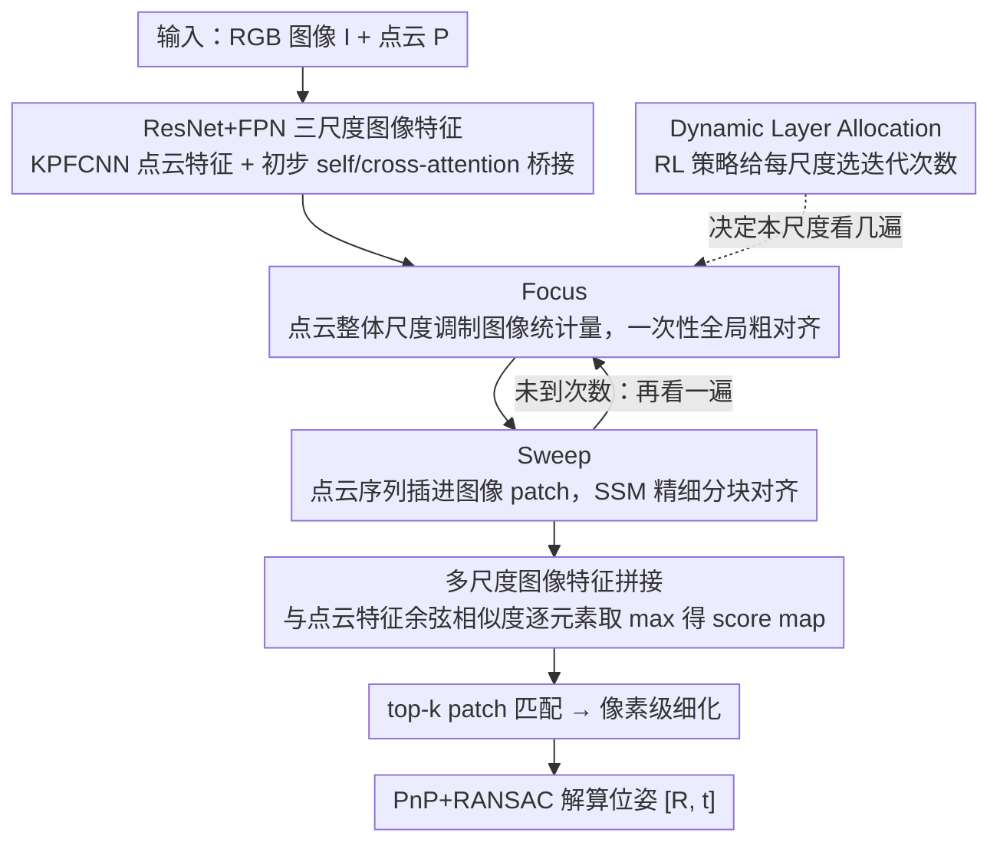

# FSI2P: A Hierarchical Focus–Sweep Registration Network with Dynamically Allocated Depth

**会议**: ICML 2026  
**arXiv**: [2605.07607](https://arxiv.org/abs/2605.07607)  
**代码**: 无  
**领域**: 3D视觉 / 跨模态配准  
**关键词**: 图像-点云配准, Mamba/SSM, 强化学习层数选择, Focus-Sweep, 多尺度交互

## 一句话总结
本文把人类“先扫一眼再逐块细看”的观察过程抽象为 Focus-Sweep 两阶段范式，用 Mamba 替换 Transformer 做图像-点云交互，并用强化学习动态决定每个尺度上的交互层数，在 RGB-D Scenes V2 和 7-Scenes 上拿到 I2P 配准的 SOTA。

## 研究背景与动机

**领域现状**：图像到点云（I2P）配准的主流路线已经从“detect-then-match”过渡到“detection-free”的 coarse-to-fine 框架，如 2D3D-MATR、B2-3D、CA-I2P 等，靠多尺度特征 + Transformer 交叉注意力建立 patch 级对应，再用 PnP+RANSAC 求位姿。

**现有痛点**：作者通过实验观察到两个被忽视的问题——第一，堆叠太多 cross-attention 层会出现“注意力漂移”，早期层的小偏差被反复放大（Matthew 效应），导致 MMD 反而上升；第二，多尺度设计虽然缓解了部分尺度差异，但在重复纹理场景下仍会因为不同分辨率上的相似纹理产生 scale ambiguity，匹配错位。

**核心矛盾**：跨模态对齐本质需要长程交互，所以必须堆叠多层；但堆得越多越容易漂移，而堆多少层又是离散、不可微的决策，普通梯度下降无法学习——“需要深交互”与“深交互会漂移”、“深度可学”与“离散决策”之间存在双重 trade-off。

**本文目标**：(1) 设计一种比 Transformer cross-attention 更稳定、能压制 scale ambiguity 的跨模态交互机制；(2) 给每个尺度配一个数据自适应的交互深度，让模型像人一样“看够了就停”。

**切入角度**：认知心理学指出，人在跨模态匹配时分两步——先做全局尺度估计与粗扫描（Focus），再分块精细比对（Sweep）。这种序列、定向、保持长期记忆的过程天然契合 SSM（Mamba）的扫描机制；而“看几次才够”本质是一个可由 RL 优化的策略。

**核心 idea**：用基于 Mamba 的“Focus-Sweep”交替交互 + 用 RL 学习每个尺度上的迭代深度，取代 Transformer 的固定深度交叉注意力。

## 方法详解

### 整体框架
FS-I2P 要解决的是图像到点云的 detection-free 配准：输入同场景的 RGB 图像 $I\in\mathbb{R}^{H\times W\times 3}$ 和点云 $P\in\mathbb{R}^{N\times 3}$，输出刚体变换 $[R,\mathbf{t}]$。它的整体思路是把人“先扫一眼估个大概、再分块逐处细看”的两阶段观察过程做成网络结构，用 Mamba 扫描替换 Transformer 交叉注意力，并让每个尺度看几遍由数据自己决定。

具体走 coarse-to-fine：先用 ResNet+FPN 抽出三个尺度的图像特征 $F_{Ia},F_{Ib},F_{Ic}$、用 KPFCNN 抽点云特征 $F_P$，过一层 self/cross-attention 做初步桥接；随后进入核心的层级 Focus-Sweep 交互模块，对每个尺度的图像特征先做 Focus 全局粗对齐、再做 Sweep 分块精细交互，而每个尺度上这对 FS-Layer 重复几次则交给一个 RL 策略网络动态分配；交互完成后把多尺度图像特征拼接，与三尺度点云特征分别算余弦相似度并逐元素取 max 得到 score map，据此做 top-k patch 匹配、细化到像素级，最后用 PnP+RANSAC 解算位姿。

### 关键设计

**1. Focus：用点云的整体尺度一次性把图像特征「对准」，避免逐层注意力漂移**

Focus 对应人观察时的「先扫一眼」，针对的痛点是 Transformer 在图像-点云尺度不一致时，早期注意力的小偏差会被后续层反复放大（Matthew 效应）。它不建任何显式 cross-attention 矩阵，而是把整朵点云的「总体口味」压成几个通道级调制因子来重排图像统计量：先对 $F_P$ 做全局 average pool 再线性投影出三组因子 $[\alpha,\beta,\gamma]=\text{Linear}(\text{AvgPool}(F_P))$，然后以 $F'_i=\gamma\cdot\text{VSSM}(\alpha\cdot F_i+\beta)+F_i$ 调整图像特征的均值/方差（VSSM 是 VMamba 的视觉 SSM 前馈层）。因为粗对齐被压缩成一次性的 norm 调制，开销极小，又能把多尺度图像特征整体拉到点云的尺度上，从源头避免后续 Sweep 的 SSM 被错误尺度反复带偏。

**2. Sweep：把点云序列反复插进图像 patch 之间，借 SSM 的近因偏好做精细分块对齐**

Sweep 对应「分块来回看」，是准确匹配的主力，要解决的是 cross-attention 在不同 patch 间缺乏顺序约束、注意力容易飘的问题。它分 Partition-Scan-Recover 三步：Partition 把图像 $F_i\in\mathbb{R}^{h\times w\times C}$ 按窗口 $o$ 切成 $P=hw/o^2$ 个不重叠 patch $[F_i^1,\dots,F_i^t]$；Scan 构造混合序列 $F_H=[F_i^1 F_P, F_i^2 F_P,\dots, F_i^t F_P]$，即在每个图像 patch 后面重复插入一遍点云序列再过一层 VSSM；Recover 把扫描结果拆回图像特征（直接重排），点云特征则用可学习权重 $\lambda=[\lambda_1,\dots,\lambda_t]$ 加权平均 $F_P^{re}=\sum_u \lambda_u F_P^t/t$。关键在于 SSM 对「越靠近当前时刻的 token 越敏感」，每进入一个新 patch，紧跟其后的点云序列就把模型「重新提醒一次」，迫使它反复对齐当前局部区域与全局点云；这样既保住局部精细比对、又留住全局接收域，而 Mamba 的线性复杂度让这种密集重复插入在算力上可行。

**3. Dynamic Layer Allocation：用 RL 给每个尺度选「看几遍」，把离散深度决策变成可学策略**

这一设计让三个尺度的 FS-Layer 迭代次数 $\{n_1,n_2,n_3\}$ 各自由数据决定（允许某尺度取 0、直接跳过该尺度交互），不再固定深度。痛点在于层数是离散、不可微的，普通梯度下降学不了，而堆太少不够准、堆太多又会漂移。做法是把图像 token 与点云 token 的 mean+max pooling 拼成状态 $s$，用轻量策略网络 $g_\theta$ 输出动作 logits $\mathbf{z}=g_\theta(s)$，得到候选深度上的类别分布 $\pi_\theta(n\mid s)=\text{Softmax}(\mathbf{z})$；训练时采样动作 $a\sim\pi_\theta(\cdot\mid s)$ 并记录 $\log p=\log\pi_\theta(a\mid s)$，推理时贪婪取 $a=\arg\max\mathbf{z}$。奖励直接来自全局配准约束（Inlier Ratio / FMR / RR 等），用 policy gradient 更新。相比拍脑袋设固定深度或手工启发式，用全局配准质量当奖励，自然对应人「看到目标就停」的行为，也让深度选择对不同场景自适应。

### 损失函数 / 训练策略
训练目标 = 标准 I2P 配准损失（patch-level 对应监督 + 细化级监督）+ 策略梯度 $\mathcal{L}_{RL}=-\mathbb{E}[R\cdot\log p]$，其中奖励 $R$ 由配准 inlier 数 / 距离误差构造。最大允许深度 $l_{\max}$ 是超参，三个尺度可独立在 $0..l_{\max}$ 间选取。

## 实验关键数据

### 主实验
两个公开 benchmark：RGB-D Scenes V2（4 个场景）与 7-Scenes（7 个场景），三个常用指标 Inlier Ratio (IR)、Feature Matching Recall (FMR)、Registration Recall (RR)。

| 数据集 | 指标 | FS-I2P (本文) | Flow-I2P | 2D3D-MATR | 备注 |
|--------|------|--------------|---------|-----------|------|
| RGB-D Scenes V2 (mean) | IR | **42.9** | 40.1 | 32.4 | +2.8 vs 之前最强 |
| RGB-D Scenes V2 (mean) | FMR | **94.4** | 93.3 | 90.8 | 与 B2-3D 持平最优 |
| 7-Scenes (mean) | IR | **53.9** | 52.0 | 50.1 | 全部 7 场景平均 |
| 7-Scenes (mean) | FMR | 92.4 | 91.6 | 92.1 | 与 SOTA 持平 |

在 Scene-11 / Scene-12（重复纹理严重的场景）上提升尤其大，验证了对 scale ambiguity 的缓解。

### 消融实验

| 配置 | RGB-D V2 mean IR | 说明 |
|------|------------------|------|
| Full FS-I2P | 42.9 | 完整模型 |
| w/o Focus (只留 Sweep) | 明显下降 | 缺少全局尺度对齐，多尺度反而互相干扰 |
| w/o Sweep (只留 Focus) | 大幅下降 | 缺少精细分块交互，仅靠 norm 调制信息不足 |
| w/o Dynamic Layer (固定 4 层) | 略低 | 固定深度无法适配不同场景；论文 Figure 3 显示 transformer 加深时 MMD 反而上升 |
| Mamba → Transformer 替换 | 下降 | 证明 Mamba 不只是“替换组件”，对 Matthew 效应的缓解有结构性收益 |

### 关键发现
- Transformer 加深时 MMD（图像-点云特征分布距离）先降后升，而 FS-I2P 用 SSM + RL 自适应深度避免了这种漂移，T-SNE 可视化也更聚类。
- Dynamic Layer Allocation 学到的策略具有解释性：在尺度差异大的场景倾向加深特定尺度的层数，在结构简单场景倾向跳过部分尺度，验证了“按需观察”的假设。
- Focus 与 Sweep 单独都不够强，两者交替才是性能主因——这说明跨模态对齐既需要全局尺度先验，也需要分块精细比对，类似于人脑两阶段感知。

## 亮点与洞察
- 用 Mamba 的“顺序敏感 + 线性复杂度”天然匹配认知科学里的两阶段观察理论，把架构选择与人类感知对齐，是一个很优雅的“motivation→backbone 选择”链路。
- “在每个图像 patch 后面重复插入点云序列”是个非常聪明的工程 trick：利用 SSM 对近期 token 更敏感的特性，无需显式 cross-attention 就实现了反复对齐，能直接迁移到任何“一边是序列、一边是集合”的跨模态匹配任务（如 text-to-point cloud、speech-to-image）。
- 把“交互层数”这种过去当超参拍脑袋的设计变成 RL 策略，是 detection-free 系列里第一个明确把“看几次”动态化的工作，思路可推广到任何 coarse-to-fine 框架。
- 论文给出了 Matthew 效应的具体证据（不同深度的 MMD 曲线），不再只是“cross-attention 易过拟合”这种泛泛之谈，对后续 SSM vs Transformer 的取舍讨论有数据支持。

## 局限与展望
- 作者承认 RL 训练需要可微/半可微的全局奖励，奖励设计在更多 I2P 数据集（如室外大尺度场景 KITTI）上的迁移性未验证。
- 自评：策略网络的状态 $s$ 只用了 mean+max pooling，比较粗糙；在场景几何高度复杂时，可能学到的策略仍偏保守。
- 论文未给出在跨数据集（如 RGB-D V2 训练 → 7-Scenes 测试）的 RL 策略迁移结果，无法判断策略本身是否过拟合到某个 benchmark 的尺度分布。
- 缺少与 LiDAR 室外大场景配准（KITTI、NuScenes）的对比，目前只在室内 RGB-D 场景验证，可推广性需要进一步实验。
- 未来工作可以把 Focus-Sweep 推广到 multi-view I2P（多张图配同一点云），用 RL 同时选层数与选视角。

## 相关工作与启发
- **vs 2D3D-MATR**：同样 detection-free coarse-to-fine，但 2D3D-MATR 用 Transformer 交叉注意力做固定深度交互；本文用 Mamba + RL 动态深度，对重复纹理鲁棒得多。
- **vs B2-3D**：B2-3D 用层级 cross-attention 处理 scale ambiguity；本文进一步用 norm-adaptation 的 Focus + 分块 SSM 的 Sweep 替换 attention，并指出 cross-attention 堆叠的 Matthew 效应问题。
- **vs Flow-I2P / Diff2I2P**：Flow-I2P 走 Beltrami flow，Diff2I2P 走 depth-conditioned diffusion；本文走“人类认知 + SSM”的认知工程路线，不依赖额外深度/扩散先验，infer 时单 pass 即可。
- **可迁移启发**：(1) 用 SSM 的 token 顺序构造跨模态对齐 anchor 的思路可推广到任何异构序列融合；(2) RL 学层数的范式可用于任何 backbone 深度作为超参的任务（动态 transformer、动态 diffusion 步数）。

## 评分
- 新颖性: ⭐⭐⭐⭐ Focus-Sweep 范式 + Mamba 交互 + RL 动态深度，三者组合在 I2P 领域是首次，但每个单独组件都不算全新。
- 实验充分度: ⭐⭐⭐⭐ 两个 benchmark、三种指标、与最新 5 个 baseline 全面对比，并给出 Matthew 效应的实验证据；少了室外大尺度场景。
- 写作质量: ⭐⭐⭐⭐ motivation→方法链路清晰，认知心理学类比让 architecture choice 很有说服力，公式与图示配合到位。
- 价值: ⭐⭐⭐⭐ 在 I2P 这个相对小但实用的方向把 SOTA 推得很扎实，RL 选深度的思路对其他动态架构也有借鉴价值。

<!-- RELATED:START -->

## 相关论文

- [\[CVPR 2026\] CMHANet: A Cross-Modal Hybrid Attention Network for Point Cloud Registration](../../CVPR2026/3d_vision/cmhanet_a_cross-modal_hybrid_attention_network_for_point_cloud_registration.md)
- [\[ICCV 2025\] CA-I2P: Channel-Adaptive Registration Network with Global Optimal Selection](../../ICCV2025/3d_vision/ca-i2p_channel-adaptive_registration_network_with_global_optimal_selection.md)
- [\[CVPR 2026\] MHopReg: Efficient Hierarchical Multi-Hop Graph Search for Point Cloud Registration](../../CVPR2026/3d_vision/mhopreg_efficient_hierarchical_multi-hop_graph_search_for_point_cloud_registrati.md)
- [\[NeurIPS 2025\] DualFocus: Depth from Focus with Spatio-Focal Dual Variational Constraints](../../NeurIPS2025/3d_vision/dualfocus_depth_from_focus_with_spatio-focal_dual_variational_constraints.md)
- [\[ECCV 2024\] Equi-GSPR: Equivariant SE(3) Graph Network Model for Sparse Point Cloud Registration](../../ECCV2024/3d_vision/equi-gspr_equivariant_se3_graph_network_model_for_sparse_point_cloud_registratio.md)

<!-- RELATED:END -->
