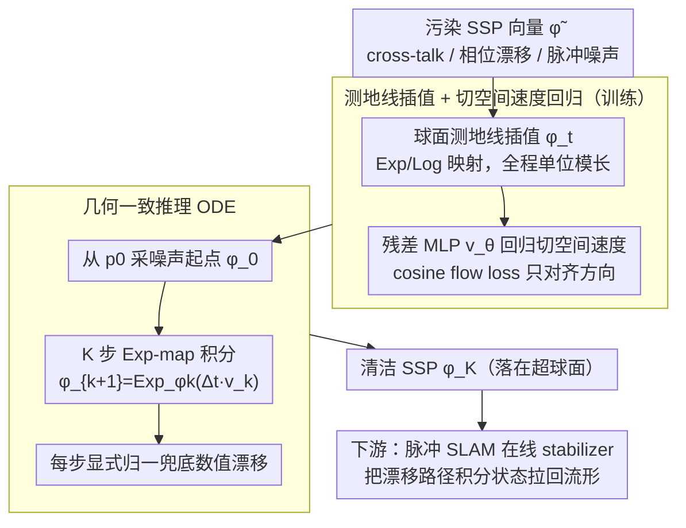

# Geodesic Flow Matching for Denoising High-Dimensional Structured Representations

**会议**: ICML 2026  
**arXiv**: [2606.00248](https://arxiv.org/abs/2606.00248)  
**代码**: https://github.com/kremHabashy/CleanupSSP  
**领域**: 表示学习 / 流匹配 / 神经符号 / 流形几何  
**关键词**: 测地线流匹配、空间语义指针 SSP、Clifford 超环面、神经符号清理、脉冲神经 SLAM

## 一句话总结
针对 Vector Symbolic Architecture 里 Spatial Semantic Pointer 这种"被嵌进单位超球面 Clifford 超环面"的高维结构化表示，作者指出标准 Flow Matching 的欧氏直线插值会从球面内部"穿心而过"导致幅值塌缩、相位毁掉，于是用 Log/Exp 映射把流约束在球面上做 **Geodesic Flow Matching (GFM)**，在脉冲神经 SLAM 上把路径误差降低 72%，并让 1500 神经元的路径积分器达到 2500 神经元 baseline 的精度。

## 研究背景与动机

**领域现状**：Vector Symbolic Architecture (VSA, 这里聚焦 Plate 95 的 HRR) 把符号编成高维向量，靠 bundling (加)、binding (循环卷积) 做组合推理；Spatial Semantic Pointer (SSP) 在此之上把连续坐标 $x\in\mathbb{R}^m$ 用傅里叶相位 $\tilde\phi(x)_j=e^{i\langle\theta_j, x\rangle}$ 编进 $d>1000$ 维向量，得到一种"位置-向量"的连续认知地图，可用于路径积分、SLAM、海马-内嗅模型。所有 VSA 系统都依赖一个关键步骤 — **cleanup**：把被 cross-talk、相位漂移、脉冲噪声污染过的向量"打回"到合法表示流形上。

**现有痛点**：传统 cleanup 走两条路。一是离散原型 (Hopfield 网络)，对连续 SSP 不适用；二是 grid lookup + L-BFGS 优化，要么受网格分辨率限制规模爆炸，要么在高噪声下被"吸"进错原型 (snap to wrong prototype) 而崩。最近有人把扩散/流匹配看成现代意义上的连续 associative memory，但直接搬过来有两大问题：(a) 扩散要几十上百步采样，机器人 SLAM 这种低延迟场景吃不消；(b) Conditional Flow Matching (CFM) 虽然把它压成确定性 ODE 几步搞定，但**假设的是欧氏几何**。

**核心矛盾**：SSP 的合法状态不是欧氏空间里的任意点，而是约束在 Clifford 超环面 $\subset \mathbb{S}^{d-1}$ 上 — 每个傅里叶分量 $e^{i\langle\theta_j,x\rangle}$ 都必须保持单位模长。CFM 用 $\phi_t=(1-t)\phi_0+t\phi_1$ 的直线插值，对应球面上两点的**弦**而不是测地线，中间时刻 $\|\phi_t\|<1$，向量幅值塌缩、相位被毁。论文实测：欧氏 CFM 在高噪声下产出一个看起来"像合法 SSP"但**空间位置已经偏移**的状态 (Figure 4b)，因为相位被破坏了。

**本文目标**：(i) 提供一种针对 SSP 这种"超环面在超球面里嵌套"的高维结构化表示的 cleanup 方法；(ii) 用 few-step ODE 推理而不是扩散迭代；(iii) 在真正的脉冲神经 SLAM 闭环里验证 cleanup 价值。

**切入角度**：Chen & Lipman 2024 已经把流匹配推广到一般 Riemannian 流形 (Riemannian Flow Matching)，但只在低维 + 高斯先验上玩过。本文的赌注是：把这套 Log/Exp 映射机制硬推到 $d>1000$、目标分布是网格化 SSP 编码的极高维非高斯场景，几何先验带来的收益会**随维度增长而稳定为正**。

**核心 idea**：把 CFM 里 $\phi_t = (1-t)\phi_0 + t\phi_1$ 替换为球面测地线 $\phi_t = \mathrm{Exp}_{\phi_0}(t\cdot \mathrm{Log}_{\phi_0}(\phi_1))$，速度场 $v_\theta$ 只回归切空间向量，保证整条采样轨迹永远贴在 $\mathbb{S}^{d-1}$ 上，从根上保住相位结构。

## 方法详解

### 整体框架
GFM 要解决的事，是给被污染的 SSP 向量做 cleanup，但它换了个看问题的角度：不再在嵌入域里离散搜索最近原型，而是把 cleanup 当成一个**从噪声分布 $p_0$ 到合法 SSP 分布 $p_1$ 的生成式 transport 问题**，并强制整条搬运轨迹始终贴在单位超球面 $\mathbb{S}^{d-1}$ 上。

整个 pipeline 顺下来是这样：输入端拿到一个被 cross-talk、相位漂移、脉冲噪声污染的向量 $\tilde\phi\in\mathbb{R}^d$，它近似服从 $p_0$ —— 超球面上的各向同性高斯，即采 $z\sim\mathcal{N}(0,I_d)$ 再归一成 $\phi_0=z/\|z\|$。训练阶段，对每个时间步 $t\sim\mathcal{U}[0,1]$，不走欧氏直线而是沿球面测地线把 $\phi_0$ 插值到合法 SSP $\phi_1$ 得到中间态 $\phi_t$，再用一个残差 MLP $v_\theta(\phi_t,t)$ 去回归这一点上的切空间速度。推理阶段，从 $p_0$ 采一个噪声起点 $\phi_0$，跑 $K$ 步建在 Exp-map 上的 ODE 积分 $\phi_{k+1}=\mathrm{Exp}_{\phi_k}(\Delta t\,v_k)$，每步再显式归一兜底数值漂移，最终输出的 $\phi_K$ 就是落在 $\mathbb{S}^{d-1}$ 上、能被 unbinding/decoder 正确解码出空间坐标的清洁 SSP。

更下游，这个 cleanup 被当成**在线 stabilizer** 插在脉冲路径积分器 (path integrator, PI) 和 VSA 地图之间：每隔一段时间把漂移的 PI 状态拉回流形，再去做 landmark binding，从而把 SLAM 闭环稳住。

（图中训练分支与推理分支分别对应设计 2、设计 3；设计 1 是支撑两者的几何失败诊断，是动机而非数据流节点。）

### 关键设计

**1. 几何失败诊断：先证明欧氏 CFM 在 SSP 域必然崩**

论文把方法的起点放在一个诊断上 —— 标准 Conditional Flow Matching 不是对 SSP "不够好"，而是会从根上失败。它先把 SSP 的噪声来源形式化成三种各不相同的分布：bundling 叠加引入的 cross-talk 是 $\epsilon\sim\mathcal{N}(0,\tfrac{n-1}{d}I_d)$，recurrence 累积出的相位漂移在圆上服从 $\mathrm{WrappedNormal}(0,t\sigma^2)$，脉冲群体的解码噪声尺度则是 $\sigma^2 d/N_{tot}$。在此之上，问题出在 CFM 的目标速度场 $u_t=\phi_1-\phi_0$ 对应的是两点间的**弦**而非测地线：弦插值在 $t\in(0,1)$ 时必有 $\|\phi_t\|<1$，而这恰好破坏了傅里叶相位 $e^{i\langle\theta_j,x\rangle}$ 赖以存在的"单位模长"。

为什么这是硬伤而非小瑕疵？因为 SSP 的空间信息全编在相位里，模长一塌、相位就毁。论文用 SSP 的相似度核可视化 (Figure 4b) 把这条因果链摆出来：欧氏流产出的向量在空间域上**位置已经偏了**，但形状还像个合法 SSP —— 这正是"幅值塌缩 → 相位漂移 → 解码到错坐标"的连锁反应。把这个诊断放在 method 之前，GFM 的几何约束就不是锦上添花的 inductive bias，而是对症下药。

**2. 测地线插值 + 切空间速度回归：让训练目标永远是合法切向量**

针对上面那条"模长一塌相位就毁"的痛点，GFM 用 Log/Exp 映射把整个概率路径搬到球面上。训练插值改成 $\phi_t=\mathrm{Exp}_{\phi_0}(t\cdot\mathrm{Log}_{\phi_0}(\phi_1))$，也就是连接 $\phi_0,\phi_1$ 的球面大圆弧，全程 $\|\phi_t\|=1$；目标速度 $u_t=\frac{d}{dt}\mathrm{Exp}_{\phi_0}(tv)\big|_{v=\mathrm{Log}_{\phi_0}(\phi_1)}$ 就是这条弧上的瞬时切向，沿弧保持常速 $\|v\|$ 且永远正交于当前位置向量 —— 于是 $v_\theta$ 学到的永远是一个合法的切空间速度，不会把状态拽离流形。损失也换掉 MSE，改用 cosine flow loss

$$\mathcal{L}_{\cos}=1-\frac{v_\theta^\top \dot\phi_t}{\|v_\theta\|\,\|\dot\phi_t\|},$$

只惩罚方向偏差，因为 SSP 的语义编在角度上而非模长上，L2 会被无关的模长误差污染。工程上 Log 映射对内积 $\langle p,q\rangle$ 做 $[-1,1]$ 截断、对正交分量加 $\epsilon=10^{-8}$ 的 floor，避开对极点和重合点处的数值崩溃。这一步本质是把 Chen & Lipman 2024 的 Riemannian flow matching 直接拿来用，但挑了最贴合 SSP 结构的环境流形 $\mathbb{S}^{d-1}$ —— 虽然 SSP 严格意义上活在更紧的 Clifford 超环面上，外接超球面已足够把相位约束兜住。

**3. 几何一致的推理 ODE：把训练时的几何一路保到采样**

如果训练在球面、推理却退回欧氏直线走一步，前两步攒下的几何先验就全漏掉了，所以推理也必须沿测地线走。GFM 从 $\phi_0\sim p_0$ 出发，每步用 $\phi_{k+1}=\mathrm{Exp}_{\phi_k}(\Delta t\,v_\theta(\phi_k,t_k))$ 更新，再补一次显式归一 $\phi_{k+1}\leftarrow\phi_{k+1}/\|\phi_{k+1}\|$ 兜底数值漂移，典型几十步 $K$ 就能从噪声端走到清洁端，比扩散动辄上百步便宜得多。更重要的是 Exp-map 更新自带"切向不会把状态推出流形"的性质，使 GFM 在 SLAM 闭环里可以当成**连续 attractor field** 而不是离散投影 —— 这正是 cleanup 模块能被插进递归回路、却不破坏积分动力学的关键 (5.4 节验证)。

### 损失函数 / 训练策略
- Loss：cosine flow loss (Eq. 10)，只对齐方向。
- $v_\theta$ 是 3 个 ResBlock 的残差 MLP：每个 block 两层 Linear + GELU + Dropout(0.1) + LayerNorm，宽度按 bottleneck schedule $2d\to d,\ 4d\to d,\ 2d\to d$；时间用 32 维 sinusoidal 嵌入拼到输入。
- 训练样本：clean SSP 用 Sobol 准随机采样保证空间域均匀覆盖；noise 用 $\mathcal{N}(0,I_d)$ 投影到球面。
- 不同方法用各自几何生成中间 $\phi_t$：欧氏 CFM 故意**不**做球面投影 (这种内部穿越正是要研究的失败模式)，GFM 用 Eq. 9 的测地线。

## 实验关键数据

### 主实验

下表汇总核心 SLAM 结果 (Table 1, RMSE 单位米, 越小越好)，重点看 1500 神经元这一资源受限场景：

| PI 神经元数 | 方法 | RMSE (m) | 说明 |
|------------|------|----------|------|
| 1000 | Grid | 0.586 ± 0.121 | 离散网格 cleanup，分辨率不够 |
| 1000 | Euclidean FM | 0.449 ± 0.068 | 欧氏直线插值 |
| 1000 | **Geodesic FM** | **0.162 ± 0.055** | 比 Grid 降 72%，比 Euclidean 降 64% |
| 1500 | Grid | 0.249 ± 0.239 | 方差极大，偶尔崩 |
| 1500 | Euclidean FM | 0.204 ± 0.103 | |
| 1500 | **Geodesic FM** | **0.076 ± 0.026** | **比 Grid 降 72%**，且方差小一个量级 |
| 2500 | Grid | 0.083 ± 0.017 | 神经元够多了，Grid 才追上来 |
| 2500 | **Geodesic FM** | **0.078 ± 0.009** | |

跨方法 cleanup benchmark (Figure 2/3, $d=1015$)：欧氏 FM 在高噪声下 cosine similarity 急剧下滑；GFM-vs-Euclidean 的优势随维度从 $d\approx 50$ 急升，到 $d\approx 200$ 稳定，$d>500$ 保持 $\sim 10\%$ 的正 gap。

### 消融实验

| 配置 | 关键指标 | 说明 |
|------|---------|------|
| Geodesic Flow (full) | 1500 神经元 RMSE 0.076m | 完整模型 |
| Euclidean Flow (换插值) | 1500 神经元 RMSE 0.204m | 把测地线换回直线，路径误差涨 ~2.7× |
| Feedforward Regression (无 flow) | 输出空间分布弥散 (Figure 4c) | 没有 ODE 迭代引导，回归塌缩到目标分布均值 — 输出像一团 bundle 而非单点 |
| Grid Lookup (非神经) | 高信号下接近完美，但 SLAM 中崩 | 离散 snap 在闭环里制造跳变，破坏 PI 动力学 |
| L-BFGS Optimization | 静态高信号 OK | 高噪声下被局部极值卡住 |

### 关键发现
- **测地线 vs 直线**才是性能差距的根源：把欧氏 FM 升级到 GFM，1500 神经元场景 RMSE 直接从 0.204m 砍到 0.076m。论文做了 Figure 4 的可视化把"为什么"讲透：欧氏流产出的 SSP 在空间域里**位置偏了**但形状还像 SSP — 验证了"幅值塌缩 → 相位毁掉 → 解码到错坐标"的因果链。
- **离散方法在闭环动力系统里特别脆**：Grid 在静态 benchmark 上很强 (高信号几乎完美)，一旦插进 SLAM 递归回路，每次"snap 到最近原型"造成不连续跳变，干扰速度积分，轨迹发散；GFM 提供连续 attractor field，把状态平滑拉回流形不打断积分。这是 4.1/5.3 节强调的"静态 benchmark 强不代表 closed-loop 能用"的核心证据。
- **几何先验的资源等价**：GFM + 1500 神经元 ≈ baseline + 2500 神经元，等于 cleanup 几何换来 40% 神经资源节省。对神经形态硬件部署有直接价值。
- 失败模式有 3 种且各不相同：Euclidean FM 是位置漂移 (相位毁)，Feedforward 是 bundle 弥散 (回归均值)，Grid 是离散跳变 (snap 错原型) — Figure 4 + Figure 5 是论文最有说服力的可视化。

## 亮点与洞察
- "诊断驱动方法"的写法值得学：第 3.3 节把三种噪声源 (cross-talk / phase drift / spike variability) 各自的分布形式 (Gaussian / WrappedNormal / 尺度 $\sigma^2 d/N$) 都写出来，然后 3.4 节再形式化欧氏 CFM 为什么必败，整个第 4 节的方法就成了"对症下药"，逻辑闭环极干净。
- 把 cleanup 重新定义为生成式 transport，是从"在嵌入域里离散搜索 (Hopfield / Grid)"到"在嵌入空间里连续流"的范式转移 — 论文 Conclusion 自己也强调了这一点，且这种视角对任何"语义编在方向上而非模长上"的 hyperspherical embedding 都适用 (Hyperspherical VAE / Prototype Net / 大模型 head 的 L2-normalized embedding)。
- Few-step ODE 推理 + 几何先验，等于在低延迟实时系统里第一次可用的"manifold-aware associative memory"。对 robotics、neuromorphic computing 这类对延迟 + 能效都极敏感的领域是真有用而不是 paper-only 的 trick。
- 一个可迁移的 trick：用 cosine flow loss 替代 MSE 来训练流匹配速度场，当语义只编在方向上时能避免被无关模长偏差污染 — 对超球面、normalized embedding 类任务都直接可用。

## 局限与展望
- 作者承认：目前 $v_\theta$ 是普通残差 MLP，要真上神经形态硬件还得用 snnTorch 转成全脉冲网络；网络架构本身没做资源优化，只是用来验证几何 transport 的有效性。
- 作者承认：当前框架严格绑定 hyperspherical 拓扑，对其他 VSA 家族 (Boolean hypercube $\{-1,+1\}^d$、复值傅里叶 HRR 活在 $(\mathbb{S}^1)^{d/2}$) 需要重新选 Log/Exp 映射。
- 自己看到的局限：SLAM 实验只在 2D 50 个 landmark、60 秒导航的合成场景里跑，没接真实里程计或视觉前端；GFM 步数 $K$ 与延迟、精度的 trade-off 曲线没系统给出；Cosine flow loss 与传统 MSE 的对比也缺一个直接 ablation；Figures 2-5 在主稿中只有定性截图描述，缺数值表。
- 改进思路：(i) 把 cleanup 直接做在 Clifford 超环面 (更紧的内禀流形) 而不是外接超球面，理论上能进一步压相位漂移；(ii) 让 $K$ 自适应噪声等级 — 干净输入只跑 1-2 步，重污染时延长；(iii) 把 GFM 当 plug-in 接到现代 LLM 的 normalized embedding 上做 retrieval cleanup，试试能否减轻 hallucination 中的"相似但错答"。

## 相关工作与启发
- **vs Conditional Flow Matching (Lipman 2022)**: CFM 假设欧氏几何 + 线性插值；本文证明在球面/环面表示上这是硬伤，必须换 Log/Exp。是 CFM 在结构化高维表示上的关键 patch。
- **vs Riemannian Flow Matching (Chen & Lipman 2024)**: RFM 提供了通用框架但只在低维 + 高斯目标上玩过；本文是第一个把 RFM 推到 $d>1000$、非高斯目标 (SSP) 的高维结构化表示，并在真实闭环系统里验证。
- **vs Grid / L-BFGS cleanup (Dumont 2023)**: 传统 SSP cleanup 是离散搜索或非凸优化；GFM 是生成式 transport，对高噪声鲁棒得多，更关键的是在 SLAM 闭环里**不破坏动力学**。
- **vs Hopfield / Modern Hopfield (Ramsauer 2020)**: 经典 associative memory 是离散原型；本文把生成式 denoising 当连续 attractor，符合 Hoover 2023 / Pham 2025 关于"生成 denoising 就是连续吸引子"的理论观点，并第一次给出 VSA 域的工程实现。
- **vs SO(3) diffusion in robotics (Braun 2024)**: 同样是"在非欧拓扑上做生成模型"，那边解的是旋转群轨迹生成，这边解的是高维 hyperspherical 表示 cleanup — 是同一思想 (manifold-aware generative transport) 在不同流形上的并行实例。

## 评分
- 新颖性: ⭐⭐⭐⭐ 第一个把 Riemannian flow matching 推到高维结构化神经符号表示，思路自然但角度有人没占。
- 实验充分度: ⭐⭐⭐ SLAM 主结果扎实 (3 种 baseline × 5 个神经元规模 × 多噪声等级)，但数据集偏合成、ODE 步数/延迟曲线缺、Figures 2-5 的定量数表没在主文中给出。
- 写作质量: ⭐⭐⭐⭐ 诊断 → 方法 → 实验的因果链极清晰，Figure 4 用空间域可视化把"幅值塌缩为何会变成位置偏差"讲到读者一看就懂。
- 价值: ⭐⭐⭐⭐ 对神经形态计算、神经符号 SLAM 是直接可落地的工程改进，对"语义编在方向上"的更广 hyperspherical embedding 也提供了 cleanup 范式。

<!-- RELATED:START -->

## 相关论文

- [\[CVPR 2026\] GeodesicNVS: Probability Density Geodesic Flow Matching for Novel View Synthesis](../../CVPR2026/3d_vision/geodesicnvs_probability_density_geodesic_flow_matching_for_novel_view_synthesis.md)
- [\[CVPR 2026\] HyperGaussians: High-Dimensional Gaussian Splatting for High-Fidelity Animatable Face Avatars](../../CVPR2026/3d_vision/hypergaussians_high-dimensional_gaussian_splatting_for_high-fidelity_animatable_.md)
- [\[CVPR 2026\] Optical Flow Matching: Reframing Optical Flow as Continuous Transport Dynamics](../../CVPR2026/3d_vision/optical_flow_matching_reframing_optical_flow_as_continuous_transport_dynamics.md)
- [\[ICML 2026\] SIMPC: Learning Self-Induced Mirror-Point Consistency for Unsupervised Point Cloud Denoising](simpc_learning_self-induced_mirror-point_consistency_for_unsupervised_point_clou.md)
- [\[CVPR 2026\] UniPixie: Unified and Probabilistic 3D Physics Learning via Flow Matching](../../CVPR2026/3d_vision/unipixie_unified_and_probabilistic_3d_physics_learning_via_flow_matching.md)

<!-- RELATED:END -->
