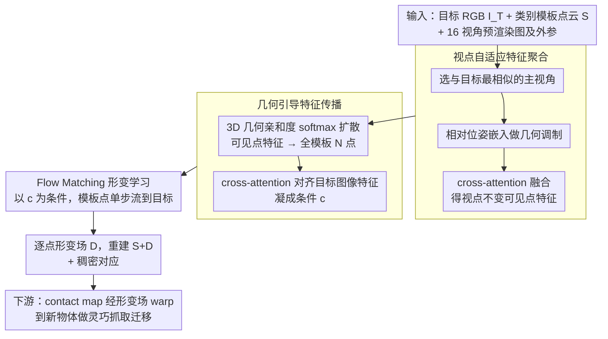

# Geometry-Guided Modeling of Foundation Features Enables Generalizable Object Shape Deformation Learning

**会议**: ICML 2026  
**arXiv**: [2605.29661](https://arxiv.org/abs/2605.29661)  
**代码**: https://GODeform.github.io/ (项目主页，代码状态待确认)  
**领域**: 3D视觉 / 单目形状重建 / 类别级形变  
**关键词**: 模板形变, 基础模型特征, 几何引导传播, 视点自适应, Flow Matching

## 一句话总结
本文提出 GODeform：把 2D 基础模型（DINOv3 类）特征"挂"到类别模板表面上做几何引导传播与跨视点融合，再用 Flow Matching 学一个从模板到目标的逐点形变场，从而在大形变、任意视角和未见类别上都能从单张图恢复 3D 形状，并直接服务于灵巧抓取迁移。

## 研究背景与动机

**领域现状**：单目 3D 形状恢复有两条主线。一条是生成式重建（LRM / Wonder3D / Phidias），追求高保真但严重依赖训练分布；另一条是"形变范式"——给一个类别模板，预测从模板到目标的形变场（ShapeMatcher、KP-RED 等），借模板的拓扑稳定遮挡区域的几何。

**现有痛点**：生成式方法在自遮挡区域常"幻觉"出不合理的几何，且对视角变化敏感；形变方法的视觉编码器多是小数据集从零训的，跨类别语义不稳，并且当目标和模板差异较大（如四脚椅 → 沙发、双层桌 → 单层桌）时，预测的形变场结构性退化，更别提推广到训练外的全新类别。

**核心矛盾**：形变需要在**模板的 3D 拓扑**与**目标的 2D 观测**之间建立逐点的精细对应。但 2D 基础模型只在图像可见面上有特征，没有 3D 几何先验；而 3D 基础模型受限于 3D 数据规模，泛化能力远不如 2D。两边各缺一半，直接拼起来又因为视角差异让语义对应失效。

**本文目标**：设计一个统一形变框架，同时满足三条泛化轴——大形变模板/目标差异、任意目标视角、未见物体类别——并能下游直接驱动机器人灵巧抓取。

**切入角度**：作者押的是"让 2D 基础特征变得几何感知"——把图像端的强语义对应能力，借模板的 3D 拓扑扩散到整个表面，再用相机位姿显式区分"视角伪差"和"真实形变"。

**核心 idea**：把形变学习重写为"以几何引导的基础特征为条件的 Flow Matching"，可见点的基础特征经几何亲和度扩散到全表面 + 多视角通过相对位姿融合成视点不变模板表征。

## 方法详解

### 整体框架
GODeform 要解决的是：只给一张目标 RGB，就能在大形变、任意视角、未见类别下恢复 3D 形状。它的整体思路是把"形变"重写成"以几何感知的基础特征为条件的逐点流动"——输入端是目标物体单张 RGB $I_{\mathcal{T}}$、一个类别级 3D 模板点云 $\mathcal{S} \in \mathbb{R}^{N\times 3}$，以及该模板的 16 个预渲染视角图 $\{I_{\mathcal{S}}^k\}$ 及其外参 $\{\mathbf{E}_{\mathcal{S}}^k\}$；输出端是逐点形变场 $\mathcal{D} \in \mathbb{R}^{N\times 3}$，重建结果 $\hat{\mathcal{T}} = \mathcal{S} + \mathcal{D}$，同时天然附带模板↔目标的稠密对应。

中间的转换分三步走。先在模板的 16 个视角里挑一个与目标语义最像的当主视角，再借相对相机位姿把其余视角的信息融进来，得到一份"视点不变"的可见点特征——这样网络后面看到的特征差才不会被相机角度污染。接着把这些只覆盖可见面的特征，通过 3D 几何亲和度扩散到模板全部 $N$ 个点（包括背面、遮挡区），并用 cross-attention 与目标图像特征对齐，凝成形变所需的条件 $\mathbf{c}$。最后以 $\mathbf{c}$ 为条件用 Flow Matching 学一个速度场，把模板点"流"到目标位置。形变被建成连续 ODE $d\phi_t/dt = \mathbf{v}_t(\phi_t \mid \mathbf{c})$，训练沿线性插值路径 $\mathbf{x}_t = (1-t)\mathbf{x}_0 + t\mathbf{x}_1$ 监督速度场 $v_\theta$；因为线性轨迹是常速度，推理时直接取 $t=0$ 一步出结果 $\mathcal{D} = v_\theta(\mathcal{S}, 0, \mathbf{c})$，约 0.67 s。

### 关键设计

**1. 视点自适应特征聚合：把"视角伪差"从"真实形变"里显式剥离**

同一 3D 结构从不同相机看，基础特征本就会变；模板视角固定、目标视角任意，这种"视点漂移"会被形变网络误当成形状变化。这一步先从 $K=16$ 个模板视角里选出与目标 $I_{\mathcal{T}}$ 在 DINOv3 特征空间余弦相似度最高的主视角 $I_{\mathcal{S}}^*$，作为锚点。再计算其余各视角相对主视角的相机变换 $\mathbf{P}_{\text{rel}}^k = (\mathbf{E}_{\mathcal{S}}^*)^{-1} \mathbf{E}_{\mathcal{S}}^k$，把旋转加平移展平成 $\mathbb{R}^{12}$ 向量后线性投影成位姿嵌入 $\mathbf{e}^k$，加到对应视角的可见点特征上做"几何调制"，等于明确告诉网络"这块特征是从哪个相机角度拍的"。最后用 cross-attention 融合：主视角特征作 query、所有视角特征拼接作 key/value，得 $\mathbf{F}_{\text{fused}}$，残差回主视角 $\tilde{\mathbf{F}}_{\text{partial}} = \mathbf{F}_{\text{fused}} + \tilde{\mathbf{F}}_{\text{primary}}$。这样位姿引起的特征差就被显式编码出来、与形状形变分开。消融里去掉主视角选择或位姿感知后，这两种"朴素多视角融合"反而比单视角还差，说明乱融多视角只会污染信号，主视角锚定加位姿调制才是赚到多视角红利的前提。

**2. 几何引导特征传播：让只看得见正面的语义贯穿整个 3D 表面**

上一步得到的视点不变可见点特征只覆盖图像可见面，模板背面、自遮挡区一片空白。如果直接把这种"半张脸"的特征喂给形变网络，遮挡区就成了无信号区，模板拓扑非但帮不上忙反而成了拖累。这一步把可见表面（$M$ 个点）上的基础特征 $\mathbf{F}_{\text{vis}}$ 扩散到完整模板的 $N$ 个点，得到 $\mathbf{F}_{\text{complete}} \in \mathbb{R}^{N\times D}$。做法是另用一个轻量 3D 编码器对完整模板算几何嵌入 $\mathbf{G} \in \mathbb{R}^{N\times d}$，以此衡量可见点 $i$ 与任意点 $j$ 的几何相似度 $S_{ji} = \mathbf{g}_j \cdot \mathbf{g}_i / (\|\mathbf{g}_j\|\|\mathbf{g}_i\|)$，再用温度 $\tau$ 的 softmax 把语义按几何相似度加权摊过去：

$$\mathbf{f}_j^{\text{complete}} = \sum_i \frac{\exp(S_{ji}/\tau)}{\sum_k \exp(S_{jk}/\tau)}\, \mathbf{f}_i^{\text{vis}}$$

直觉就是"几何近似的点共享语义"——椅腿背面没看到，就借几何相似的正面椅腿的语义，于是遮挡区也拿到了有方向性的形变指引。值得强调的是，这套机制不依赖任何 3D 基础模型预训练，只靠一个小 3D encoder 算亲和度即可。得到完整模板特征后，再用 cross-attention 把它当 query 去检索目标图像特征 $\mathbf{F}_{\mathcal{T}}$（作 key/value），输出对齐特征 $\mathbf{F}_{\text{aligned}}$ 充当 Flow Matching 的条件。

**3. Flow Matching 形变学习：用连续流替代一次性回归 offset**

复杂大形变下直接回归一个 offset 容易不稳。这一步把形变看成"在条件 $\mathbf{c}$ 下从模板分布到目标分布的连续轨迹"：训练时在 $\mathbf{x}_0 = \mathcal{S}$ 与 $\mathbf{x}_1 = \mathcal{T}$ 之间线性插值，监督速度场对齐 $\mathbf{u}_t = \mathbf{x}_1 - \mathbf{x}_0$（即 Flow Matching 损失 $\mathcal{L}_{\text{FM}}$）。由于线性轨迹常速度，推理可直接在 $t=0$ 一步采样出形变，理论上等价单步 rectified flow，既快又省去迭代 ODE 求解。把形变视作连续流相当于给优化引入了更平滑的几何插值假设，处理拓扑差异更有韧性——消融里换成直接回归（w/o FM），Random Template 上 CD 从 2.46 升到 2.74，印证了这一选择的必要性。

### 损失函数 / 训练策略
总损失把多种几何正则一并加进来：$\mathcal{L} = \lambda_{\text{FM}}\mathcal{L}_{\text{FM}} + \lambda_{\text{CD}}\mathcal{L}_{\text{CD}} + \lambda_{\text{Lap}}\mathcal{L}_{\text{Lap}} + \lambda_{\text{ARAP}}\mathcal{L}_{\text{ARAP}} + \lambda_{\text{reg}}\mathcal{L}_{\text{reg}} + \lambda_{\text{sil}}\mathcal{L}_{\text{sil}}$，其中 Chamfer 管全局对齐、Laplacian 管局部连续、ARAP 管局部刚性、reg 限制形变幅值、silhouette 管多视角剪影一致性。训练用 ShapeNetv2 七类（chair/table/airplane/car/cabinet/bowl/bottle），每类抽 500 个 shape，其中 50 个当模板池；目标视角对每个目标只随机采一个角度，自然带自遮挡难度。统一一个模型跨所有类别，与按类别训的 baseline 形成对比。

## 实验关键数据

### 主实验
两个评测设定：Retrieved Template（按 DINOv3 余弦取最相似模板）vs Random Template（随机抽模板，制造大形变）。ShapeMatcher / KP-RED 是按类别训的；GODeform 是统一一个模型。Our-SV 用单视角模板，Our-MV 是完整多视角融合。

| 数据集 / 设定 | 指标 | 本文 Our-MV | KP-RED | ShapeMatcher | 备注 |
|--------|------|------|----------|----------|------|
| Seen / Retrieved | CD $(10^{-3})$ ↓ | **2.38** | 3.05 | 5.92 | 检索模板下也比 KP-RED 强 22% |
| Seen / Retrieved | S-IoU (%) ↑ | **48.79** | 46.73 | 40.47 | |
| Seen / Random | CD $(10^{-3})$ ↓ | **2.46** | 5.10 | 13.02 | 随机模板下 KP-RED CD 翻倍，本方法基本持平 |
| Seen / Random | S-IoU (%) ↑ | **47.31** | 42.05 | 34.36 | |
| Unseen / Retrieved | CD $(10^{-3})$ ↓ | **3.69** | N/A | N/A | baseline 不支持跨类别 |
| Unseen / Random | S-IoU (%) ↑ | **52.57** | N/A | N/A | 未见类别仍维持 ~52% S-IoU |

最值得看的是 Random Template 列：baseline 一旦换成不相似模板就崩（KP-RED CD 从 3.05 涨到 5.10，ShapeMatcher 从 5.92 直接到 13.02），而 GODeform 几乎不掉（2.38 → 2.46）。这才是"几何引导基础特征"真正解决的问题——对模板选择鲁棒。

### 消融实验
| 配置 | CD ($10^{-3}$, Retrieved) | CD ($10^{-3}$, Random) | S-IoU (%, Random) | 说明 |
|------|---------|---------|---------|------|
| Our-MV (Full) | **2.38** | **2.46** | **47.31** | 完整模型 |
| w/o FM | 2.66 | 2.74 | 43.57 | 改用直接回归，CD 升 11%，验证 Flow Matching 必要性 |
| w/o Prop. | 2.74 | 2.95 | 41.10 | 遮挡点用 mean 填充，掉得最多 |
| w/o Rel. | 2.56 | 2.70 | 44.67 | 去掉 cross-attention 对齐，改用 FiLM 全局广播 |
| w/o PrimSel. | 2.64 | 2.84 | 44.40 | 多视角融合时不选主视角，用均值 query |
| w/o PoseAware. | 2.60 | 2.79 | 44.47 | 多视角直接平均，无位姿嵌入 |
| Our-SV | 2.45 | 2.61 | 46.78 | 仅用单视角模板，仍打过所有 baseline |

### 关键发现
- **几何传播是命门**：w/o Prop. 在所有指标上掉幅最大（Random S-IoU 47.31 → 41.10），说明只在可见点上挂特征、其余点丢空，会让形变网络"瞎猜"遮挡区域。
- **多视角融合必须有方法**：w/o PrimSel 和 w/o PoseAware 这两种"朴素多视角"反而不如 Our-SV（单视角）——直接平均多视角特征会引入视点污染，必须靠主视角锚定 + 位姿调制才能赚到多视角的好处。
- **下游落地**：在 Isaac Gym 用 Shadow Hand 做灵巧抓取迁移，形变 0.67 s + 抓取优化 15 s；真实世界 NAVIAI AW-1 机器人在 bowl/bottle/mug/lotion pump 四类上达 77% 抓取成功率，验证了"稠密对应"这个副产品的工程价值。

## 亮点与洞察
- **把"基础特征几何感知化"做成显式机制而非隐式融合**：相比把 DINO 特征直接 concat 进 3D 网络，本文用"3D 几何亲和度作传播桥"的设计很优雅——不依赖任何 3D 基础模型预训练，只用一个轻量 3D encoder 算亲和度，就把 2D 强语义"摊"到整个表面。这个思路完全可以迁到 6D pose estimation、part segmentation、affordance 预测等所有"图像有语义但表面要稠密标签"的任务上。
- **位姿嵌入 + 主视角选择**的组合避免了"多视角即更好"的天真假设。消融里"乱融比单融差"是个反直觉发现，提醒我们多视角融合必须有显式的几何锚定。
- **形变得到稠密对应这件事被作者真正"用起来"**：直接把模板上的 contact map 通过形变场 warp 到新物体，免去单独训抓取模型——这是形变范式相对生成范式的本质优势，被这篇做得很彻底。
- **单步 Flow Matching 推理**：把 rectified flow 的线性轨迹假设利用到极致，0.67 s 出形变，工程上比迭代式 ODE 求解友好得多。

## 局限与展望
- 作者承认的局限：单视角输入本身 ill-posed，目标关键区域完全遮挡时（如杯把全藏在背面）模型缺乏 2D 形变线索，会有几何错位（论文 A.8）。
- 自己看到的局限：需要每个目标类别有预先准备的模板池（每类约 50 个模板），对完全没有先验拓扑可参照的"自由形态"物体（如柔体、生物）不直接适用；多视角模板（16 个）的离线渲染对开放世界部署是个 overhead。
- ShapeNet + OakInk 的"未见类别"评测仍是合成数据，real-world 抓取实验只在 4 类常见物体（且都有规整几何）上做，对透明/反光/极端形变物体的鲁棒性没回答。
- 改进方向：作者已提到扩展到多视角目标输入和引入 VLM 语义先验；个人补充——把 3D encoder 也换成预训练大模型（如 Sonata/Point-LLM 类），亲和度计算从 cosine 换成可学的相似度，可能在跨类别时更稳。

## 相关工作与启发
- **vs ShapeMatcher (Di et al., CVPR'24)**：都做模板形变，但 ShapeMatcher 依赖检索质量且按类别训。本文用基础模型特征+几何传播，统一模型在 Random Template 下 CD 优 81%（13.02 → 2.46）。
- **vs KP-RED (Zhang et al., 2024)**：KP-RED 用关键点驱动稀疏形变；本文用稠密点级 Flow Matching，捕获细节更好，且不需 GT depth 输入。
- **vs Phidias / LRM / Wonder3D**：生成式方法在遮挡区域常幻觉（如缺失的桌腿、杯把），本文靠模板拓扑兜底，保证类别级几何合理性。代价是依赖模板池。
- **vs FreeZe / VFM-pose (Caraffa, Chen et al.)**：同样思路是"用 2D 基础特征做 3D 任务"，但 FreeZe 等做的是 pose estimation；本文把这套思路推广到了"形变"这个更难的稠密预测任务，几何传播机制是关键差异。
- **启发**：任何"图像端有强大基础模型，3D 端没有"的任务，都可以套这个"特征上挂 + 几何亲和度传播 + 视点位姿调制"的三段式 recipe。

## 评分
- 新颖性: ⭐⭐⭐⭐ — Flow Matching + 几何传播 + 视点融合的组合是新的，但每个零件（基础特征用于 3D、模板形变、多视角融合）单独都不新；亮点在整合得很合理且消融充分。
- 实验充分度: ⭐⭐⭐⭐⭐ — Seen / Unseen × Retrieved / Random 四象限对比 + 6 个消融变体 + 真实机器人 77% 抓取成功率，闭环完整。
- 写作质量: ⭐⭐⭐⭐ — 公式与图表组织清晰，但部分模块（如 Flow Matching 训练细节、损失权重）压到附录，主文里"为什么 ARAP/silhouette 必要"略带过。
- 价值: ⭐⭐⭐⭐⭐ — 解决了形变范式的两大死穴（跨类别 + 大模板差异）并直接服务于机器人抓取，对具身智能 pipeline 有直接工程价值。

<!-- RELATED:START -->

## 相关论文

- [\[CVPR 2026\] SGSoft: Learning Fused Semantic-Geometric Features for 3D Shape Correspondence via Template-Guided Soft Signals](../../CVPR2026/3d_vision/sgsoft_learning_fused_semantic-geometric_features_for_3d_shape_correspondence_vi.md)
- [\[NeurIPS 2025\] Learning Generalizable Shape Completion with SIM(3) Equivariance](../../NeurIPS2025/3d_vision/learning_generalizable_shape_completion_with_sim3_equivariance.md)
- [\[CVPR 2026\] Online3R: Online Learning for Consistent Sequential Reconstruction Based on Geometry Foundation Model](../../CVPR2026/3d_vision/online3r_online_learning_for_consistent_sequential_reconstruction_based_on_geome.md)
- [\[ICML 2026\] FoundObj: Self-supervised Foundation Models as Rewards for Label-free 3D Object Segmentation](foundobj_self-supervised_foundation_models_as_rewards_for_label-free_3d_object_s.md)
- [\[CVPR 2026\] Exploring 6D Object Pose Estimation with Deformation](../../CVPR2026/3d_vision/exploring_6d_object_pose_estimation_with_deformation.md)

<!-- RELATED:END -->
