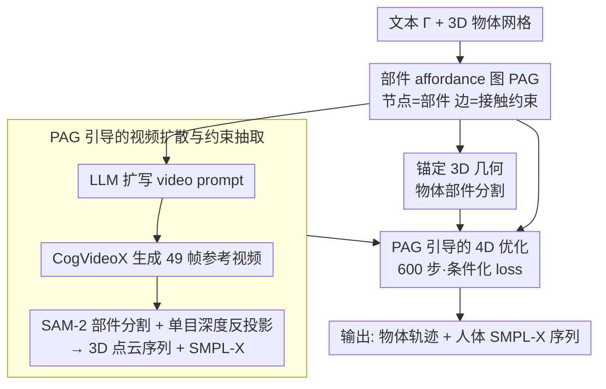

# HOI-PAGE: Zero-Shot Human-Object Interaction Generation with Part Affordance Guidance

**会议**: ICML 2026  
**arXiv**: [2506.07209](https://arxiv.org/abs/2506.07209)  
**代码**: https://craigleili.github.io/projects/hoipage (项目主页)  
**领域**: 3D视觉 / 人-物交互生成 / 视频扩散  
**关键词**: 4D HOI、部件级 affordance、affordance 图、视频扩散蒸馏、零样本生成

## 一句话总结
HOI-PAGE 让 LLM 先"想清楚"身体哪个部位该接触物体哪个部件，把推理结果写成一张「部件 affordance 图」(PAG)，再用它去驱动 3D 部件分割、视频扩散和优化求解，从而在零样本、零 4D 训练数据的条件下生成可处理"多人单物 / 单人多物"等复杂场景的 4D 人-物交互序列。

## 研究背景与动机
**领域现状**：4D 人-物交互 (HOI) 生成的主流路线是扩散模型（HOI-Diff、CHOIS 等），把人体和物体的整体运动作为联合 token 一起去噪。这些方法依赖 BEHAVE、GRAB 等真值 4D 抓取/搬运数据训练，物体词表很窄，几乎只覆盖"单人单物"场景。

**现有痛点**：训练数据采集昂贵且稀缺，泛化到新物体（如吉他、割草机）时人体往往"飘在物体附近"，出现明显穿模、接触不上、动作和文本不匹配；多人或多物体场景几乎无法处理，因为接触关系数量随对数增长。

**核心矛盾**：HOI 的本质不是"人的质心靠近物体质心"，而是"特定身体部位 ↔ 特定物体功能部件"之间的精细接触（手握把柄、脚踩踏板）。整体姿态级建模丢掉了这层部件级语义，缺乏数据时学不出来，有数据时也只能记住分布而非推理。

**本文目标**：在不依赖任何 4D HOI 训练数据的前提下，从一句文本和若干 3D 物体出发，生成对"哪个手接哪个把手"这种部件级 affordance 显式建模、可扩展到多人多物的 4D 序列。

**切入角度**：LLM 已经具备关于日常交互的常识知识（迭代衣服时哪只手握底板、哪只手按底面）。如果把这种语言空间的"接触剧本"显式落地成图结构，再分别落到 3D 几何 / 视频 / 优化，就能把视觉-动作生成的负担分摊到"已有的强先验组件"上。

**核心 idea**：用 LLM 推理出**部件 affordance 图 (PAG)** 作为整套 pipeline 的脚本——节点是部件、边是接触约束，让 PAG 统一指挥 3D 物体部件分割、视频扩散提示、4D 优化的接触/穿模/平滑各项 loss。

## 方法详解

### 整体框架
HOI-PAGE 要解决的是：在没有任何 4D HOI 真值数据的前提下，从一句文本和几个 3D 物体网格出发，生成"哪只手握哪个把手"这种部件级精细交互的 4D 序列。它的破题思路是不让任何单一模型一口气端到端地解决全部问题，而是把"常识剧本—视觉运动—几何精度"拆给三种各自最擅长的组件分头处理，再用一张图把它们串起来。

整条 pipeline 从一句文本 $\Gamma$（如"一个人在熨衣板上熨衣服"）加一组 3D 物体网格 $\{O\}$ 入手，先让 LLM 推理出一张**部件 affordance 图 (PAG)**，把"哪个部件接哪个部件、接触是否持续、物体是否移动"全写成图上的节点和边；这张图随即兵分三路——锚定到 3D 几何上做部件分割、扩写成 prompt 驱动视频扩散生成参考视频、再当成硬约束指挥最后一步优化。视频扩散负责"人和物大致怎么动"，单目深度和人体恢复把视频切片成 2D/3D 点云与 SMPL-X 序列，最后一步 600 步梯度下降在 PAG 约束下把物体姿态"校正"出来。最终输出每个物体的轨迹 $\{(R_t, t_t)\}_{t=1}^{T}$（$T=49$ 帧）和每个人体的 SMPL-X 参数 $\{\Theta_t\}_{t=1}^{T}$。值得强调的是，这四个阶段里**只有最后一步是可调的，LLM、视频扩散、深度估计、人体恢复、SAM-2 全部冻结**，这正是它"zero-shot"的由来。

### 关键设计

**1. 部件 affordance 图 (PAG)：把 HOI 的语义约束从端到端学习里剥出来，交给 LLM 推理**

HOI 生成最难的地方在于，它的本质不是"人的质心靠近物体质心"这种姿态级分布，而是一组组离散的部件级约束——手握把柄、脚踩踏板——这层语义在缺数据时根本学不出来。PAG 的做法是把这些约束全部显式压成一张图 $G=(V,E)$，作为后续所有阶段的统一控制信号。节点 $V=V_o \cup V_h$ 同时包含物体部件和 12 类人体部件（左右手、左右脚、髋等），并为每个物体/人挂一个虚拟父节点 $v$，携带两个运动状态 $(a_r, a_\tau)$ 标记它是否旋转、是否平移；每条边 $e=(v_1,v_2)$ 代表一次部件级接触，带两个属性 $(a_c, a_s)$：$a_c$ 表示接触是否在整段视频中**持续**，$a_s$ 表示接触是否**相对静止**（手始终握住把手 vs. 熨斗在板上来回滑）。整张图由 LLM（DeepSeek 系）用 in-context 推理一次性给出——作者也试过让 VLM 直接看物体图，但发现 VLM 经常忽略视觉输入或产生幻觉，反而不如纯 LLM 稳。

这一步的价值在于把"常识推理"和"几何执行"彻底解耦：原本"没有 4D 数据就学不会交互"的难题，被转化成"几何优化怎么满足一张图的约束"这个可解的问题；而且图结构天然可扩展，多人/多物场景只需往图里加节点和边，整套 pipeline 一行不改。

**2. PAG 引导的视频扩散与约束抽取：让扩散承担"怎么动"，但只当软参考**

光有一张约束图还不够，系统需要知道人和物大致怎么运动，这件最难的事被交给视频扩散来做。具体做法是用 LLM 把原文本 $\Gamma$ 结合每条边的接触类型扩写成更细致的 video prompt $\Gamma^+$（如"右手始终紧握把手，左手按住底面"）喂给 CogVideoX；同时用 FLUX 生成 5 张首帧候选、让 GPT-4.1 挑解剖结构最合理的一张作锚定，再扩散出 49 帧参考视频。拿到视频后，按 PAG 里的部件名做开放词表检测加 SAM-2 部件级分割，得到每帧每部件的 2D mask，用单目深度估计（Wang et al. 2024）把 mask 反投影成 3D 部件点云序列，并用 Shen et al. 2024 的方法抽出人体 SMPL-X 序列 $\{\Theta_t\}$。

需要注意的是，这里得到的人体动作是"孤立"的，物体姿态还没解出来，且视频本身的几何精度不够。所以视频在这里只扮演"软参考"——它告诉系统大致的运动，真正把物体姿态钉准的工作留给下一步用 PAG 的硬约束来完成。这种分工同时绕开了"视频模型几何不准"和"几何模型语义不够"两难。

**3. PAG 引导的 4D 优化：用同一套条件化 loss 把视频"提升"成 4D**

最后一步要求解每个物体的轨迹 $\{(R_t, t_t)\}_{t=1}^{T}$，让它同时拟合视频中的 2D/3D 观察、满足 PAG 每条边的接触约束、不与人体穿模、并保持时序平滑。这通过四项 loss 加权求和实现：

$$L_{\text{total}} = \lambda_{\text{fit}} L_{\text{fit}} + \lambda_{\text{con}} L_{\text{con}} + \lambda_{\text{pen}} L_{\text{pen}} + \lambda_{\text{smo}} L_{\text{smo}}$$

其中 $L_{\text{fit}}$ 是物体级 + 部件级、2D + 3D 的 Chamfer 距离；接触项 $L_{\text{con}} = L_{cc} + L_{cd}$，$L_{cc}$ 在 $a_c=\text{true}$ 时取所有帧最近邻平均、在 $a_c=\text{false}$ 时只取最小帧（一次性接触），接触动力学项 $L_{cd}$ 在 $a_s=\text{true}$ 时惩罚相邻帧相对位移、在 $a_s=\text{false}$ 时用 $L_2\big(P_t^{v_2 \to v_1}, \tfrac{1}{2}(P_{t-1}^{v_2 \to v_1}+P_{t+1}^{v_2 \to v_1})\big)$ 鼓励平滑变化；$L_{\text{pen}}$ 用预计算 SDF 惩罚人体顶点穿入物体；$L_{\text{smo}}=L_r+L_\tau$ 则按 PAG 中 $(a_r, a_\tau)$ 在"球面线性平滑"和"惩罚一切变化"两种模式间切换。

这里 PAG 的威力才真正显现：所有 loss 都由图的属性"按边/按节点条件化"——同一份代码靠 $a_c/a_s/a_r/a_\tau$ 四个布尔属性切换，既能处理"持续紧握"也能处理"短暂触碰"，既能处理"物体静止"也能处理"物体随人移动"，无须为不同交互改实现。优化跑 600 步梯度下降，单物体约 6 分钟、双物体约 10 分钟（A100），并用 4 个绕重力轴的初始旋转重复求解以避开 Chamfer 的局部极小。

### 损失函数 / 训练策略
全程**无任何模型训练**，只有最后一步对物体位姿做优化，LLM、视频扩散、深度估计、人体恢复、SAM-2 全部冻结。优化取 4 次随机初始化中的最优解；CogVideoX 用 50 去噪步、生成 49 帧视频；四项 $\lambda$ 权重由经验设定（论文附录给出）。

## 实验关键数据

### 主实验
作者自建 Sketchfab 数据集（24 个日常 3D 物体 + 16 单人单物 prompt + 5 个多人/多物 prompt），与依赖 4D 真值训练的 HOI-Diff 和 CHOIS 比较。

| 指标 | HOI-Diff | CHOIS | HOI-PAGE |
|------|---------|-------|----------|
| VideoCLIP ↑ (语义) | 0.233 | 0.239 | **0.250** |
| 物体平滑度 ↓ | 0.035 | 0.009 | **0.006** |
| 物体动作多样性 ↑ | 0.72 | 0.49 | **0.80** |
| Non-collision ↑ | 0.98 | 0.98 | **0.99** |
| Contact ↑ | 0.76 | 0.64 | **0.92** |

感知评测中，HOI-PAGE 在二元偏好上以 91%–99% 击败两个 baseline；1-5 分制单评中 HOI-PAGE 拿到 ~4.0 分（真实感 3.97、文本匹配 4.07），而 baseline 普遍 ≤ 1.9。

### 消融实验
| 配置 | VideoCLIP ↑ | Smoothness ↓ | Diversity ↑ | Contact ↑ | 说明 |
|------|-----|-----|-----|-----|-----|
| Full | 0.290 | 0.004 | 0.83 | 0.76 | 完整 PAG 三项约束 |
| w/o 部件级拟合 (PF) | 0.290 | 0.004 | 0.81 | 0.76 | 物体姿态略糙 |
| w/o 部件级接触 (PC) | 0.289 | 0.011 | 0.71 | **0.26** | 接触崩塌、运动抖 |
| w/o 物体运动状态 (OMS) | 0.290 | 0.006 | 0.78 | 0.73 | 物体动作不该动时也动 |

### 关键发现
- **去掉 PC 后 Contact 从 0.76 暴跌到 0.26**：说明 LLM 推理出的接触图就是整个 pipeline 的命门，几何 loss 本身根本压不住"手要握住把手"这种语义约束。
- **HOI-Diff 的人体局部更平滑 (0.007)，但多样性最低 (0.35)**：暴露了纯监督模型的过拟合——记忆训练分布而非生成真实多样动作。
- **零数据反超有数据**：HOI-PAGE 在所有维度全面胜过两个用真值 4D 训练的 baseline，是这类工作里第一篇做到这一点的；对未见物体（割草机、吉他）尤其明显，因为 baseline 训练集根本没见过。
- **多场景扩展几乎免费**：单人单物 4.0 分、多人单物 4.17 分、单人多物 4.46 分——只增加 PAG 节点边，性能反而更稳。

## 亮点与洞察
- **用 LLM 当"导演"而不是"编剧"是个值得迁移的设计**：让 LLM 出结构化的约束图（节点+边+属性），而不是出长 prompt，能让视觉/几何模块严格执行约束，绕开了 LLM/VLM 的幻觉问题。可推广到机器人任务分解、场景生成、动作编辑。
- **PAG 的"按边条件化 loss"是优雅的统一**：同一份代码用 $a_c/a_s/a_r/a_\tau$ 四个布尔属性切换八种 loss 模式，避免了为每种交互写专用 pipeline，工程性很强。
- **视频扩散的几何弱、几何先验的语义弱，互相弥补**：HOI-PAGE 没有试图用一个模型解决所有事，而是把"语义剧本-视觉运动-几何精度"分给 LLM、视频扩散、SDF 优化各自最擅长的领域，是组合式零样本 pipeline 的范例。
- **多人/多物只改图不改算法**这件事在 HOI 领域非常稀有，传统监督模型几乎无法做到（要重训）。

## 局限与展望
- 优化依赖视频扩散质量，长视频 (>49 帧)、复杂背景、相机大幅运动时几何抽取会崩，约束跟着崩。
- 单目深度 + 视频反投影得到的点云本身误差很大，物体姿态最终由 Chamfer 拟合主导，对薄/小物体（叉子、笔）效果可疑（数据集只选了 24 个偏大的日常物体，回避了这点）。
- LLM 是否能正确给出"接触是否持续"等属性，强依赖 prompt 工程；论文用了 DeepSeek，作者也承认 VLM 仍不稳定。
- 单次优化 6-10 分钟、还要重复 4 次初始化，不适合实时；对长序列、剧烈动作（跳跃、翻滚）的扩展尚未验证。
- 评测全部在自建 Sketchfab 数据集上做，缺少在 BEHAVE/GRAB 等公开 benchmark 的对照实验。

## 相关工作与启发
- **vs HOI-Diff / CHOIS**：他们端到端学"人+物联合姿态分布"，依赖 4D 真值；HOI-PAGE 把语义剥到 LLM、几何留给优化，零样本反超。本质区别是"学习 vs. 组合"。
- **vs ZeroHSI / ZeroHOI / DAViD**：同样零样本、同样借助视频扩散，但都把人和物当作整体处理；HOI-PAGE 引入显式部件级图结构，是第一个能扩展到多人/多物的方案。
- **vs PiGraphs / iMapper**：PiGraphs 早期就用过"原型交互图"做静态人-场景合成；HOI-PAGE 把这个思想搬到 4D + 视频扩散时代，并让 LLM 来推理图结构，避免了对训练数据的依赖。

## 评分
- 新颖性: ⭐⭐⭐⭐ 把 LLM 推理变成显式图结构再驱动几何优化，思想清晰、和并发工作有明显差异化（部件级 vs. 整体级）。
- 实验充分度: ⭐⭐⭐ 对比和消融都做了，但数据集是作者自建，缺公开 benchmark；多人/多物只有定性 + 小规模表格。
- 写作质量: ⭐⭐⭐⭐ 方法分阶段清晰，PAG 的图示和 loss 条件化写得明白，公式编号干净。
- 价值: ⭐⭐⭐⭐ "零 4D 数据 + 可扩展多人多物" 这两点对 HOI 生成社区有真实推动；PAG 的设计模式可迁移到机器人和场景生成。

<!-- RELATED:START -->

## 相关论文

- [\[AAAI 2026\] AnchorHOI: Zero-shot Generation of 4D Human-Object Interaction via Anchor-based Prior Distillation](../../AAAI2026/3d_vision/anchorhoi_zero-shot_generation_of_4d_human-object_interactio.md)
- [\[CVPR 2026\] CARI4D: Category Agnostic 4D Reconstruction of Human-Object Interaction](../../CVPR2026/3d_vision/cari4d_category_agnostic_4d_reconstruction_of_human_object_interaction.md)
- [\[ECCV 2024\] Zero-Shot Multi-Object Scene Completion](../../ECCV2024/3d_vision/zero-shot_multi-object_scene_completion.md)
- [\[CVPR 2026\] Human Interaction-Aware 3D Reconstruction from a Single Image](../../CVPR2026/3d_vision/human_interaction-aware_3d_reconstruction_from_a_single_image.md)
- [\[CVPR 2026\] TeHOR: Text-Guided 3D Human and Object Reconstruction with Textures](../../CVPR2026/3d_vision/tehor_text-guided_3d_human_and_object_reconstruction_with_textures.md)

<!-- RELATED:END -->
