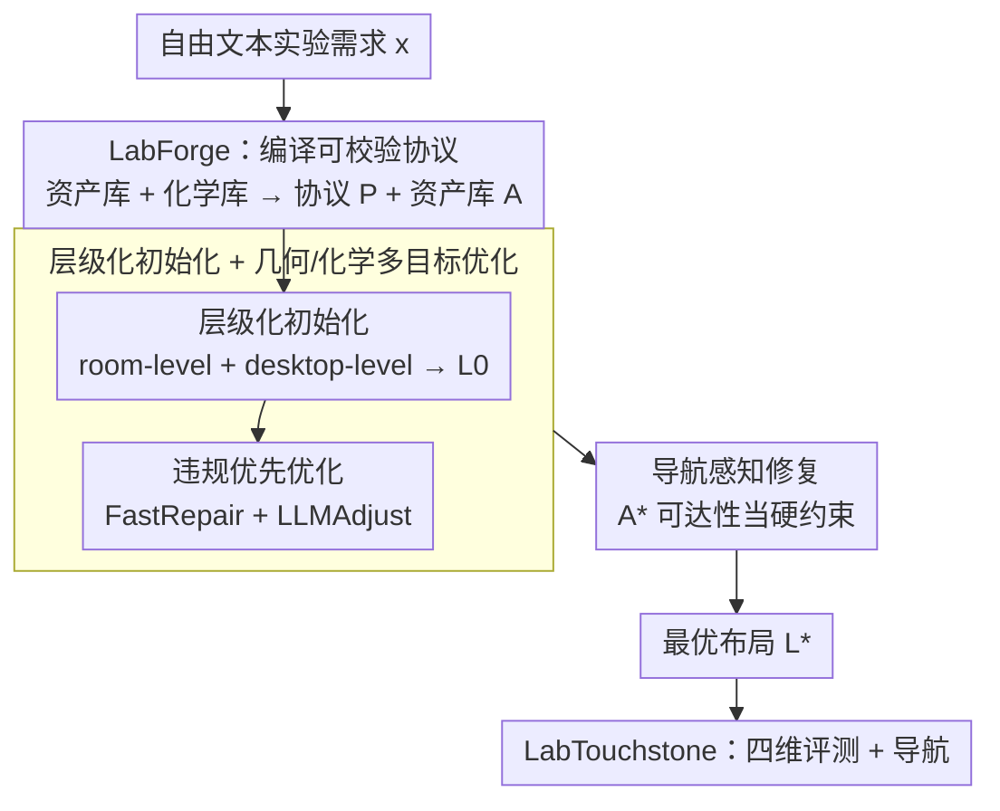

# LabBuilder: Protocol-Grounded 3D Layout Generation for Interactable and Safe Laboratory

**会议**: ICML 2026  
**arXiv**: [2605.02288](https://arxiv.org/abs/2605.02288)  
**代码**: 无  
**领域**: 3D视觉 / 具身环境生成  
**关键词**: 实验室场景生成、协议落地、化学安全、导航可达、层级布局

## 一句话总结
LabBuilder 把自由文本的实验描述编译成"资产-化学协议"，再用层级化生成 + 几何/化学多目标优化 + 导航修复，产出既视觉合理、又能让机器人真正跑通实验流程的 3D 化学实验室布局。

## 研究背景与动机
**领域现状**：3D 室内场景生成大多服务家居场景，依赖 3D-FRONT 这类家居数据集，目标是"看起来像"——几何不打架、家具配色合理。近年大量工作把 LLM 当成布局规划器，用文本→结构化 JSON→渲染的流水线把语言描述变成可交互场景。

**现有痛点**：把这套迁移到化学实验室时几乎全军覆没。家居场景里的桌椅只需要"放得下、不重叠"；而实验室里的通风橱、酒精灯、易燃试剂、玻璃器皿之间有**协议级语义**：药品要按反应类型摆、易燃物必须离热源远、玻璃器皿不能靠桌沿、机器人手臂要够得到。家居生成器把试剂瓶当装饰物，既不知道它的化学属性，也不会去验证机器人是否能从工作台 A 走到通风橱 B。

**核心矛盾**：现有方法在生成阶段只约束"静态几何合法性 + 视觉合理性"，把可执行性、安全性留到事后评估。但在实验室里，可执行性是设计约束本身——一个微小的几何变化（例如把酒精灯多移 20 cm）就会让整套实验流程废掉，甚至引发安全事故。

**本文目标**：给定一个自由文本的实验需求（例如"做一个 SN2 取代反应实验"），自动生成一个 3D 实验室布局，要求：(i) 协议里需要的所有资产都被实例化；(ii) 几何无冲突、贴墙合规；(iii) 化学安全约束被满足；(iv) 机器人可以按协议步骤逐站到达所需设备。

**切入角度**：作者把场景生成问题重新写成"协议落地的约束优化"——先用 LLM + 知识库把自由文本变成机器可校验的结构化协议，再让协议直接驱动布局的搜索与修复，把可执行性从后置评估前置到生成回路中。

**核心 idea**：用"资产知识库 + 化学知识库"作为先验，把实验需求编译成 schema 化协议，然后用层级化初始化 + 几何/化学违约优先的局部搜索 + 导航可达性修复，三阶段闭环生成实验室。

## 方法详解

### 整体框架
LabBuilder 要解决的是"把一句自由文本的实验需求，变成机器人真能跑通的 3D 实验室"。它把这件事拆成一条编译—生成—评测的流水线：前端的 **LabForge** 把自由文本和异构资产编译成结构化协议 $\mathcal{P}$ 与资产库 $\mathcal{A}$；中间的 **LabGen** 拿着协议先做层级化初始化得到候选布局 $\mathcal{L}_0$，再做几何+化学联合优化 $\Phi$，最后用导航感知修复 $\Upsilon$ 收敛到最优布局 $\mathcal{L}^\star$；末端的 **LabTouchstone** 从几何合规、可行性 FSR、化学安全、语义合理四个维度打分并补做 point-goal 导航评测。整条管线之所以跑得通，关键在协议 $\mathcal{P}$ 一身两职——它既是"目标说明书"告诉生成器要放哪些资产，又是"约束模板"告诉优化器哪些摆放算违规，从而把可执行性从事后评估前置进了生成回路。

### 关键设计

**1. LabForge：先把自由文本编译成可校验协议，再驱动布局**

痛点在于 LLM 直接吐"摆位 JSON"既会撞出物理冲突，又完全没有化学安全语义——它把试剂瓶当装饰物。LabForge 的做法是先编译出一层中间表示：它构造了一个 176 个实验室实体的资产标注库，每个实体带几何、语义、安全三个维度的标注，并从化学文献里抽出涵盖 7 类反应（取代、保护/脱保护、缩合、环化、氧化还原、官能团转化、烷基化/酰基化）的实验库。给定需求文本 $x$ 和知识库上下文 $\mathcal{C}$，LLM 在 $(x, \mathcal{C})$ 上做检索增强生成，产出 schema 严格、资产引用归一化的协议 $\mathcal{P}$，再过一遍基于资产库 $\mathcal{A}$ 的约束检验保证每个引用都能落地。这相当于给生成器套上一层 schema validator，避免幻觉资产或缺失仪器；统计上每个协议平均含 5.27 个试剂、9.87 个仪器、9.00 步操作、4.30 次导航，复杂度足够支撑后续的几何与安全约束。

**2. 层级化初始化 + 几何/化学多目标优化：把组合搜索压到可控规模**

实验室的连续配置空间巨大，一遍 LLM 直接出整间屋子必然爆炸。LabGen 把布局沿两个粒度分层：room-level 决定功能分区与大型设备的 6-DoF 位姿 $(\mathcal{R}, \pi) \sim p_\theta(\cdot \mid x, \mathcal{P}, \mathcal{A})$，desktop-level 再决定每张桌面上小仪器和试剂的摆放 $\mathcal{D}_s \sim p_\theta(\cdot \mid \cdot, s, \mathcal{R}, \pi)$，两层合并得初始布局 $\mathcal{L}_0$。优化目标同时奖励几何合法和化学安全：

$$\mathbb{F} = w_{\text{geo}} f_{\text{geo}} + w_{\text{chem}} f_{\text{chem}}$$

搜索的精髓是**违规优先**的接受准则——先比 hard-constraint 违规数 $v(\mathcal{L})$，违规更少者直接胜出，只有违规数打平才去比 $\mathbb{F}$ 的语义分。这样搜索会先把"违法的几何"压到零，再去抢更好的安全评分，不会在不合法的解空间里反复横跳。修复算子 $\Phi$ 混合两条路径：FastRepair 用算法层快速处理简单几何冲突这类便宜任务，LLMAdjust 只在需要语义推理时才调用 LLM（如"把丙酮挪到通风橱内"）。优化先在 room-level 收敛到局部最优，再切到 desktop-level 精修，每层只面对 $O(10)$ 个物体，把 LLM 调用费留给真正高语义难度的小问题。

**3. 导航感知修复：把机器人可达性当成硬约束**

物理上合法的布局也可能让机器人卡在两张工作台之间，看着对、用不了。LabGen 把可达性直接写进生成回路：先把 3D 场景投影成 2D 占据网格，按机器人半径做膨胀，再对协议里每一对 (start, goal) 用 $A^\star$ 规划路径。规划失败被归成三类——端点被占用、超出房间边界、拓扑不连通——统一压成二值指标 $f_{\text{reach}} \in \{0, 1\}$。一旦 $f_{\text{reach}} = 0$，就迭代调用修复算子 $\mathcal{L}_{t+1} = \Upsilon(\mathcal{L}_t, \mathcal{P}, \mathcal{A})$ 去移动阻挡物或调整功能区，直到协议中所有 step-to-step 转移都有碰撞自由的路径。把可达性当 hard constraint 而非事后指标，正是为了从机制上排除"生成完才发现走不通"的废布局。

### 损失函数 / 训练策略
LabBuilder 本质是搜索-验证管线而非可训模型，没有梯度训练。最终布局由约束优化给出：

$$\mathcal{L}^\star = \arg\max_\mathcal{L} \mathbb{F}(\mathcal{L}, \mathcal{P}, \mathcal{A})$$

其中 $f_{\text{geo}}$ 编码资产级几何约束，$f_{\text{chem}}$ 来自协议中的危险性标注，硬约束集合包括易燃物隔离、试剂存放、不相容化学品分离、玻璃器皿离桌沿距离等。

## 实验关键数据

### 主实验
在 30 个真实化学实验上对比 Holodeck 和 SceneWeaver（论文 Table 2）：

| 方法 | OB↓ | CN↓ | Asset↑ | Nav↑ | Flam.↑ | Lay↑ |
|------|-----|-----|--------|------|--------|------|
| Holodeck | 10.8 | 0.20 | 0.700 | – | 0.239 | 5.61 |
| SceneWeaver | 5.61 | 0.35 | 0.226 | – | 0.097 | 4.57 |
| **LabBuilder** | **0.07** | **0.17** | **0.833** | **0.966** | **0.725** | **9.00** |

边界违规几乎归零，化学安全和资产可用性大幅领先，LLM 语义评分 9/10。

### 消融实验

| 配置 | OB↓ | CN↓ | Asset↑ | Nav↑ | Flam.↑ |
|------|-----|-----|--------|------|--------|
| Ours (w/o annotation) | 0.25 | 0.36 | 0.786 | 0.952 | — |
| Ours (full) | 0.07 | 0.17 | 0.833 | 0.966 | 0.725 |

去掉资产标注后碰撞数翻倍、边界违规显著上升，证明 $\mathcal{A}$ 中的几何与化学语义对优化器至关重要。

### 关键发现
- 几何/化学优化的违规优先准则是关键：它让搜索把"违法的几何"先压到零，再去抢"更好的语义评分"，避免在不合法的解空间里反复横跳。
- 资产数 Obj 反而比基线更多（23.2 vs 10-15），说明生成器没有偷懒减少物品，而是真的把协议里要求的所有仪器都补齐了。
- 导航可达成功率 96.6%，但常见失败模式是细长仪器（如蒸馏装置）阻挡走道，提示后续可以用更细的形状抽象来改善 occupancy 网格。

## 亮点与洞察
- "把可执行性前置到生成回路"是关键观念转变。家居生成器之所以一直做不了实验室，是因为它把化学安全当成可选 metric；本文把它写成 hard constraint，直接进入接受/拒绝判据，从生成机制上就排除掉危险摆位。
- 分层 + 违规优先的搜索给出了一个可复用的 LLM-in-the-loop 范式：用算法层处理几何冲突这类便宜任务，把 LLM 留给真正需要语义推理的修复，避免每一步都付 LLM 调用费。
- 协议作为中间表示是优雅的解耦：上游可以接受任意自由文本，下游只看 schema 化协议，因此新增反应类型只需要扩 experiment library，不用改生成器。

## 局限与展望
- 资产库目前只有 176 个实体，长尾的特殊仪器（如手套箱、低温装置）覆盖不足，扩库需要持续的标注成本。
- 化学安全约束目前是离散的硬规则集合，难以表达"长时间反应中通风状态"这类时间维度的安全语义。
- 导航评测只考虑 point-goal，没有评估机器人手臂操作过程中的可达性（reach + grasp），实际部署到双臂平台时可能再次暴露问题。

## 相关工作与启发
- **vs Holodeck**：Holodeck 主打 open-vocabulary 室内场景生成，资产几乎不带功能语义，OB/Flam. 都被本文吊打，说明家居先验迁移到实验室无效。
- **vs SceneWeaver**：SceneWeaver 引入了几何约束验证但缺乏协议接地，资产可用性只有 0.226，几乎所有实验跑不通，反映 "几何对" 不等于 "能做实验"。
- **vs UP-VLA / 协议驱动机器人**：本文给具身智能社区提供了一个"协议→可执行环境"的桥梁，未来 VLA 模型可以直接消费 $\mathcal{P}$ 做监督，省掉手写场景。

## 评分
- 新颖性: ⭐⭐⭐⭐ 协议落地 + 化学硬约束首次系统化进入场景生成。
- 实验充分度: ⭐⭐⭐⭐ 30 个实验 + 三家基线 + 消融 + 导航评测，比较完整。
- 写作质量: ⭐⭐⭐⭐ 三模块结构清晰，公式和算法伪代码到位。
- 价值: ⭐⭐⭐⭐⭐ 自动化实验室是个有真金白银需求的方向，本文给出可落地的环境合成方案。

<!-- RELATED:START -->

## 相关论文

- [\[ICML 2026\] STABLE: Simulation-Ready Tabletop Layout Generation via a Semantics–Physics Dual System](stable_simulation-ready_tabletop_layout_generation_via_a_semantics-physics_dual_.md)
- [\[ICCV 2025\] REPARO: Compositional 3D Assets Generation with Differentiable 3D Layout Alignment](../../ICCV2025/3d_vision/reparo_compositional_3d_assets_generation_with_differentiable_3d_layout_alignmen.md)
- [\[NeurIPS 2025\] PhysX-3D: Physical-Grounded 3D Asset Generation](../../NeurIPS2025/3d_vision/physx-3d_physical-grounded_3d_asset_generation.md)
- [\[ICML 2026\] RelaxFlow: Text-Driven Amodal 3D Generation](relaxflow_text-driven_amodal_3d_generation.md)
- [\[ICML 2026\] PhyScene3D: Physically Consistent Interactive 3D Tabletop Scene Generation](physcene3d_physically_consistent_interactive_3d_tabletop_scene_generation.md)

<!-- RELATED:END -->
