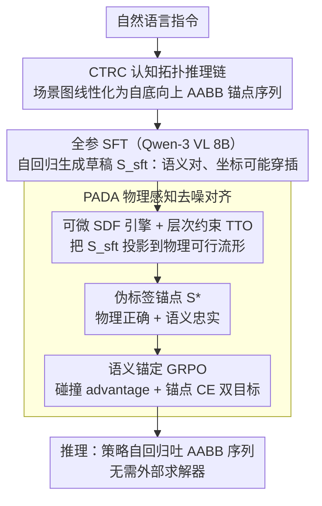

# PhyScene3D: Physically Consistent Interactive 3D Tabletop Scene Generation

**会议**: ICML 2026  
**arXiv**: [2606.01649](https://arxiv.org/abs/2606.01649)  
**代码**: 待确认  
**领域**: 3D视觉 / 场景生成 / 具身智能  
**关键词**: 桌面场景生成, VLM, 可微分SDF, 测试时优化, 物理一致性

## 一句话总结
PhyScene3D 把 3D 桌面场景生成重塑成"人类构造式"的层次化序列规划：用 Cognitive Topological Reasoning Chain (CTRC) 把场景图线性化为基于 AABB 的锚点序列，再用 Physics-Aware Denoising Alignment (PADA) 把可微分 SDF 物理引擎嵌入 VLM 训练循环，使模型生成的场景在物理合理性上反超人工标注训练数据（场景级碰撞率从 81.5% 降到 41.6%，资产级降到 3.86%）。

## 研究背景与动机

**领域现状**：可交互的 3D 桌面场景（kinematically valid、无穿插、可直接载入 IsaacGym / SAPIEN 等物理仿真器）是训练通用机器人操控策略的关键基础。当前主流做法分三类：(a) Agent 式求解器（Holodeck、I-Design）让 LLM 出符号约束、外部求解器求位姿；(b) 图像中介式 pipeline（先生成 2D 图、再 parse、再 retrieve 资产）；(c) 端到端回归模型（MesaTask 等）直接从数据集回归对象 6D pose。

**现有痛点**：(a) 类方法存在"符号瓶颈"——LLM 缺乏细粒度空间感知，常出现悬浮堆叠等几何不可解的图，下游求解器只能要么破坏语义、要么报错；(b) 类多阶段流水线 latency 高且误差累积；(c) 类端到端模型受训练数据质量天花板限制——MesaTask-10k 这类人工标注集本身就有 81.5% 的场景级穿插率，naive supervised learning 会逼模型把这些违反物理的伪影一并复制，根本无法产出可靠的仿真场景。

**核心矛盾**：桌面场景比室内家具布置更难——它要求严格的 3D 拓扑（笔必须在笔筒里、笔筒必须在书上），10~20 个物体在小空间内有密集的容纳/支撑/邻近关系。要同时满足"语义忠实于指令"和"物理上零穿插/不悬浮"，但纯 RL 优化物理会导致 semantic drift（把物体散开就没有碰撞了），纯模仿监督又会继承数据噪声。这是个 reward-hacking 与 blind-mimicry 之间的双重陷阱。

**本文目标**：在不放弃 VLM 语义先验的前提下，让生成模型的物理合理性**超越**训练数据的上限，并对未见场景（OOD）保持泛化。

**切入角度**：作者的两个关键观察是——(1) 人类布置桌面时遵循 "anchor → 横向扩展 → 自底向上堆叠" 的层次顺序，把这种顺序作为强结构归纳偏置注入 VLM，可以消除"先放内容再放容器"这种因果幻觉；(2) 训练数据的噪声不是 ground truth 而是"可以被去噪的不完美参考"，只要有可微的物理信号反向传播到 VLM 参数，模型就能学到比标注者更干净的布局。

**核心 idea**：把"显式规划 + 求解器后处理"的传统流程**内化**进 VLM 的隐式推理——CTRC 提供结构骨架（线性化的 AABB 锚点序列），PADA 用可微 SDF + 测试时优化 (TTO) 把 SFT 输出"投影"到物理可行流形上，再把这种投影后的伪标签作为 GRPO 训练的语义锚点，蒸馏物理先验回 policy。

## 方法详解

### 整体框架
PhyScene3D 要解决的是：给一句自然语言指令，生成一桌没有穿插、不悬浮、能直接丢进物理仿真器的桌面场景，而且物理质量要超过本身就很脏的人工标注训练集。它把这件事拆成"先让 VLM 学会像人一样有顺序地摆，再用可微物理引擎反过来纠正 VLM"两层。具体地，输入指令 $\mathcal{I}$，输出场景 $\mathcal{S}=\{e_i\}_{i=1}^N$，每个实体 $e_i=(c_i,\mathbf{p}_i,\mathbf{s}_i,\theta_i)$ 被重参数化成一个 6 维的 3D AABB $\mathbf{b}_i=[x_{\min},x_{\max},\dots,z_{\max}]\in\mathbb{R}^6$，让位置、尺寸和相对关系都落在同一种可直接度量空间占用的表示里。骨干是 Qwen-3 VL 8B，训练走两阶段：先在带层次场景图标注的 MesaTask-CTRC 数据上做全参 SFT，让模型学会按 CTRC 的锚点序列自回归生成；再进入 PADA 阶段，用 LoRA(r=16)+GRPO，每条训练 prompt 先用 SFT 推理出 $\mathcal{S}_{sft}$，再用测试时优化(TTO)把它投影到物理可行流形得到伪标签锚点 $\mathcal{S}^*_{anchor}$，与 RL 探索项联合训练。推理时只剩 VLM 自回归吐出 AABB 序列，不再需要外部求解器或后处理。

### 关键设计

**1. Cognitive Topological Reasoning Chain (CTRC)：把"先放容器再放内容"的顺序硬编码进生成过程**

桌面生成最大的痛点是因果幻觉——VLM 经常先放笔再放笔筒，或让物体悬空堆叠，因为扁平的 set generation 没有任何顺序约束。CTRC 把这个问题重构成一个有序的自底向上自回归过程 $P(\mathcal{S}|\mathcal{I})=\prod_{t=1}^{N}P(e_t|e_{<t},\mathcal{I})$，强制"容器 → 内容物"的因果链。它先用几何启发式抽出场景图 $G=(V,E)$：容纳关系由体积比 $V_B/V_A\geq 1.5$ 且 $IoU_{xy}\geq 0.9$ 判定，支撑关系由 $z_{min}^A \approx z_{max}^B$ 判定，邻近关系由分离主轴判定，边的优先级排成 $\text{in} \succ \text{on} \succ \text{near}$。生成顺序由 Anchor-Expansion 策略决定：先放离桌心最近的 base anchor，再横向扩展同层物体，一旦遇到容器或支撑就**立即**自底向上递归填满它的子物体，这其实是一条结构性的 Chain-of-Thought，而非 prompt 工程。

关键还在于子物体的位姿不是用绝对坐标、而是表示为父物体局部坐标系下的相对 AABB，并且把竖直维度按关系类型解耦：关系为 $\text{in}$ 时 $z^{rel}_{\{min,max\}} = z^{abs}_{\{min,max\}}(e_{ch}) - z^{abs}_{min}(e_{pa})$，关系为 $\text{on}$ 时 $z^{rel}_{\{min,max\}} = z^{abs}_{\{min,max\}}(e_{ch}) - z^{abs}_{max}(e_{pa})$。这样"inside"和"on"在数学上就变成两种不同形式的偏移量，搜索空间被锚定到几何不变量上——即便父物体被移动，子物体的相对参数化也保持不变，从源头消除悬浮/穿插的幻觉。AABB 在这里只负责宏观拓扑这个粗粒度归纳偏置，高精度的物理细节留给后面的 SDF 引擎。

**2. 可微分 SDF 物理引擎 + Hierarchy-Constrained TTO：把语义计划投影到物理流形**

CTRC 给的是拓扑对、但坐标仍可能穿插的草稿，这一步负责把它"推"成物理可行的。所有资产用 GPU 常驻的向量化 SDF 表示，对任意一对物体 $A,B$ 计算可微的碰撞能量

$$\mathcal{L}_{sdf}(A,B) = \sum_{\mathbf{p}\in P_A} \text{ReLU}\big(-\phi_B(\mathbf{R}_B^\top(\mathbf{R}_A \mathbf{p} + \mathbf{t}_A - \mathbf{t}_B))\big),$$

其中 $P_A$ 是在 $A$ 标准坐标系下采样的表面点，$\phi_B$ 是 $B$ 的 SDF 场，$\text{ReLU}$ 只在点穿进 $B$ 内部（SDF 为负）时产生惩罚，梯度自然把穿插对象"推开"。但单纯最小化碰撞会 drift——只要把物体推到远处碰撞就没了，语义也就毁了。所以 TTO 的目标里加了相对坐标约束：

$$\min_\xi \big(\mathcal{L}_{sdf} + \lambda_{rel}\mathcal{L}_{rel}(\mathcal{G}) + \lambda_{reg}\|\xi - \xi_{init}\|^2\big),$$

其中 $\mathcal{L}_{rel}$ 对 $\text{in}$ 边冻结父子相对位置（整组当刚体），对 $\text{on}$ 边强制 $z^{rel}$ 对齐，$\xi_{init}$ 是 VLM 的初始输出、由正则项拉住不让它跑偏。这样 TTO 只能要么把整组刚体平移、要么在合法 affordance 区域里微调，做到 collision-free 的同时保持语义意图——这正是它能稳定产出高质量伪标签的前提。

**3. Physically-Projected Semantic Anchoring：把 TTO 的解析能力蒸馏回 VLM**

TTO 虽好但只是部署期的局部修正，昂贵且受初始化质量限制；而纯靠物理奖励去 fine-tune VLM 又会 reward-hacking（把物体散开来骗碰撞分，GPT-Score 从 8.96 掉到 8.47）。PADA 的做法是把 TTO 当 teacher 蒸馏进 policy：每轮 RL，对训练指令先用 SFT 推理得 $\mathcal{S}_{sft}$（它落在语义流形 $\mathcal{M}_{sem}$ 上但带物理噪声），再用前面的 Hierarchy-Constrained TTO 投影得 $\mathcal{S}^*_{anchor}=\text{TTO}(\mathcal{S}_{sft})$（被拉到物理流形 $\mathcal{M}_{phys}$ 上、又因 CTRC 约束保住语义）。这个锚点同时具备物理正确和语义忠实，于是被当作 GRPO 的稠密监督，构成双目标损失

$$\mathcal{J}(\theta) = \mathbb{E}_{\mathcal{L}\sim\pi_\theta}\Big[\frac{1}{K}\sum_{k=1}^K A_k \frac{\pi_\theta(\mathcal{S}_k)}{\pi_{old}(\mathcal{S}_k)}\Big] + \alpha \cdot \mathcal{L}_{CE}(\pi_\theta, \mathcal{S}^*_{anchor}),$$

前一项由碰撞分数派生的 advantage $A_k$ 驱动探索，后一项用 cross-entropy 把锚点当"修正向量"稳住语义。这么做既加速收敛（模型不必从头重新探索"杯子装笔"这种语义结构，只需学会把它微调到无碰撞），又把老师的能力内化进生成分布本身——这就是为什么最终 PADA 的 QPR(46.5%) 能反超 inference-only TTO(38.0%)：模型初始生成就比 TTO 从噪声起点修出来的更好。

### 损失函数 / 训练策略
两阶段训练：(i) SFT 用全参微调 Qwen-3 VL 8B 在 9,429 个带 CTRC 序列标注的样本上学习 AABB 序列生成；(ii) PADA 用 LoRA r=16 跑 GRPO，每条 prompt 在线生成 $K$ 个 rollouts，advantage $A_k$ 由 SCR/ACR 派生，锚点项权重 $\alpha$ 控制语义稳定性 vs 物理探索的权衡。训练在 640GB VRAM 集群上完成。

## 实验关键数据

### 主实验
MesaTask-CTRC benchmark（866 样本，6 场景 × 5 难度等级），用 Quality Pass Rate (QPR, GPT-Score > $\tau$ 且 collision-free 的比例) + Scene-wise / Asset-wise Collision Rate 评估：

| 方法 | QPR (τ=7) | GPT Score Avg | SCR ↓ | ACR ↓ |
|------|-----------|---------------|-------|-------|
| Reference (人工标注) | 17.1% | 8.87 | 81.5% | 8.19% |
| GPT-4o | 27.6% | 8.19 | 68.9% | 7.87% |
| Holodeck-table (Agent) | 2.7% | 4.60 | 2.7% | 0.47% |
| I-Design-table (Agent) | 19.0% | 6.53 | 39.1% | 5.94% |
| MesaTask (End-to-End) | 21.1% | 8.80 | 78.3% | 8.19% |
| **PhyScene3D (Ours)** | **46.5%** | **8.93** | **41.6%** | **3.86%** |

OOD 场景（Cashier Counter / Nightstand / Side Table / TV Stand）：MesaTask QPR 崩塌到 1.01%，PhyScene3D 仍有 29.1%，相对提升 ~29×。Diffusion-based DiffuScene 在 Dining Table 子集 QPR=0、SCR=100%，证明纯生成式建模在密集桌面场景下完全失效。

### 消融实验（Qwen-3 VL 8B + 增量加模块）

| 配置 | QPR (τ=7) | GPT Avg | SCR ↓ | ACR ↓ | 说明 |
|------|-----------|---------|-------|-------|------|
| Qwen-3 VL 8B (SFT only) | 19.2% | 8.84 | 80.1% | 8.18% | VLM 基线 |
| + CTRC | 21.6% | 8.96 | 77.8% | 7.60% | 加层次序列：物理小幅好转，GPT 略升 |
| + GRPO (纯 RL) | 28.8% | 8.47 | 68.9% | 6.82% | reward hacking：GPT 掉 0.49 |
| + TTO (post-hoc) | 38.0% | 8.83 | 60.5% | 4.86% | 推理期修正，强但贵 |
| + PADA* (锚点用 raw SFT) | 34.2% | 8.73 | 64.5% | 5.63% | 仅 SFT 锚点不够 |
| **+ PADA (TTO-refined anchor)** | **46.5%** | **8.93** | **41.6%** | **3.86%** | 完整方法 |

机器人下游任务（ManiSkill 仿真器，桌面杂乱目标抓取）：在 MesaTask 生成场景上训练的 agent IID 成功率仅 4.6% / OOD 3.5%（因穿插导致初始化失败）；在 PhyScene3D 场景上训练的 agent IID 50.4% / OOD 14.1%，绝对提升超 10×。

### 关键发现
- **CTRC 单独加 → 物理几乎不动（SCR 从 80.1% 到 77.8%）但语义稳住**：层次归纳偏置是必要前提，没有它后续 PADA 的 TTO 会 drift。
- **纯 GRPO 必 reward-hack**：GPT-Score 掉 0.49，输出变稀疏。这印证了不能纯靠物理奖励 fine-tune VLM。
- **PADA 反超 inference-only TTO (46.5% vs 38.0%)**：说明 VLM 通过蒸馏真的"学会了物理"，初始生成就比 TTO 从噪声起点修出来的解更好——这是把局部 repair 升级为 global policy 改进的强证据。
- **OOD 上 CTRC 单独就带来 10× QPR 提升**：相对 AABB 表示捕获了拓扑不变量（桌面/床头柜/侧桌的 "on a surface" 结构相同），这是 OOD 泛化的核心来源。
- **难度上升时的鲁棒性差异**：Level 5（最密集）下 Reference 数据 QPR=0、GPT-4o=19%、MesaTask=7.1%，而 PhyScene3D 还有 40%——层次分解避免了非层次基线的级联误差。

## 亮点与洞察
- **"训练数据是可去噪的不完美参考，不是 ground truth"**——这一论断把 generative scene synthesis 从 distribution matching 解放出来。只要有可微的物理信号，模型可以系统性超越人类标注上限（SCR 从 81.5% 到 41.6%），这种 self-correction 思路可迁移到任何"标注本身有缺陷"的生成任务（如机器人轨迹、CAD 设计、布局规划）。
- **TTO-refined anchor 作为 GRPO 的稠密监督**——这是绕过显式语义 reward model 的精妙做法：用同一个 SFT model 既出预测又出 anchor，TTO 在相对坐标约束下做投影既保物理又保语义。比起 RLHF 需要训独立 reward model，这种"自蒸馏 + 物理 teacher"模式数据成本几乎为零，对其他难定义稠密语义奖励的领域（如代码、数学推理中间步骤）有借鉴价值。
- **相对 AABB + 关系类型解耦 $z$ 维度**——一个 6 维表示把位置、尺寸、关系（in/on）都编码了，让"穿插"在数学上变成 SDF 的 ReLU 项、"悬浮"变成 $z^{rel}$ 偏离 0，pose error 立即可见且可被 SDF 引擎惩罚。这种"让错误可观测可微"的设计哲学值得学习。
- **CTRC 的 anchor-expansion 是结构性 Chain-of-Thought**——它不是 prompt 工程，而是把人类布置桌面的归纳偏置 hard-code 进生成顺序。这一思路可迁移到其他有强层次依赖的生成任务（HTML 布局、UI mock、分子构象）。

## 局限与展望
- 作者承认 AABB 对极不规则形状（如带把手的篮子）会保守高估占用，依赖后续 SDF 在 contact 处修正；这意味着对接触型 affordance（如旋钮、把手对齐）可能仍力不从心。
- 即使 PADA 把 ACR 降到 3.86%，桌面 10~20 个物体的密集场景里要求**绝对**零碰撞依然极难，论文承认这一点；意味着直接用于精细操控仍可能引发仿真器初始化不稳。
- 自评仍依赖 GPT-Score（GPT-4 作为 judge），存在判官与候选模型同源的偏差风险，且没有人评校准。
- OOD 仍是 IID 场景的近邻类（都是桌面/台面），跨大类别（房间布局、室外）泛化未验证。
- 改进方向：(a) 把 AABB 升级到 oriented bounding box (OBB) 或低维形状描述子以处理非轴对齐物体；(b) 把 PADA 锚点机制和 diffusion policy 结合，可能解决 DiffuScene 失败的密集场景；(c) 把 SDF 引擎扩展到关节型物体支持铰接 affordance（开抽屉/翻书页）。

## 相关工作与启发
- **vs Holodeck / I-Design (Agent 求解器)**：他们让 LLM 出符号约束、外部求解器解，本文把规划内化进 VLM 的隐式推理。本文优势是无 latency / 无 symbolic bottleneck，劣势是无法保证 hard constraints（求解器可以，但 PADA 只能软优化到 ~3.86% ACR）。
- **vs MesaTask (端到端回归)**：他们用同一份 MesaTask-10k 做监督回归，inherently 上限被 81.5% 的训练集 SCR 卡死；本文用同样数据但因 PADA 的物理蒸馏反超训练集，相对碰撞率降幅 ~50%。
- **vs DiffuScene (扩散场景生成)**：扩散模型在密集桌面 QPR=0、SCR=100%，本文证明纯生成建模缺乏显式 3D 物理边界 enforcement 时根本不可用，这种"任务需要硬约束 vs 软建模"的对比对生成模型方法选型有警示意义。
- **vs SpatialVLM (Chen 2024) / 各类 spatial-aware VLM**：他们把空间推理用于感知/分析现存场景（识别 / 描述 / 问答），本文把 VLM 的几何先验**反过来**用作生成 planner，且 runtime 无视觉输入——这一从"感知"到"构造"的转变是关键 novelty 来源。
- **vs Differentiable Physics 系列工作**：可微 SDF 此前多用于物理仿真和形状重建，本文把它当 reward provider 嵌入 VLM 的 RL 训练循环，相当于把"梯度反传"从优化几何参数扩展到优化生成 policy 参数，这种 differentiable simulator + policy gradient 的耦合方式值得在其他 sim-to-real 场景借鉴。

## 评分
- 新颖性: ⭐⭐⭐⭐⭐ 把可微 SDF + TTO + GRPO 三件套组合成 PADA，并用 TTO-refined anchor 做语义蒸馏的设计在桌面场景生成里首次出现，且物理上反超训练集这一结果有思想分量。
- 实验充分度: ⭐⭐⭐⭐⭐ 7 个 baseline、IID + OOD + diffusion + 难度分层 + 消融拆到每个模块 + 下游机器人任务，覆盖度极高。
- 写作质量: ⭐⭐⭐⭐ 动机讲得清楚（blind mimicry + reward hacking 双陷阱），CTRC 和 PADA 都有图解；GPT-Score 作为评测的局限若能讨论会更扎实。
- 价值: ⭐⭐⭐⭐⭐ 直接服务于通用机器人学习的仿真环境瓶颈，下游 ManiSkill 抓取成功率从 4.6% 跳到 50.4% 的实际收益非常硬。

<!-- RELATED:START -->

## 相关论文

- [\[ICML 2026\] STABLE: Simulation-Ready Tabletop Layout Generation via a Semantics–Physics Dual System](stable_simulation-ready_tabletop_layout_generation_via_a_semantics-physics_dual_.md)
- [\[ICCV 2025\] SuperMat: Physically Consistent PBR Material Estimation at Interactive Rates](../../ICCV2025/3d_vision/supermat_physically_consistent_pbr_material_estimation_at_interactive_rates.md)
- [\[CVPR 2025\] WonderWorld: Interactive 3D Scene Generation from a Single Image](../../CVPR2025/3d_vision/wonderworld_interactive_3d_scene_generation_from_a_single_image.md)
- [\[ICLR 2026\] One2Scene: Geometric Consistent Explorable 3D Scene Generation from a Single Image](../../ICLR2026/3d_vision/one2scene_geometric_consistent_explorable_3d_scene_generation_from_a_single_imag.md)
- [\[ICML 2026\] RelaxFlow: Text-Driven Amodal 3D Generation](relaxflow_text-driven_amodal_3d_generation.md)

<!-- RELATED:END -->
