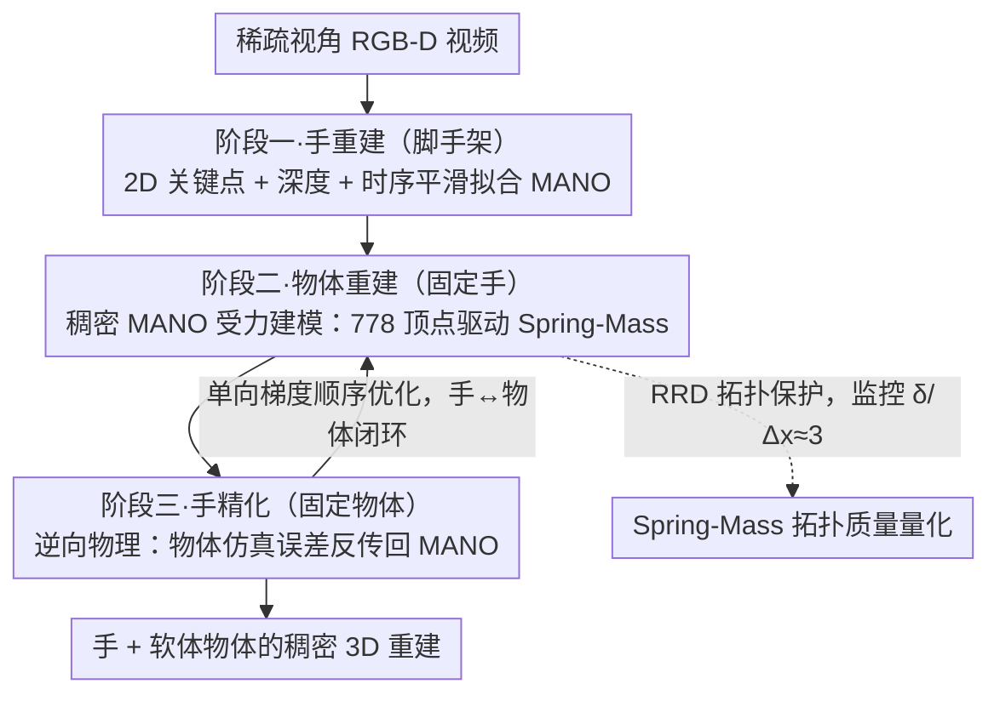

# PhysHanDI: Physics-Based Reconstruction of Hand-Deformable Object Interactions

**会议**: ICML 2026  
**arXiv**: [2605.09538](https://arxiv.org/abs/2605.09538)  
**代码**: 未公开  
**领域**: 3D 视觉 / 手物交互重建 / 物理仿真  
**关键词**: 手物交互、可变形物体、Spring-Mass、MANO、逆向物理

## 一句话总结
本文提出 PhysHanDI，把 MANO 手模型和 Spring-Mass 软体模型耦合起来，用稠密手网格驱动可变形物体的物理仿真，并反向利用物体仿真去精化手的重建，在稀疏视角 RGB-D 视频上同时拿到了手和软物的稠密 3D 重建 SOTA。

## 研究背景与动机
**领域现状**：现有手物交互重建大多假设物体是刚体或分段刚体（HOnnotate、ARCTIC 等），用一个参考形状加上全局或分部分的刚性变换就能描述物体动力学。

**现有痛点**：日常物体里有大量软体——衣物、毛绒玩偶、充电线，它们存在大幅度、空间变化丰富的非刚性形变，刚体框架完全失效。少量软体工作（HMDO、qi2025human）只处理手指按压产生的小范围局部形变，无法描述「把毛绒娃娃手臂折弯 180°」这种大范围全局形变。

**核心矛盾**：最相关的 PhysTwin 用 Spring-Mass 物理模型可以仿真大形变，但它把手简化为深度图直接采样得到的约 30 个稀疏控制点，导致两个问题：(1) 接触点在遮挡下不可观测，受力建模不准；(2) 用稀疏控制点拟合出的 Spring-Mass 拓扑（连接半径 $\delta$ 偏大）次优，破坏物理仿真稳定性。而且 PhysTwin 完全不做完整 3D 手重建。

**本文目标**：(1) 同时给出手和软体物体的稠密 3D 重建；(2) 用稠密手网格驱动物体仿真，把受力建模做准；(3) 反过来让物体物理先验提升手重建精度。

**切入角度**：既然 Spring-Mass 仿真高度依赖控制点几何，那把控制点从 30 个稀疏深度点替换为 MANO 拟合得到的 778 个稠密顶点，自然能得到更密集、更准确的接触集合和更合理的连接半径。

**核心 idea**：用 MANO 稠密手顶点作为 Spring-Mass 系统的「虚拟节点」，通过 hand→物体的力场闭合手物物理耦合；再通过 inverse physics（让物体仿真误差反传到 MANO 参数）形成 hand↔object 互补优化。

## 方法详解

### 整体框架
要解决的问题是：从稀疏视角（默认三视角）RGB-D 视频里同时拿到手和软体物体的稠密 3D 重建，而软体存在「把毛绒娃娃手臂折弯 180°」这种大范围非刚性形变，刚体框架完全失效。PhysHanDI 的整体思路是让手和物体在一个可微分物理仿真里互相驱动、互相精化。系统先把每只手参数化为 MANO 模型 $\Theta_h=\{\bm\theta,\bm\beta,\mathbf R,\mathbf t\}$，把每个软体物体参数化为 Spring-Mass 图 $\mathcal O=(\mathcal N,\mathcal E)$，图上每个节点带位置 $\mathbf x_i$、速度 $\mathbf v_i$、单位质量、弹簧刚度 $s_{ij}$、阻尼 $\gamma_{ij}$ 和连接半径 $\delta$。

整条 pipeline 走三个顺序阶段。第一阶段做手重建：仅用 2D 关键点、深度和时序平滑损失把 MANO 逐帧拟合好。第二阶段在手已知的条件下做物体重建：把 MANO 顶点当成受力源对 Spring-Mass 做正向仿真，用 Chamfer 加 CoTracker3 轨迹损失反传去优化弹簧的物理参数。第三阶段做手精化：冻结物体模型，把物体仿真误差通过逆向物理（inverse physics）反传回 MANO 参数，得到物理上更自洽的手。手→物体→手的闭环正是这套方法的核心结构。

### 关键设计

**1. 稠密 MANO 驱动的 Spring-Mass 受力建模：用 778 个手顶点替代 30 个稀疏控制点，把接触力建准**

最相关的 PhysTwin 只把手简化成深度图直接采样得到的约 30 个稀疏控制点，导致两个老毛病：接触点在遮挡下不可观测、受力建模不准，以及拟合出的虚拟弹簧拓扑次优、破坏仿真稳定。PhysHanDI 的做法是把 MANO 全部 778 个顶点当作虚拟控制节点 $\mathcal V'$ 注入接触力。每个节点上的力分成弹簧、阻尼、外力三部分 $\mathbf F_i=\sum_{(i,j)\in\mathcal E}\mathbf F_{i,j}^{\text{spring}}+\mathbf F_{i,j}^{\text{damping}}+\mathbf F_i^{\text{external}}$，其中弹簧力遵循胡克定律 $\mathbf F_{i,j}^{\text{spring}}=s_{ij}(\|\mathbf x_j-\mathbf x_i\|-r_{ij})\frac{\mathbf x_j-\mathbf x_i}{\|\mathbf x_j-\mathbf x_i\|}$；手物之间凡是落在连接半径 $\delta$ 内的就自动建立「虚拟弹簧」$\mathcal E^{\text{virtual}}$，把 MANO 顶点位置固定为边界条件后随时间积分牛顿第二定律。

之所以稠密顶点有效，关键在拓扑。PhysTwin 用 30 个深度点拟合出的虚拟弹簧过长，半径与离散分辨率之比 $\delta/\Delta x$ 远偏离 peridynamics 推荐值 3，导致波动在物体里过度扩散、接触建模失真；换成 778 个稠密顶点后 $\delta$ 自然回落到合理区间，接触力集中在真实接触面而不再散布到非接触区。

**2. 逆向物理驱动的手精化：让「物体物理一致性」反过来监督手姿态**

单视角 RGB-D 下手观测高度欠定，手指经常被物体或自身遮挡，仅靠 2D 关键点和深度损失不够稳。PhysHanDI 反过来用物体的物理行为去约束手：定义 $\mathcal S_t(\Theta_h)$ 为给定手参数下 $t$ 时刻物体节点位置的可微分仿真，再求解

$$\tilde\Theta_h=\arg\min_{\Theta_h}\frac{1}{T}\sum_t\big[\mathcal L_{ch}(\mathcal S_t(\Theta_h),\mathcal P)+\lambda_{tr}\mathcal L_{tr}(\mathcal S_t(\Theta_h),\mathbf T)\big]$$

其中 $\mathcal P$ 是观测点云、$\mathbf T$ 是 CoTracker3 轨迹，梯度通过 Spring-Mass 的可微分积分一路回传到 $\Theta_h$。这相当于额外加了一条约束——「这只手必须能让物体按观测到的方式变形」，可以排除大量物理上不可能的姿态，等于免费多了一种监督，把手重建从「拟合像素」升级为「拟合物理」。

**3. 三阶段顺序优化与拓扑保护：单向梯度避免伪解，并量化监控拓扑质量**

如果手和物体联合优化，很容易出现「物体形变去补偿手的误差」这种伪解。PhysHanDI 因此采取严格的顺序优化：先固定手做物体优化，再固定物体做手精化，循环进行但每个阶段只走单方向梯度。物体阶段沿用 PhysTwin 的可微仿真，但因为控制源已经换成稠密 MANO，优化出的 $\delta$ 显著变小。为了显式保证拓扑接近最优，作者引入 Radius-to-Resolution Deviation 指标 $RRD=|(\delta/\Delta x)/r-1|$（推荐值 $r=3$，$RRD$ 越小越接近 peridynamics 推荐配置）来量化拓扑质量，确保每一阶段都朝物理可解释的方向推进。

### 损失函数 / 训练策略
手阶段优化 $\min_{\Theta_h}\mathcal L_{2D}+\lambda_d\mathcal L_d+\lambda_t\mathcal L_t$，三项分别是 2D 关键点重投影误差、深度图渲染差、相邻帧参数时序平滑。物体阶段用 Chamfer 损失 $\mathcal L_{ch}$ 衡量仿真节点与点云的距离，加上 $\mathcal L_{tr}$ 衡量与 CoTracker3 伪 GT 轨迹的 $\ell_2$ 差。手精化阶段复用 $\mathcal L_{ch}+\lambda_{tr}\mathcal L_{tr}$，但梯度落到 MANO 参数上。由于没有 GT 质量信息，所有节点质量统一设为单位质量。整套流程不训练任何新网络，全部是逐视频的可微优化。

## 实验关键数据

### 主实验
在 PhysTwin-dense 子集（剔除只有针尖式接触的序列）和自建 DenseHDI（19 个序列、10 类软物）两个数据集上对比 PhysTwin、Spring-Gaus、GS-Dynamics。

| 数据集 | 任务 | 指标 | PhysTwin | PhysHanDI | 提升 |
|--------|------|------|----------|-----------|------|
| PhysTwin-dense | 重建+重仿真 | $CD_{dyn}$ ↓ | 10.78 | 8.32 | -22.8% |
| PhysTwin-dense | 重建+重仿真 | Track Err. ↓ | 1.00 | 0.89 | -11% |
| PhysTwin-dense | 未来预测 | $CD_{dyn}$ ↓ | 16.32 | 14.35 | -12% |
| DenseHDI | 重建+重仿真 | CD ↓ | 5.59 | 5.06 | -9.5% |
| DenseHDI | 未来预测 | CD ↓ | 7.98 | 7.54 | -5.5% |

Spring-Gaus 在三视角稀疏输入下仿真崩坏（$CD_{dyn}=27.79$），GS-Dynamics 在短序列下退化为只学微小运动（$CD_{dyn}=33.37$）。

### 消融实验
**单视角未来预测（PhysTwin 在此设置因接触点识别失败无法运行）：**

| 配置 | Hand CD ↓ | CD ↓ | Track Err. ↓ |
|------|-----------|------|--------------|
| Ours w/o 手精化 | 7.36 | 42.8 | 7.57 |
| Ours Full | 7.17 | 33.5 | 6.75 |

**Spring-Mass 拓扑质量（$RRD$ 越低越接近 peridynamics 推荐值）：**

| 方法 | $RRD_{\text{object}}$ ↓ | $RRD_{\text{virtual}}$ ↓ |
|------|-------------------------|--------------------------|
| PhysTwin | 0.64 | 2.63 |
| PhysHanDI | 0.32 | 0.35 |

虚拟弹簧 $RRD$ 直降 7×，说明稠密手控制几乎彻底消除了 PhysTwin 那种「拉长弹簧硬接触」的拓扑失真。

### 关键发现
- 在多视角充足输入下，初始 MANO 拟合已足够好，inverse physics 精化主要在「单视角未来预测」这种欠定场景里显效——Hand CD 从 7.36 降到 7.17，物体 CD 直降 9.3 mm。
- 鲁棒性测试中（depth/track/controller 各加噪），本方法在 perturbed tracking 下 CD 几乎不变（5.30→5.56），PhysTwin 却跳到 9.60，说明稠密手作为接触线索能吸收大部分上游噪声。
- 拓扑分析揭示了一条可迁移的规律：仿真精度首先取决于 Spring-Mass 离散与连接半径的比例 $\delta/\Delta x$，而 controller 稠密度直接决定这个比例能否落到推荐区间。

## 亮点与洞察
- **逆向物理给手做监督**：第一次用「物体物理一致性」反过来精化手姿态，把 hand reconstruction 从「拟合像素」升级为「拟合物理」，思路非常优雅，可迁移到任何手物可微仿真框架。
- **从控制源稠密度反推拓扑质量**：把 peridynamics 里的 $\delta/\Delta x\approx 3$ 经验法则引入 hand-object 仿真，并用 $RRD$ 量化「PhysTwin 为什么差」，从理论层面解释了稠密控制的必要性。
- **训练-自由的物理先验**：整个 pipeline 不训新网络，所有可微优化都在每段视频上做，对小数据/新物体天生友好。

## 局限与展望
- 单位质量假设：所有 mass node 用 $m_i=1$，无法区分轻软物（纱巾）和重软物（湿毛巾），未来若结合材质先验或多模态触觉可解锁更细的动力学。
- 依赖 RGB-D + 多视角 CoTracker3 伪 GT 轨迹做监督，迁移到纯单目 RGB 还需要看上游深度/跟踪估计的精度天花板。
- 仅支持 spring-mass 这一类「连续介质 + 离散弹簧」模型，对衣物折叠中的自接触、布料拓扑变化（撕裂）等高阶现象建模能力有限。
- 没有讨论实时性：可微仿真+inverse physics 在长视频上的优化成本是工程瓶颈。

## 相关工作与启发
- **vs PhysTwin (jiang2025phystwin)**：同样用 Spring-Mass 仿真物体，但 PhysTwin 用 ≈30 个稀疏深度采样点作为控制，本方法用 778 个 MANO 顶点；本方法额外提供了完整手重建以及 hand refinement 闭环。
- **vs HMDO / qi2025human**：HMDO 系列假设物体只有手指点接触下的局部形变，本方法处理大范围全局形变。
- **vs Spring-Gaus (zhong2024reconstruction) / GS-Dynamics (zhang2024dynamics)**：它们要么需要稠密视角，要么需要长序列才能学动力学；本方法在三视角短序列下仍稳定，归功于显式 MANO + 物理仿真的强先验。
- **启发**：这个 hand↔object inverse physics 思路可以平移到 robot↔object（用机器人手的关节运动反推接触参数，再反过来优化运动规划）以及 body↔scene（人体跌坐沙发后反过来精化人体姿态）等场景。

## 评分
- 新颖性: ⭐⭐⭐⭐⭐ inverse physics 精化手是 hand-object 重建里第一次出现的闭环
- 实验充分度: ⭐⭐⭐⭐ 三视角、单视角、四种扰动、拓扑量化都覆盖了，唯一缺真实开放物体的长期评估
- 写作质量: ⭐⭐⭐⭐ 故事线（hand→object→hand）清晰，物理与学习的交界讲得很顺
- 价值: ⭐⭐⭐⭐ 给 AR/VR、机器人遥操作的软体抓取重建提供了新的物理-学习基线

<!-- RELATED:START -->

## 相关论文

- [\[CVPR 2026\] ArtHOI: Taming Foundation Models for Monocular 4D Reconstruction of Hand-Articulated-Object Interactions](../../CVPR2026/3d_vision/arthoi_taming_foundation_models_for_monocular_4d_reconstruction_of_hand-articula.md)
- [\[CVPR 2026\] ForeHOI: Feed-forward 3D Object Reconstruction from Daily Hand-Object Interaction Videos](../../CVPR2026/3d_vision/forehoi_feed-forward_3d_object_reconstruction_from_daily_hand-object_interaction.md)
- [\[CVPR 2026\] PAD-Hand: Physics-Aware Diffusion for Hand Motion Recovery](../../CVPR2026/3d_vision/pad-hand_physics-aware_diffusion_for_hand_motion_recovery.md)
- [\[CVPR 2026\] Glove2Hand: Synthesizing Natural Hand-Object Interaction from Multi-Modal Sensing Gloves](../../CVPR2026/3d_vision/glove2hand_synthesizing_natural_hand-object_interaction_from_multi-modal_sensing.md)
- [\[CVPR 2026\] PhysGaia: A Physics-Aware Benchmark with Multi-Body Interactions for Dynamic Novel View Synthesis](../../CVPR2026/3d_vision/physgaia_a_physics-aware_benchmark_with_multi-body_interactions_for_dynamic_nove.md)

<!-- RELATED:END -->
