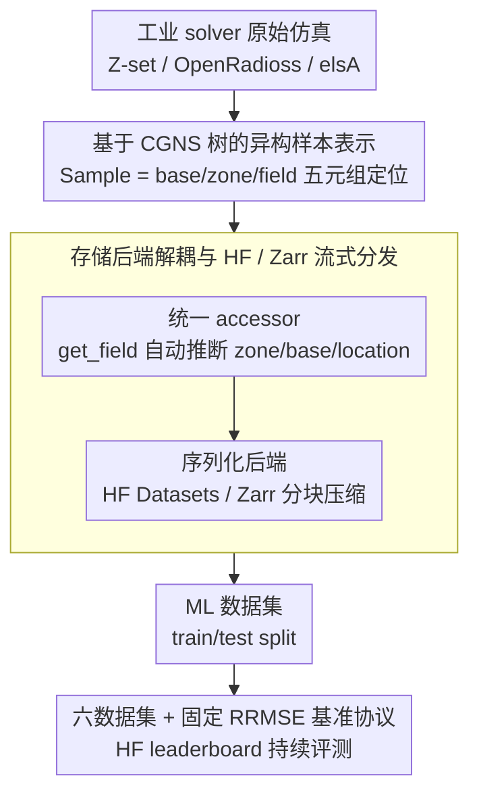

# PLAID: A Unified Data Model for Machine Learning on Heterogeneous Physics Simulations

**会议**: ICML 2026  
**arXiv**: [2505.02974](https://arxiv.org/abs/2505.02974)  
**代码**: https://github.com/PLAID-lib/plaid (有)  
**领域**: 科学计算 / 物理仿真 / 数据集与基准  
**关键词**: 物理机器学习, 异构网格, 代理模型, 数据标准, 基准测试

## 一句话总结
PLAID 提出一套面向异构物理仿真数据的统一数据模型与开源库，配套发布 6 个覆盖结构力学和 CFD 的工业级数据集与可复现基准，把"变网格、变拓扑、变维度"的真实仿真数据真正变成机器学习社区可用的标准化 benchmark。

## 研究背景与动机

**领域现状**：用机器学习训练 surrogate model 来加速 PDE 仿真已经形成一条独立赛道，主流路线包括基于消息传递的 MeshGraphNets 类 GNN、Fourier Neural Operator 这种算子学习方法、以及最近的 mesh transformer 与隐式神经表示，依托 PyTorch Geometric、DGL、PhysicsNeMo 等基础设施。

**现有痛点**：相比 NLP 有 web-scale 文本、CV 有十亿级图文对，物理 ML 的数据集长期处于"小、窄、私有、格式各异"状态——要么是 PDEBench、The Well 这种只支持规则结构网格的玩具问题，要么是绑定特定 solver 和读写库的 ad-hoc 数据集，不同数据集之间几乎没有互操作性。

**核心矛盾**：真实工业仿真的复杂度恰恰来自"异构性"——同一个数据集里样本可以有不同形状、节点数、连接关系、单元类型、甚至拓扑（如多孔材料中孔的数量），还可能在时间维度上 remesh；但现有 ML 数据格式假设的是 "tensor with fixed shape"，于是社区只能砍掉这些异构性、退化到结构化网格上做学术评测，导致 benchmark 不能反映真实工业泛化能力。

**本文目标**：把这个鸿沟拆成三个子问题——(1) 设计一个既能保留 CGNS 工业级仿真复杂度、又能被 ML 框架高效消费的数据抽象；(2) 提供配套的库 + 在线存储后端，让构造、读写、流式访问都简单可扩展；(3) 提供一组真正异构的工业级数据集与公开 benchmark 协议，让不同建模范式可以被公平比较。

**切入角度**：不重新发明轮子，而是承认 CGNS 是工业 CFD/FEM 事实标准，让 PLAID 复用 CGNS 的分层 simulation tree 作为底层 schema，在其上加一层"ML-friendly"的样本/输入/输出/划分元数据；同时把分发交给 Hugging Face 和 Zarr 这些已经被社区接受的基础设施，从工程上降低门槛。

**核心 idea**：用一个"CGNS 树 + ML 元数据 + 标准化 accessor + HF 分发"的三层栈，把异构物理仿真数据封装成机器学习数据集的一等公民，再用 6 个工业级数据集 + 5 种主流方法的基准定义出整个赛道的事实标准。

## 方法详解

### 整体框架

PLAID 要解决的是"真实工业仿真数据无法被 ML 框架直接消费"这件事：现有 ML 数据格式假设张量形状固定，而工业 CFD/FEM 数据天生异构（变网格、变拓扑、混合单元、时间 remesh），社区只能砍掉异构性退化到规则网格上做评测。PLAID 的整体思路是搭一条三层栈，把原始仿真一路转成可训练的标准数据集：底层用 CGNS 树作 schema 承载异构结构，中间层用统一 accessor 把存储格式与物理字节解耦，顶层把数据集和评测协议托管到 Hugging Face 上持续运行。

具体来说，输入是 Z-set、OpenRadioss、elsA 等工业 solver 生成的原始仿真，经数据模型层封装成以 `Sample` 为单位的对象（每个 sample 内部是一棵带多 base / 多 field 的 CGNS 树），再由库层提供高层访问与并行读写、由分发层序列化成 HF Datasets 或 Zarr 后端；最终产出是带 train/test split、可被 GNN / operator / transformer 直接消费的 ML 数据集，以及在固定 RRMSE 协议下计算出的社区排行榜。

### 关键设计

**1. 基于 CGNS 树的异构样本表示：让"变网格、变拓扑"成为数据模型的一等情形**

物理 ML 最大的工程痛点是异构性——同一数据集里样本可以有不同节点数、不同连接关系、不同单元类型甚至不同拓扑（多孔材料里孔的数量都在变），还会随时间 remesh，而 "tensor with fixed shape" 的假设根本装不下这些。PLAID 把抽象单位定为 `Sample`，每个 sample 内部复用 CGNS 的 `base/zone/field` 层级，一个 sample 可同时挂多个 base（不同维度、不同物理量挂在不同 mesh 上，因此"同一样本既有 2D 流场又有 1D 叶片表面场"这种多支撑结构天然支持）。每个 field 用 `name, zone_name, base_name, location∈\{Vertex, CellCenter, FaceCenter\}, time` 五元组显式定位，于是 remeshing、字段动态出现/消失、不同维度 mesh 共存全都是数据模型里的常规情形而非"特殊 case"；高层 API 在定位无歧义时允许省略大部分维度，写起来接近 `dict` 访问。这一步的关键判断是"在 CGNS 之上加 ML 约定"而非另造 schema——所有支持 CGNS 的工业 solver、ParaView 等可视化工具天然可用，规避了"自创格式 → 生态空"的陷阱。

**2. 存储后端解耦与 HF / Zarr 流式分发：让 GB 级异构数据集可以按字段流式取用**

异构物理数据集动辄 GB 级（如 2D_ElPlDynamics 达 8.6GB），整体加载进内存并不现实，而让每个 ML 团队各写一套 lazy loader 又重复造轮子。PLAID 把数据模型与物理存储格式解耦：库层只暴露统一 accessor（如 `sample.get_field(name)` 自动推断默认 zone/base/location、`sample.show_tree(time)` 可视化结构，底层依赖 Muscat 桥接各工业 solver 的读写），后端只负责字节序列化与并行 I/O。同一份数据集既能以人类可读的 YAML+CGNS 文件落地，也能序列化成 Hugging Face Datasets（复用其远程缓存与版本化）或 Zarr（分块压缩 + 远程对象存储），从而支持在线流式与按 feature 的部分读取——用户可以只拉需要的几个字段，不必下载整个数据集。把"流式 + feature-wise 访问"做进数据层，正是 PLAID 区别于 The Well、PDEBench 那类"打包好的 npz/h5"基准的关键工程能力。

**3. 六个递进异构数据集 + 固定 RRMSE 基准协议：把异构性逐项 stress-test 出来**

光有数据模型不够，还要有能暴露异构性挑战的数据与一把公平的尺子。PLAID 配套发布 6 个工业级数据集（Tensile2d、2D_MultiScHypEl、2D_ElPlDynamics、Rotor37、2D_profile、VKI-LS59），覆盖 Z-set / OpenRadioss / elsA / BROADCAST 等真实 solver，单 sample 平均节点数从约 5k 到约 37k，把"几何变化、网格变化、拓扑变化、时间相关、混合单元"逐项压测出来：最复杂的 2D_MultiScHypEl 直接让"圆孔数量"变化触发拓扑变更，2D_ElPlDynamics 引入断裂、erosion 和非局部本构。评测用统一的相对均方根误差

$$\mathrm{RRMSE}_f = \Big(\frac{1}{n_\star}\sum_i \frac{1}{N^i}\frac{\|\mathbf{f}^i_{\rm ref}-\mathbf{f}^i_{\rm pred}\|_2^2}{\|\mathbf{f}^i_{\rm ref}\|_\infty^2}\Big)^{1/2}$$

对 scalar 用相对 RMSE，最终 `total_error` 取所有字段与标量 RRMSE 的均值；testing set 输出不公开、提交由 HF 平台自动打分。这套设计意在打破"benchmark 自带 leaderboard 过拟合"的循环——既保留固定参考实验让论文可复现，又把长期评测放到社区平台上持续接收新模型；论文表 1 也据此论证 PLAID 是唯一同时具备 steady/transient、2D+3D、复杂域、几何变化、样本异构性的开放数据集合。

### 损失函数 / 训练策略

PLAID 本身不规定训练损失，只规定**评估指标**：所有方法在统一 split 上训练后，按 RRMSE 计算每个 field/scalar 的相对误差，最终汇总为 `total_error`。对时间相关数据集（2D_ElPlDynamics）则把整条轨迹的场堆叠后再算 RRMSE，相当于做"轨迹级"误差评估，rollout 误差增长曲线留作未来工作。

## 实验关键数据

### 主实验

下表是 6 个 PLAID 数据集上 6 种代表性方法的 `total_error`（越低越好，加粗为该行最优，下划线为次优）。可以看到没有任何一种方法在所有数据集上称王，这恰恰是 PLAID 想暴露的"异构性挑战"。

| 数据集 | MGN | MMGP | Vi-Transf. | Augur | FNO | MARIO |
|--------|-----|------|------------|-------|-----|-------|
| Tensile2d | 0.0673 | **0.0026** | 0.0116 | 0.0154 | 0.0123 | 0.0038 |
| 2D_MultiScHypEl | 0.0437 | — | 0.0325 | **0.0232** | 0.0302 | 0.0573 |
| 2D_ElPlDynamics | 0.1202 | — | 0.0227 | 0.0346 | **0.0215** | 0.0319 |
| Rotor37 | 0.0074 | **0.0014** | 0.0029 | 0.0033 | 0.0313 | 0.0017 |
| 2D_profile | 0.0593 | 0.0365 | 0.0312 | 0.0425 | 0.0972 | **0.0307** |
| VKI-LS59 | 0.0684 | 0.0312 | 0.0193 | 0.0267 | 0.0215 | **0.0124** |

### 数据集复杂度对比

| 数据集 | 样本数 | 平均节点 | 网格 | 异构源 |
|--------|--------|----------|------|--------|
| Tensile2d | 702 | 9,428 | tri | 变网格 + 非线性本构 |
| 2D_MultiScHypEl | 1,140 | 5,692 | tri | 变拓扑（圆孔数变化） |
| 2D_ElPlDynamics | 1,018 | 25,429 | tri | 时间相关 + 断裂 erosion |
| Rotor37 | 1,200 | 29,773* | quad | 3D + 激波位置变化 |
| 2D_profile | 400 | 37,042 | tri | 大变形 + 跨音速激波 |
| VKI-LS59 | 839 | 36,421* | quad | 多支撑（2D 流场 + 1D 叶片表面） |

### 关键发现
- **MMGP 在"样本间可对齐"的设定下统治排行榜**（Tensile2d 0.0026、Rotor37 0.0014），但只要数据集出现拓扑变化（2D_MultiScHypEl、2D_ElPlDynamics），mesh morphing 假设直接失效，因而表格里空缺；这条经验告诉新方法："对齐性"是物理 ML 里一个被严重低估的归纳偏置。
- **MARIO（基于隐式神经表示 + 几何 conditioning）在光滑或激波主导的 CFD 任务上表现最好**（2D_profile、VKI-LS59），但在 2D_MultiScHypEl 这种局部应力集中 + 拓扑变化的固体力学任务上反而垫底，说明 coordinate-based latent 表示对"局部 sharp feature + 离散拓扑变化"还不友好。
- **FNO 在 Rotor37、2D_profile 上掉得最厉害**，原因是把各向异性 / 3D mesh 投到规则网格上同时引入"近似误差 + 计算开销"双重代价——这是论文用数据说话的核心论据：benchmark **必须保留原生 mesh 结构**，不应该退化到规则网格上做比较，否则 FNO 类方法会被系统性低估或高估。
- Vi-Transformer 和 Augur 提供稳健的"中位数性能"，验证了 mesh partition + token 化是当前对异构性最 robust 的范式。

## 亮点与洞察
- **"在 CGNS 之上加 ML 约定"是非常成熟的工程判断**：物理仿真领域已有事实标准（CGNS、ParaView、各类商业 solver），强行造新格式只会被忽略；PLAID 把所有创新限制在"ML 元数据 + accessor + 分发后端"这一层，于是工业用户与 ML 研究者可以各取所需，这种"少做一点"反而是开放生态的关键。
- **把数据集异构性显式作为一个评估轴**（论文表 1）是一个被长期忽略但极有冲击力的视角：现有方法在 PDEBench 上排名靠前不等于在变拓扑下也好用，本文用 6×6 矩阵直接撕开了"统一 SOTA"幻觉，迫使后续工作必须明确自己适用于哪一类异构性，可以预见这套坐标系会成为物理 ML 论文的标配。
- **把 benchmark 嵌进 Hugging Face 而非自建网站**是另一个值得抄的工程决策：免运维、自带账号体系与 leaderboard UI、社区起步即有流量，作者在初次发布即拿到 80+ 提交。任何想做基准的科研项目都可以借鉴这套"HF Competitions + Zenodo 数据存档"组合拳。

## 局限与展望
- 当前只覆盖结构力学和 CFD 两大类，电磁、热传、声学、燃烧等物理域尚未纳入；时间相关数据集也只有 2D_ElPlDynamics 一项，rollout 误差增长、长时间稳定性等动态诊断留待未来。
- 测试集 ground truth 不公开虽然防止了 leaderboard overfit，但对希望做误差分析、可视化失效模式的研究者形成额外门槛——未来可以考虑发布"诊断性子集"或受控的 oracle 查询接口。
- 基准虽然涵盖 GNN / operator / transformer / 隐式表示，但缺少 diffusion-based PDE solver、neural ODE 等更前沿范式；也没有在同等计算预算约束下做对比，因此 `total_error` 排行不能直接读作"方法 A 比方法 B 好"。
- 工程上 Augur 是商业方案，复现性受限，后续如果有完整开源等价物会让基准更干净。

## 相关工作与启发
- **vs The Well (Ohana 2024)**: The Well 只支持结构化均匀采样网格，几何变化只能通过"密度场"近似；PLAID 直接支持非结构 mesh + 拓扑变化 + 多 base 多维度共存，是工业级真实仿真的超集。
- **vs PDEBench / PDEArena**: 前者主要覆盖 fluids，不涉及非线性结构力学与变拓扑；PLAID 引入 Z-set、OpenRadioss 等工业 FEM solver 数据，把固体力学这条长期被冷落的赛道补齐。
- **vs CGNS**: 二者不是替代关系——CGNS 标准化仿真本身的层级结构，PLAID 在其上标准化"可被 ML 直接消费的数据集与基准任务"，类似"PyTorch Dataset 之于 numpy array"的关系。
- **vs MeshGraphNets / MMGP**: 后两者是 PLAID 基准里的 baseline，本文不是新模型，而是给所有这类方法提供公平评测的"地面"。这给出一个有趣的启发：物理 ML 下一步比拼，可能不在再造一个 backbone，而在谁能在 PLAID 这类异构 benchmark 上"哪一格都不掉到 SOTA 之外"。

## 评分
- 新颖性: ⭐⭐⭐⭐ 数据 + 基准 + 库三合一的"基础设施工作"，工程系统性创新远高于单点算法贡献，可与 ImageNet / GLUE 在各自领域的角色类比。
- 实验充分度: ⭐⭐⭐⭐⭐ 6 个数据集 × 6 种方法的完整矩阵 + HF 长期评测平台，对一篇数据/基准论文已是过量。
- 写作质量: ⭐⭐⭐⭐ 结构清晰，表 1 / 表 6 都打在关键 punchline 上；缺点是数据集章节略冗长，可以挪到附录。
- 价值: ⭐⭐⭐⭐⭐ 直接抬高了整个物理 ML 赛道的评测下限，预计 1–2 年内成为该方向的事实标准基准之一。

<!-- RELATED:START -->

## 相关论文

- [\[CVPR 2026\] UniPixie: Unified and Probabilistic 3D Physics Learning via Flow Matching](../../CVPR2026/3d_vision/unipixie_unified_and_probabilistic_3d_physics_learning_via_flow_matching.md)
- [\[AAAI 2026\] GSAP-ERE: Fine-Grained Scholarly Entity and Relation Extraction Focused on Machine Learning](../../AAAI2026/3d_vision/gsap-ere_fine-grained_scholarly_entity_and_relation_extraction_focused_on_machin.md)
- [\[ICML 2026\] PhysHanDI: Physics-Based Reconstruction of Hand-Deformable Object Interactions](physhandi_physics-based_reconstruction_of_hand-deformable_object_interactions.md)
- [\[CVPR 2026\] A Cookbook of 3D Vision: Data, Learning Paradigms, and Application](../../CVPR2026/3d_vision/a_cookbook_of_3d_vision_data_learning_paradigms_and_application.md)
- [\[NeurIPS 2025\] Galactification: Painting Galaxies onto Dark Matter Only Simulations Using a Transformer-Based Model](../../NeurIPS2025/3d_vision/galactification_painting_galaxies_onto_dark_matter_only_simulations_using_a_tran.md)

<!-- RELATED:END -->
