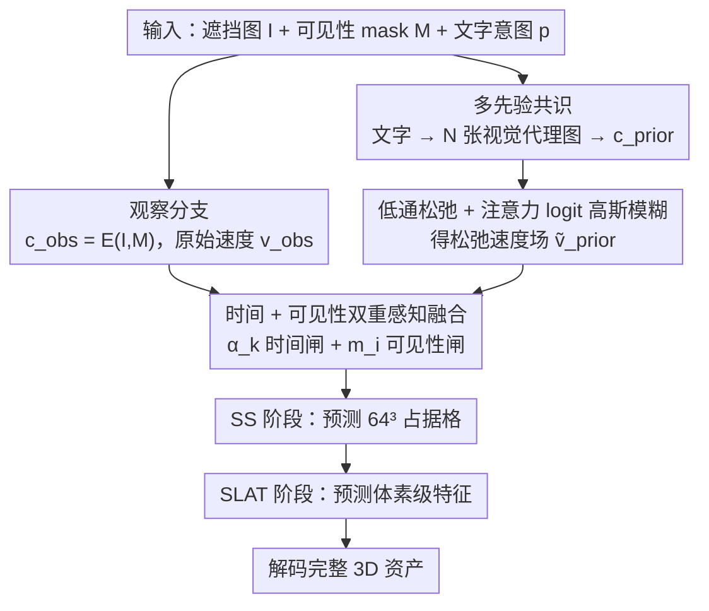

# RelaxFlow: Text-Driven Amodal 3D Generation

**会议**: ICML 2026 Spotlight  
**arXiv**: [2603.05425](https://arxiv.org/abs/2603.05425)  
**代码**: https://github.com/viridityzhu/RelaxFlow  
**领域**: 3D视觉 / 扩散模型 / 多模态VLM  
**关键词**: amodal 3D生成, 文本驱动, 训练免调, 低通松弛, 双分支流模型

## 一句话总结
RelaxFlow 把"用文字补全被遮挡 3D 物体"形式化为一个**双目标控制粒度解耦**问题，提出训练免调的双分支推理框架——观察分支保持像素级硬约束、语义先验分支用"多先验共识 + 注意力 logit 高斯模糊"实现低通松弛——并从理论上证明这一松弛等价于对生成向量场做低通滤波，从而在 SAM3D / TRELLIS 等 SOTA 上把 Point-FID 从 100.38 降到 81.11。

## 研究背景与动机
**领域现状**：image-to-3D 生成（TRELLIS、SAM3D、Trellis-XL 等前馈模型）已经能把单张图变成可用的 3D 资产，路线是把图像 token 喂给条件化的 rectified flow，再分别预测 sparse structure（占据格）和 structured latent（外观）。

**现有痛点**：当输入图被严重遮挡，可见像素本身不足以唯一确定物体类别（背板既可能是床、也可能是沙发、梳妆台）。前馈模型只接受图像 token，遇到这种"语义欠定"时会**坍缩到一种"观察过拟合"的最常见解释**，用户无法干预；而基于优化的 SDS-style 编辑方法虽然能跟随文本，又会过度平滑或破坏可见证据，因为语义梯度和像素重建梯度直接打架。

**核心矛盾**：现有方法用**统一的控制粒度**同时强加两个目标——观察必须**刚性遵守**（视觉保真），文本只是**柔性结构指引**（容忍局部偏差以适配观察）。当二者放在同一条件分支里争夺注意力时，必然出现"要么压住文字、要么破坏观察"的二选一。

**本文目标**：(1) 形式化 text-driven amodal 3D generation 这一新任务；(2) 设计一种**不重训生成器**、能同时满足"观察硬约束 + 文本软指引"的推理时方案；(3) 给出可解释的理论说明为什么这样做能稳定收敛。

**切入角度**：作者观察到，oracle 的"语义传输向量场"$\bm{v}_{\rm sem}$ 在频谱上是**带限的**——类别级几何（"床的形状"）只占低频；而前馈模型直接吃文本/图像 token 时引入的实例细节、纹理冲突属于**高频噪声**。因此只要把语义分支的速度场做一次低通滤波，就能保留"全局几何走廊"、丢掉破坏观察的高频抖动。

**核心 idea**：把生成过程拆成**两条共享状态、独立条件**的 ODE 流——观察分支跑原始 $v_\theta(x_t,t,c_{\rm obs})$，语义分支在**注意力 logit 上做高斯模糊**得到松弛速度场 $\tilde v_\theta=\mathcal R_\sigma[v_\theta(x_t,t,c_{\rm prior})]$，再按"前期靠语义抢全局模式、后期靠观察补细节"的时间相关权重加权融合。

## 方法详解

### 整体框架
RelaxFlow 要解决的是这样一个尴尬：当一张被严重遮挡的图喂给前馈 image-to-3D 生成器时，可见像素不足以唯一确定物体类别，模型只能坍缩到一种"最常见解释"，用户想用文字纠偏却无从插手。它的破题思路是把生成过程拆成**两条共享同一状态、各自独立条件**的 ODE 流：观察分支死守像素证据，语义先验分支被"低通滤波"后只贡献粗粒度类别几何，再按"前期靠语义抢全局、后期靠观察补细节"加权融合。整个模块训练免调，可直接插进任何"图像 token + rectified flow"型生成器（论文以 TRELLIS、SAM3D 为载体）。

输入是被遮挡图像 $I$、可见性 mask $M$、文字意图 $p$；输出是经 Sparse Structure（SS，预测 $64^3$ 占据格）和 Structured Latent（SLAT，预测体素级特征）两阶段流采样后解码的完整 3D 资产。具体落点在每一步 Euler 更新上——原本是单条件的

$$x_{k+1}=x_k+\Delta t\,v(x_k,t_k,c)$$

被替换成双分支共享状态的插值：观察分支照常喂 $c_{\rm obs}=E(I,M)$，语义分支把文字先转成 $N=3$ 张视觉代理图编码成 $c_{\rm prior}$、再过一次注意力 logit 模糊得到松弛速度 $\tilde v_{\rm prior}$，最后按时间权重 $\alpha_k$ 与可见性权重 $m_i$ 融合二者。下面三个设计正是把"文字 → 视觉代理 → 低通速度场"这条 retrofit 通道做到零 adapter 训练的关键。

### 关键设计

**1. 多先验共识：把文字翻译成生成器原生能吃的视觉 token，同时抹掉单图的实例风格污染**

现代前馈 3D 生成器的条件接口是视觉 token 而非文本 embedding，要跟随文字要么加 adapter 重训（昂贵且分布漂移），要么把文字"翻译"成视觉代理——作者选了后者，因为它能把单先验、多先验、用户参考图三种来源统一到同一接口。做法是对一句 prompt 用检索或 Z-Image 生成 $N$ 张共享语义、但外观各异的参考图 $\{(I_p^n,M_p^n)\}$（如"红嘴鸟"采几张红嘴但身体形态各异的样例），把它们的 token 序列**拼成一条长序列一次性喂进 cross-attention**。共享属性在 token 集合里反复出现、累积到更大注意力；个性化纹理彼此冲突、自然被稀释。这个 consensus 直接逼近论文 §3.2 Wasserstein 上界里的残差项 $\delta_{\rm prior}$（视觉代理与真实意图之差），是"无需 adapter 也能跟随文本"得以成立的前提。

**2. 低通松弛 + 注意力 logit 模糊：给语义速度场套低通滤波，只留全局几何、滤掉实例纹理冲突**

如果像 SDS / CFG 那样直接加权拼两个 prompt，高频的实例冲突会在每个 step 不停把状态拽来拽去，把 §3.2 里那条"语义走廊"打成碎片。作者的关键洞察是：oracle 语义传输向量场 $\bm v_{\rm sem}$ 在频谱上是**带限的**（类别级几何只占低频），而 token 冲突引入的实例细节是**高频噪声**，所以只要对语义分支的速度场做低通滤波 $\tilde v_\theta=\mathcal R_\sigma[v_\theta]$，就能加厚语义走廊、保留全局模式而丢掉破坏观察的抖动。理论上（Proposition A.4 + Theorem A.9）只要满足带限假设，这一松弛就严格降低 $L_2$ 路径范数语义误差 $\mathcal E_{\rm sem}$，进而把生成分布到真值的距离上界收紧成

$$\mathcal W_2(p,\hat p)\le C\big(\mathcal E_{\rm obs}+\mathcal E_{\rm sem}(\tilde v)+\delta_{\rm prior}\big)$$

实现上作者不直接在向量场上做卷积（昂贵），而是在 prior 分支 cross-attention 的 logit 矩阵 $L_{i,j}=q_i^\top k_j/\sqrt d$ 上沿 query、key 索引各做一次 1D 高斯卷积 $\tilde L=G_\sigma^{(q)}*_q L *_k G_\sigma^{(k)}$ 再 softmax；由于注意力 token 按 2D/3D 网格排布，这等价于对 logit 做可分离 2D 高斯模糊，并诱导出等价的速度场松弛（Appendix A.4）。一个抽象算子 $\mathcal R_\sigma$ 同时活在证明和 kernel 里，默认 $\sigma=1.0$，性能在 $[0.5,2]$ 内不敏感。

**3. 时间 + 可见性双重感知融合：让语义先验只在"早期 + 真被遮挡的体素"上发力**

低通后的语义分支若全程、全空间介入仍会过度涂改可见区域，所以融合要在时间和空间两维都设闸。时间维用线性 cutoff 调度 $\alpha_k=\max(1-k/K,\,0)\cdot\mathbb 1[k\le\lfloor\rho K\rfloor]$（默认 $\rho=0.2$，即前 20% 步给先验、之后归零），匹配扩散模型"前期定全局 / 后期补细节"的归纳偏置。空间维则对每个体素从已知物体位姿做 z-buffer 投影得到深度差 $\Delta_i=z_i-D'(u_i,v_i)$，经高斯 falloff 得软可见性权重 $m_i\in(0,1]$，SLAT 阶段融合写成

$$v_i=v_{\rm obs,i}+(1-m_i)\,\alpha_k\,(\tilde v_{\rm prior,i}-v_{\rm obs,i})$$

即可见体素几乎完全保留观察速度、只有遮挡体素才接受先验偏移。消融显示去掉这个 mask 比去掉低通松弛掉得还狠（81.1→92.3 vs 81.1→87.1），说明"在该听观察的地方坚决听观察"比"语义走廊有多平滑"更要紧——这是直觉上不显然却被数据证实的关键点。

### 训练策略
**全程零训练、零微调**。所有 backbone（SAM3D / TRELLIS 的 SS + SLAT flow 模型）参数冻结，只在推理时改 cross-attention 计算和 Euler 更新公式。默认 $N=3$ 张先验图、$\sigma=1.0$、$\rho=0.2$，单卡 A40 即可跑通。ExtremeOcc-3D 只在 SS 阶段启用（语义只影响几何），AmbiSem-3D 在 SS 和 SLAT 都启用（语义同时影响结构与外观）；TRELLIS 因没有位姿估计，禁用可见性 mask、其余照搬。

## 实验关键数据

### 主实验

**ExtremeOcc-3D**（264 个 3D-FUTURE/3D-FRONT 中遮挡率 ≥80% 的样例，类别级文字先验）：

| Backbone | 方法 | CLIP_img↑ | CLIP_txt↑ | FID↓ | LPIPS↓ | Point-FID↓ |
|---|---|---|---|---|---|---|
| TRELLIS | baseline | 0.78 | 23.14 | 122.68 | 0.83 | 141.48 |
| TRELLIS | **+ RelaxFlow** | 0.80 | 24.09 | 100.75 | 0.80 | **97.79** |
| SAM3D | baseline | 0.84 | 24.08 | 50.73 | 0.54 | 100.38 |
| SAM3D | Amodal2D+SAM3D | 0.76 | 21.59 | 94.38 | 0.56 | 127.27 |
| SAM3D | Amodal3R | 0.77 | 22.29 | 118.49 | 0.60 | 129.46 |
| SAM3D | **+ RelaxFlow** | **0.87** | **27.26** | **39.44** | **0.51** | **81.11** |

两个 backbone 全指标提升，CLIP_img 与 LPIPS 没有为了跟随文本牺牲观察保真，反而更好——说明语义先验确实只在该出手的地方出手。

**AmbiSem-3D**（21 个 ObjaverseXL 多解模糊样例 + 用户研究，n=32）：

| 方法 | CLIP_img↑ | CLIP_txt↑ | 文本对齐↑ | 3D 保真↑ | 总偏好↑ |
|---|---|---|---|---|---|
| SAM3D | 0.85 | 26.29 | 4.84% | 13.59% | 9.22% |
| TRELLIS (multi-view) | 0.80 | 26.59 | 3.75% | 8.28% | 6.02% |
| SDXL → TRELLIS | 0.81 | 26.76 | 6.09% | 8.91% | 7.50% |
| SDXL → SAM3D | 0.79 | 26.71 | 11.41% | 6.09% | 8.75% |
| **RelaxFlow (ours)** | **0.87** | **27.23** | **73.91%** | **63.13%** | **68.52%** |

人评偏好压倒性领先（68.52% 总偏好），且自动指标在观察与文本两端都最高——这是论文最有说服力的结果：在没有真值的"多解"任务上，用户能感知到 RelaxFlow 真的"听懂了文字又没乱画"。

### 消融实验（ExtremeOcc-3D, SAM3D backbone）

| 配置 | Point-FID↓ | 说明 |
|---|---|---|
| Full RelaxFlow | **81.1** | 完整模型 |
| w/o Low-Pass Relax | 87.1 | 去掉注意力模糊，语义噪声漏进来 |
| w/o Visibility Mask | 92.3 | 语义先验污染可见区域，掉点最狠 |
| cutoff $\rho=0.4$ | 86.5 | 先验介入太久 |
| cutoff $\rho=1.0$ | 89.9 | 全程先验，破坏细节 |
| LP Relax $\sigma=2.5$ | 95.2 | 过度模糊，语义信号也被抹掉 |
| Generated priors (Z-Image) | 82.7 | 改用生成先验替代检索先验 |

### 关键发现
- **可见性 mask 比低通松弛更关键**：去掉前者 Point-FID 掉 11.2，去掉后者只掉 6.0。这反直觉地说明"该听谁的"比"语义信号有多干净"更重要——印证了双分支解耦本身才是核心贡献。
- **$\sigma$ 和 $\rho$ 都有"过犹不及"特征**：$\rho$ 从默认 0.2 拉到 1.0（先验全程参与）反而比 0.4 还差；$\sigma=2.5$ 时语义信号本身被滤掉。说明低通松弛是"恰到好处地降噪"，不是越平滑越好。
- **生成先验和检索先验差距很小**（82.7 vs 81.1）：意味着在没有同类数据池可检索的场景下，直接用 T2I 模型生成代理图也基本够用，方法对先验来源鲁棒。

## 亮点与洞察
- **"控制粒度解耦"这个 framing 非常优雅**：把过去 SDS / CFG 之类"硬塞两个 prompt 一起优化"的混战，重新解释为"硬约束 vs 软指引需要不同频段的速度场"，一句话点破矛盾。
- **理论与实现的对偶很漂亮**：理论上把松弛建模为向量场的低通滤波器、推出 Wasserstein 上界，实现上落到注意力 logit 的 2D 高斯模糊——一个抽象算子 $\mathcal R_\sigma$ 同时活在数学证明和 CUDA kernel 里，且 Appendix A.4 给出二者等价性。这种 "spec 与 code 同构" 的设计可移植到很多 retrofit 类工作。
- **完全训练免调、对 backbone 无侵入**：不需要 adapter、不需要 LoRA、不需要重新跑 flow 训练，纯 inference-time 改造。这意味着任何下游做新的 image-to-3D backbone 都可以零成本接入这套机制。
- **可迁移性强**：注意力 logit 模糊这一招本质是"用注意力的频谱滤波做语义解耦"，思路可直接迁移到 image editing（low-pass 文本 token 注意力以保留底图细节）、video generation（low-pass 时间维以稳定全局动作）、甚至 LLM controllable generation（low-pass system prompt 注意力以让 user prompt 主导细粒度）。

## 局限与展望
- **依赖前馈生成器是 cross-attention 结构**：方法把 $\mathcal R_\sigma$ 落在注意力 logit 上，对纯 MLP 条件注入或离散 token 选择型 backbone 不直接适用。
- **多分支推理有额外开销**：每步要跑两次速度估计 + logit 卷积，runtime 至少翻倍；论文承认运行时变慢、显存"温和增加"，但没给精确数字。
- **依赖位姿估计做 visibility mask**：TRELLIS 因为没有位姿估计就只能砍掉可见性 mask，而消融显示这是掉点最狠的组件——意味着在野外没有标定相机的场景下，RelaxFlow 的优势会缩水。
- **AmbiSem-3D 只有 21 个样例**：是作者新提出的诊断 benchmark，规模小且无 GT，用户研究虽然结果显著，但泛化到更广的真实意图模糊仍需更大规模验证。
- **改进方向**：把可见性 mask 替换成从单图自监督推断的伪可见性（如 SAM mask + depth-anything），即可解锁无标定真实场景；同时可探索把"低通松弛"推广到 token 维度自适应（高频区域强模糊、低频区域弱模糊）以减少全局过平滑。

## 相关工作与启发
- **vs SAM3D / TRELLIS / Amodal3R（前馈 image-to-3D）**：它们要么不接受额外文本控制（SAM3D 默默"硬猜一个最常见解释"），要么需要重训（Amodal3R 用 masked 输入微调）。RelaxFlow 直接以推理时插件形式让用户用文字解歧义，且 Point-FID 反超原 backbone（81.1 vs 100.4），说明 retrofit 路线在可控生成里完全竞争得过 retrain 路线。
- **vs SDXL → 3D 两阶段 pipeline**：先 2D 编辑再 lift 到 3D 的方案会引入几何不一致伪影（用户研究里 SDXL+TRELLIS 总偏好仅 7.5%）。RelaxFlow 在 3D 流的内部解决问题，跳过 2D editing 的几何漂移。
- **vs FlowEdit / 经典 CFG 多 prompt 组合**：CFG 在 score 层加权两条件，但没区分两条件的频谱性质。RelaxFlow 显式把"硬约束保留全频谱、软约束只保留低频"，相当于给 CFG 加了一个频域 prior，且给出了第一手的 Wasserstein 收紧证明。
- **vs Smoothed Energy Guidance (Hong 2024)**：Hong 把 attention blur 当成 regularizer 单独使用，没和"双条件多目标"任务连起来；RelaxFlow 把它定位为**两个条件分支之间冲突仲裁器**，并配套理论+多先验共识+可见性融合三件套，让一个旧 trick 在新任务上长出了系统级价值。

## 评分
- 新颖性: ⭐⭐⭐⭐⭐ 形式化了一个真实存在但没人正面解决的任务（text-driven amodal 3D），且给的解法既有 framing 突破又有数学根据。
- 实验充分度: ⭐⭐⭐⭐ 双 backbone × 双 benchmark + 用户研究 + 完整消融 + 超参敏感性都覆盖到了；扣一星是因为 AmbiSem-3D 仅 21 例、且没有报告运行时具体数字。
- 写作质量: ⭐⭐⭐⭐⭐ 三层结构（任务定义 → 理论分析 → 实现）非常清晰，图 2 的 corridor 概念图与图 3 的 pipeline 互补，附录给出了完备的证明。
- 价值: ⭐⭐⭐⭐⭐ 训练免调 + 即插即用 + 对所有 cross-attention 型 3D 生成器都适用，且"低通松弛 + 多条件解耦"这个范式可迁移到 image / video / LLM 可控生成，影响面远超 3D。

<!-- RELATED:START -->

## 相关论文

- [\[AAAI 2026\] NURBGen: High-Fidelity Text-to-CAD Generation through LLM-Driven NURBS Modeling](../../AAAI2026/3d_vision/nurbgen_high-fidelity_text-to-cad_generation_through_llm-driven_nurbs_modeling.md)
- [\[CVPR 2026\] Text–Image Conditioned 3D Generation](../../CVPR2026/3d_vision/text-image_conditioned_3d_generation.md)
- [\[CVPR 2026\] Are We Ready for RL in Text-to-3D Generation? A Progressive Investigation](../../CVPR2026/3d_vision/are_we_ready_for_rl_in_text-to-3d_generation_a_progressive_investigation.md)
- [\[ICCV 2025\] Amodal Depth Anything: Amodal Depth Estimation in the Wild](../../ICCV2025/3d_vision/amodal_depth_anything_amodal_depth_estimation_in_the_wild.md)
- [\[CVPR 2026\] Multimodal Semantic Bias Mitigation for Diverse Text-To-3D Generation](../../CVPR2026/3d_vision/multimodal_semantic_bias_mitigation_for_diverse_text-to-3d_generation.md)

<!-- RELATED:END -->
