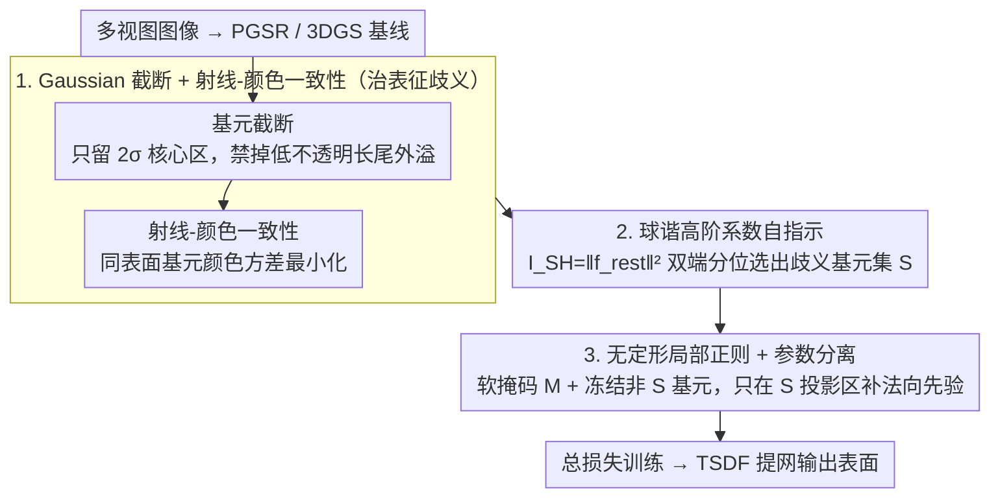

# Revisiting Photometric Ambiguity for Accurate Gaussian-Splatting Surface Reconstruction

**会议**: ICML 2026  
**arXiv**: [2605.12494](https://arxiv.org/abs/2605.12494)  
**代码**: 项目主页 https://fictionarry.github.io/AmbiSuR-Proj/  
**领域**: 3D 视觉 / 表面重建 / Gaussian Splatting  
**关键词**: 光度歧义、Gaussian 截断、射线-颜色一致性、SH 自指示、稀疏正则

## 一句话总结
AmbiSuR 把 Gaussian Splatting 的两类内生光度歧义（基元边缘外溢、像素混合欠约束）显式建模并用截断 + 射线-颜色一致性消歧，再借高阶球谐系数作"自指示器"找出歧义高风险基元并做无定形局部先验正则，在 DTU 上把平均 Chamfer 距离降到 0.46，超过此前最优 GeoSVR (0.47)。

## 研究背景与动机
**领域现状**：把多视角图像变成 3D 表面已经从隐式 SDF（NeuS、Neuralangelo）转向显式 3DGS 家族（2DGS、GOF、PGSR、MILo、GeoSVR），后者在效率和细节上明显占优。这些方法的共同前提是"多视角光度一致性"——同一空间点在不同视角下颜色应一致。

**现有痛点**：现实世界里光度一致性几乎不可能完美满足——无纹理区、反射面、阴暗处、覆盖不足等会让多视角三角化变得严重病态；现有缓解手段要么是为反射做复杂射线建模（限定场景），要么是套上 MonoDepth/Normal 大模型做粗粒度正则（容易把整张图都"平滑掉"），都没有从 3DGS 表征本身追根溯源。

**核心矛盾**：3DGS 的渲染等式 $\mathbf{C} = \sum_i c_i \tilde\alpha_i \prod_{j<i}(1-\tilde\alpha_j)$ 是按"加权和等于真值"为目标的，这对像素颜色合成够用，但对"还原唯一表面"则严重欠约束——任意一组 $\{c_i, w_i\}$ 只要和等于 $\mathbf{C}_{gt}$ 就被认为正确，导致重建被"伪几何 + 视相关效应"骗过去。

**本文目标**：从表征和监督两个层面同时消歧——既要在前向计算里堵住 Gaussian 自身的几何歧义，又要在 supervision 不可靠时主动识别歧义并给出有指向的先验补偿。

**切入角度**：作者系统拆解 3DGS 流水线后定位到两类内生表征歧义（基元低不透明度长尾、基元色彩混合自由度过高），同时观察到 SH 系数本身可作为捕获 supervision 歧义的"自然探测器"——高阶 SH 异常大暗示拟合视相关残差，异常小则暗示监督不足。

**核心 idea**：用"基元截断 + 射线-颜色方差"两个温和约束治本，把表征端的歧义先压住；再用 SH 高阶系数双端指示（上/下分位）抓出问题基元，配以仅对这些基元有效的无定形局部法向正则做最小侵入修复。

## 方法详解

### 整体框架
AmbiSuR 要解决的是 3DGS 表面重建里被长期容忍的"光度歧义"——同一空间点在不同视角下颜色本该一致，但 3DGS 的加权求和渲染让一堆错误的基元组合也能凑出正确像素，于是几何被"伪表面 + 视相关效应"骗过去。它把这件事拆成两层来治：表征端的歧义来自基元本身，监督端的歧义来自图像不可靠。方法因此套在 PGSR 这类 3DGS 管线上加两块改造。前一块是 Gaussian Splatting 光度消歧，在前向渲染时截断每个基元的低不透明边缘、并加一条射线-颜色一致性约束，从源头压住基元层面的歧义；后一块是球谐歧义自指示，用每个基元的高阶 SH 能量 $I_{SH} = \|f_{\text{rest}}\|_2^2$ 作探针，按上下分位挑出歧义高风险基元集合 $\mathcal{S}$，只在它们的投影区域内补几何先验、并冻结其余基元。整套训练由总损失 $\mathcal{L} = \mathcal{L}_{photo} + \tau\mathcal{L}_{geo} + \mu_1\mathcal{N} + \mu_2\mathcal{R}$ 驱动，并提供一个用 metric depth 的强版本 AmbiSuR 和一个只用 mono depth 的通用版本 AmbiSuR-Mono。

### 关键设计

**1. Gaussian 基元截断 + 射线-颜色一致性：从前向计算堵住表征层面的两类歧义**

3DGS 表征本身埋了两个雷：一是每个 Gaussian 有一条低不透明度的长尾边缘，这些"几乎透明"的外溢部分会在不同视角间被反复错配，制造出根本不存在的几何；二是像素颜色是若干基元按 alpha 加权混出来的，只要加权和等于真值就算对，单个基元的颜色因此可以随便取，监督完全约束不住。截断针对第一个雷：把每个 Gaussian 的投影分成核心区 $\mathcal{G}_{core}$ 和边缘区 $\mathcal{G}_{edge}$，渲染时只保留核心部分，$\tilde\alpha_{\mathcal{T}}(\mathbf{x}) = \alpha\,\mathcal{G}_{core}(\mathbf{x})\cdot\mathbb{1}(\|\mathbf{x}-\mu_i\|\le \gamma\sigma_i)$，取 $\gamma=2$ 相当于强制每个基元只在自己的 $2\sigma$ 范围内"发声"，物理上直接禁掉了长尾被跨视角错配的劣势行为。射线-颜色一致性针对第二个雷：把 alpha-blending 看成沿射线的一条概率分布，要求代表同一表面的基元应有相近的视相关颜色，于是定义

$$\mathcal{R}(\mathbf{r}) = \sum_i w_i\|c_i - \mathbf{C}\|_2^2$$

且只让颜色项 $c_i$ 参与梯度。这一步把"加权和等于真值"的弱约束升级成"各颜色项之间要彼此一致"，逼着每个基元去拟合表面真实的光学属性，而不是靠混合作弊。

**2. 球谐高阶系数作为光度歧义自指示器：不训额外网络就定位监督端的问题基元**

监督端的歧义没有外部 oracle 告诉你哪儿不可靠，但作者发现 3DGS 本来就要学的球谐系数恰好是天然探针。把基元颜色函数按 SH 展开 $C(\mathbf{d}) = \bar C + \sum_i \beta_i Y_i(\mathbf{d})$，由正交性可证视相关偏差的能量正比于 $\sum_i \beta_i^2$，于是直接用高阶系数能量 $I_{SH} = \|f_{\text{rest}}\|_2^2$ 当指示量。关键是"双端指示"：$I_{SH}$ 异常高（落在前 $\eta_U$ 分位）说明这个基元在用高阶 SH 硬背视相关残差，对应监督前后不一致；$I_{SH}$ 异常低（落在后 $\eta_L$ 分位）说明监督不足、或外观被错误烘焙进基础色，二者各代表一类典型歧义。取并集 $\mathcal{S} = \mathcal{S}_U\cup\mathcal{S}_L$ 就得到歧义高风险基元集。因为 SH 是训练的附带产物，把它当指示器几乎零额外计算，是真正的 free-lunch；而双端同时覆盖"过拟合视相关效应"和"欠拟合无纹理"两种场景，比另起一个分割或不确定性网络都轻得多。

**3. 无定形局部正则 + 参数分离：先验只补在最弱的地方，不碰已收敛的好区域**

传统做法是在整张图上均匀施加几何先验，结果连本来重建得很好的区域也被一起平滑掉。本文改成两层定位。第一层冻结所有非歧义基元的参数，并把不透明度 $\alpha$ 和尺度 $s$ 排除在正则之外，只允许调方向相关属性，避免破坏已收敛的形状。第二层按指示集 $\mathcal{S}$ 把每个像素的"基元归属概率"积成一张软掩码

$$\mathbf{M} = \sum_i \mathbb{1}(i\in\mathcal{S})\,\tilde\alpha_i\prod_{j<i}(1-\tilde\alpha_j)$$

再用 $\mathcal{N} = \mathrm{Mean}(\mathbf{M}\cdot(1 - \mathbf{N}_{\mathbf{D}}\cdot\mathbf{N}_P))$ 把"渲染深度导出的法向 $\mathbf{N}_{\mathbf{D}}$ 与先验法向 $\mathbf{N}_P$ 的角度差"乘上软掩码，使先验只在歧义基元的投影区域生效。这种"指示器选基元、软掩码选像素"的两层定位让先验物理上只补在缺信息的局部，同时对单目、多视角、立体匹配等各种 prior 源都保持兼容。

### 损失函数 / 训练策略
总目标 $\mathcal{L} = \mathcal{L}_{photo} + \tau\mathcal{L}_{geo} + \mu_1\mathcal{N} + \mu_2\mathcal{R}$，固定 $\tau=0.1, \mu_1=0.1, \mu_2=10^{-5}$；训练 30k 次迭代；metric 版本用 Depth Anything 3 多视角深度，Mono 版本用 Depth Anything V2 单目深度；最后用 TSDF 提网。

## 实验关键数据

### 主实验

| 数据集 | 指标 | 之前最佳 | AmbiSuR | 备注 |
|--------|------|----------|---------|------|
| DTU 平均 | Chamfer ↓ | 0.47 (GeoSVR) | 0.46 | 训练 0.6h |
| DTU 24/37/40 | Chamfer ↓ | 0.32/0.51/0.30 (GeoSVR) | 0.32/0.48/0.31 | 多场景持平或更优 |
| Tanks&Temples | F1 ↑ | 各对手最佳 | 全部 F1 最高 | 大场景含大量光度歧义 |
| 训练时间 | — | NeuS >12h、Neuralangelo >128h | 0.6h | 显式 + 高效 |

### 消融实验

| 配置 | 关键指标 | 说明 |
|------|---------|------|
| 仅 PGSR baseline | 0.52 (DTU Chamfer) | 起点 |
| + 基元截断 | 改善但有限 | 仅治表征歧义 |
| + 射线-颜色一致性 | 改善叠加 | 抑制混合歧义 |
| + SH 双端指示 + 无定形正则 | 收敛到 0.46 | 治监督端 |
| 单端指示 vs 双端 | 双端更稳 | 异常低 SH 也有指示价值 |
| 全图正则 vs 无定形 | 无定形保住细节 | 验证选择性正则收益 |

### 关键发现
- "代表性"基元的不透明长尾是被忽视的歧义源——简单截断就能拿到显著收益，说明 3DGS 自身的表征瑕疵被过度容忍了多年。
- 高阶 SH 系数是"免费的歧义探测器"，对预算极度敏感的工业 3D 重建很友好，因为不需要再训分类器或叠加大模型。
- AmbiSuR-Mono 用单目深度也能逼近 metric 版本，说明设计对 prior 质量的鲁棒性来自于"只在歧义处用 prior"，而非依赖某种特定深度源。

## 亮点与洞察
- "把 SH 当指示器"是少见的真正 free-lunch——把已有学习参数转化为新功能的指示量，几乎零额外计算，思路可迁移到其它显式表征（如 3DGS-SLAM 中的不确定性）。
- 射线-颜色方差把"加权和正确"升级为"分布要紧"，是一种对欠约束监督的优雅紧化，对其它"加权聚合"任务（如 NeRF 的密度场、光场重建）也有借鉴价值。
- "基元冻结 + 软掩码 + 仅对方向参数"三层精细控制，是无定形正则的关键工程化技巧，体现了"在哪里加 prior"比"加什么 prior"更重要的设计观。

## 局限与展望
- 截断阈值 $\gamma$ 与上/下分位 $\eta_U, \eta_L$ 仍需按数据集小调（DTU 与户外用了不同值），缺少自适应机制；
- 对透明物体、强镜面（BRDF 与 SH 假设强冲突）尚未深入验证，可能需要更强的视相关建模；
- 指示器基于单帧 SH，未利用时序/视角间一致性，在动态场景下需要扩展。

## 相关工作与启发
- **vs 2DGS / GOF / PGSR / MILo / GeoSVR**：这些工作集中在"几何对齐 + 高质量网格提取"，本文反向追溯到"光度歧义"层并给出表征 + 监督的双重消歧方案，与它们正交。
- **vs MonoSDF / Neuralangelo**：SDF 系列依赖隐式高表达 MLP，训练动辄数十小时；AmbiSuR 用显式 3DGS 在 0.6h 内取得超越，凸显显式表征的工程优势。
- **vs VCR-GauS / 各类几何 prior 嵌入**：先前是在全图均匀做 prior 强约束，本文用 SH 自指示器把先验聚焦到"真正缺信息"的局部，避免了"被 prior 平滑掉细节"的通病。

## 评分
- 新颖性: ⭐⭐⭐⭐ 把"SH 高阶系数当歧义指示器"和"射线-颜色方差"组合是首次出现的视角
- 实验充分度: ⭐⭐⭐⭐ DTU + T&T 全套对比，多种 prior 源测试，缺一些反射 / 透明物体专项
- 写作质量: ⭐⭐⭐⭐ 论证按表征-监督两侧分层展开，公式与可视化配合很好
- 价值: ⭐⭐⭐⭐ 0.6h 训练即超过此前 SOTA，且对 prior 鲁棒，工业可落地

<!-- RELATED:START -->

## 相关论文

- [\[AAAI 2026\] MeshSplat: Generalizable Sparse-View Surface Reconstruction via Gaussian Splatting](../../AAAI2026/3d_vision/meshsplat_generalizable_sparse-view_surface_reconstruction_via_gaussian_splattin.md)
- [\[AAAI 2026\] SparseSurf: Sparse-View 3D Gaussian Splatting for Surface Reconstruction](../../AAAI2026/3d_vision/sparsesurf_sparse-view_3d_gaussian_splatting_for_surface_reconstruction.md)
- [\[NeurIPS 2025\] GeoSVR: Taming Sparse Voxels for Geometrically Accurate Surface Reconstruction](../../NeurIPS2025/3d_vision/geosvr_taming_sparse_voxels_for_geometrically_accurate_surface_reconstruction.md)
- [\[ICCV 2025\] SurfaceSplat: Connecting Surface Reconstruction and Gaussian Splatting](../../ICCV2025/3d_vision/surfacesplat_connecting_surface_reconstruction_and_gaussian_splatting.md)
- [\[CVPR 2026\] Neural Gabor Splatting: Enhanced Gaussian Splatting with Neural Gabor for High-frequency Surface Reconstruction](../../CVPR2026/3d_vision/neural_gabor_splatting.md)

<!-- RELATED:END -->
