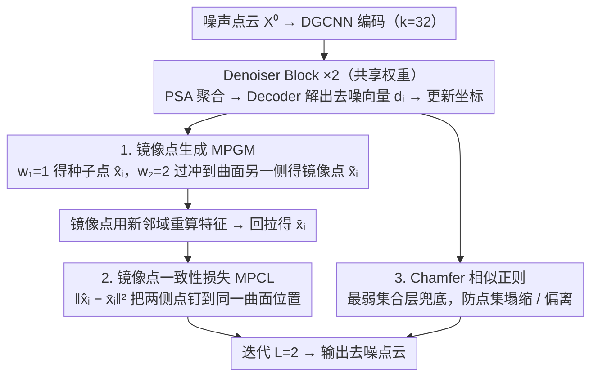

# SIMPC: Learning Self-Induced Mirror-Point Consistency for Unsupervised Point Cloud Denoising

**会议**: ICML 2026  
**arXiv**: [2605.26894](https://arxiv.org/abs/2605.26894)  
**代码**: 无  
**领域**: 3D视觉  
**关键词**: 点云去噪, 无监督学习, 镜像点一致性, 几何先验, 确定性对应

## 一句话总结
SIMPC 提出在**同一个噪声点**上沿去噪向量做"对称延伸"得到一个位于曲面另一侧的镜像点，再用 Mirror-Point Consistency Loss 强制两点的去噪目标重合，从而把无监督点云去噪从"在多份噪声变体间找统计对应"换成"在单点内部找确定性几何对应"，在 PUNet/PCNet 合成数据和 Paris-Rue-Madame / Kinect 真实扫描上全面超越无监督 SOTA，并击败若干有监督方法。

## 研究背景与动机

**领域现状**：点云去噪是表面重建、语义理解等下游任务的关键预处理。有监督方法（PD-Refiner、StraightPCF、PD-LTS 等）依赖 CAD 合成的成对 noisy–clean 数据，泛化受限；而 LiDAR 等设备能不断产生海量裸噪声扫描，因此**无监督点云去噪**是更现实的方向。

**现有痛点**：图像去噪可以靠像素索引把多份噪声观测对齐到同一个干净像素（Noise2Noise / Noise2Void 那一脉），但点云**没有固定空间索引**，噪声直接扰动了点坐标本身（既承载位置又承载几何），跨变体的点对应天然破碎。现有两条无监督路线都不彻底：
- Noise-based（Noise4Denoise、Noise2Score3D）注入额外噪声 $u\sim\mathcal{N}(0,\Delta\sigma)$ 让网络预测反向噪声 $-u$，但这种对应纯靠随机噪声驱动，**并没有指向真实曲面**，推理时还要靠对噪声分布的额外假设来缩放外推。
- EMD-based（NoiseMap、U-CAN）用 Earth Mover's Distance 在两份噪声变体之间做最优传输，对应比 Noise-based 更结构化，但传输是**点集分布级**的，无法保证"被对上的两个点真的来自同一段曲面"，本质上仍是模糊对应。

**核心矛盾**：现有方法都把"找对应"放在**多份独立采样的噪声观测**之间——只要观测是独立采样的，对应就必然带有随机性，去噪目标也就漂移。要让无监督去噪稳，得换一个数据源去构造对应。

**本文目标**：在不引入新的噪声观测、不引入分布假设的前提下，**仅从一个噪声点自身**构造出一个能与之严格一一对应、且确定性地落在底层曲面"另一侧"的伴生点，让两个点的去噪目标必须收敛到同一处。

**切入角度**：去噪向量 $d_i$ 本身就是网络对"该点应该往曲面哪边移多少"的估计——这是一个隐含的几何先验。如果用 $w_1=1$ 倍 $d_i$ 把点拉到曲面附近得到 $\hat{x}_i$，再用 $w_2=2$ 倍 $d_i$ 把点过冲到曲面**另一侧**得到镜像点 $\tilde{x}_i$，那么 $\hat{x}_i$ 与 $\tilde{x}_i$ 关于曲面"几何对称"，二者再各自去噪一次得到的 $\hat{x}_i$、$\bar{x}_i$ 就**必然指向同一片曲面**——这是一个无须额外观测、由模型自身诱导出的确定性对应。

**核心 idea**：用"过冲–回拉"把单个噪声点裂成一对几何对称的镜像点，再用 MSE 强制两侧回拉到同一目标，把"跨观测的模糊对应"换成"自诱导的确定性对应"。

## 方法详解

### 整体框架

SIMPC 要解决的核心难题是：无监督点云去噪缺一个可靠的"哪里是曲面"的监督信号，以往都靠多份独立采样的噪声观测互相对齐，对应天然带随机性。它的破解办法是把"找对应"从数据空间挪进模型内部——让网络对每个点预测的去噪向量 $d_i$ 充当几何先验，用它在单点上自己造出一个确定的对称伴生点，再逼两者回拉到同一处。

整条 pipeline 沿用迭代去噪范式。一份噪声点云 $X^0\in\mathbb{R}^{N\times3}$ 先经 $T=3$ 层 DGCNN 编码（$k=32$，邻域特征按 $[g_i\|g_j-g_i]$ 拼接后过 MLP）得到初始特征 $U^0\in\mathbb{R}^{N\times 256}$，随后串两个共享权重的 Denoiser Block（$L=2$）。每个 Block 内部三步走：先用 Point Self-Attention 在空间近邻 $\hat{\mathcal{N}}_i=\mathrm{KNN}(x_i, X^l, k)$ 上聚合特征 $f_i=\sum_{j\in\hat{\mathcal{N}}_i}\alpha_{ij}\odot h(u_j)$，再用 MLP+tanh 的 Decoder 解出归一化的点级去噪向量 $d_i\in\mathbb{R}^3$，最后更新坐标 $x_i^l = x_i^{l-1} + d_i^l$。SIMPC 的新意全部加在这个 $d_i$ 之上：每个 Block 额外用 $d_i$ 生成镜像点并施加一致性约束。训练时按 U-CAN 协议取两个独立采样的噪声变体 $X_a, X_b$，但**不**在它们之间做 EMD 对齐，而是各自跑镜像点流程；推理时直接对单份点云迭代 $L$ 次输出去噪结果。

### 关键设计

**1. Mirror-Point Generation Module（MPGM）：把一个噪声点裂成一对几何对称的镜像点**

旧方法的对应来自两份独立采样的噪声观测，只要观测独立，配对就必带随机性，去噪目标随之漂移。MPGM 的破法是只用一个噪声点 $x_i$ 自诱导出它的伴生点：把当前 Block 预测的去噪向量 $d_i$ 看成对"曲面方向 + 到曲面距离"的隐式估计，先以 $w_1=1$ 走正常一步得到种子去噪点 $\hat{x}_i = x_i + w_1 d_i$，再以 $w_2=2$ 做**对称延伸**把点过冲到曲面另一侧得到镜像点 $\tilde{x}_i = x_i + w_2 d_i$——这一步几何上等价于以底层曲面为镜面把 $\hat{x}_i$ 反射过去。镜像点落在新位置后用**新邻域** $\tilde{\mathcal{N}}_i=\mathrm{KNN}(\tilde{x}_i, X^l\setminus\{x_i\}, k)$ 重算特征 $\tilde{f}_i=\mathrm{PSA}([u_i\|\tilde{x}_i], \{[u_j\|x_j]\}_{j\in\tilde{\mathcal{N}}_i})$，过同一个 Decoder 得到镜像去噪向量 $\tilde{d}_i$，回拉得 $\bar{x}_i=\tilde{x}_i+\tilde{d}_i$。

这样得到的对应**完全由同一个 $x_i$ 和同一份 $d_i$ 决定**，所以是确定的而非采样出来的；又因为镜像点在曲面另一侧、邻域也不同，模型相当于从两个互补视角去观测同一片曲面，信息量比"对自己做一次去噪"更大。$w_2=2$ 这个取值不是搜出来的而是几何推出来的：它让 $\hat{x}_i$ 与 $\tilde{x}_i$ 到曲面的距离严格相等，消融里 $w_2=1.5$（偏近）和 $w_2=2.5$（过冲过远）都会均匀掉点，印证对称才是甜点。

**2. Mirror-Point Consistency Loss（MPCL）：把两侧回拉点钉到同一曲面位置**

有了确定性配对还需要一个能优化的信号把它兑现。曲面位置之所以难以无监督学到，本质是模型缺一个**点级**的位置锚，而 MPGM 恰好提供了一对明确对称、本应重合的点。MPCL 就直接对每个点做点对点的硬一致约束：

$$\mathcal{L}_{\mathrm{MPC}}=\sum_{i=1}^{N}\|\hat{x}_i - \bar{x}_i\|_2^2$$

它不像 Chamfer 那样只要求"集合层面对齐就行"，也不像 EMD 那样在分布上做软匹配，而是要求每个噪声种子和它的镜像收敛到同一个物理位置。关键在于：只有当 $\hat{x}_i$ 和 $\bar{x}_i$ 真的同时落在底层曲面上时，这个损失才能降到 0，所以最优解被几何地钉死在曲面上，缓解了 EMD 方法常见的"对齐了但整体偏离曲面"现象——消融中 EMD-only 的 P2M（18.87）远高于其 CD 的比值异常，正是这种偏离的证据。

**3. Chamfer-only Similarity Regularization：用最弱的集合层先验兜底防塌缩**

把找对应的责任全交给 MPCL 后，跨变体的相似约束就只需承担"别让点集整体塌缩或被 MPCL 拉离原始分布"这一件事，不再负责对应。所以作者把它退化成最轻的 Chamfer 正则，彻底弃用 EMD：

$$\mathcal{L}_{\mathrm{SR}}^l = \mathrm{CD}(X_a^l, X_b^l) + \mathrm{CD}(X_a^{l-1}, X_b^l) + \mathrm{CD}(X_b^{l-1}, X_a^l)$$

消融把这个分工讲得很直白：单用 $\mathcal{L}_{\mathrm{SR}}(\mathrm{CD})$ 在 3% 噪声下 P2M 飙到 36.20，单用 $\mathcal{L}_{\mathrm{SR}}(\mathrm{EMD})$ 也只能到 18.87，而 $\mathcal{L}_{\mathrm{MPC}}+\mathcal{L}_{\mathrm{SR}}(\mathrm{CD})$ 直接降到 13.85——确定性对应才是性能主因，集合层正则用最简单的 CD 就够，反而是更复杂的 EMD 会用它的模糊性污染 MPCL 的硬对应。

### 损失函数 / 训练策略

总损失是每层 Denoiser Block 的 MPCL 与 CD 正则之和：$\mathcal{L}_{\mathrm{total}}=\sum_{l=1}^{L}(\mathcal{L}_{\mathrm{MPC}}^l + \mathcal{L}_{\mathrm{SR}}^l)$，$L=2$。训练数据为 PUNet 40 形状，按 bounding sphere 半径的 0.5%–2% 注入高斯噪声；优化器 Adam，lr $=1\times10^{-4}$，100 epoch，batch=16，单卡 RTX 4090。

## 实验关键数据

### 主实验

PUNet 高斯噪声（CD/P2M $\times 10^5$，越小越好；摘录 50K 点 1% 与 10K 点 3% 两个代表性档位）：

| 数据集/档位 | 指标 | 之前无监督 SOTA | SIMPC | 提升 | 对照有监督 SOTA |
|------|------|----------------|-------|------|----------------|
| PUNet 50K 1% | CD↓ | 8.33 (Noise2Score3D) | **5.81** | -30% | PD-Refiner 4.66 |
| PUNet 50K 1% | P2M↓ | 2.65 (Score-U) | **1.02** | -61% | PD-Refiner 0.45 |
| PUNet 50K 3% | CD↓ | 24.34 (Noise2Score3D) | **12.58** | -48% | PD-LTS 18.52（被 SIMPC 反超） |
| PUNet 50K 3% | P2M↓ | 17.04 (Noise2Score3D) | **6.45** | -62% | PD-LTS 10.67（被 SIMPC 反超） |
| PUNet 10K 3% | CD↓ | 36.66 (U-CAN) | **34.42** | -6% | PD-Refiner 30.77 |
| PUNet 10K 3% | P2M↓ | 18.42 (U-CAN) | **13.85** | -25% | PathNet 24.04（被 SIMPC 反超） |

PCNet 高斯 + Kinect 真实扫描：

| 数据集/档位 | 指标 | 最强无监督 baseline | SIMPC | 备注 |
|------|------|---------------------|-------|------|
| PCNet 50K 3% | CD↓ / P2M↓ | Score-U 39.28 / 11.74 | **18.62 / 4.15** | 反超有监督 HybridPF (19.10/4.80) |
| Kinect 真实扫描 | CD↓ / P2M↓ | Score-U 15.85 / 7.33 | **13.01 / 6.35** | 反超 4 个有监督方法（最好 StraightPCF 13.46/7.39）|

### 消融实验（PUNet 10K，三档高斯噪声，CD/P2M $\times 10^5$）

| 配置 | 1% CD / P2M | 2% CD / P2M | 3% CD / P2M | 说明 |
|------|--------------|--------------|--------------|------|
| $\mathcal{L}_{\mathrm{SR}}(\mathrm{CD})$ only | 18.91 / 2.47 | 37.84 / 13.91 | 65.73 / 36.20 | 集合级 CD 在大噪下崩 |
| $\mathcal{L}_{\mathrm{SR}}(\mathrm{EMD})$ only | 26.54 / 7.64 | 31.88 / 12.41 | 41.04 / 18.87 | EMD 对应模糊，P2M 高 |
| **$\mathcal{L}_{\mathrm{MPC}}+\mathcal{L}_{\mathrm{SR}}(\mathrm{CD})$（Full）** | **20.25 / 3.60** | **28.82 / 7.13** | **34.42 / 13.85** | 主因是 MPCL |
| $w_2=1.5$（Near） | 20.77 / 4.06 | 29.31 / 7.68 | 35.10 / 14.55 | 非对称偏小 |
| $w_2=2$（Symmetry） | 20.25 / 3.60 | 28.82 / 7.13 | 34.42 / 13.85 | 几何对称最优 |
| $w_2=2.5$（Far） | 21.39 / 4.84 | 30.13 / 8.54 | 36.33 / 15.25 | 过冲过远引入额外扰动 |

### 关键发现
- **MPCL 是绝对主力**：把损失从 EMD 换成 MPCL，3% 噪声 P2M 从 18.87 砍到 13.85（-27%），CD 从 41.04 砍到 34.42（-16%）。
- **几何对称 $w_2=2$ 是甜点，非搜出来而是推出来的**：$w_2$ 偏离 2（无论 1.5 或 2.5）都会均匀掉点，对应附录里"几何对称保证两侧距曲面等距"的理论解释。
- **P2M 改善幅度普遍大于 CD**：说明 SIMPC 的去噪结果不只是"看起来像点云"，而是真的贴在曲面上——这正是确定性对应直接优化的目标。
- **非高斯噪声（Laplacian / Discrete）下泛化最强**：Discrete 噪声 50K 1% 档位 SIMPC P2M 0.32，逼近有监督最好 PD-Refiner 0.12，远低于第二好无监督 Score-U 0.82——说明 SIMPC 没有像 noise-based 那样过拟合到训练噪声分布。

## 亮点与洞察
- **把"找对应"从数据空间挪到模型空间**：以往无监督去噪都在"如何构造更好的多份噪声观测"上做文章（Noisier2Noise、N2N3D、U-CAN），SIMPC 反其道而行——既然多观测必然带随机性，那就**只用一份观测**，让模型自己的预测 $d_i$ 充当几何先验来生成对应。这把对应从一个数据问题改成了一个网络自反馈问题。
- **过冲–回拉是一招很可迁移的"自监督几何构造"**：把"在曲面上"这个隐式目标，转换成"两个明确对称的点必须重合"这个显式 MSE 目标。同样思路理论上可迁移到无监督表面重建、SDF 拟合、甚至无监督 3D 配准——任何"对应难定义但局部几何先验易得到"的任务都可以套这个范式。
- **极简损失击败复杂传输**：放弃 EMD 后只用 Chamfer 兜底，反而让 MPCL 的确定性约束发挥到极致，证明在有强一致信号时，分布层面的软对齐越简单越好——别让 EMD 的模糊性反过来污染 MPCL 的硬对应。
- **超越有监督的现象值得深究**：SIMPC 在 PCNet 3% 和 Kinect 真实扫描上反超多个有监督方法。原因在于有监督方法依赖 CAD 合成数据的噪声假设，而 SIMPC 的几何先验是从待去噪点云**本身**提取的，对真实噪声更鲁棒——这是无监督路径在分布外场景上的天然优势。

## 局限与展望
- 作者承认未深入讨论的局限：MPGM 完全依赖 Denoiser Block 当前预测的 $d_i$ 来确定镜像方向，**冷启动阶段** $d_i$ 噪声很大、方向估计不准，镜像点可能根本不在曲面对侧，此时 MPCL 会拽错方向。论文用 $L=2$ 的迭代缓解，但没有报告训练前期的收敛曲线。
- **$w_1, w_2$ 的固定取值依赖局部曲面"近似平面"假设**：在高曲率细节区域，"对称延伸"未必真的把镜像点送到曲面另一侧，这可能是 PCNet（含细节较多）相对 PUNet 的 CD 改进幅度更小（30% vs 48% @ 3%）的隐性原因。可改进方向是按局部曲率自适应预测 $w_2$。
- **只对 Gaussian/Laplacian/Discrete 等数学噪声做了系统评测**，对 LiDAR 多路径、镜面反射、动态物体伪影等真实复杂噪声只有 Kinect/Paris 的定性图，缺乏定量。
- **$L=2$ 的迭代上限可能是性能瓶颈**：扩散去噪范式（PD-Refiner、PD-LTS）通常用更多步，但 SIMPC 每步要算镜像点+二次 PSA，开销翻倍，限制了堆深度。后续可探索镜像点的轻量化变体。

## 相关工作与启发
- **vs Noise4Denoise / Noise2Score3D（Noise-based）**：他们靠外注入噪声 $u$ 构造"更脏–更干净"的对应，推理时要靠固定/自适应缩放外推到干净点；SIMPC 不注入任何噪声，对应直接由模型自身预测的 $d_i$ 诱导，**不需要任何噪声分布假设**，因此在非 Gaussian 噪声上提升尤其大。
- **vs NoiseMap / U-CAN（EMD-based）**：他们用 EMD 在两份噪声变体间做最优传输，得到的是"分布对齐"但点级未必落在曲面上（U-CAN 在 50K 3% 上 CD=24.79 但 P2M=18.63，比值异常高就是证据）；SIMPC 用 MPCL 把对应钉到点级，CD 和 P2M 等比例下降。
- **vs PD-Refiner / StraightPCF / PD-LTS（有监督）**：这些方法依赖 CAD 合成 noisy–clean 配对，需要大量人工设计噪声；SIMPC 仅需裸噪声扫描就能训，且在真实扫描（Kinect、Paris-Rue-Madame）上反超它们，证明"自监督的几何先验比合成数据的噪声先验更接近真实分布"。
- **vs IterativePFN（迭代去噪范式开创者）**：架构借鉴其 DGCNN+迭代设计，但把训练信号从有监督替换为 MPCL，是"把同一架构无监督化"的优雅范例。

## 评分
- 新颖性: ⭐⭐⭐⭐⭐ "用模型自身预测的去噪向量构造对称镜像点"是一个非常干净、可解释、且和点云去噪的几何本质直接对齐的 idea，跳出了"对应必须来自多份观测"的惯性思维。
- 实验充分度: ⭐⭐⭐⭐ 覆盖 PUNet/PCNet 合成数据 × 3 档高斯 + 4 种非高斯 + Kinect/Paris 两个真实数据集，消融精确隔离 MPCL 与 $w_2$；扣 1 星是因为缺少训练动态分析和高曲率区域的 failure case 可视化。
- 写作质量: ⭐⭐⭐⭐ Fig.1 的四象限对照图把和前人 paradigm 的差异说得非常清楚，方法章节顺序与读者疑问完全对齐；公式偶有符号不一致（$\bar{x}_i$ 与 $\mathrm{x}_i$ 混用）。
- 价值: ⭐⭐⭐⭐⭐ 给无监督 3D 任务提供了"模型自反馈生成几何对应"的通用范式，能直接迁移到 SDF 拟合、无监督表面重建、点云补全等多个相关任务。

<!-- RELATED:START -->

## 相关论文

- [\[NeurIPS 2025\] U-CAN: Unsupervised Point Cloud Denoising with Consistency-Aware Noise2Noise Matching](../../NeurIPS2025/3d_vision/u-can_unsupervised_point_cloud_denoising_with_consistency-aware_noise2noise_matc.md)
- [\[ICCV 2025\] Noise2Score3D: Tweedie's Approach for Unsupervised Point Cloud Denoising](../../ICCV2025/3d_vision/noise2score3d_tweedies_approach_for_unsupervised_point_cloud_denoising.md)
- [\[CVPR 2026\] Routing on Demand: DSNet for Efficient Progressive Point Cloud Denoising](../../CVPR2026/3d_vision/routing_on_demand_dsnet_for_efficient_progressive_point_cloud_denoising.md)
- [\[CVPR 2026\] Topology-aware Feature Propagation for Unsupervised Non-rigid Point Cloud Correspondence](../../CVPR2026/3d_vision/topology-aware_feature_propagation_for_unsupervised_non-rigid_point_cloud_corres.md)
- [\[ECCV 2024\] P2P-Bridge: Diffusion Bridges for 3D Point Cloud Denoising](../../ECCV2024/3d_vision/p2p-bridge_diffusion_bridges_for_3d_point_cloud_denoising.md)

<!-- RELATED:END -->
