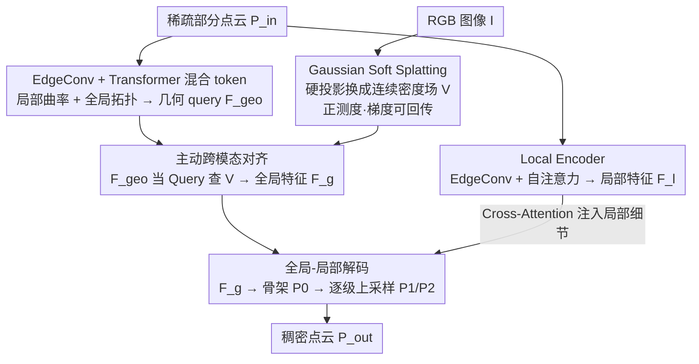

# SplAttN: Bridging 2D and 3D with Gaussian Soft Splatting and Attention for Point Cloud Completion

**会议**: ICML 2026 Spotlight  
**arXiv**: [2605.01466](https://arxiv.org/abs/2605.01466)  
**代码**: https://github.com/zay002/SplAttN (有)  
**领域**: 3D 视觉 / 点云补全 / 多模态融合  
**关键词**: 点云补全, 可微高斯泼溅, 跨模态熵塌陷, 多模态学习理论, KITTI counter-factual

## 一句话总结
本文指出多模态点云补全里"硬投影把 3D 点直接打到 2D 网格"会让支持集 Lebesgue 测度为零、梯度被 Dirac delta 截断（称为 Cross-Modal Entropy Collapse），用可微 Gaussian Soft Splatting 把硬投影换成连续密度估计，搭配 EdgeConv 局部 + Transformer 全局的混合编码器和全局-局部解码器，在 PCN/ShapeNet-55/34 拿到 SOTA，并用 KITTI 上的 counter-factual 评估证明 baseline 实际是退化的"单模态模板检索器"。

## 研究背景与动机

**领域现状**：点云补全从早期纯几何方法（PCN、FoldingNet）发展到引入 2D 图像作为语义先验的多模态范式（SVDFormer、GeoFormer 等），通过把稀疏 3D 部分点云投影到图像平面后查询视觉特征，再注入补全网络。多模态学习理论（Lu, 2023）保证：只要"模态异质性 Heterogeneity"和"模态连接 Connection"都满足，泛化界可提升 $O(\sqrt{n})$。

**现有痛点**：作者发现，现有 SOTA 多模态点云补全方法虽然在 PCN/ShapeNet 上分数好看，但 Connection 这条腿实际是假的。原因：把稀疏的 3D 点云通过 $\pi: \mathbb{R}^3 \to \mathbb{R}^2$ 硬投影到图像平面后，得到的支持集 $\mathcal{S}_{hard} = \{\pi(p)\}$ 是离散点集，Lebesgue 测度 $\mu(\mathcal{S}_{hard}) = 0$，几乎不占像素。

**核心矛盾**：硬投影下条件密度 $P_{hard}(v|\mathcal{P}_{in}) = \tfrac{1}{N}\sum_p \delta(v - \pi(p))$ 是 Dirac delta 之和；按链式法则 $\nabla_p \mathcal{L} = \tfrac{\partial \mathcal{L}}{\partial v} \cdot \tfrac{\partial v}{\partial \pi(p)} \cdot \nabla_p \delta(v - \pi(p))$，而 Dirac delta 的导数几乎处处为零，导致视觉监督的梯度无法传回到几何点位置——视觉特征"挂在"几乎不占面积的离散位置上，编码器拿不到密集语义，模型只能退化成"几何模板检索器"。这种现象作者命名为 Cross-Modal Entropy Collapse。

**本文目标**：(1) 给硬投影的失败一个测度论 + 信息论的形式化解释；(2) 设计一个保 lossless 但有非零测度支持的投影替代品，让梯度能流回；(3) 设计能真正"主动查询"视觉特征的几何 token；(4) 给出验证"模型真用了视觉"的 counter-factual 评估协议。

**切入角度**：既然问题是支持集测度为零，那就把每个投影点用一个 Gaussian 核扩展成 disk，让支持集 $\mathcal{S}_{soft} = \bigcup_p \{v: \|v - \pi(p)\| < 3\sigma\}$ 有正测度，密度变连续，梯度自然非零。这呼应 differentiable rendering（Softmax Splatting、3DGS）的成功——用可微密度估计代替硬采样。

**核心 idea**：把硬投影换成可微 Gaussian Soft Splatting + 用 EdgeConv（捕局部曲率）+ Transformer（捕全局拓扑）的混合 token 主动 query 这个连续视觉密度场，再用全局-局部 decoder 由粗到细生成。

## 方法详解

### 整体框架

方法要解决的核心是：让 2D 视觉特征能真正反传梯度到 3D 几何点，从而修复硬投影下的 Cross-Modal Entropy Collapse。输入是 sparse partial point cloud $\mathcal{P}_{in} = \{p_i\}_{i=1}^N \subset \mathbb{R}^3$ 与对应 RGB 图像 $\mathcal{I}$，输出是补全后的稠密点云 $\mathcal{P}_{out}$。整体是 dual-branch 编码 + 分层 decoder 的结构。GS-Bridge 分支先用 EdgeConv 从 $\mathcal{P}_{in}$ 抽局部几何 token、再过 Transformer 得到全局几何 query $\mathcal{F}_{geo}$，同时把视觉特征图经 Gaussian Soft Splatting 变成有正测度支持的连续密度场 $\mathcal{V}$，让 $\mathcal{F}_{geo}$ 用 cross-attention 主动查询 $\mathcal{V}$，得到融合全局特征 $\mathcal{F}_g$；并行的 Local Encoder 用 EdgeConv + Multi-Head Self-Attention 抽出拓扑感知的局部特征 $\mathcal{F}_l$。两路特征汇入 Global-Local Decoder：先从 $\mathcal{F}_g$ 经 MLP 预测 skeleton $\mathcal{P}_0$ 并用 $\mathcal{P}_{in}$-Merge 注入输入先验，再逐级上采样 $\mathcal{P}_0 \to \mathcal{P}_1 \to \mathcal{P}_2$，每个 upsample stage 都靠 Structure Self-Attention 维持几何一致性、靠 Cross-Attention 注入 $\mathcal{F}_l$ 做细节细化，由粗到细生成最终点云。

### 关键设计

**1. Gaussian Soft Splatting：把硬投影换成有正测度支持的连续密度场，让梯度流回几何点**

痛点直指 entropy collapse：硬投影把 3D 点打成离散像素，支持集测度为零，视觉监督的梯度被 Dirac delta 截断，传不回点位置。本文的做法是把每个投影点 $\pi(p)$ 用一个 Gaussian 核扩散成 disk，定义 soft 密度 $P_{soft}(v|\mathcal{P}_{in}) = \tfrac{1}{N}\sum_p \alpha_p \mathcal{G}(v; \pi(p), \sigma)$。这样对图像平面上任意 sub-pixel query $\mathbf{q}$，视觉特征都有定义，聚合方式为

$$\mathcal{V}(\mathbf{q}) = \frac{\sum_{k \in \mathcal{N}(\mathbf{q})} w_k(\mathbf{q}) f_k}{\sum_k w_k + \epsilon}, \qquad w_k(\mathbf{q}) = \exp\!\Big(-\frac{\|\mathbf{u}_k - \mathbf{q}\|^2}{2\sigma^2}\Big) \cdot (z_k + \epsilon)^{-1}.$$

权重里空间 Gaussian 核当低通滤波器，inverse depth 项 $(z_k+\epsilon)^{-1}$ 是 soft Z-buffer、用可微方式近似遮挡（避免硬 z-buffer 的不可导），$f_k$ 由归一化 3D 坐标的伪彩色实例化。关键收益在于：由 measure subadditivity 可严格推出 soft 支持集 $\mu(\mathcal{S}_{soft}) > 0$，密度场有正测度支持，因而梯度 $\nabla_{\mathbf{u}} \mathcal{L}$ 非零，反传能更新几何坐标——Gaussian tail 让"轻微对齐误差"也产生梯度信号，从根上把被截断的跨模态梯度重新接通。

**2. EdgeConv + Transformer 混合几何 tokenization：同时抓住局部曲率与全局拓扑**

纯局部算子虽然能刻画细节但盲于全局拓扑，纯 Transformer 又丢局部精度，而视觉 query 必须落在正确粒度上才有用。本文用混合架构生成 geometric query $\mathcal{F}_{geo}$：先在 $\mathcal{P}_{in}$ 上用 EdgeConv 动态构 k-NN 图，$\mathbf{h}_i = \max_{j \in \mathcal{N}(i)} \phi_\theta(p_i,\, p_j - p_i)$，作者把这个 max-aggregation 解释为对 Laplace-Beltrami 算子的离散化，因而能近似切空间和平均曲率、捕捉椅子腿这类薄结构；再过 Transformer encoder，把 self-attention 当全连接图模型做全局 message passing，推理孔洞、对称等全局不变量。这对应"local isometry + global homeomorphism"的双重几何不变性，是把 GS-Bridge 视觉 query 推到合适粒度的前提。

**3. 主动跨模态对齐 + 全局-局部解码：让几何 token 主动查视觉、让生成压力聚焦缺失区**

被动 concat 容易吸进背景噪声、也无法选择性利用语义先验，所以本文让几何 token 当 Query 主动从视觉密度场 $\mathcal{V}$ 取语义：

$$\mathcal{F}_g = \mathcal{F}_{geo} + \mathrm{Softmax}\!\Big(\frac{(\mathcal{F}_{geo}\mathbf{W}_Q)(\mathcal{V}\mathbf{W}_K)^\top}{\sqrt{d}}\Big)(\mathcal{V}\mathbf{W}_V),$$

等价于一次"可微字典查询"，比被动拼接更能选择性吸收语义、抑制噪声。解码端则要把生成压力精确投到缺失部位而非全局均匀铺点：用 Chamfer Distance 当 local reconstruction uncertainty 的 proxy，把这个几何误差投到高维 embedding，让 Structure Self-Attention 在高熵（即缺失）区域增密特征，再用 Cross-Attention 把 $\mathcal{F}_l$ 里的局部高曲率信息注入细化——这正是 hierarchical upsample 能由粗到细补出细节的关键 inductive bias。

### 损失函数 / 训练策略

用 Weighted Arc-CD：$\mathcal{L}_{\mathrm{warc}}(X, Y; \lambda) = \lambda \cdot \mathrm{arccosh}(1 + \mathcal{L}_{\mathrm{CD}}(X, Y))$，arccosh 的非线性自然压缩异常值并保细节敏感性。三个 stage 损失等权相加 $\mathcal{L}_{total} = \mathcal{L}_{\mathrm{warc}}(\mathcal{P}_0, \mathbf{P}_{gt}) + \sum_{k=1}^{2} \mathcal{L}_{\mathrm{warc}}(\mathcal{P}_k, \mathbf{P}_{gt})$。PyTorch + AdamW + one-cycle cosine 调度，4 × RTX 4090，Gaussian kernel size = 4。

## 实验关键数据

### 主实验

| 数据集 | 指标 | 本文 SplAttN | SVDFormer | GeoFormer | AdaPoinTr |
|--------|------|--------------|-----------|-----------|-----------|
| PCN | CD-Avg ↓ ($\times 10^3$) | **6.36** | 6.54 | 6.42 | 6.53 |
| PCN | F1 ↑ | **0.854** | 0.841 | 0.853 | 0.845 |
| PCN | DCD ↓ | **0.523** | 0.536 | 0.526 | – |
| ShapeNet-55 | CD-Avg ↓ ($\times 10^3$) | **0.77** | 0.82 | – | – |
| ShapeNet-55 | F1 ↑ | **0.520** | 0.444 | – | – |
| ShapeNet-34 (seen) | CD-Avg ↓ | **0.65** | 0.75 | – | 0.73 |
| ShapeNet-34 (21 unseen) | CD-Avg ↓ | **1.22** | 1.28 | – | 1.23 |
| ShapeNet-34 (21 unseen) | F1 ↑ | **0.481** | 0.427 | – | 0.416 |

### 消融实验

| 配置 | 关键指标 | 说明 |
|------|----------|------|
| Full SplAttN | PCN CD 6.36, ShapeNet-55 F1 0.520 | 完整方法 |
| Hard projection 替代 GSS | 显著降级 | 验证"硬投影 → entropy collapse"的因果 |
| 仅 EdgeConv，无 Transformer | 全局拓扑结构损坏 | 验证混合 token 必要性 |
| Passive concat 替代 Active Attention | 跨模态依赖度下降 | 验证"主动 query"重要 |

(详细消融数字在论文 4.3 节；作者强调单组件去除都触发性能 regression)

### 关键发现

- **主结果跨 6 个 benchmark 全部 SOTA**：PCN/ShapeNet-55/34（seen 与 unseen）以及 KITTI 真实场景。在 unseen 类 F1 提升尤其大（0.481 vs 0.427 of SVDFormer），印证 Connection 真正建立后的泛化收益。
- **KITTI counter-factual 评估是亮点**：作者用 PCN 训练的模型直接跑 2401 个真实车实例，提出 Semantic Consistency Score——把视觉输入移除（feed null image），看模型输出变化。Baseline 几乎不变（说明它们退化成"几何 → 模板"的单模态检索器），SplAttN 输出显著变化（说明视觉真正参与了重建）。这把"我们用了视觉" 从口头声明变成可量化指标。
- **薄结构（椅子腿、灯）显著改善**：定性图显示 SplAttN 对 thin structure 的恢复明显优于 SOTA，与"hybrid encoder 同时捕局部曲率 + 全局拓扑"的设计动机一致。
- **DCD 指标改善幅度比 CD 大**：DCD 对密度分布更敏感，说明 SplAttN 不只是"点平均更接近"，而是密度分布也更接近真实流形。

## 亮点与洞察

- 把"硬投影失败"的工程现象升格成"Lebesgue 测度为零导致 Dirac delta 梯度截断"的测度论命题——这种把 deep learning 现象映射到 measure theory 的能力非常少见，给整篇工作一个干净的理论支点。
- "KITTI counter-factual 评估"是这篇文章对社区最有价值的方法学贡献：它揭穿了一批多模态点云补全方法实际上"没真用视觉"。这种 stress test 范式可以推广到任何多模态融合工作（VLM、3D Detection 等）。
- Gaussian Splatting 在 3D rendering 火起来后，作者把它的核心思想（可微密度估计）反向用回 2D 投影平面，这种"反向迁移"思路很巧。
- soft Z-buffer 用 $1/(z + \epsilon)$ 这一项保 differentiability 又近似遮挡——是非常工程化但有效的小 trick。

## 局限与展望

- Gaussian kernel 大小 $\sigma$ 是固定的（kernel size = 4），不是 learnable / adaptive；对于密度变化大的场景（如远近物体），固定 $\sigma$ 会要么过模糊要么覆盖不到。
- 视觉特征源（RGB）的质量被假设较高；如果输入图像有强遮挡、噪声或模态不匹配（如 LiDAR + 夜间 RGB），soft splatting 可能放大噪声。
- KITTI counter-factual 只评了"car"类，没有跨多类。Semantic Consistency Score 阈值 0.7 是经验值。
- 整套架构在 inference 上比纯几何方法重不少（GS-Bridge + Transformer + Decoder），论文未给出延迟对比；实时应用（如机器人感知）需要进一步剪枝/蒸馏。
- 理论命题中的 PMI 分析放在附录 §C.1，正文只给"被实现支撑的密度估计"层面的解释；如果能把 PMI lower bound 与 actual reward / accuracy 联系上，理论会更扎实。

## 相关工作与启发

- **vs SVDFormer (Zhu et al. 2023b) / GeoFormer (Yu et al. 2024)**：它们也是"3D 点 query 视觉"，但都用硬投影，因此模型实际退化为单模态 baseline；SplAttN 用 Gaussian Splatting 修复 Connection，相同的 query 范式但有效梯度路径。
- **vs Softmax Splatting (Niklaus & Liu 2020)**：原用于视频插帧，本文把它的思想拉到点云-图像投影。
- **vs 3DGS (Kerbl et al. 2023)**：3DGS 用 Gaussian 渲染图像，SplAttN 反向用 Gaussian 把图像特征投到 3D query 空间，是 "rendering 工具的逆用"。
- **vs Pure Geometric methods (PoinTr, SeedFormer)**：纯几何方法不需要图像，在 PCN 上 CD 已经能达到 6.7~6.9；SplAttN 拿到 6.36，说明引入视觉的边际收益是真的，但前提是 Connection 必须有效——这恰好是论文核心论点的反向验证。

## 评分
- 新颖性: ⭐⭐⭐⭐⭐ 测度论 + Dirac delta 视角下的 entropy collapse 形式化在点云补全里前所未见；KITTI counter-factual 评估也是范式级贡献。
- 实验充分度: ⭐⭐⭐⭐ PCN + ShapeNet-55/34 (seen+unseen) + KITTI 真实场景，benchmark 完整；缺少 inference 延迟与 $\sigma$ 敏感性分析。
- 写作质量: ⭐⭐⭐⭐ 数学符号清晰、图 1/2/4 信息密度高；动机段 "Cross-Modal Entropy Collapse" 命名响亮但前半部分多模态学习理论引用稍长。
- 价值: ⭐⭐⭐⭐ 不只提了一个新方法，更暴露了一批 SOTA 的隐含 bug（伪多模态），有望推动整个 multimodal 3D 任务的评估规范。

<!-- RELATED:START -->

## 相关论文

- [\[AAAI 2026\] Rethinking Multimodal Point Cloud Completion: A Completion-by-Correction Perspective](../../AAAI2026/3d_vision/rethinking_multimodal_point_cloud_completion_a_completion-by-correction_perspect.md)
- [\[AAAI 2026\] DAPointMamba: Domain Adaptive Point Mamba for Point Cloud Completion](../../AAAI2026/3d_vision/dapointmamba_domain_adaptive_point_mamba_for_point_cloud_completion.md)
- [\[CVPR 2026\] Hyper-PCN: Hypergraph-Based Point Cloud Completion via High-Order Correlation Modeling](../../CVPR2026/3d_vision/hyper-pcn_hypergraph-based_point_cloud_completion_via_high-order_correlation_mod.md)
- [\[AAAI 2026\] Simba: Towards High-Fidelity and Geometrically-Consistent Point Cloud Completion via Transformation Diffusion](../../AAAI2026/3d_vision/simba_towards_high-fidelity_and_geometrically-consistent_point_cloud_completion_.md)
- [\[ICCV 2025\] Revisiting Point Cloud Completion: Are We Ready For The Real-World?](../../ICCV2025/3d_vision/revisiting_point_cloud_completion_are_we_ready_for_the_real-world.md)

<!-- RELATED:END -->
