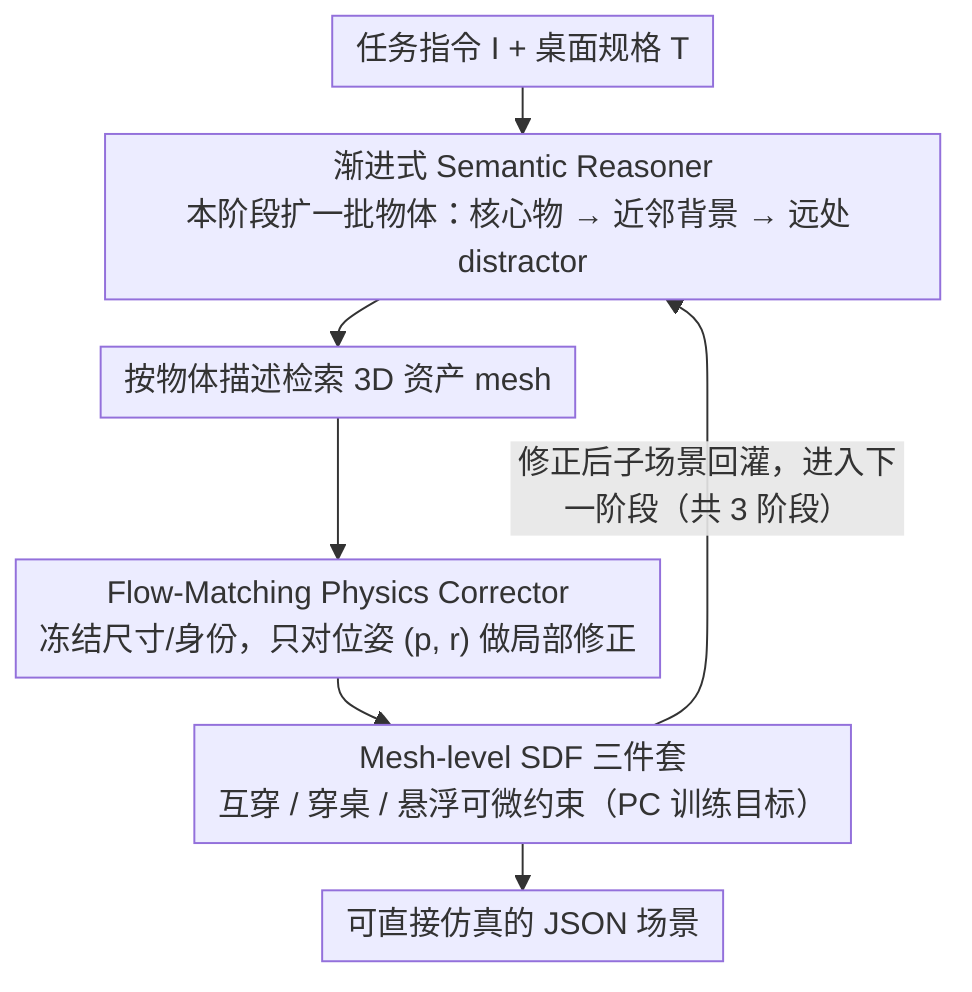

# STABLE: Simulation-Ready Tabletop Layout Generation via a Semantics–Physics Dual System

**会议**: ICML 2026  
**arXiv**: [2605.16137](https://arxiv.org/abs/2605.16137)  
**代码**: https://stable-tabletop.github.io  
**领域**: 3D视觉 / 具身AI / 场景生成  
**关键词**: 桌面场景生成、语义-物理双系统、Flow Matching、SDF 碰撞损失、渐进式推理

## 一句话总结
STABLE 把"任务指令→可仿真桌面场景"拆成 LLM-based Semantic Reasoner（出粗布局）和 flow-matching + SDF 损失的 Physics Corrector（修位姿），并让两者按 task-critical → background 三阶段交替迭代，最终在 MesaTask-10K 上把物体碰撞数压到 0、任务对齐 AwS 拉到 99.0%。

## 研究背景与动机

**领域现状**：Embodied AI 训练越来越依赖合成数据，给定一句操作指令（"把苹果放在香蕉左边"）就能批量生成可直接喂仿真器的桌面场景，是机器人 manipulation 数据生产的关键一环。当前主流做法是用 LLM（零样本提示、多轮 prompt 或在场景数据上 SFT）直接吐出场景 JSON——代表工作如 LayoutGPT、I-Design、Holodeck、MesaTask。

**现有痛点**：纯 LLM 路线在 3D 空间推理上有结构性短板：(1) 把连续坐标离散化成 token 后精度不够，**物体互穿、悬浮、穿桌**频发，仿真器一加载就崩；(2) 后处理优化（如 Steerable 的物理 post-proc）虽然能强行消碰撞，但会大幅挪动物体位置——苹果可能被推到香蕉**右边**，直接破坏指令语义。结果就是"任务对齐"和"物理可行"两个目标在已有方法里互相打架。

**核心矛盾**：LLM 擅长语义、不擅长连续几何；优化器擅长几何、不懂语义。把两者串行拼接会让后者覆盖前者。

**本文目标**：(1) 让 LLM 只负责语义粗布局，不再要求它给出物理精确位姿；(2) 用一个轻量、几何感知的修正器只更新 $(\mathbf{p}, r)$ 而保留对象身份/尺寸/关系；(3) 通过分阶段交替让"补物体"和"修位姿"互不污染。

**切入角度**：作者类比 Helix 的 "System 1 / System 2" VLA 思路——快慢系统分工。Semantic Reasoner 是慢思考的语义系统，Physics Corrector 是快响应的几何系统，两者**频繁交互**而非一锤定音。

**核心 idea**：用 SR + PC 的"语义-物理双系统"渐进式扩展场景，每加一批物体立即用 flow-matching + mesh-level SDF 损失把位姿拍回物理可行域，从而在不牺牲任务语义的前提下实现 simulation-ready。

## 方法详解

### 整体框架
STABLE 要解决的是"一句指令直接生成可仿真桌面"里语义对齐和物理可行互相打架的问题，核心思路是把这件事拆给两个互补的子系统轮流处理。输入是任务指令 $I$ 加桌面规格 $T$，输出是结构化 JSON 场景 $J=\{T, \{O_i\}_{i=1}^N\}$，其中每个物体 $O_i=\{\mathbf{p}_i, r_i, s_i, d_i\}$ 含 3D 平移、yaw 旋转、bbox 尺寸、文本描述，并关联一个从 3D 资产库检索的 mesh $a_i$。

整条 pipeline 是一个三阶段渐进循环：先由 Semantic Reasoner（SR）按指令吐出 task-oriented 物体集 $O^t$（指令里明确点名的物体），检索资产后交给 Physics Corrector（PC）把位姿拍回物理可行域；接着 SR 在 $(I, T, O^t)$ 条件下补 important background 物体 $O^B$（与 $O^t$ 物理接触或紧邻），PC 再修一遍；最后 SR 在 $(I, T, O^t, O^B)$ 条件下补 secondary background 物体 $O^b$（远处的 distractor），PC 收尾。每阶段 PC 修完的位姿都会回灌成下一阶段 SR 的上下文，这样几何误差不会跨阶段累积。整个流程还能在 batch 上 pipeline——A 场景在跑 PC 时 B 场景同步推 SR。

### 关键设计

**1. 渐进式 Semantic Reasoner：让 LLM 先锁任务核心物、再填背景**

纯 LLM 一次性吐整场景的最大问题是 task-grounding 弱——指令里点名的关键物体容易被漏掉或被一堆背景物淹没。STABLE 把 MesaTask-10K 的整场景标注重组成 $(O^t, O^t\cup O^B, O^t\cup O^B\cup O^b)$ 三段序列做 SFT，强制 LLM 按"先核心、再近邻、再背景"逐步往外扩：推理时也对应 $O^t \leftarrow \mathrm{SR}(I, T)$、$O^B \leftarrow \mathrm{SR}(I, T, O^t)$、$O^b \leftarrow \mathrm{SR}(I, T, O^t, O^B)$ 三步出。其中 $O^B$ 与 $O^b$ 的划分靠 bbox 相交（含阈值）自动判定，相交的算近邻背景、其余归远处 distractor；训练时还去掉了原 MesaTask 的长链思维直接输出 JSON 以压缩 token。这样先把任务核心物锁死，既提升指令对齐又便于后续 PC 在小集合上做局部修正——消融里 AwT 从 89.9% 涨到 99.4%，Distractor Rate 从 78.6% 涨到 86.1%，说明分阶段不仅强化了 grounding，还让场景更丰满而非更稀疏。

**2. 几何感知的 Flow-Matching Physics Corrector：只改位姿、不动语义骨架**

PC 的关键定位是"修正器而非生成器"：它保持 $(s_i, d_i, a_i)$ 完全不变，只对位姿向量 $\mathbf{x}=[\mathbf{p}_1,\dots,\mathbf{p}_N, r_1,\dots,r_N]\in\mathbb{R}^{4N}$ 做连续修正，从根本上避免 Steerable 那种"消碰撞顺手把苹果挪到香蕉右边"的语义破坏。为了能处理堆叠/包含（小盒子放进大盒子里）这类 bbox 描述不了的情况，PC 用冻结的 PointTransformer-V3 从每个资产采样的表面点云抽 mesh-level 几何嵌入 $\mathbf{g}_i=\phi(\mathcal{P}_i)$，拼成条件 $\mathcal{C}=(\mathbf{x}^c, \mathbf{G})$。

修正本身用 flow matching 而非扩散，原因是这里只需要"小幅 local 校准"。训练时把 SR 输出的粗位姿 $\mathbf{x}^c$ 加高斯噪声得 $\mathbf{x}_0=\mathbf{x}^c+\sigma\boldsymbol{\epsilon}$，GT 位姿当 $\mathbf{x}_1$，按 $\mathbf{x}_t=(1-t)\mathbf{x}_0+t\mathbf{x}_1$ 插值，用 U-Net 学速度场 $\mathbf{v}_\theta$ 拟合 $\mathbf{v}_{\mathrm{target}}=\mathbf{x}_1-\mathbf{x}_0$：

$$\mathcal{L}_{\mathrm{flow}}=\mathbb{E}\big\|\mathbf{v}_\theta(\mathbf{x}_t, t, \mathcal{C})-(\mathbf{x}_1-\mathbf{x}_0)\big\|_2^2$$

推理时直接从 $\mathbf{x}(0)=\mathbf{x}^c$ 起 ODE 积分到 $t=1$ 拿修正后位姿。这套"训练加噪、推理从粗位姿起步"的设计让模型学到的是围绕 $\mathbf{x}^c$ 邻域的局部修正流，比照搬扩散从纯噪声生成更稳，也和 PC 的修正器定位完美对齐。

**3. Mesh-level SDF 物理约束三件套：把三类失败模式直接打进训练目标**

纯数据驱动的 flow loss 总会残留少量但致命的互穿，仿真器一加载就崩，所以 STABLE 在 flow loss 之外硬加三项可微 SDF 损失，把"互穿、穿桌、悬浮"三类失败模式显式约束住。对每个 mesh $m$ 预算 SDF $D_m(\mathbf{x})$（负值表示在 mesh 内部），用 mesh-level 而非 bbox 是因为堆叠/包含里 bbox 太粗、小偏移就会藏穿透。物体间互穿损失为

$$\mathcal{L}_{\mathrm{obj\text{-}obj}}=\sum_{i<j}\big[\max(0, -\mathrm{dist}_{\mathrm{sdf}}(i,j))\big]^2,\quad \mathrm{dist}_{\mathrm{sdf}}(i,m)=\min_{\mathbf{q}\in\mathcal{Q}_i}D_m(\mathbf{q})$$

同理把桌面建模成 SDF $\tau$ 得到 $\mathcal{L}_{\mathrm{obj\text{-}table}}$。支撑接触损失则采样物体底部点 $\mathcal{B}_i$ 和候选支撑面集 $\mathcal{S}_i$，取最近支撑 $z_i^{\mathrm{sup}}=\arg\min_s \delta(i,s)$，定义 $\mathcal{L}_{\mathrm{sup}}=\sum_i[\max(0, \mathrm{gap}(i,z_i^{\mathrm{sup}})-\epsilon)]^2$，借 $|D_s(\cdot)|$ 既惩罚悬浮也惩罚陷进凹面里离支撑太远。总目标把三者加权合一：

$$\mathcal{L}_{\mathrm{PC}}=\mathcal{L}_{\mathrm{flow}}+\lambda_{\mathrm{sdf}}(\mathcal{L}_{\mathrm{obj\text{-}obj}}+\mathcal{L}_{\mathrm{obj\text{-}table}})+\lambda_{\mathrm{sup}}\mathcal{L}_{\mathrm{sup}}$$

三个损失高度互补且互相耦合：消融显示任去其一物理指标都明显劣化，而且去掉 $\mathcal{L}_{\mathrm{obj\text{-}table}}$ 后 float 反而降低——物体直接"沉"进桌面来绕过支撑约束，说明只看单个物理指标会被误导，必须联合评估。

### 损失函数 / 训练策略
PC 用 MesaTask-10K 全部 10K 场景训练；SR 把同样 10K 实例改写成三段渐进序列后 SFT 一个开源 LLM。推理时走 batch pipeline：某场景在跑 PC 时其它场景并行推 SR，避免空等；batch size = 1 时退化为标准串行交替。

## 实验关键数据

### 主实验

| 数据集 | 指标 | STABLE | 之前 SOTA | 提升 |
|--------|------|--------|-----------|------|
| MesaTask-10K | FID ↓ | **38.6** | MesaTask 40.6 | -2.0 |
| MesaTask-10K | AwT (任务对齐, %) | **99.4** | Steerable 99.4 = 持平 | — |
| MesaTask-10K | AwS (场景图对齐, %) | **99.0** | Steerable 91.1 | +7.9 |
| MesaTask-10K | OC (物体碰撞) | **0** | Steerable 0 / MesaTask 15.6 | 与 Steerable 持平且不挪物体 |
| MesaTask-10K | GPT 总均分 | **9.0** | TabletopGen 8.6 | +0.4 |

| 任务 | 指标 | STABLE | StructDiffusion | LEGO-NET |
|------|------|--------|-----------------|----------|
| Rearrangement | Distance Move ↓ | **0.14** | 0.21 | 0.28 |
| Rearrangement | EMD to GT ↓ | **0.08** | 0.23 | 0.43 |
| Rearrangement | OC ↓ | **0** | 0.25 | 0.32 |

关键观察：Steerable 靠强行挪物体把 OC 打到 0，但 AwS 只有 91.1——印证了"消碰撞会破坏任务语义"这一核心矛盾；STABLE 同时拿下 OC=0 + AwS=99.0，是唯一两端都赢的方法。

### 消融实验

| 配置 | OC ↓ | Float ↓ | AwT ↑ | Distractor Rate ↑ | 说明 |
|------|------|---------|-------|--------------------|------|
| Full PC | **0** | **0** | — | — | 完整 PC |
| w/o $\mathcal{L}_{\mathrm{sup}}$ | 4.7 | 9.8 | — | — | 悬浮飙升 |
| w/o $\mathcal{L}_{\mathrm{obj\text{-}table}}$ | 13.6 | 5.4 | — | — | 物体沉桌"假性"减 float |
| w/o $\mathcal{L}_{\mathrm{obj\text{-}obj}}$ | 11.9 | 15.8 | — | — | 互穿 + 失稳双重崩 |
| One-shot SR | — | — | 89.9 | 78.6 | 一次性出整场景 |
| Progressive SR | — | — | **99.4** | **86.1** | 三阶段渐进 |

| 初始碰撞数桶 | 0-10 | 10-20 | 20-30 | 30-40 |
|--------------|------|-------|-------|-------|
| MesaTask Optim. (50K iter) | ✓ | ✓ | ✗ | ✗ |
| Steerable | ✓ | ✓ | ✗ | ✗ |
| Physics Corrector | ✓ | ✓ | **✓** | **✓** |

### 关键发现
- 三个 SDF 损失高度耦合：去掉 $\mathcal{L}_{\mathrm{obj\text{-}table}}$ 后 float 反而**降低**，因为物体直接"沉"进桌面规避支撑约束——说明只看单个物理指标会被误导，必须联合评估。
- 渐进式 SR 比一次性 SR 在 AwT 上涨 9.5 个点，同时 Distractor Rate 也涨了 7.5 个点，证明分阶段不仅强化任务 grounding，还让场景**更丰满**而非更稀疏。
- PC 在 30-40 碰撞数的"严重场景"上仍能 100% 找到无碰撞解，而后处理优化器（即便给 50K 迭代）直接失败——学习式修正在极端拥挤下比迭代式优化器更鲁棒。

## 亮点与洞察
- **"双系统 + 不动尺寸"是把 trade-off 解开的关键**：PC 只改 $(\mathbf{p}, r)$ 不改 $(s, d)$，相当于把"语义骨架"冻住、只在物理空间微调，从根本上避免了 Steerable 那种"消碰撞顺手把苹果挪到香蕉右边"的语义破坏。这个 4N 维位姿子空间的设计简单却极有效。
- **加噪 + flow-from-coarse-pose 的训练-推理一致性**：训练时把 GT 位姿加噪当起点，推理时从 SR 的粗位姿起点；这让 PC 学到的是 $\mathbf{x}^c$ 邻域的**局部修正流**而非全场景生成，与"PC 只是修正器"的定位完美匹配，比照搬扩散 from-noise 的范式更合任务本质。
- **Mesh-level SDF 损失的可迁移性**：把"互穿、穿桌、悬浮"三件套抽成三项可微 SDF loss + 一个最近支撑面选择，这套组合对任意需要"位姿可微 + 物理可行"的下游任务（家具布置、机械臂抓取候选、AR 物体放置）都直接能复用，工程价值很高。

## 局限与展望
- 只修平移和 yaw，没建模 pitch/roll——对放倒的瓶子、斜搁的书等姿态多样物体覆盖不足，扩展到 SE(3) 全旋转会带来 SDF 损失梯度的新挑战。
- 高度依赖 MesaTask-10K 的标注与资产库；新场景（户外、厨房油污环境、软体物体）下 PC 学到的"合理布局分布"未必迁移，资产检索失败时整条链路退化。
- SR 的三阶段切分用 bbox 相交阈值硬定义 $O^B$，对长条/L 形物体可能漏判；阶段数固定为 3 也限制了对极复杂场景（>50 物体）的扩展性。
- 速度方面只展示了 batch pipeline 的吞吐优化，没给出单场景延迟数据，对实时机器人闭环（如在线 rearrangement）的可用性需更多分析。

## 相关工作与启发
- **vs MesaTask（SFT-LLM）**：MesaTask 让 LLM 端到端出整布局，OC=15.6、AwS=90.2；STABLE 在它的 SR 基础上加 PC + 渐进式推理，OC=0、AwS=99.0——证明"LLM 出语义、专用模型修几何"的解耦比把所有担子压给 LLM 更可扩展。
- **vs Steerable（后处理优化）**：Steerable 在 OC=0 上和本文打平，但 AwS 掉到 91.1 且在 >20 碰撞场景下 50K 迭代仍不收敛；STABLE 用学习式 PC 在所有碰撞桶都成功且不破坏语义，说明"学一个 local correction 流"比"迭代优化"在严重碰撞下更可靠。
- **vs TabletopGen（图像中介）**：TabletopGen 用 image 作为 text→3D 桥梁拿到 8.6 GPT score，但小物体/遮挡下漏物频发；STABLE 直接在 3D 结构化层面操作，避免了图像中介的歧义累积。
- **启发**：Helix 的 System1/System2 思想被这里成功落到非具身控制场景；任何"语义易表达但物理难精确"的生成任务（家具布置、机械臂抓取候选、AR 物体摆放）都可以借这个"语义粗稿 + flow-matching 局部修正 + mesh SDF 约束"的三段式模板。

## 评分
- 新颖性: ⭐⭐⭐⭐ 双系统拆分思想本身非首创，但"flow-matching from coarse pose + mesh-level SDF 三件套 + 渐进式阶段交替"的具体组合是这个任务的首例，工程整合度很高。
- 实验充分度: ⭐⭐⭐⭐ 覆盖 4 类 baseline（任务到场景、后处理、闭源 LLM、图像中介）+ 主表 + 物理约束消融 + 渐进式消融 + 碰撞桶鲁棒性 + Rearrangement 下游 + Editing 应用，相当扎实；只是缺 SE(3) 旋转和实时延迟分析。
- 写作质量: ⭐⭐⭐⭐ Helix 双系统类比让动机一目了然，公式与算法描述清晰；图 1/2/3 的失败模式可视化（红/黄/蓝框）让对比直观。
- 价值: ⭐⭐⭐⭐ 直接给机器人 manipulation 仿真数据生产提供可用 pipeline，SDF 损失三件套对场景生成社区有清晰可复用价值，缺点是当前只验证桌面级、对房间级扩展还需更多证据。

<!-- RELATED:START -->

## 相关论文

- [\[ICML 2026\] PhyScene3D: Physically Consistent Interactive 3D Tabletop Scene Generation](physcene3d_physically_consistent_interactive_3d_tabletop_scene_generation.md)
- [\[NeurIPS 2025\] Gaussian-Augmented Physics Simulation and System Identification with Complex Colliders](../../NeurIPS2025/3d_vision/gaussian-augmented_physics_simulation_and_system_identification_with_complex_col.md)
- [\[ICML 2026\] LabBuilder: Protocol-Grounded 3D Layout Generation for Interactable and Safe Laboratory](labbuilder_protocol-grounded_3d_layout_generation_for_interactable_and_safe_labo.md)
- [\[CVPR 2025\] MotionAnyMesh: Physics-Grounded Articulation for Simulation-Ready Digital Twins](../../CVPR2025/3d_vision/motionanymesh_physics-grounded_articulation_for_simulation-ready_digital_twins.md)
- [\[CVPR 2026\] PhysHead: Simulation-Ready Gaussian Head Avatars](../../CVPR2026/3d_vision/physhead_simulation-ready_gaussian_head_avatars.md)

<!-- RELATED:END -->
