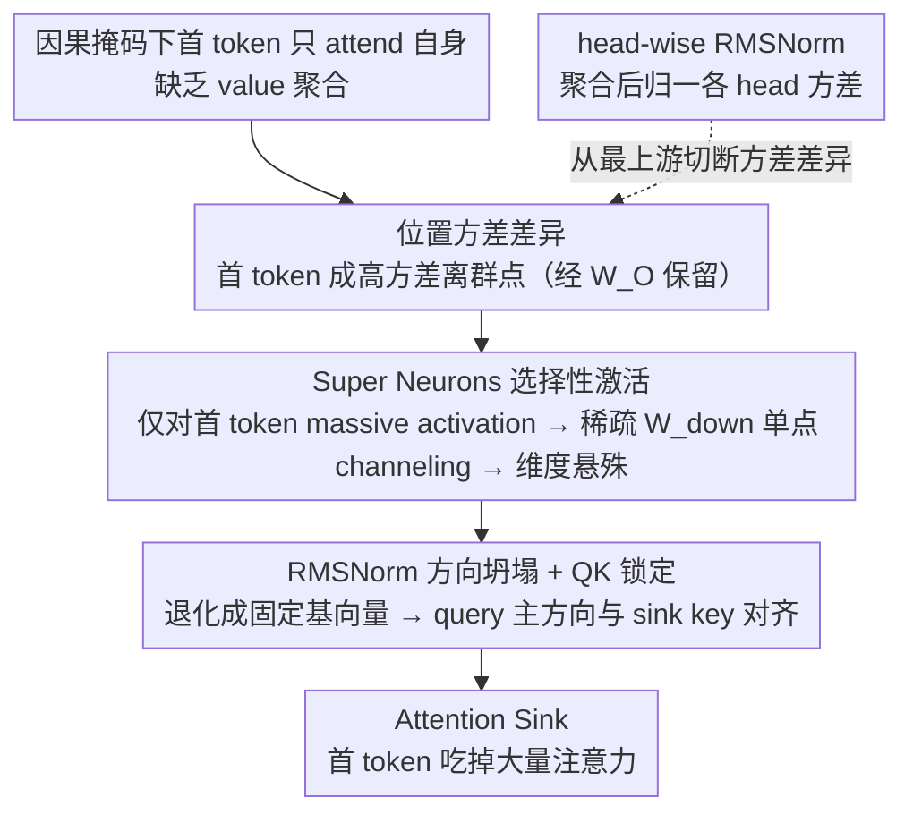

# The Structural Origin of Attention Sink: Variance Discrepancy, Super Neurons, and Dimension Disparity

**会议**: ICML 2026  
**arXiv**: [2605.06611](https://arxiv.org/abs/2605.06611)  
**代码**: 无  
**领域**: 可解释性 / Transformer 机理 / LLM 优化  
**关键词**: attention sink, 方差差异, super neurons, 维度坍塌, head-wise RMSNorm

## 一句话总结
本文揭示 LLM 中"注意力汇聚到第一个 token"的结构性根源 —— 因果掩码下首 token 缺乏 value 聚合导致维度方差差异,被 FFN 中的 super neurons 选择性放大形成维度极度悬殊,最终锁死 QK 投影迫使形成 attention sink;并据此提出 head-wise RMSNorm 在预训练阶段从根上抑制 sink。

## 研究背景与动机

**领域现状**:Attention sink (decoder-only Transformer 里第一个 token 莫名其妙吃掉大量注意力分数) 是 GPT/LLaMA 类模型里的普遍现象,既被利用 (StreamingLLM 的 KV cache 压缩) 也被诟病 (导致激活离群点、表征坍塌、低比特量化困难)。过往解释有:Softmax 需要"接收剩余概率质量"、位置编码副产物、谱子空间问题等 (Xiao et al. 2023、Yan et al. 2024、Cancedda 2024)。

**现有痛点**:这些解释要么是现象学的 (说"Softmax 需要 sink"),要么只覆盖部分案例 (位置编码理论无法解释为什么不在 layer 0 而在 layer 2 突然出现),没有一个能完整回答 **"为什么偏偏是第一个 token、为什么偏偏在第几层、为什么 norm 会突然爆炸"**这三个连锁现象。

**核心矛盾**:作者发现 attention sink 的 onset 是一个**结构性 invariant** —— Llama-2 上无论输入是什么,sink 都在 layer 2 准时出现,且伴随首 token 表征 $\ell_2$-norm 同步暴涨。这说明 sink 不是涌现的 emergent property,而是某条**确定的因果链**在固定层数处必然触发,但这条链是什么、能不能干预,前人没说清。

**本文目标**:把"从 token 级别的统计差异 → 到 FFN 神经元级别的放大 → 到 attention pattern 级别的锁死"这条三段式因果链完整描出来,并在每个环节做控制实验验证因果性。

**切入角度**:从 value aggregation 的**位置不对称性**入手 —— causal mask 下首 token $i=0$ 只能 attend 到自己 ($a_{0,0}=1$),后续 token 都在做 $i+1$ 个向量的凸组合,方差自然会单调衰减,所以首 token 天然就是 variance outlier。这个简单观察是整条链的发源点。

**核心 idea**:Attention sink = **方差差异 (value aggregation 引入) → super neurons 选择性激活 (FFN 放大) → 维度差异 (down-projection 稀疏 channeling) → QK 锁定 (RMSNorm 把首 token 投到固定方向)** —— 一旦理解了这条链,就可以从最上游用 head-wise RMSNorm 抑制方差差异,釜底抽薪。

## 方法详解

### 整体框架
作者先做"现象诊断"(Sec 3):证明 layer 2 onset、norm 同步暴涨;再做"因果定位"(Sec 3.1-3.2):证明 value aggregation 引入位置方差差异,且用两种 controlled intervention (mask 干预、变量放大) 在**任意位置**复现 sink;再做"传播链分析"(Sec 4):逐层追踪方差差异如何被 $\mathbf{W}_O$ 保留 → 触发 super neurons → 经 sparse $\mathbf{W}_{\text{down}}$ 形成维度差异 → 经 RMSNorm 退化成单个基向量 → 锁死 QK 形成 sink;最后做"工程干预"(Sec 5):提出 head-wise RMSNorm 从根抑制方差差异,在预训练阶段不仅消除 sink 还加速收敛。

### 关键设计

**1. 位置方差差异（Variance Discrepancy）：把"为什么偏偏是首 token"钉死到 value aggregation 这一步**

整条因果链的源头要回答"为什么受宠的总是第一个 token"。作者用全随机 token 序列(排除 BOS 偏置)测 Llama-2-7B 第 1 层 value aggregation 之后的逐维方差,发现位置 0 的方差远高于其余位置、且随位置单调衰减——原因很朴素:因果掩码下首 token 只能 attend 自己($a_{0,0}=1$),后续 token 都在做 $i+1$ 个 value 向量的凸组合,凸组合自然把方差摊平,唯独首 token 没被平均、成了天然的高方差离群点。光有这个相关性还不够,作者再用两个控制干预把它坐实成因果:(a) **掩码干预**——把第 $k$ 个 token 的注意力掩码改成只 attend 自身、模拟首 token 的"未聚合"状态,结果 $k$ 立刻变成新的 sink;(b) **方差放大**——用 $\mathbf{o}_k'^{(l)}=\boldsymbol{\mu}^{(l)}+\lambda\cdot(\mathbf{o}_k^{(l)}-\boldsymbol{\mu}^{(l)})$($\lambda>1$)直接放大任意位置的方差,同样能凭空造出 sink。最关键的是反证实验:单纯放大范数 $\lambda\cdot\mathbf{o}_k$ 却**造不出** sink——干净地排除了"是 norm 大导致 sink"的混淆,真正的因是方差而非量级。这两个干预把前文的"方差差异是 root cause"从相关性升级成了因果性。

**2. Super Neurons 选择性激活:方差差异被 FFN 里少数神经元指数级放大成维度悬殊**

上一步只是 token 级的统计差异,本步解释它如何被 FFN 翻译成参数级的几何坍塌。对 SwiGLU 的 $\text{FFN}(\mathbf{x})=(\text{SiLU}(\mathbf{x}\mathbf{W}_{\text{gate}})\odot \mathbf{x}\mathbf{W}_{\text{up}})\mathbf{W}_{\text{down}}$,作者先发现 $\mathbf{W}_{\text{gate}}$/$\mathbf{W}_{\text{up}}$ 里有极少数范数超大的列向量(称作 super neurons,如 index 7890);追踪它们对首 token 的响应,发现 $\cos(\mathbf{x}_{\text{norm}}, \mathbf{w}_{\text{gate}}^{(7890)})$ 在首 token 上很高、在其他位置接近 0,于是 super neurons 几乎**只对首 token "开门"**、投出 massive activation。紧接着 $\mathbf{W}_{\text{down}}$ 对应的行 $\mathbf{w}_{\text{down}}^{(7890)}$ 是**重尾稀疏**的——大部分维度接近 0、个别维度(如 dim 2533)极大,把这股 massive activation 单点 channeling 到那几个离群维度上。最终用 Dominance Ratio $\text{DomRatio}(\mathbf{h}_0)=\max_j|\mathbf{h}_{0,j}|/(\frac{1}{d}\sum_k|\mathbf{h}_{0,k}|)$ 量化这种悬殊,Llama-2 浅层就飙到 200+。这一步也顺带回答了"为什么 sink 卡在固定层数(layer 2)才出现"——super neurons 是预训练学到的固定结构,方差差异要逐层累积到足以触发它们才行,所以 sink 是确定性地、而非随机地在某层冒出来。

**3. RMSNorm 方向坍塌 + QK 结构锁定:维度悬殊为何必然翻译成对首 token 的注意力 lock-in**

最后一环关闭因果链。当 $\mathbf{x}_0$ 在某维 $c$ 上有压倒性大值 $\lambda$ 时,RMSNorm 的归一化常数几乎完全由 $\lambda$ 主宰,输出被压成一个固定方向的基向量 $\text{RMSNorm}(\mathbf{x}_0)\approx \text{sgn}(\lambda)\sqrt{d}\gamma_c\cdot\mathbf{e}_c$;再过 key 投影,$\mathbf{k}_0^{(h)}\approx\pm\sqrt{d}\cdot(\mathbf{W}_K^{(h)})_{c,:}$ 就退化成 $\mathbf{W}_K$ 的第 $c$ 行——也就是首 token 的 key 被锁死在一个与输入内容无关的固定方向上。作者用 SVD 取出 query 矩阵的主方向 $\mathbf{u}_1^{(h)}$,测它与 $\mathbf{k}_0^{(h)}$ 的 cosine 对齐度,发现高对齐的 head 在**所有** token 上的 QK 点积都为正(positive ratio ~100%):这些 head 的 query 结构性地指向 sink key,于是无论当前 token 是什么,都会给首 token 打出一个大注意力分数,sink 就此形成。至此"高方差 → super neurons → 维度悬殊 → 固定方向 → 高 QK 分数 → sink"每一步都有可观测、可量化的中间变量,没有未解释的跳跃。

### 损失函数 / 训练策略
**Head-wise RMSNorm 干预** (Sec 5.1):在 value aggregation 后、output projection $\mathbf{W}_O$ 之前对每个 head 输出做 RMSNorm:$\hat{\mathbf{o}}_t^{(h)}=\frac{\mathbf{o}_t^{(h)}}{\text{RMS}(\mathbf{o}_t^{(h)})}\odot \boldsymbol{\lambda}$,$\boldsymbol{\lambda}\in\mathbb{R}^{d_k}$ 是 head 间共享的可学习缩放向量。这保证 (i) 所有位置的 aggregated vector 方差归一,(ii) 低熵 head (高方差) 与高熵 head (低方差) 对 $\mathbf{W}_O$ 的贡献被均衡,不让单个 head 因量级压倒性主宰残差流。从零预训练 152M 参数 / 20B token / OpenWebText 验证。

## 实验关键数据

### 主实验:三架构对比 (Llama-2 配置,4 个随机 seed 平均)

| 指标 | Baseline (Softmax) | Sigmoid Attention | **Ours (HeadNorm)** |
|------|---------------------|-------------------|---------------------|
| Train Loss ↓ | 2.7483 ± 0.0118 | — | **2.7073 ± 0.0095** |
| Validation Loss ↓ | 2.7812 ± 0.0109 | (慢且高) | **2.7421 ± 0.0066** |
| Effective Rank ↑ (layer 均值) | 343.71 ± 15.63 | 高 | **445.96 ± 5.37** |
| Dimension Disparity ↓ (layer 均值) | 82.67 ± 8.09 | 低 | **33.74 ± 2.73** |
| Attention Sink 是否消除 | 否 (layer 5 起出现) | 是 | 是 |

### 消融与干预验证

| 实验 | 现象 | 结论 |
|------|------|------|
| Mask block at $k=10$ | $k$ 立即变 sink | 方差差异是 sink 的因果起点 |
| Variance amplify $\lambda\uparrow$ at $k=10$ | sink score 单调上升 | 量级控制 → 因果性强 |
| Scale norm $\lambda\cdot \mathbf{o}_k$ (control) | 不出现 sink | 排除"norm 大就出 sink"的混淆 |
| $\mathbf{W}_O$ Kendall $\tau$ vs $\boldsymbol{\sigma}_{in}$ | 均值 0.32 (正偏) | $\mathbf{W}_O$ 结构性放大方差维度 |
| Layer 2 outlier dim 2533 后 RMSNorm | DomRatio 262.88× | 方向几乎完全坍缩到 $\mathbf{e}_{2533}$ |

### 关键发现
- **Sigmoid attention 能消除 sink 但训练更差**:验证了"方差差异是 root cause"的同时,也说明简单换 activation 不是 free lunch —— 因为 $\sigma$ 输出量级随序列长度 scale,引入新的训练不稳定
- **HeadNorm 不仅消 sink 还加速收敛**:这是有理论解释的实证 bonus —— 方差归一改善了优化 landscape 的 conditioning,让 AdamW 在更平的曲面上下降
- **Effective rank 从 343 → 446**:说明 sink 不只是 attention 现象,它伴随着 hidden state 的 manifold collapse,HeadNorm 同时也救了表征容量
- **Super neuron 不是 emergent 而是 learned**:预训练后这些 neuron 的位置固定 (如 index 7890),且对应 $\mathbf{W}_{\text{down}}$ 行向量稀疏 —— 这给低比特量化的 outlier 处理也指出了 root cause

## 亮点与洞察
- **三段式因果链 + 两个 controlled intervention,把 attention sink 从"经验现象"做成了"可干预的工程问题"**:Mask 和 variance amplification 两个实验非常漂亮,直接把"是不是因果"这个老问题给定钉了
- **HeadNorm 这个工程方案优雅且廉价**:就一行 RMSNorm + 一个可学 $\boldsymbol{\lambda}$,既不改 attention 数学也不改 Softmax,完全可以放进现有 LLaMA 类预训练 pipeline,后续工作能直接拿来用
- **Super neuron + sparse down-projection 这个视角非常 generalizable**:它把 attention sink、activation outlier、低比特量化困难、表征坍塌这一系列"看似无关"的现象统一到了 FFN 结构的同一个解释下,对模型设计和压缩研究都是重要 lemma

## 局限与展望
- 干预实验主要在 Llama-2-7B 上做,虽然附录验证了多个 open-source LLM,但都是同一架构家族 (decoder-only + SwiGLU + RMSNorm),对 GLU 变体或不同 norm 类型 (LayerNorm、DeepNorm) 的泛化没充分测
- HeadNorm 的 pretraining 验证仅在 152M 规模 / 20B token,scaling law 趋势没追上去,工业级 7B+ 是否还有同样收敛加速没保证
- 没分析 HeadNorm 对下游 long context 性能 (尤其 StreamingLLM 这种依赖 sink 做 KV 压缩的方法) 的影响 —— 如果业务上需要 sink 作为锚,反而是负作用
- "可学 $\boldsymbol{\lambda}$" 在不同任务/数据上是否需要重新调,以及它学到的值有没有可解释 pattern,作者没探讨
- 未来方向:把"何处何时该 normalise"做成动态决策 (类似 Mixture-of-Norm),针对不同 head 行为给不同处理

## 相关工作与启发
- **vs Xiao et al. 2023 (StreamingLLM)**:他们发现 sink 现象并利用它做 KV 压缩,本文挖到下面三层告诉你 sink 是 fully avoidable structural artefact;两边其实互补 (一个 utilise,一个 fix)
- **vs Cancedda 2024 (spectral subspace)**:Cancedda 解释 sink 是 query/key 谱子空间问题,本文进一步给出**为什么谱子空间会这样** —— 因为 RMSNorm 把首 token 投到 $\mathbf{W}_K$ 的特定行
- **vs Liu et al. 2024 (activation outliers)**:他们关注量化场景的 outlier,本文证明 outlier 与 sink 同根 (super neuron + sparse down-proj),所以解决 sink 就同时缓解了量化困难
- **vs Sigmoid attention (Ramapuram et al. 2024)**:Sigmoid 是已被知道能消 sink 的 alternative,本文不只是横向对比,而是用它来 sanity-check 自己的因果假说 —— 既然 Sigmoid 消的是 sum-to-one 约束 (从而消方差差异),按本文理论它应该也消 sink,结果确实如此

## 评分
- 新颖性: ⭐⭐⭐⭐⭐ 三段式因果链 + super neuron 视角是真正新的解释,而不是又一个现象学猜想
- 实验充分度: ⭐⭐⭐⭐⭐ 两个 controlled intervention + multi-seed 验证 + 多 LLM 复现 (附录),非常扎实
- 写作质量: ⭐⭐⭐⭐⭐ 现象 → 假说 → 因果验证 → 传播链 → 工程修复,五步推进非常工整,Schematic Figure 1 一图说清
- 价值: ⭐⭐⭐⭐ 工程上 HeadNorm 立刻可用、机理上对量化/long-context 都有启示;暂时没在大规模 (>7B) 验证略减分

<!-- RELATED:START -->

## 相关论文

- [\[ICLR 2026\] Reducing Class-Wise Performance Disparity via Margin Regularization](../../ICLR2026/3d_vision/reducing_class-wise_performance_disparity_via_margin_regularization.md)
- [\[CVPR 2026\] Beyond Geometry: Artistic Disparity Synthesis for Immersive 2D-to-3D](../../CVPR2026/3d_vision/beyond_geometry_artistic_disparity_synthesis_for_immersive_2d-to-3d.md)
- [\[CVPR 2026\] Dynamic-Static Decomposition for Novel View Synthesis of Dynamic Scenes with Spiking Neurons](../../CVPR2026/3d_vision/dynamic-static_decomposition_for_novel_view_synthesis_of_dynamic_scenes_with_spi.md)
- [\[AAAI 2026\] Arbitrary-Scale 3D Gaussian Super-Resolution](../../AAAI2026/3d_vision/arbitrary-scale_3d_gaussian_super-resolution.md)
- [\[ECCV 2024\] VCD-Texture: Variance Alignment based 3D-2D Co-Denoising for Text-Guided Texturing](../../ECCV2024/3d_vision/vcd-texture_variance_alignment_based_3d-2d_co-denoising_for_text-guided_texturin.md)

<!-- RELATED:END -->
