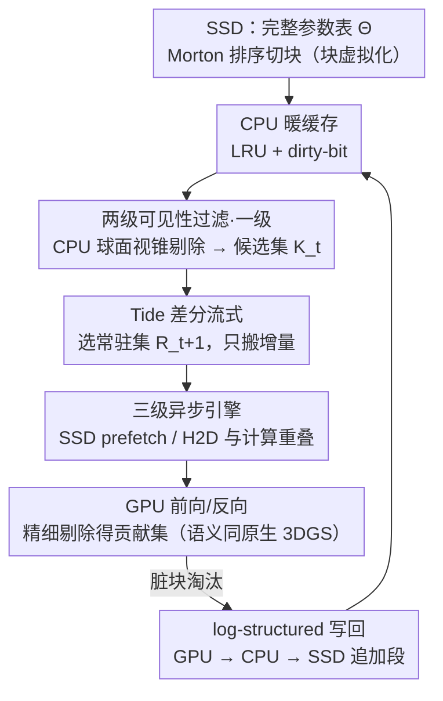

# TideGS: Scalable Training of Over One Billion 3D Gaussian Splatting Primitives via Out-of-Core Optimization

**会议**: ICML 2026 Spotlight  
**arXiv**: [2605.20150](https://arxiv.org/abs/2605.20150)  
**代码**: 待确认  
**领域**: 3D视觉 / 3D Gaussian Splatting / 系统优化  
**关键词**: 3DGS、out-of-core、SSD-CPU-GPU 三级存储、可见性稀疏、轨迹差分流式

## 一句话总结
TideGS 把 3DGS 的参数表搬到 SSD 上，按"块"虚拟化并以 GPU VRAM 作为视锥可见工作集的缓存，配合三级异步流水线和轨迹自适应差分流式传输，在单张 24 GB GPU 上首次把可训练的高斯数量从约 11M（原生 3DGS）/ 105M（CLM）推到 **超过 10 亿**，且大场景重建质量优于所有评测的单卡基线。

## 研究背景与动机

**领域现状**：3D Gaussian Splatting（3DGS）已经成为新视角合成的主流显式表示，每个高斯点带一组可学参数，靠 splatting 实现实时光栅化。相比 NeRF 这类隐式表示，3DGS 把模型容量直接搬到了"原语表"里——高斯越多，理论上重建越细，但显存压力也越大。

**现有痛点**：在标准 SH-degree-3 配置下，每个高斯有 $D=59$ 个 fp32 参数，再加上梯度和 Adam 的一阶/二阶矩，约需 8× 倍存放空间。一个 1 亿高斯的场景就要 ~90 GB，远超 24 GB 商用单卡上限。实测上，原生 3DGS 在 24 GB 卡上只能撑到 ~11.5M 高斯，ZeRO-Offload 风格的 Naive Offload 卡在 ~50M（每步仍需把全部参数搬上 GPU 做光栅化），即便是更聪明的 CLM（把 SH 系数 offload 到 CPU）也只能到 ~105M——再往上光栅化阶段的 radix-sort buffer 就直接吃光 VRAM。

**核心矛盾**：3DGS 把模型容量绑死在 GPU 显存上，但**单次迭代真正访问的高斯却极少**。在 MatrixCity BigCity 这种城市级场景上，单视角平均只激活 0.39% 的高斯（最差 1.06%），存在巨大的可见性稀疏；并且相邻时刻的相机视锥高度重叠，激活集之间有强时序局部性。也就是说，把所有参数永远塞在 VRAM 里是巨大的浪费。

**本文目标**：(i) 把"参数永驻 VRAM"打破成"VRAM 是当前工作集的缓存"；(ii) 把存储层级从 GPU↔CPU 进一步扩展到 SSD，让单张消费级 GPU 能训亿到十亿规模；(iii) 在做到这一切的同时，前向/反向语义和最终重建质量与原生 3DGS 保持一致。

**切入角度**：把 3DGS 训练类比为**稀疏 embedding-table 训练**——只把"当前 batch 用到的行"流进 GPU，其余留在 CPU/SSD。但 SSD 带宽低、延迟高，做朴素 offload 必然崩，需要"块对齐 + 异步流水线 + 差分传输"三件套同时上。

**核心 idea**：用块（block）作为统一的存储/缓存/传输单元，借助 Morton 排序保留空间局部性；CPU 端先做粗粒度视锥剔除决定哪些块进 GPU；再用**轨迹自适应差分流式**——只传送相邻迭代间常驻集合 $\mathcal{R}_t \to \mathcal{R}_{t+1}$ 的增量 $\mathcal{S}_t^+ = \mathcal{R}_{t+1} \setminus \mathcal{R}_t$，让跨层流量随"工作集变化量"而非"模型规模"伸缩。

## 方法详解

### 整体框架
TideGS 要解决的核心问题是：3DGS 把模型容量绑死在 GPU 显存上，但单步真正访问的高斯极少——如何把"参数永驻 VRAM"改成"VRAM 只缓存当前工作集"，从而在单张消费级卡上训到十亿规模。它的做法是搭一套以 SSD–CPU–GPU 三层存储为骨架的 out-of-core 训练系统：完整参数表 $\Theta \in \mathbb{R}^{N \times D}$（$D=59$）以**块**为单位常驻 SSD，CPU DRAM 维护一个带 dirty-bit 的 LRU 暖缓存，GPU VRAM 只放当前迭代真正要光栅化的**容量受限常驻集** $\mathcal{R}_t$。

每一步训练像一条数据在三层之间流动的流水线：先在 CPU 上对相机 batch 做块级视锥剔除，得到这一步保守可见的候选工作集 $\mathcal{K}_t$；接着异步 prefetch 把缺失的块从 SSD 经 CPU 搬到 VRAM；然后 GPU 上跑标准 3DGS 的前向/反向，语义与原生完全一致；最后把被淘汰的脏块异步搬回 CPU 缓存，等 CPU 缓存满了再批量追加写回 SSD。剔除、搬入、搬出这三件 I/O 事务都用独立 CUDA stream 和 I/O 线程与 GPU 计算重叠，把 SSD/PCIe 的延迟藏在计算之下，让 GPU 几乎不停摆。

### 关键设计

**1. 块虚拟化 + 两级可见性过滤：把按高斯的随机访问变成按块的大粒度 I/O，并在搬数据之前就滤掉不可见块**

SSD 的痛点是不擅长零散随机读、必须靠大块对齐才能跑满带宽，而 3DGS 原生的"按单个高斯访问"恰恰是最坏的随机模式。TideGS 先按高斯中心的 Morton 码排序，再切成大小 $B=4096$ 的连续块，每块负载 $4096 \times 59 \times 4$ B ≈ 944 KiB（约 236 个 4 KB 页），天然对齐文件系统/页缓存粒度，于是 SSD 访问就从随机小读变成顺序大读、跑得满 3.3 GB/s。每个块用一个 bounding sphere $(\mathbf{c}_k, r_k)$ 概括，作为粗粒度可见性测试的代理。

光做大块还不够，还必须在数据搬运**之前**把不可见块拦掉，否则跨层流量仍会随 $N$ 线性涨。因此过滤分两级：第一级在 CPU 上对相机 batch $\mathcal{B}_t$ 做 6 平面视锥球面剔除（若 $d < -r_k$ 则丢弃），留下保守可见块集合 $\mathcal{K}_t = \bigcup_{c \in \mathcal{B}_t}\{k \mid \mathrm{visible}(k, c)\}$；第二级在 GPU 上对常驻块内的高斯做标准 3DGS 精细剔除与光栅化，得到真正贡献集 $\mathcal{I}_t \subseteq \bigcup_{k \in \mathcal{R}_t \cap \mathcal{K}_t} \mathrm{Block}(k)$。Morton 排序让同块内的高斯空间紧凑、bounding sphere 更小，CPU 端剔除也就更准。块归属一旦初始化就固定，高斯位置更新只刷新所属块的 bound（允许相邻块 bound 重叠但不重复归属），这样既能批量 I/O，又**不改变原生 3DGS 的渲染语义**。

**2. 三级异步引擎 + log-structured 写回：在低带宽高延迟的 SSD 后端下仍让 GPU 不停摆，并把频繁的小块更新变成顺序大块追加写**

朴素 offload 的致命伤是每个阶段都串行等 I/O，端到端被 SSD 延迟支配。TideGS 把 (i) SSD prefetch、(ii) H2D 搬入、(iii) GPU 前/反向、(iv) D2H 搬出 + SSD flush 四件事放在专用 I/O 线程和独立 CUDA stream 上，再配合双缓冲块槽位做"当前迭代算的同时，把下一迭代要用的增量 $\mathcal{S}_t^+$ 提前搬进来"，于是 GPU 利用率主要靠这层 overlap 撑出来。

写回侧则要回避 SSD 的随机写放大。SSD 上用 append-only 段组织：初始模型写成不可变的 base segment，训练中更新的块按 cache flush 批次追加到 patch segment，靠一张索引表 $\mathrm{Index}[k] = (\mathrm{file\_id}, \mathrm{offset}, \mathrm{size}, \mathrm{version})$ 指向最新版本，从而把"原地覆写"换成"顺序追加"——这是 SSD 系统保住峰值写带宽的经典套路。脏块的淘汰走两步路径 VRAM → CPU → SSD：脏块先以 dirty 形式进 CPU 暖缓存，只有在被 CPU 缓存驱逐或显式 checkpoint 时才真正刷盘。这样 GPU 端反复修改的热脏块能一直留在 CPU 缓存里被改而不触盘，I/O 只摊销到真正的 capacity miss 上。

**3. Tide：轨迹自适应差分流式传输——跨迭代复用常驻块，只传增量，让流量随工作集变化量伸缩**

即便剔除后 $\mathcal{K}_t \ll N$，城市级场景里每步重传整个 $\mathcal{K}_t$ 仍是几百 MB 的 PCIe 流量。Tide 的观察是：只要相机轨迹平滑，相邻迭代的工作集高度重叠，真正需要新搬的增量远小于整个工作集。为此它先用 TSP-聚类排序（而非随机 shuffle）安排相机序列，主动增加相邻 batch 的工作集重叠；每次迭代从候选池 $\mathcal{C}_t = \mathcal{R}_t \cup \mathcal{K}_{t+1}$ 中按打分

$$s(k) = \lambda \cdot \mathbf{1}[k \in \mathcal{K}_{t+1}] + (1-\lambda) \cdot \mathrm{Recency}(k)$$

挑选下一步常驻集 $\mathcal{R}_{t+1}$，其中前一项关注"下一步要用到"、后一项保留 LRU 热度。当候选超出 VRAM 预算（$|\mathcal{K}_{t+1}| > C$）时采用 camera-balanced Top-$C$：先给 batch 内每个相机分配少量配额保证视角覆盖，再按全局 $s(k)$ 填满剩余槽位。

确定 $\mathcal{R}_{t+1}$ 后，跨层只搬运差集 $\mathcal{S}_t^+ = \mathcal{R}_{t+1} \setminus \mathcal{R}_t$、淘汰 $\mathcal{S}_t^- = \mathcal{R}_t \setminus \mathcal{R}_{t+1}$、保留交集 $\Omega_t^R = \mathcal{R}_t \cap \mathcal{R}_{t+1}$。由于轨迹平滑，$|\mathcal{S}_t^+|$ 通常远小于 $|\mathcal{K}_t|$，于是流量从"工作集尺度"又被压一个数量级——这也是"Tide"（潮汐）名字的来历：常驻集像潮水随相机移动缓慢起落，而不是每步整个重灌。优化器状态只为常驻块实例化、淘汰即弃、再入则冷重启，等于拿"瞬时矩状态"换"更小 VRAM 足迹与更小跨层流量"；好在轨迹排序让热块往往跨多次迭代留驻，矩状态实际很少冷启动。

### 损失函数 / 训练策略
完全沿用原生 3DGS 的光度损失、SH 阶 3 表示和 Adam 优化器调度，块大小 $B = 4096$。在 Mip-NeRF 360 上 batch=4 训 30k 步；MatrixCity 默认走 throughput 设定 batch=64 + 16 GB CPU cache（受显存压力时回退到 batch=16 + 32 GB CPU cache）。Morton 排序 + 初始 base segment 写入是一次性预处理：102M 高斯耗 1.9 分钟，1.1B 高斯耗 21.2 分钟，占总训练时间 <0.5%。

## 实验关键数据

### 主实验

可扩展性边界（24 GB 单卡上的最大可训规模）：

| 方法 | VRAM 复杂度 | 受限因素 | $N_{\max}$ |
|------|------|------|------|
| Native 3DGS | $O(N)$ | 全状态驻 VRAM | ~11.5M |
| Naive Offload | $O(N)$ | 每步参数（SH） | ~50M |
| CLM | $O(N)$ | 光栅化 buffer | ~105M |
| **TideGS (Ours)** | $O(\|\mathcal{R}_t\|)$ / $O(\|\mathcal{I}_t\|)$ | 常驻集预算 / SSD 容量 | **>1B** |

MatrixCity 大规模训练吞吐 + 跨层流量：

| 方法 | 规模 $N$ | 后端 | PCIe (GB/iter) ↓ | GPU Util (%) ↑ | Iter (ms) ↓ |
|------|------|------|------|------|------|
| Naive Offload | ~102M | DRAM | — OOM — | — | — |
| CLM | ~102M | DRAM | 0.41 | 37.0 | 100.8 |
| **TideGS** | ~102M | NVMe SSD | **0.10** | 43.3 | **90.7** |
| CLM | ~1.1B | DRAM | — OOM — | — | — |
| **TideGS** | ~1.1B | NVMe SSD | 0.97 | 49.5 | 525.6 |

In-memory regime（Mip-NeRF 360）质量对齐：TideGS 28.92 dB / 0.8689 / 0.1399 vs Native 3DGS 29.03 dB / 0.8694 / 0.1394，PSNR 仅差 0.11 dB，证明虚拟化没有动到优化目标。质量缩放（MatrixCity BigCity/Aerial 关掉 densify/prune）：CLM 在 ~102M 上 25.0 dB 然后 OOM，TideGS 在 ~1.1B 上达 **26.1 dB**——更多高斯换来了实打实的重建增益。

### 消融实验

| 配置 | Iter (ms) ↓ | PCIe (GB/iter) ↓ | CPU Cache Hit (%) ↑ |
|------|------|------|------|
| Full TideGS | **90.7** | **0.10** | **95.2** |
| w/o Tide（差分流式） | 145.3 | 0.85 | 95.2 |
| w/o Overlap（异步流水线） | 210.5 | 0.10 | 95.2 |
| w/o Morton（空间局部性） | 115.8 | 0.45 | 42.1 |

### 关键发现
- **差分流式贡献最大的"流量轴"**：关掉 Tide 后 PCIe 流量直接 ×8.5，迭代时间几乎翻倍——说明常驻集复用是把"块级 working set"再压一档的关键，没有它再好的剔除也撑不住大场景。
- **异步流水线贡献最大的"延迟轴"**：保持相同流量但串行执行后 iter time 从 90.7 ms 暴涨到 210.5 ms，端到端被 SSD/PCIe 延迟支配——说明 GPU 利用率主要靠 overlap 撑出来的。
- **Morton 排序是 CPU 缓存的命脉**：随机块布局让 CPU cache 命中率从 95.2% 摔到 42.1%，PCIe 流量翻 4.5 倍——空间局部性是 out-of-core 训练能否摊销 SSD 带宽的前提。
- **三个消融对最终 PSNR/SSIM/LPIPS 几乎无影响**：它们只改变数据搬运调度，没动可见高斯集合或优化目标，正向验证了"系统层优化与建模解耦"的设计哲学。

## 亮点与洞察
- 把 3DGS 训练**视为稀疏 embedding-table 训练**是非常漂亮的类比：embedding 系统几十年攒下来的 working-set cache、LRU、dirty-bit、log-structured write 这一整套机制几乎可以直接平移，作者只是把"行"换成了"3D 空间块"。这种"换个视角看老问题"的迁移本身就值得记下来。
- "轨迹自适应"对训练序列做**TSP 聚类排序**而不是经典的随机 shuffle，是个反 ML 直觉但对系统极友好的选择——它牺牲了一点优化器看到 i.i.d. batch 的便利，换来了 8.5× 的 PCIe 流量节省。论文也老实承认这是 trade-off（附录 A.1 讨论收敛），这种"为了系统适当让一步建模"的工程取舍很值得学习。
- **可见性两级过滤**（CPU 球面剔除 + GPU 精细剔除）让 SSD/PCIe 不再绑死在 $N$ 上，是把 out-of-core 从"卡 100M"推到"上 10 亿"的真正杠杆——核心信号 "$|\mathcal{K}_t| \ll N$"（单视角 0.39% 访问率）是数据驱动的设计指南，可以迁移到任何"全表大、单步访问稀疏"的训练场景，比如大规模 NeRF、稀疏专家 MoE、超大词表 LM head。
- 优化器状态"**冷启动可丢**"是一个被很多 offload 论文回避的硬选择：它换来了显著更小的 VRAM 足迹和更少跨层流量，并且作者用轨迹排序让热块大概率不冷启动，实际收敛影响很小（数据见附录 A.4）。这对"如何在做大规模训练时取舍优化器状态完整性"是一个有意思的样本。

## 局限与展望
- **依赖相机轨迹平滑性**：差分流式的收益来自"相邻 batch 工作集高度重叠"。如果是高度乱序的视频流、或者需要随机视角采样的下游任务（如新视角风格迁移），$|\mathcal{S}_t^+|$ 会接近 $|\mathcal{K}_t|$，Tide 的流量优势会被压扁。论文用 TSP 排序回避了这一点，但下游应用未必有自由排序的余地。
- **优化器状态冷重启的长期影响未深入**：附录给了 churn 统计，但是否会在某些纹理细节区域造成"刷新慢"或"局部 PSNR 抖动"，正文没有给出对比；如果常驻集预算 $C$ 设得激进，热块流失会让冷重启频率提高。
- **预处理 + 块归属固定的代价被低估**：Morton 排序 + base segment 写入虽说仅 <0.5% 训练时间，但**块归属固定**意味着高斯位置剧烈漂移时 bounding sphere 会越变越大、剔除越来越保守；作者只承认会刷新 bound，没量化"长期训练后剔除精度下降"的情况。一个自然的改进是周期性的离线 re-block + base segment compaction。
- **未与多卡系统正面对比**：作者明确把多卡（RetinaGS、Grendel-GS）排除在评测之外。这合理（不同硬件 budget），但在"亿规模建模"上多卡 vs 单卡 + SSD 的 cost-per-quality 是值得后续做的对比。
- **依赖 NVMe SSD 性能**：3.3 GB/s 的企业级 NVMe 是 sweet spot，消费级 SSD（尤其 QLC 或 SATA）实际带宽和写耐久度都差一截，论文未给"低端 SSD 上是否仍可用"的下界数据。

## 相关工作与启发
- **vs CLM (Zhao et al., 2026)**：CLM 把高维 SH 系数 offload 到 CPU，保留几何在 GPU；TideGS 把整个参数表都搬到 SSD，VRAM 只放视锥可见的 capacity-bounded 常驻集。结果上 TideGS 在 ~102M 把 PCIe 流量降 4×（0.41→0.10 GB/iter），把单卡极限从 ~105M 推到 >1B；架构上 TideGS 多出一级 SSD 存储，且把"reuse 工作集"做成了一等公民。
- **vs Naive Offload / ZeRO-Offload (Ren et al., 2021)**：Naive Offload 复刻了 LLM 的 ZeRO-Offload 思路（梯度+优化器去 CPU，参数留 GPU），但 3DGS 的瓶颈不在优化器而在参数表本身，所以收益不大、~50M 就到顶。TideGS 的关键区别是承认"3DGS 的参数访问是稀疏 + 轨迹相关"，从而把参数也搬出 VRAM。
- **vs 多卡 3DGS（RetinaGS / Grendel-GS）**：多卡靠堆显存横向扩展，单步可以装下大模型，但对硬件门槛高、工程复杂；TideGS 用纵向存储层级换横向显存堆叠，定位是"消费级单卡下的可达性"。两条技术路线互补，未来甚至可以叠加（每卡用 TideGS 再横向 sharding）。
- **vs 稀疏 embedding-table 训练 (Wilkening et al., 2021)**：这是 TideGS 思想上最直接的祖宗——把"全表大、单步访问稀疏"的工业级训练机制借鉴到 3DGS。启发是：未来任何"显式大参数表 + 稀疏访问"的场景（如 Hash-grid NeRF、稀疏 MoE expert pool、超大词表 token embedding）都可以尝试 SSD-tier out-of-core 方案。

## 评分
- 新颖性: ⭐⭐⭐⭐ 思路本身（稀疏 embedding-table 类比、out-of-core training）在系统圈不算新，但把这一整套机制系统性地搬到 3DGS、并把单卡极限推到 10 亿是首次。
- 实验充分度: ⭐⭐⭐⭐⭐ 同时给了"in-memory 不掉点 + 大规模可行性 + 三项消融 + 质量缩放"四个维度，PCIe 流量/缓存命中率等系统指标都有量化。
- 写作质量: ⭐⭐⭐⭐ 结构清晰，从可见性稀疏一路推到三件套设计，公式和图配合得当；个别地方（块归属固定的副作用）讨论稍浅。
- 价值: ⭐⭐⭐⭐⭐ 直接把"亿级 3DGS"从"必须多卡集群"降到"单张 24 GB 商用卡 + SSD"，对学术和创作者群体都是显著的可达性跃迁，且方法学（SSD-tier out-of-core + 差分流式）天然可以迁移到其他大参数表训练场景。

<!-- RELATED:START -->

## 相关论文

- [\[ICCV 2025\] A Unified Interpretation of Training-Time Out-of-Distribution Detection](../../ICCV2025/3d_vision/a_unified_interpretation_of_training-time_out-of-distribution_detection.md)
- [\[CVPR 2026\] Off The Grid: Detection of Primitives for Feed-Forward 3D Gaussian Splatting](../../CVPR2026/3d_vision/off_the_grid_detection_of_primitives_for_feed-forward_3d_gaussian_splatting.md)
- [\[CVPR 2026\] FastGS: Training 3D Gaussian Splatting in 100 Seconds](../../CVPR2026/3d_vision/fastgs_training_3d_gaussian_splatting_in_100_seconds.md)
- [\[CVPR 2026\] Faster-GS: Analyzing and Improving Gaussian Splatting Optimization](../../CVPR2026/3d_vision/faster-gs_analyzing_and_improving_gaussian_splatting_optimization.md)
- [\[CVPR 2026\] 3D sans 3D Scans: Scalable Pre-training from Video-Generated Point Clouds](../../CVPR2026/3d_vision/3d_sans_3d_scans_scalable_pre-training_from_video-generated_point_clouds.md)

<!-- RELATED:END -->
