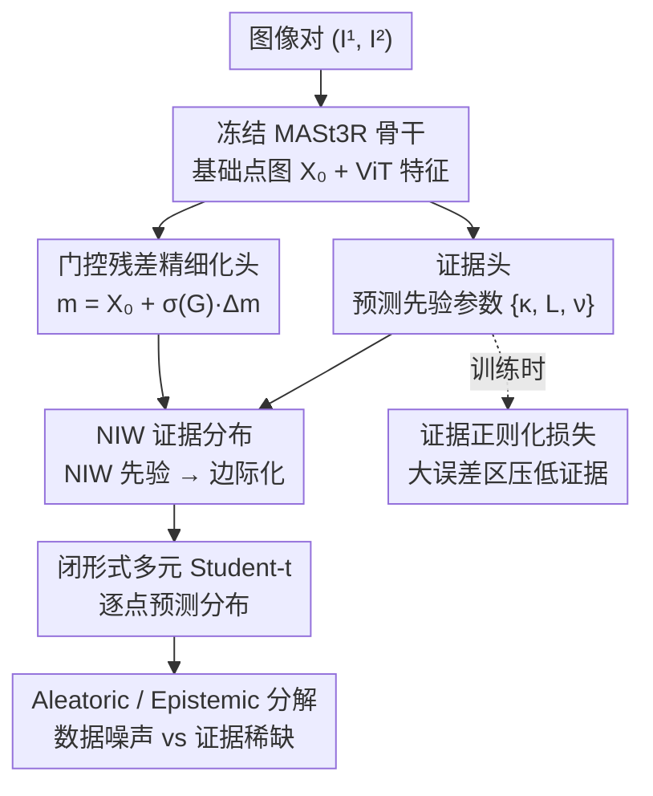

# Trust3R: Evidential Uncertainty for Feed-Forward 3D Reconstruction

**会议**: ICML 2026  
**arXiv**: [2605.19539](https://arxiv.org/abs/2605.19539)  
**代码**: https://trust3r-z.github.io/  
**领域**: 3D视觉 / 不确定性量化  
**关键词**: 证据学习, 不确定性量化, 3D重建, 点图, 几何基础模型

## 一句话总结
Trust3R 为 MASt3R 等 feed-forward 3D 重建模型引入概率化证据学习框架，用 Normal-Inverse-Wishart 先验为每个 3D 点预测闭形式多元 Student-t 分布，取代启发式置信度，单遍前向推理就能输出概率可解释的逐点不确定性，并在 ScanNet++ 上 AURC 降低 25%、AUSE 降低 41%。

## 研究背景与动机

**领域现状**：DUSt3R、MASt3R 等几何基础模型直接 feed-forward 回归稠密 3D 点图，无需迭代优化，已成为实时 SLAM 与机器人感知的关键构件。这些模型同时输出一张每像素的"置信度"图作为可靠性指标。

**现有痛点**：现有置信度是启发式学习权重，并非概率意义下的预测不确定性。这导致两个问题：在遮挡/低纹理/分布偏移等困难条件下置信度可能过高而实际误差很大；启发式置信度无法跨视图传播或与下游几何优化（如 SLAM 加权）形成概率一致的组合。

**核心矛盾**：feed-forward 3D 重建天然有歧义——重复纹理、遮挡、低纹理区域都会产生多个几何上合理但不同的解释。要"概率可解释"地刻画不确定性，传统方法要么 MC dropout 跑十几次前向，要么训练多个 ensemble 模型，对稠密点图代价太高；直接回归方差又训练不稳，难以排序误差点。

**本文目标**：设计轻量级、单遍、概率可解释的不确定性头，既保持基础模型精度，又对每个 3D 点输出闭形式预测分布。

**切入角度**：证据学习让网络直接预测"证据参数"（先验分布的参数），一次前向即可得到闭形式预测分布；多元证据回归用 NIW 先验产生多元 Student-t 分布，天然能建模 $x,y,z$ 坐标间的协方差，正好对应 3D 几何里坐标不独立的特性。

**核心 idea**：用 NIW 证据头为每个像素预测 $\{\mathbf{m}, \kappa, \boldsymbol{\Psi}, \nu\}$，再用门控残差头选择性微调预训练点图，单遍闭形式输出多元 Student-t 不确定性，并解析分解出 aleatoric / epistemic 两类。

## 方法详解

### 整体框架

Trust3R 要解决的是：让 feed-forward 3D 重建模型在单遍前向里输出"概率可解释"的逐点不确定性，而不是 MASt3R 那种没有概率含义的启发式置信度。它的做法是把一个冻结的几何基础模型当骨干，只在顶上叠两个轻量级头，再借证据学习把网络输出从"一个点 + 一个权重"升级成"一个完整的预测分布"。

具体地，输入图像对 $(I^1, I^2)$ 先经冻结的 MASt3R backbone 得到基础点图 $\mathbf{X}_0$ 和 ViT 特征。门控残差头在 $\mathbf{X}_0$ 上预测残差 $\Delta\mathbf{m}$ 与门控 $\mathbf{G}$，给出精细化后的均值 $\mathbf{m}$；证据头则从同一特征预测先验参数 $\{\kappa, \mathbf{L}, \nu\}$（$\mathbf{L}$ 是协方差尺度 $\boldsymbol{\Psi}$ 的 Cholesky 因子，保证正定）。把这组参数代入 NIW 先验并边际化掉隐变量，每个像素就直接得到一个闭形式的多元 Student-t 预测分布，无需任何采样或多遍前向就能解析地读出该点的不确定性，并进一步拆成 aleatoric / epistemic 两份。

### 关键设计

**1. Normal-Inverse-Wishart 证据分布：让网络一次前向就吐出带坐标协方差的预测分布**

痛点在于：要"概率可解释"地刻画稠密点图的不确定性，MC dropout 要跑十几遍、ensemble 要训多个模型，对稠密输出代价太高；直接回归方差又训练不稳。证据学习的思路是让网络不去预测点，而去预测"先验分布的参数"，一次前向就能解析地得到预测分布。Trust3R 假设每个 3D 点 $\mathbf{X}_i \sim \mathcal{N}(\boldsymbol{\mu}_i, \boldsymbol{\Sigma}_i)$，并对未知的 $(\boldsymbol{\mu}, \boldsymbol{\Sigma})$ 放一个 NIW 共轭先验，网络输出先验参数 $\boldsymbol{\theta}=\{\mathbf{m}, \kappa, \boldsymbol{\Psi}, \nu\}$——其中 $\mathbf{m}$ 是均值，$\kappa$ 表"对均值的信心"，$\nu$ 是自由度，$\boldsymbol{\Psi}$ 是协方差尺度。把隐变量边际化后，预测分布是闭形式的多元 Student-t：

$$p(\mathbf{X}\mid\boldsymbol{\theta}) = \mathrm{St}\!\left(\mathbf{X} \mid \mathbf{m},\ \frac{\boldsymbol{\Psi}(\kappa+1)}{\kappa(\nu-2)},\ \nu-2\right).$$

选 NIW 而非各坐标独立的 NIG，关键在于它显式建模了 $x,y,z$ 三个坐标之间的协方差，这正对应多视图三角化导致的坐标相关性——在挑战分布 ETH3D 上，NIW 把 AURC 从 NIG 的 0.3213 压到 0.3040。而且 Student-t 的负对数似然直接可导、推理与单遍预测同复杂度，等于用一次前向换来了集成才有的概率刻画。

**2. 证据正则化损失：逼模型在大误差区主动认怂**

纯证据 NLL 有个老毛病：模型可以在预测错的地方照样输出"高证据"（假装很自信），从而产生退化解、让不确定性和真实误差脱钩。为此 Trust3R 沿用 deep evidential regression 的标准正则项，定义证据总量 $e_i = \kappa_i + \nu_i$，并加一项与误差耦合的惩罚：

$$\mathcal{L}_{\mathrm{evi}} = \|\mathbf{X}^{\mathrm{true}}_i - \mathbf{m}_i\|_2^2 \cdot e_i.$$

当预测均值远离真值、$e_i$ 又大时这一项受重罚，于是模型被逼着在大误差区学出低证据 / 高不确定性，让输出的不确定性真正能给误差点排序，而不是一味自信。

**3. 门控残差精细化头：在"改几何"和"信预训练"之间做数据驱动取舍**

如果直接拿证据损失去微调骨干，几何精度会被拉坏，OOD 下尤其严重。门控残差头的做法是不硬改、而是给每个点配一个开关：均值取 $\mathbf{m} = \mathbf{X}_0 + \sigma(\mathbf{G}) \odot \Delta\mathbf{m}$，门 $\sigma(\mathbf{G})\to 0$ 时几何被冻结、完全信任预训练点图，$\to 1$ 时才放开调整，且门初始化为 no-op 保证冷启动稳定。这样模型能数据驱动地决定哪些点该动、哪些点该留——KITTI 上 MAE/RMSE 只微升而 AURC/AUSE 大幅改善，说明它倾向于在难点处"调高不确定性"而不是"乱改坐标"，把不确定性和几何精度的拉扯解耦开。

**4. Aleatoric / Epistemic 闭形式分解：区分"数据本身吵"和"模型没见过"**

NIW 预测分布还自带一个好处：两类不确定性可以解析地拆开，下游能据此做不同决策。aleatoric 对应观测噪声 / 固有歧义，等于协方差的期望；epistemic 对应证据稀缺 / 分布偏移，等于均值的方差：

$$\Sigma_{\mathrm{alea}} = \mathbb{E}[\boldsymbol{\Sigma}] = \frac{\boldsymbol{\Psi}}{\nu - 4},\qquad \Sigma_{\mathrm{epi}} = \mathrm{Var}[\boldsymbol{\mu}] = \frac{\boldsymbol{\Psi}}{\kappa(\nu - 4)}.$$

二者只差一个 $1/\kappa$ 因子，所以 $\kappa$（对均值的信心）越小，epistemic 越大。实验里 epistemic 分量排序质量最好，说明 Trust3R 抓住的主要是"证据稀缺"——这类区域可以触发额外传感器或人工审查，而 aleatoric 高的区域则更多是数据本身的歧义。

## 实验关键数据

### 主实验：不确定性排序质量

| 数据集 | 方法 | AURC↓ | AUSE↓ | Spearman ρ↑ | 推理方式 |
|--------|------|-------|-------|-------------|---------|
| ScanNet++ | MASt3R (启发式) | 0.1649 | 0.0747 | 0.2837 | 单遍 |
| ScanNet++ | Hetero (异方差) | 0.1616 | 0.0715 | 0.3545 | 单遍 |
| ScanNet++ | **Trust3R (NIW)** | **0.1233** | **0.0444** | **0.4946** | 单遍 |
| TUM RGB-D | MASt3R | 0.1649 | 0.0747 | 0.2837 | 单遍 |
| TUM RGB-D | Trust3R | **0.1233** | **0.0444** | **0.4930** | 单遍 |
| KITTI | MASt3R | 0.0538 | 0.0233 | 0.4812 | 单遍 |
| KITTI | Trust3R | **0.0481** | **0.0178** | **0.5169** | 单遍 |
| 平均 | MC Dropout (16×) | 0.4902 | 0.2726 | 0.3249 | 多遍 |
| 平均 | Deep Ensembles (5×) | 0.2992 | 0.0916 | 0.4556 | 多遍 |
| 平均 | **Trust3R** | 0.3861 | 0.1684 | **0.4898** | **单遍** |

### 消融实验

| 消融维度 | 配置 | AURC↓ | AUSE↓ | Spearman ρ↑ |
|---------|------|-------|-------|-------------|
| 不确定性来源 (ETH3D) | Aleatoric only | 0.3175 | 0.1452 | 0.3093 |
| | Total | 0.3064 | 0.1341 | 0.3455 |
| | **Epistemic** | **0.3040** | **0.1318** | **0.3483** |
| 证据分布族 (ETH3D) | NIG (独立坐标) | 0.3213 | 0.1493 | 0.3229 |
| | **NIW (协方差)** | **0.3040** | **0.1318** | **0.3483** |
| 门控残差 (ScanNet++) | 关 | 0.1788 | 0.0887 | — |
| | **开** | **0.1349** | **0.0512** | — |

### 关键发现

- 室内 ScanNet++ 上 AURC 相对 MASt3R 启发式置信度降低 25.2%、Spearman ρ 提升 74%，单遍即接近 5× Deep Ensemble 的排序质量。
- KITTI（OOD 户外）下几何精度小幅退步（MAE +3.4%）但不确定性显著改善，说明门控选择性微调把"难点"导向"标高不确定性"而不是"改坐标"。
- Epistemic 分量在所有数据集上排序质量最好，说明模型抓住的是"证据稀缺"而非"观测噪声"。
- 下游 SLAM（TUM RGB-D）用 Trust3R 不确定性加权替代启发式置信度，RPE 降低 13.4%。

## 亮点与洞察

- **概率化替代启发式**：把 MASt3R 的"置信度学习权重"升级为有 NIW 贝叶斯解释的预测分布，支持解析的 aleatoric/epistemic 分解，能跨视图组合并对接下游几何优化。
- **闭形式单遍 vs 多遍集成**：推理成本仅 1.6× 启发式（80.9ms vs 49.4ms），却接近 5× Deep Ensembles 的排序质量，对实时 SLAM/机器人是质变。
- **门控残差的稳定化**：把"是否覆盖预训练几何"做成 sigmoid 门并初始化为 0，是个简单而有效的稳定化 trick，可迁移到其他在冻结骨干上叠加不确定性头的场景。
- **跨基础模型可迁移**：在 VGGT backbone 上 Spearman ρ 从 0.3162 提到 0.6419，说明头是通用的，不局限于 MASt3R 一家。

## 局限与展望

- Student-t 是单模态分布，对强重复纹理/大遮挡这种"多个合理 3D 解释"的多模态歧义只能笼统标"高不确定性"，无法分离假设。
- 像素级 mean-field 假设没有显式建模相邻像素的空间相关性（如共面约束），可能在强纹理前景处偏乐观。
- OOD 泛化仍是开放问题，极端域偏移（合成→真实、近→远）的表现需更多验证。
- 下游集成只在 SLAM 加权一个场景上做了实证，融合/闭环/滤波等更深层应用还未覆盖。

## 相关工作与启发

- **vs MASt3R / DUSt3R**：他们出确定性点图 + 启发式置信度；本文证明在其顶上叠 evidential 头就能换来概率可解释的不确定性，几何精度几乎不掉。
- **vs MC Dropout / Deep Ensembles**：把"多遍采样"换成"单遍闭形式"，对实时几何任务是 4–20× 的提速。
- **vs Heteroscedastic 回归**：Hetero 只回归方差且假设坐标独立，本文 NIW 在难数据集上显著超越，说明协方差建模有几何意义。
- **vs Conformal Prediction**：CP 提供分布无关保证但通常保守，evidential 走参数路径换来更紧的估计，两者可互补。

## 评分

- 新颖性: ⭐⭐⭐⭐⭐ 首次把 NIW evidential learning 迁到稠密点图不确定性，并配上门控残差稳定化。
- 实验充分度: ⭐⭐⭐⭐⭐ 室内/户外/OOD 三类数据 + 启发式/Hetero/MCD/DeepEns 对比 + 完整消融 + SLAM 下游验证。
- 写作质量: ⭐⭐⭐⭐ 动机清晰、公式严谨，少数细节（如 post-upsampling smoothing）放在 appendix 影响可复现性。
- 价值: ⭐⭐⭐⭐⭐ 直击实时 3D 系统对"高效可靠不确定性"的真实需求，单遍闭形式 + 开源代码 + 易迁移头，对 SLAM/机器人社区有直接价值。

<!-- RELATED:START -->

## 相关论文

- [\[CVPR 2026\] Speed3R: Sparse Feed-forward 3D Reconstruction Models](../../CVPR2026/3d_vision/speed3r_sparse_feed-forward_3d_reconstruction_models.md)
- [\[CVPR 2026\] VGG-T3: Offline Feed-Forward 3D Reconstruction at Scale](../../CVPR2026/3d_vision/vgg-t3_offline_feed-forward_3d_reconstruction_at_scale.md)
- [\[CVPR 2026\] PanoVGGT: Feed-Forward 3D Reconstruction from Panoramic Imagery](../../CVPR2026/3d_vision/panovggt_feed-forward_3d_reconstruction_from_panoramic_imagery.md)
- [\[CVPR 2026\] Evidential Neural Radiance Fields](../../CVPR2026/3d_vision/evidential_neural_radiance_fields.md)
- [\[CVPR 2026\] AMB3R: Accurate Feed-forward Metric-scale 3D Reconstruction with Backend](../../CVPR2026/3d_vision/amb3r_accurate_feed-forward_metric-scale_3d_reconstruction_with_backend.md)

<!-- RELATED:END -->
