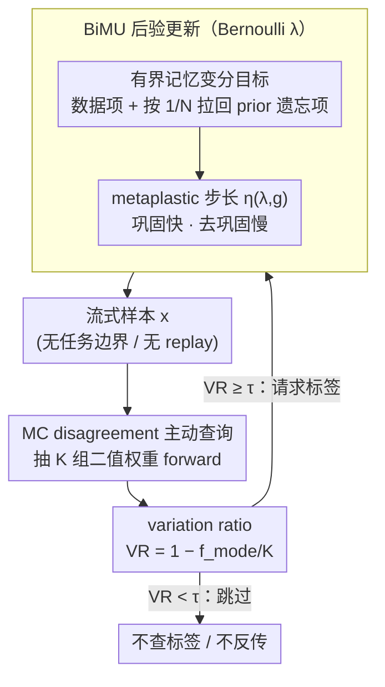

# Active Continual Learning with Metaplastic Binary Bayesian Neural Networks

**会议**: ICML2026  
**arXiv**: [2605.30198](https://arxiv.org/abs/2605.30198)  
**代码**: https://github.com/kellian-cottart/active-continual-learning-bayesianbinn  
**领域**: 模型压缩 / 连续学习 / 主动学习  
**关键词**: 二值贝叶斯网络、连续学习、主动学习、后验不确定性、边缘智能  

## 一句话总结
BiMU 为二值贝叶斯神经网络设计有界记忆和不确定性感知的 metaplastic 更新，防止 Bernoulli 后验在长程非平稳流中饱和，并用 Monte Carlo disagreement 实现无缓存的一次性主动查询，显著减少标签和反向传播更新。

## 研究背景与动机
**领域现状**：Always-on 边缘系统需要长期在线推理，并在用户、传感器或环境分布变化时持续学习。二值神经网络用 $\{-1,+1\}$ 权重和激活降低存储、乘加和数据搬运成本；贝叶斯二值网络进一步提供 epistemic uncertainty，可用于 OOD 检测和可靠性监控。

**现有痛点**：均值场 Bernoulli 后验在长时间数据流上容易饱和。随着证据累积，natural parameter $|\lambda|$ 越来越大，权重采样几乎确定，后验不确定性消失，synapse 很难再改变符号。对于连续学习，这意味着模型变得僵硬，难以适应新任务；对于主动学习，这意味着不确定性信号失效。

**核心矛盾**：边缘设备既需要稳定记住过去，又不能无限累积证据导致冻结；既要在线学习，又不能保存 replay buffer 或频繁反向传播；既要低比特推理，又要保留足够的贝叶斯不确定性来决定何时请求标签。

**本文目标**：作者希望为 mean-field Bernoulli synapses 推导一个 fully online、buffer-free 的连续学习规则，使二值网络在 1000 个任务级别的非平稳流中仍保持 plasticity 和 OOD uncertainty，并把这种不确定性用于一次性主动查询，减少标签和更新成本。

**切入角度**：论文从 bounded-memory Bayesian learning and forgetting 出发，把“只保留最近 $N$ 个更新窗口的信息”写成变分目标。对 Bernoulli posterior 展开后，可以得到数据项、向 prior 放松的遗忘项，以及一个随不确定性和梯度方向变化的 metaplastic step size。

**核心 idea**：把二值贝叶斯后验的自然参数更新设计成“数据驱动 + 有界遗忘 + 不确定性感知步长”，让二值 synapse 不会因长期证据累积而彻底冻结。

## 方法详解

### 整体框架
BiMU 要解决的是二值贝叶斯网络在长程非平稳流上的「后验饱和」问题：每个二值 synapse $\omega\in\{-1,+1\}$ 由 Bernoulli natural parameter $\lambda$ 参数化，$\lambda=0$ 是最大不确定，$|\lambda|$ 越大权重越确定，而普通贝叶斯更新只会把 $|\lambda|$ 越推越大，最终 synapse 冻结、不确定性消失。BiMU 的做法是把后验更新拆成三件事协同：当前 batch 数据驱动巩固、一个由记忆窗口控制的有界遗忘项把后验拉回 prior、一个看梯度与当前符号是否一致的非对称步长；推理时再用多组二值权重采样的预测分歧做一次性主动查询，决定要不要花标签和反向传播。整个过程只看当前 batch，不存 replay buffer，也不需要任务边界。

### 关键设计

**1. 有界记忆 Bernoulli 变分目标：让后验会遗忘，而不是无限累积证据**

连续学习长期僵化的根因，是证据被无限积累进 $|\lambda|$，synapse 越来越难翻转符号。BiMU 把变分目标写成三项之和：当前数据项、到上一时刻 posterior 的 KL 稳定项、以及到 initialization prior 的 KL 遗忘项，其中遗忘项权重取 $1/N$，$N$ 就是滑动窗口大小或证据半衰期。对 Bernoulli 后验展开求导后，更新里多出一个 prior relaxation 项 $(\lambda_{t-1}^{(i)}-\lambda_{prior}^{(i)})/(N\cosh^2(\lambda_{t-1}^{(i)}))$，它持续把已经很确定的 synapse 往 prior 拉一点点。$N$ 小代表更快忘记、更可塑，$N$ 大接近累计学习、更容易重新僵化，因此后验不再只会越来越确定，而是在稳定和可塑之间有一个可控旋钮。

**2. 不确定性感知的 metaplastic 步长：巩固快、去巩固慢**

真实数据流里既有稳定结构，也有短期噪声和类不平衡，如果对所有更新一视同仁，单个噪声样本就可能翻掉一个已经巩固好的权重。BiMU 不去估计昂贵的 Hessian，而是用一个有界的 surrogate learning rate $\eta(\lambda,g)$，让步长取决于当前 $\lambda$ 与梯度 $g$ 的符号关系：当 $\lambda g<0$、梯度在强化当前权重符号时，步长接近上界 $\alpha_{max}$，快速巩固一致证据；当 $\lambda g>0$、梯度试图反转当前符号时，步长缩小，必须有持续反证才会真正去巩固。这种非对称动力学正是让二值 synapse 既能学新任务、又不会被噪声轻易抹掉旧记忆的关键。

**3. 基于 MC disagreement 的一次性主动查询：把保留下来的不确定性换成标签节省**

前两个设计保住了 epistemic uncertainty，第三个设计把它变现成预算节省。边缘设备没法缓存未标注池再排序，也经不起频繁反向传播，所以 BiMU 对每个进来的样本抽取 $K$ 组二值权重做 MC forward，得到多个预测类别，再算 variation ratio $VR=1-f_{mode}/K$（$f_{mode}$ 是众数类别出现次数）。$VR$ 越高说明这 $K$ 次采样越不一致、样本越可能有学习价值；只要 $VR\ge\tau$ 就一次性请求标签并执行 BiMU 更新，否则直接跳过，既不要标签也不反向传播。由于二值网络 forward 可用 bit-level 操作，$K$ 次采样的成本远低于一次反向传播和权重写入，这让主动查询在边缘上真正划算。

### 损失函数 / 训练策略
数据项梯度用 Concrete / Gumbel-softmax 松弛估计，对 relaxed binary weights 反向传播并在 $K$ 个 MC 样本上平均。主要超参数包括 memory window $N$、最大 metaplastic step size $\alpha_{max}$、likelihood/KL 缩放系数，以及主动学习阈值 $\tau$。实验覆盖 1000-tasks Permuted-MNIST、OpenLORIS-Object 冻结 VGG19 特征上的在线线性头，以及 Animals/OpenLORIS 类不平衡主动学习。

## 实验关键数据

### 主实验
1000-tasks Permuted-MNIST 检验长程连续学习和 OOD uncertainty。BiMU 是二值方法中唯一在 1000 个任务后仍保持高准确率的方法。

| 方法 | Task bounds | Last 5 tasks Acc | OOD AUC | MMRR | Single-task Acc | 说明 |
|------|-------------|------------------|---------|------|-----------------|------|
| BiMU | no | 90.30±0.38 | 0.99±0.00 | 139.47 | 94.67±0.11 | 二值方法中最稳，且无需任务边界 |
| BayesBiNN | yes | 41.12±1.62 | 0.57±0.12 | 2.04 | 93.22±0.09 | 后验饱和导致长期僵化 |
| Syn. Meta. | yes | 10.27±0.01 | - | 1.64 | 71.40±1.48 | 强 metaplasticity 近乎不可逆 |
| STE | no | 29.35±0.96 | 0.69±0.04 | 9.32 | 77.56±1.35 | 缺少连续学习机制 |
| MESU | no | 91.69±0.58 | 0.95±0.03 | 261.10 | 96.10±0.18 | 实值贝叶斯强 baseline，但状态更大 |
| EWC Online | yes | 81.78±0.82 | 0.66±0.11 | 6.63 | 96.06±0.11 | 任务边界辅助下仍不如 BiMU |

OpenLORIS-Object 使用冻结 VGG19 特征和在线线性头，评估 nuisance-factor shifts 与特征压缩。

| 方法 | Features | Mean Acc | Aleatoric AUC | Epistemic AUC | 说明 |
|------|----------|----------|---------------|---------------|------|
| BiMU | 1,024 | 73.61±1.53 | 0.96±0.01 | 1.00±0.00 | 强压缩下保持可用 |
| BayesBiNN | 1,024 | 72.01±1.69 | 0.93±0.01 | 1.00±0.00 | 短 horizon 下接近 BiMU |
| STE | 1,024 | 52.88±3.39 | 0.73±0.02 | - | 二值确定性 baseline 明显较差 |
| BiMU | 8,192 | 89.19±0.19 | 0.99±0.00 | 1.00±0.00 | 压缩约 3 倍仍高精度 |
| BiMU | 25,088 | 90.62±0.22 | 0.93±0.00 | 0.90±0.00 | 原始特征下超过实值 baselines |

主动学习结果显示，BiMU 能把不确定性转成实际标签/更新节省。

| 场景 | 方法 / 设置 | 标签或更新比例 | 准确率 | 结论 |
|------|-------------|----------------|--------|------|
| Animals imbalanced | VR querying | 11% labels | 84.46% | 接近 100% 更新 baseline |
| Animals imbalanced | VR querying | 18% labels | 87.12% | 超过 100% 更新 baseline 86.28% |
| OpenLORIS imbalanced | BiMU VR | 3.1% updates | 88.70% | 相比全流 87.76%，32× 标签/更新节省 |
| OpenLORIS imbalanced | BiMU VR | 4.0% updates | 90.91% | 25× 节省且准确率更高 |

### 消融实验
Memory window 和 activation ablation 解释了 BiMU 的稳定-可塑机制。

| 消融 | 配置 | 结果 | 启示 |
|------|------|------|------|
| 网络容量 | 2000 hidden units | BiMU 95.20±0.26 Acc, OOD AUC 1.00, MMRR 862.09 | 增大容量时 BiMU 进一步提升，超过实值 baseline |
| Memory overhead | BiMU | 0.32 MB | 训练态内存等于推理态，不存历史参数/importance |
| Memory overhead | BayesBiNN | 0.64 MB | 需要额外 posterior 状态 |
| Memory overhead | Syn. Meta. | 1.84 MB | Adam 状态和任务 BN 参数带来额外成本 |

| Activation / 方法 | Last 5 tasks Acc | OOD AUC | MMRR | 说明 |
|-------------------|------------------|---------|------|------|
| BiMU + Sign | 81.78±0.58 | 0.76±0.08 | 22.25 | BiMU 机制有效，但 uncertainty 较弱 |
| BiMU + RBG | 90.29±0.24 | 0.99±0.01 | 215.52 | Reverse Binary Gate 明显增强表示和不确定性 |
| BayesBiNN + Sign | 66.40±0.97 | 0.54±0.19 | 5.85 | 换激活不能解决 rigidity |
| BayesBiNN + RBG | 67.41±1.03 | 0.76±0.17 | 4.99 | 单任务提升但长期僵化仍在 |
| MESU + ReLU | 93.51±0.18 | 0.91±0.03 | 500.02 | 实值模型仍强 |
| MESU + RBG | 92.35±0.21 | 0.80±0.05 | 943.44 | RBG 不适合所有模型 |

OpenLORIS 主动学习中的 MC 样本数分析说明，小 $K$ 已经能带来大部分收益。

| MC samples | Accuracy | Data used | Threshold | 说明 |
|------------|----------|-----------|-----------|------|
| 2 | 89.30±0.88 | 3.30±0.04% | 0.50 | 极少采样也可高效查询 |
| 3 | 90.61±0.53 | 3.87±0.05% | 0.33 | 已接近主结果 |
| 10 | 90.91±0.98 | 3.97±0.03% | 0.10 | 主实验设置之一 |
| 25 | 91.34±0.50 | 5.63±0.09% | 0.04 | 准确率更高但 forward 成本增加 |
| Full stream baseline | 87.76±0.19 | 100% | - | 主动查询能超过全量更新 |

### 关键发现
- BiMU 的主要优势来自防止 posterior saturation。BayesBiNN 单任务准确率很高，但长程流上迅速僵化；BiMU 通过有界遗忘和 metaplastic 步长保持长期适应。
- 不确定性不仅是诊断指标，也是省算力机制。VR 查询把更新集中在分布变化后和低频类别上，避免大量冗余多数类样本。
- 二值模型的 MC uncertainty 在边缘场景更现实。多次 forward 的开销可用 bit-level 操作降低，而反向传播和写权重才是主要成本。
- Memory window 是可解释控制旋钮。太小会快速遗忘，太大接近累计学习并重新僵化，中间值实现稳定-可塑平衡。

## 亮点与洞察
- 论文把“二值网络省算力”和“贝叶斯不确定性”真正结合起来，而不是只把二值网络当压缩模型。BiMU 让低比特模型还能长期表达 epistemic uncertainty。
- 从 bounded-memory Bayesian objective 推导二值 synapse 更新，比手工 metaplastic rule 更有原则，也解释了巩固/去巩固非对称性。
- 主动学习设计很贴近边缘现实：没有池化、没有 replay、没有任务边界，只用一次阈值判断决定是否花标签和反向传播成本。
- 实验中主动查询超过 100% 更新 baseline 很有意思，说明在类不平衡流里“少更新但更新对的样本”可能比全量在线 SGD 更好。

## 局限与展望
- BiMU 仍需要 MC forward 估计 uncertainty。虽然二值 forward 便宜，但在极低功耗设备上 $K$、阈值和延迟仍需精细权衡。
- 主实验大量使用冻结 VGG19 特征和在线线性头，完整端到端二值 CNN/Transformer 连续学习还需要更多验证。
- VR 对纯 label-function shift 可能失效，论文也指出 unlabeled uncertainty 未必能发现 $p(y|x)$ 改变但 $p(x)$ 熟悉的情况。
- 超参数较多，包括 $N$、$\alpha_{max}$、KL/likelihood scaling 和阈值 $\tau$，不同硬件和数据流上需要自动调节。
- 二值后验使用 Concrete relaxation 估计梯度，松弛温度和采样方差可能影响训练稳定性。

## 相关工作与启发
- **vs BayesBiNN**: BayesBiNN 提供 Bernoulli posterior，但长程流中后验饱和；BiMU 加入 bounded forgetting 和 metaplastic step size，保持可塑性。
- **vs MESU**: MESU 也是有界记忆贝叶斯学习，但面向实值 Gaussian posterior；BiMU 将类似思想专门推到 Bernoulli 二值 synapse，并显著降低训练态内存。
- **vs EWC / SI**: EWC/SI 通过 importance 约束保护旧知识，但需要额外状态和任务边界，且长期可能僵化；BiMU 无任务边界且不存 replay。
- **vs pool-based active learning**: 传统主动学习常假设有未标注池可排序；BiMU 是 stream 上一次性阈值查询，更适合 always-on edge 设备。

## 评分
- 新颖性: ⭐⭐⭐⭐☆ 把有界记忆贝叶斯、二值 posterior metaplasticity 和在线主动学习结合得很完整。
- 实验充分度: ⭐⭐⭐⭐☆ 长程 Permuted-MNIST、OpenLORIS、Animals、memory/activation/MC 消融较充分；端到端视觉模型仍可扩展。
- 写作质量: ⭐⭐⭐⭐☆ 公式推导和实验叙事清楚，但符号密度较高，附录结果很多。
- 价值: ⭐⭐⭐⭐⭐ 对边缘连续学习、低比特贝叶斯模型和低成本主动标注都有直接参考价值。

<!-- RELATED:START -->

## 相关论文

- [\[ICML 2026\] Singular Bayesian Neural Networks](singular_bayesian_neural_networks.md)
- [\[ICML 2026\] Frequency Matching in Spiking Neural Networks for mmWave Sensing](frequency_matching_in_spiking_neural_networks_for_mmwave_sensing.md)
- [\[CVPR 2026\] Federated Active Learning Under Extreme Non-IID and Global Class Imbalance](../../CVPR2026/ai_safety/federated_active_learning_extreme_noniid.md)
- [\[ICLR 2026\] Robust Spiking Neural Networks Against Adversarial Attacks](../../ICLR2026/ai_safety/robust_spiking_neural_networks_against_adversarial_attacks.md)
- [\[ICLR 2026\] ATEX-CF: Attack-Informed Counterfactual Explanations for Graph Neural Networks](../../ICLR2026/ai_safety/atex-cf_attack-informed_counterfactual_explanations_for_graph_neural_networks.md)

<!-- RELATED:END -->
