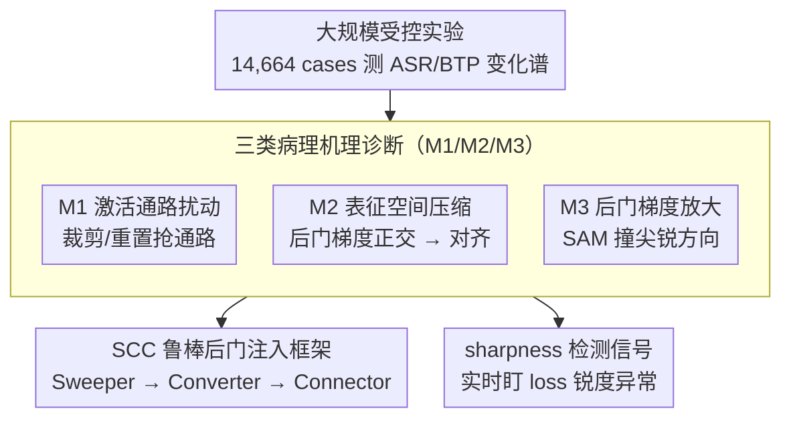

# Angel or Demon: Investigating the Plasticity Interventions' Impact on Backdoor Threats in Deep Reinforcement Learning

**会议**: ICML 2026  
**arXiv**: [2605.14587](https://arxiv.org/abs/2605.14587)  
**代码**: <https://github.com/maoubo/Plasticity>  
**领域**: AI 安全 / 深度强化学习后门攻击 / 可塑性干预  
**关键词**: DRL backdoor, plasticity intervention, SAM, loss landscape sharpness, robust backdoor injection

## 一句话总结
作者首次系统评估 7 种主流可塑性干预 (SAM/Shrink&Perturb/Weight Clip/SN/WD/LN/ReDo) 对深度强化学习 (DRL) 后门攻击的影响 (14,664 个实验)，发现只有 SAM 是"恶魔"——能显著加剧后门威胁；据此提出"Sweeper-Converter-Connector" 鲁棒后门注入框架并给出基于 loss landscape 锐度的检测信号。

## 研究背景与动机

**领域现状**：DRL 在机器人控制、无人机导航、自动驾驶中应用广泛；同时被发现易受后门攻击 (TrojDRL/BadRL/SleeperNets/UNIDOOR 等)。另一方面，DRL 训练存在"可塑性丢失" 问题 (非平稳输入 + 优化目标漂移会让 agent 渐失学习能力)，因此现代 DRL pipeline 普遍内置 plasticity 干预：Shrink & Perturb、Weight Clipping、Spectral Normalization、Weight Decay、Layer Normalization、ReDo、SAM 等。

**现有痛点**：(1) 后门研究和可塑性研究两条线长期井水不犯河水，从来没人系统问过"可塑性干预到底会让后门更容易还是更难"；(2) 实际部署 DRL agent 时这两类技术几乎总是同时存在，但缺乏指引会导致"以为加了 LN/SAM 是性能改进，实际却是安全漏洞"。

**核心矛盾**：plasticity 干预的设计初衷是稳定训练，对"恶意触发器→目标动作" 的映射学习是不是也有副作用？如果某些干预反而帮助后门更稳更猛，那它们就成了无意中的"攻击放大器"。

**本文目标**：(1) 量化每种干预在两种威胁模型 (TM-Scratch 从头训练时注入 / TM-Post 拿到模型后注入) 下对 ASR (攻击成功率) 与 BTP (良性任务表现) 的影响；(2) 找出影响背后的内在机理；(3) 据机理设计更鲁棒的后门注入框架，并提出后门检测信号。

**切入角度**：把可塑性领域已经成熟的三个 pathological 指标——**权重幅值 / 有效秩 / loss landscape 锐度**——直接挪来当后门内部属性的诊断仪表盘，对每种干预下后门 agent 进行排名分析。

**核心 idea**：用大规模 (14,664 cases) 受控实验 + 三指标病理诊断，把"干预效果"分解到三种机理 (M1 激活通路扰动 / M2 表征空间压缩 / M3 后门梯度放大)，再用机理反推鲁棒攻击与检测策略。

## 方法详解

### 整体框架
本文要回答的核心问题是"DRL pipeline 里标配的可塑性干预，到底会让后门更容易还是更难"。它先用一组庞大的受控实验把每种干预对攻击成功率 (ASR) 和良性表现 (BTP) 的影响测出来，再把这些杂乱的数字"翻译"成网络内部的病理变化，最后把诊断出的机理反过来用作攻击设计和检测信号。换句话说，整篇工作是"先大规模量出现象、再诊断出机理、最后把机理派生成攻防工具"这条主线，三块环环相扣。

### 关键设计

**1. 大规模受控实验：把"干预对后门的影响"测成一张谱**

要回答的痛点是：后门研究和可塑性研究长期各做各的，没人系统量过两者交互。作者用笛卡尔积把变量铺满——2 种威胁模型 (TM-Scratch 从头训练时注入 / TM-Post 拿到模型后注入) × 8 种干预 × 47 个后门任务 × 4 种攻击算法 (TrojDRL/BadRL/SleeperNets/UNIDOOR) × 3 个 seed = 9,024 cases，再加 5,640 cases 评估干预组合，总计 14,664 cases。攻击端统一用 transition tampering 把 trigger 注入 $(\text{state},\text{action},\text{reward})$ 三元组、用 backdoor reward 强化"触发器→目标动作"的绑定；任务覆盖 Gym 4 经典控制 + 2 物理控制 + PyBullet 3 机器人，兼顾离散/连续动作、稀疏/稠密奖励、冷启动/非冷启动条件，每种干预的超参都遵循其原论文。这样得到的 ASR/BTP 变化谱才足够稳，不会被某个超参或某个任务的偶然性带偏。

**2. 三类病理机理 (M1/M2/M3)：把现象归约成可解释的内部机制**

光看"某干预 ASR ±x%"无法解释为什么 SAM 会反向加剧后门。作者借用可塑性领域成熟的三个 pathological 指标——权重幅值、有效秩、loss landscape 锐度——对每个干预下的 backdoored agent 体检，把现象拆成三种机制。**M1 激活通路扰动**：Shrink&Perturb / Weight Clipping / ReDo 靠裁剪或重置权重，让"后门通路"和"良性通路"抢资源——Fig.6 显示后门攻击会让 actor 网第二层少量权重幅值剧增 (后门通路稀疏)，而 Weight Clip 一刀切把它们压回，逼出重建竞争。**M2 表征空间压缩**：Spectral Norm / Weight Decay / Layer Norm 通过限制 Lipschitz 常数或平滑激活，把原本与良性梯度近乎正交的后门梯度 (点积 $\approx 0$) 拉到几乎完全对齐 ($\approx 1.0$)，后门于是从稀疏单通路变成与良性共享的多通路，在非平稳训练下反而更不稳定。**M3 后门梯度放大**：SAM 用对抗扰动专门捕捉损失的尖锐方向，而后门样本恰好把 loss landscape sharpness 范围撑大 6 倍多 (+635.22%)，正好撞在 SAM 的"放大镜"下——SAM 把这些梯度放大、再把后门通路引向 flat minimum，使它对参数扰动格外鲁棒。这套 8×3 的病理向量 $\mathbf{v}(p_i)$ 让"SAM 反向"这类反直觉结论有了机理依据，而不只是统计巧合。

**3. SCC 鲁棒后门注入框架 (Sweeper-Converter-Connector)：把机理反向用作攻击 cookbook**

实验里发现组合干预 (Plastic/SLac/SSW) 比单用 SAM 更猛 (ASR $0.178\to0.418$, BTP $0.745\to0.915$)，作者顺势把三种机理拼成一条三步注入流程：**Sweeper** 用 Shrink&Perturb / Weight Clip / ReDo 类干预清掉一部分良性通路给后门腾位 (利用 M1)；**Converter** 用 Spectral Norm / Weight Decay / LN 把后门梯度从正交拉向对齐良性，让后门长成多通路结构 (利用 M2)；**Connector** 用 SAM 把这些多通路联合优化进 flat minima，使后门表征稳定共存 (利用 M3)。为量化"哪种组合更危险"，作者定义病理距离 $PD(A)=\sum_{i<j}\lVert\mathbf{v}(p_i)-\mathbf{v}(p_j)\rVert_2$，衡量组合内各干预的病理差异——实验证实 $PD$ 越大威胁越强 (如 SSW 的 $PD=18.64$ 对应最高 ASR)。其含义是：现实部署里本就常叠多种干预 (Plastic/Swiss Cheese 等)，攻击者只要按 SCC 模板挑机理互补的干预，就能白嫖一波攻击放大。

**4. 基于 loss landscape sharpness 的后门检测信号：把最强病理表象翻成防御指标**

三大病理里 sharpness 的差异最大 (后门让其波动范围扩 635.22%)，而且除 SAM 外的所有干预都会进一步加剧这一异常 ($v_{i3}>v_{13}$)，这让它天然适合当预警量。防御方可在 agent 整个训练过程实时盯 sharpness 时间序列，把显著的异常尖峰或急降视作可疑，配合任务自适应阈值与多源噪声去耦即可作为通用 DRL 后门预警。相比依赖触发器或专门 probe 的现有检测，sharpness 信号无须知道触发器、能挂在任何 DRL 训练流程上、且本就是优化器常规监控量，部署成本极低；代价是任务间 sharpness 基线方差大、其他训练异常也可能引发误报——作者明确把这两点留作开放问题。

### 损失函数 / 训练策略
本文不提出新损失，主体是评测协议本身：攻击端靠 transition tampering 注入 trigger、靠 backdoor reward 强化绑定；防御端不施加任何手段 (只研究干预的副作用)。47 个 backdoor tasks 覆盖单后门与多后门，每种干预超参均按其原论文设置，以保证跨干预对比公平。

## 实验关键数据

### 主实验
TM-Post 场景下 (干预对已训练好的 agent 更显著影响)，机器人控制任务的代表性 ASR / BTP 变化：

| 干预 | ASR (机器人) | BTP (机器人) | 主要病理影响 |
|------|--------------|---------------|-----------------|
| None (baseline) | 0.178 ± 0.157 | 0.745 ± 0.230 | — |
| Weight Clipping | ↓ 17.46% | ↓ 20.19% | M1 通路扰动 |
| Spectral Norm | ↓ 11.78% | ↓ 中等 | M2 表征压缩 |
| Layer Norm | ↓ 中等 | ↓ 11.93% | M2 表征压缩 |
| Weight Decay | ↓ 轻度 | ↓ 轻度 | M2 表征压缩 |
| Shrink & Perturb | ↓ 轻度 | ↓ 轻度 | M1 软扰动 |
| ReDo | ↓ 轻度 | ↓ 轻度 | M1 神经元重置 |
| **SAM** | **↑ 0.326 (+83%)** | **↑ 0.814 (+9%)** | **M3 梯度放大** |

干预组合对比 (机器人控制 + SAM 系列)：

| 组合 | 含 SAM? | ASR | BTP | Pathological Distance |
|------|---------|------|------|------------------------|
| None | — | 0.178 ± 0.157 | 0.745 ± 0.230 | N/A |
| Plastic | ✓ | 0.368 ± 0.144 | 0.724 ± 0.362 | 9.43 |
| SLac | ✓ | 0.417 ± 0.146 | 0.816 ± 0.276 | 17.42 |
| **SSW** | ✓ | **0.418 ± 0.092** | **0.915 ± 0.131** | **18.64** |
| Swiss Cheese (WD+LN) | ✗ | ≈ LN 单独 | ≈ LN 单独 | 0.52 |

### 消融实验

| 配置 | 现象 | 解读 |
|------|------|------|
| TM-Scratch (注入与训练同时) | ASR 仅微动 (LN 最大 -8.84%) | 表征尚未稳定，干预效果被训练动态稀释 |
| TM-Post (后训练注入) | ASR/BTP 变化显著 | 已稳定模型才显出干预影响 |
| 后门 vs 普通训练 (Fig.4) | weight magnitude 范围 +98.63%, effective rank +19.16%, sharpness +635.22% | sharpness 是最强的后门外在标志 |
| 仅 v.s. 多干预组合 | $PD$ 越大攻击越强；同机理组合 (Swiss Cheese) 几乎无增益 | 互补机理才能联合放大威胁 |
| Spectral Norm 后梯度对齐分析 (Fig.7) | 后门-良性梯度从 ≈0 升到 ≈1.00 | 验证 M2 表征压缩→通路共享 |
| Weight Clipping 3D 权重可视化 (App. Fig.13) | TM-Scratch 影响小、TM-Post 强 | 参数灵活性是关键变量 |

### 关键发现
- **反直觉**：SAM (本意稳定训练) 是唯一加剧后门的干预，因为它正好对后门带来的尖锐 loss 方向敏感并把它放大并压扁。
- **TM-Post 比 TM-Scratch 更敏感**：已收敛的良性表征要被后门"挤出空间" 才能注入，此时干预对参数灵活性的限制效应放大。
- **BTP 比 ASR 更敏感**：良性表征复杂、依赖大量协同参数，干预破坏后难以重建；后门表征稀疏、局部 pathway 易于快速重建。
- **干预组合非加性**：同机理组合 (Swiss Cheese = WD+LN, $PD$=0.52) 几乎无叠加效应；异机理组合 (SSW, $PD$=18.64) 攻击放大显著——SCC 的 Pathological Distance 是有效设计指标。
- **三大病理中 sharpness 最具检测价值**：后门攻击使 sharpness 波动范围扩 6 倍，其他干预 (除 SAM) 会进一步加剧这种异常，可被防御端利用。

## 亮点与洞察
- **大规模受控实验设计**：14,664 cases 覆盖 2 威胁模型 × 8 干预 × 5 组合 × 4 攻击 × 9 任务 × 多 seed 的笛卡尔积；这种规模在 DRL 安全文献里罕见，结论可信度高。
- **跨领域桥接**：把"可塑性" 与"后门安全" 两个看似无关的子社区用三大病理指标对接起来，是少有的"跨子领域诊断" 工作；对其他安全方向 (公平性、隐私) 都有方法论启发。
- **"角色复用" 思维**：SAM 在防御文献里被推崇为提升泛化的良药，本文揭示它同时是攻击放大器，提醒人们任何 generalization 工具都可能是双刃剑。
- **从机理到设计**：SCC 三角 (Sweeper-Converter-Connector) 把诊断结果直接转译为攻击设计 cookbook，并提供 PD 这种可量化的协同度指标——这种"机理→流程→指标" 三件套套路可借鉴。
- **sharpness 检测的可行性**：因 sharpness 本身就是优化器常规监控量，部署成本极低；这是一个被低估的免费防御信号。

## 局限与展望
- 实验任务集中在低维状态空间的控制任务 (Gym/PyBullet)，对 Atari / StarCraft 等高维像素观察任务是否依然成立未知。
- SCC 框架仅给出概念性设计，没有正式实现 + 对比真实"统一注入算法"——读者得自己拼装。
- Sharpness-based 检测面临两大挑战 (作者自承)：(1) 任务间 sharpness 基线方差大，难以设统一阈值；(2) 其他训练异常 (奖励 hacking、unstable critic) 也可能引起异常 sharpness。
- 干预超参敏感性虽在 App.E 做了 ablation，但只验证 "趋势一致"，未深入找出最坏情况组合。
- "组合干预放大攻击" 的结论倚赖现成的 5 种组合 (Plastic/Swiss Cheese/Lac/SLac/SSW)，未做系统的组合搜索；理论上还有更猛的组合存在。
- 本文不提防御对策 (除 sharpness 检测建议)，距离闭环安全方案还有距离。

## 相关工作与启发
- **vs TrojDRL/BadRL/SleeperNets/UNIDOOR**：这些工作只研究 vanilla DRL 下的攻击；本文把"现代 DRL pipeline 标配" 加进来评估，揭示了攻击 / 干预的复合效应。
- **vs Klein et al. 2024 (可塑性 survey)**：提供了四类干预动机分类；本文沿用其框架但调换视角，从"保塑" 改到"安全副作用"。
- **vs Lee et al. 2023 (SAM for DRL)**：把 SAM 当 plasticity-preserving 良药；本文相当于给出 SAM 的"安全警告标签"。
- **vs deep learning 后门防御 (Li et al. 2024b)**：DL 后门可通过 finetune-pruning 缓解；本文显示 DRL 中"裁剪" 类干预 (Weight Clip) 也有类似效果但代价是 BTP 下降，trade-off 仍开。
- **vs Lyle et al. 2024 (Swiss Cheese / multi-intervention plasticity)**：他们提倡组合干预提升泛化；本文显示同样的组合在 backdoor 视角下可能成为"漏洞放大器"，给"plasticity-aware 安全评测" 留下作业。

## 评分
- 新颖性: ⭐⭐⭐⭐ 首次系统刻画 plasticity 干预与 DRL 后门的交互关系，提出 SCC + sharpness 检测两条新思路。
- 实验充分度: ⭐⭐⭐⭐⭐ 14,664 cases 的笛卡尔积评估，配合三大病理诊断分析，论据极扎实。
- 写作质量: ⭐⭐⭐⭐ RQ 驱动结构、概念命名清楚 (M1/M2/M3 → SCC)，公式与图配合到位。
- 价值: ⭐⭐⭐⭐⭐ 直接影响所有部署带 plasticity 干预的 DRL 系统的安全实践，给攻防双方都提供了可操作信号。

<!-- RELATED:START -->

## 相关论文

- [\[NeurIPS 2025\] Impact of Dataset Properties on Membership Inference Vulnerability of Deep Transfer Learning](../../NeurIPS2025/ai_safety/impact_of_dataset_properties_on_membership_inference_vulnerability_of_deep_trans.md)
- [\[ICLR 2026\] Beware Untrusted Simulators -- Reward-Free Backdoor Attacks in Reinforcement Learning](../../ICLR2026/ai_safety/beware_untrusted_simulators_--_reward-free_backdoor_attacks_in_reinforcement_lea.md)
- [\[ICML 2026\] Regret-Based Federated Causal Discovery with Unknown Interventions](regret-based_federated_causal_discovery_with_unknown_interventions.md)
- [\[ICML 2025\] Adversarial Inception Backdoor Attacks against Reinforcement Learning](../../ICML2025/ai_safety/adversarial_inception_backdoor_attacks_against_reinforcement_learning.md)
- [\[CVPR 2026\] Monte Carlo Stochastic Depth for Uncertainty Estimation in Deep Learning](../../CVPR2026/ai_safety/mcsd_uncertainty_estimation.md)

<!-- RELATED:END -->
