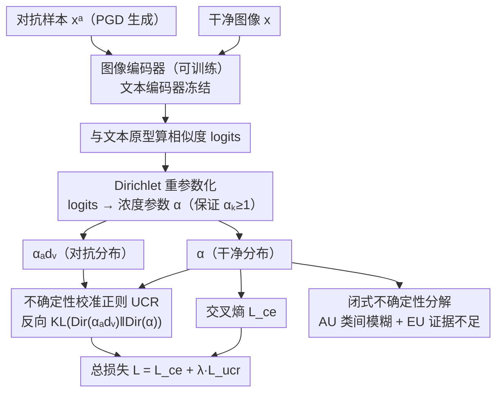

# Calibrating Uncertainty for Zero-Shot Adversarial CLIP

**会议**: ICML 2026  
**arXiv**: [2512.12997](https://arxiv.org/abs/2512.12997)  
**代码**: https://github.com/VivienLu/UCAT  
**领域**: AI安全  
**关键词**: 对抗鲁棒性, 不确定性校准, CLIP, Dirichlet分布, 零样本分类  

## 一句话总结

提出 UCAT 框架，将 CLIP 的 logits 重新参数化为 Dirichlet 分布的浓度参数，通过对齐干净样本与对抗样本的 Dirichlet 分布（反向 KL 散度），在零样本对抗微调中同时校准不确定性和保持语义结构，在 16 个基准上实现了鲁棒性与校准的最优平衡。

## 研究背景与动机

**领域现状**：CLIP 等视觉-语言模型通过对比预训练实现了强大的零样本识别能力，但对对抗攻击极其脆弱——微小的像素级扰动就能导致自信的错误分类。现有的零样本对抗鲁棒性（ZSAR）方法主要通过对抗微调图像编码器来提升鲁棒性，同时保留零样本泛化能力。

**现有痛点**：主流方法采用"单锚点对齐"策略，即将对抗特征拉向真实标签的文本嵌入方向，但忽略了与其他类别文本嵌入之间的相对几何关系。另一些方法虽然对齐了 softmax 分布，但 softmax 归一化会丢弃绝对 logit 尺度信息，而这在开放词汇场景下对可靠性推理至关重要。

**核心矛盾**：作者发现了一个反直觉的现象——对抗扰动不仅降低准确率，还**压制了预测不确定性**，使模型在被攻击时产生虚假的高置信度预测。这违背了"输入越困难/越偏离训练分布，不确定性应越高"的基本预期，暴露了超越准确率的**可靠性缺口**。

**本文目标**：设计一种同时优化准确率和不确定性校准的对抗微调方法，使模型在对抗攻击下既能保持鲁棒性，又能给出校准良好的置信度估计。

**切入角度**：作者观察到 CLIP 零样本分类的 softmax 概率与 Dirichlet 分布期望在数学上存在结构对应关系——两者都是对 logits 的 softmax 运算。这意味着 CLIP 的 logits 可以被重新解释为 Dirichlet 分布的证据参数。

**核心 idea**：将 CLIP logits 重参数化为 Dirichlet 浓度参数，用反向 KL 散度对齐干净与对抗样本的 Dirichlet 分布，从而同时保持类间语义关系（认知不确定性）和校准证据强度（偶然不确定性）。

## 方法详解

### 整体框架

UCAT 想解决的是 CLIP 对抗微调里"只盯准确率、不管置信度"的问题：模型被攻击后既会答错，又会虚高自信。它沿用标准的 CLIP 对抗微调骨架——冻结文本编码器、只训图像编码器，输入一对干净图像 $x$ 和对应的 PGD 对抗样本 $x^a$，各自算出与文本原型的相似度 logits。关键转换是把这些 logits 重新解释成 Dirichlet 分布的浓度参数，再让对抗样本的分布去对齐干净样本的分布，从而在保持鲁棒性的同时把不确定性校准回来。

### 关键设计

**1. Dirichlet 重参数化：让 CLIP logits 自带不确定性**

现有方法对齐 softmax 概率时会丢掉绝对 logit 尺度，而尺度正是开放词汇下判断"证据够不够"的关键信息。UCAT 的出发点是一个数学巧合：CLIP 零样本分类的 softmax 和 Dirichlet 分布的期望都是对 logits 做 softmax，二者结构对应。于是定义浓度参数 $\alpha_k(x) = \exp(h(\ell_k^{v \to t}(x)))$，其中 $h(\ell) = (\tau \ell + 1) / \tau'$。余弦相似度让 $\tau \ell_k \in [-1, 1]$，加 1 后落到 $[0, 2]$，除以校准系数 $\tau'$ 再取指数保证为正。这样构造的好处是 $\alpha_k \geq 1$ 恒成立，绕开了 $\alpha_k < 1$ 时 Dirichlet 的角集中效应和 digamma 数值不稳定。更妙的是当 $\tau' = \tau$ 时 Dirichlet 期望严格等于 CLIP 的 softmax 预测（$p_k^{\text{Dir}} = p_k^{\text{CLIP}}$），且任意 $\tau' > 0$ 都不改变 argmax——也就是说不动 CLIP 架构、不损原始预测，就凭空多出了一套闭式不确定性参数。

**2. 不确定性校准正则化（UCR）：用反向 KL 对齐两个 Dirichlet**

光有 Dirichlet 参数还不够，得让对抗样本的证据分布逼近干净样本。UCR 把正则化损失定义为 Dirichlet 层面的反向 KL 散度 $\mathcal{L}_{\text{ucr}} = \text{KL}(\text{Dir}(\alpha_{\text{adv}}) \| \text{Dir}(\alpha))$，与交叉熵合成最终目标 $\mathcal{L} = \mathcal{L}_{\text{ce}} + \lambda \mathcal{L}_{\text{ucr}}$。这里有两个刻意的选择：一是在 Dirichlet 层面而非概率层面对齐，因为概率级 KL 会抹掉绝对证据强度，Dirichlet 级则同时保住相对类结构（形状，对应认知不确定性）和总证据量（对应偶然不确定性）；二是用反向 KL 而非前向 KL，反向 KL 是 mode-seeking 的，只追踪干净分布的主模式、允许在无关类别上保持低证据，而前向 KL 会覆盖所有模式把证据平铺开。消融里这两个选择各自带来明显增益，验证了它们不是随意拍板。

**3. 闭式不确定性分解：一次前向同时给出 AU 和 EU**

有了 Dirichlet 参数，认知不确定性（AU）和偶然不确定性（EU）就能解析地分开算，不必像 MC Dropout 那样多次前向或挂额外模块。AU 取 Dirichlet 下分类分布的期望 Shannon 熵 $\text{AU}(x) = -\sum_k \frac{\alpha_k}{\alpha_0}(\psi(\alpha_k+1) - \psi(\alpha_0+1))$，刻画数据固有的类间模糊；EU 取总证据的倒数 $\text{EU}(x) = C / (\alpha_0 + C)$（$\alpha_0 = \sum_k \alpha_k$ 为总浓度，$C$ 为类别数），刻画证据不足的程度。证据越多 $\alpha_0$ 越大、EU 越小，符合"看得越清越笃定"的直觉，也让校准评估有了现成的标量出口。

### 损失函数 / 训练策略

总损失为交叉熵加 UCR 正则 $\mathcal{L} = \mathcal{L}_{\text{ce}} + \lambda \mathcal{L}_{\text{ucr}}$。对抗样本由 $\ell_\infty$ PGD 生成，校准系数取对比学习标准温度 $\tau' = 0.07$，正则权重 $\lambda = 10^5 / \beta$（其中 $\beta = 2/e^{\tau'}$）。训练全程只微调图像编码器，文本编码器保持冻结。

## 实验关键数据

### 主实验（16 个单标签数据集零样本对抗鲁棒性）

| 方法 | Clean Avg | PGD-100 Avg | CW Avg | AutoAttack Avg | H (Clean-AA) |
|------|-----------|-------------|--------|----------------|---------------|
| CLIP | 64.45 | 3.46 | 4.06 | 0.51 | 1.01 |
| TeCoA | 43.83 | 29.86 | 29.25 | 28.74 | 34.72 |
| FARE | 53.00 | 12.81 | 12.64 | 2.33 | 4.45 |
| PMG-AFT | 53.72 | 31.63 | 22.25 | 17.88 | 26.83 |
| TGA-ZSR | 49.91 | 31.55 | 31.28 | 30.52 | 37.88 |
| Comp-TGA | 52.09 | 31.40 | 31.16 | 26.24 | 34.90 |
| **UCAT** | **54.17** | **32.20** | **31.41** | **30.58** | **39.09** |

UCAT 同时取得最高的干净准确率（54.17%）和最佳的 Clean-AA 调和均值（39.09），在多数攻击设定下排名第一或第二。

### 消融实验

| 配置 | Clean | PGD-100 | CW | AutoAttack | 说明 |
|------|-------|---------|-----|------------|------|
| $\mathcal{L}_{\text{ce}}$ (TeCoA基线) | 43.83 | 29.86 | 29.25 | 28.74 | 仅交叉熵 |
| + KL(p(x)‖p(xᵃ)) | 45.03 | 30.12 | 29.61 | 29.13 | 概率级前向KL，微弱提升 |
| + KL(p(xᵃ)‖p(x)) | 45.05 | 29.98 | 29.28 | 28.80 | 概率级反向KL，微弱提升 |
| + KL(Dir(α)‖Dir(αₐdᵥ)) | 36.72 | 25.01 | 24.66 | 24.36 | Dirichlet级前向KL，性能下降 |
| **+ KL(Dir(αₐdᵥ)‖Dir(α))** | **54.17** | **32.20** | **31.41** | **30.58** | **Dirichlet级反向KL，大幅提升** |

消融清晰揭示两个关键设计选择：(1) Dirichlet 级别远优于概率级别——因为保留了绝对证据强度；(2) 反向 KL 远优于前向 KL——mode-seeking 特性更适合对抗场景。

### 跨骨干泛化

| 骨干网络 | 方法 | Clean | AutoAttack | H |
|---------|------|-------|------------|---|
| CLIP-B/16 | Base | 63.72 | 0.01 | 0.02 |
| CLIP-B/16 | +UCAT | 52.91 | 30.54 | 39.05 |
| CLIP-B/32 | Base | 64.42 | 5.58 | 10.28 |
| CLIP-B/32 | +UCAT | 54.17 | 30.58 | 39.09 |
| SLIP-B/16 | Base | 46.03 | 0.02 | 0.04 |
| SLIP-B/16 | +UCAT | 38.37 | 20.40 | 26.68 |

UCAT 在不同对比预训练 VLM 上都能显著提升鲁棒性，不依赖特定 CLIP 变体。

## 亮点与洞察

1. **对抗扰动压制不确定性**是一个重要的实证发现——模型被攻击后反而更"自信"，这比单纯的准确率下降更危险，因为用户无法通过置信度判断预测是否可靠
2. CLIP logits 与 Dirichlet 期望的**数学等价性**是一个优雅的理论洞察，使得整个框架无需修改 CLIP 架构即可获得不确定性估计能力
3. 消融实验中 Dirichlet 级反向 KL 相比概率级 KL 带来的**巨大性能差距**（Clean 43→54, AA 29→31），有力证明了保留绝对证据强度的重要性
4. 多标签 MS-COCO 实验表明方法在语义模糊场景下仍有优势，验证了分布对齐保留类间关系的设计直觉

## 局限性 / 可改进方向

1. 在强领域偏移数据集（PCAM、EuroSAT）上效果有限，因为 CLIP 本身在这些领域的干净语义结构较弱，Dirichlet 对齐缺乏可靠的参考分布
2. 当前仅在图像编码器侧做对抗微调，文本编码器完全冻结，未探索联合微调的可能性
3. $\tau' = 0.07$ 虽然在大多数场景下稳定，但对不同领域的最优校准系数可能不同

## 相关工作与启发

- **TeCoA / FARE / TGA-ZSR**：先前 ZSAR 方法主要做单锚点或 softmax 对齐，忽略了不确定性校准
- **Evidential Deep Learning (Sensoy et al., 2018)**：Dirichlet 参数化思想的来源，但原始 EDL 针对闭集分类，本文首次将其与 CLIP 的对比学习框架结合
- **TRADES (Zhang et al., 2019)**：经典鲁棒性-准确率权衡框架，UCAT 可视为其在开放词汇 VLM 中的 Dirichlet 级推广

## 评分

- 新颖性: 8/10 — CLIP logits 到 Dirichlet 证据的映射理论优雅，对抗扰动压制不确定性的发现具有启发性
- 实验充分度: 9/10 — 16 个数据集 + 多标签 + 跨骨干 + 详尽消融 + 校准分析，非常全面
- 写作质量: 8/10 — 理论推导严谨清晰，图表设计信息量丰富
- 价值: 8/10 — 为 VLM 对抗鲁棒性引入了不确定性校准视角，具有较强的方法论贡献

<!-- RELATED:START -->

## 相关论文

- [\[CVPR 2026\] Hierarchically Robust Zero-shot Vision-language Models](../../CVPR2026/ai_safety/hierarchically_robust_zero-shot_vision-language_models.md)
- [\[CVPR 2026\] Zero-shot Detection of AI-Generated Image via RAW-RGB Alignment](../../CVPR2026/ai_safety/zero-shot_detection_of_ai-generated_image_via_raw-rgb_alignment.md)
- [\[AAAI 2026\] OAD-Promoter: Enhancing Zero-shot VQA using Large Language Models with Object Attribute Description](../../AAAI2026/ai_safety/oad-promoter_enhancing_zero-shot_vqa_using_large_language_models_with_object_att.md)
- [\[ECCV 2024\] CLIP-Guided Generative Networks for Transferable Targeted Adversarial Attacks](../../ECCV2024/ai_safety/clip-guided_generative_networks_for_transferable_targeted_adversarial_attacks.md)
- [\[AAAI 2026\] Diversifying Counterattacks: Orthogonal Exploration for Robust CLIP Inference](../../AAAI2026/ai_safety/diversifying_counterattacks_orthogonal_exploration_for_robust_clip_inference.md)

<!-- RELATED:END -->
