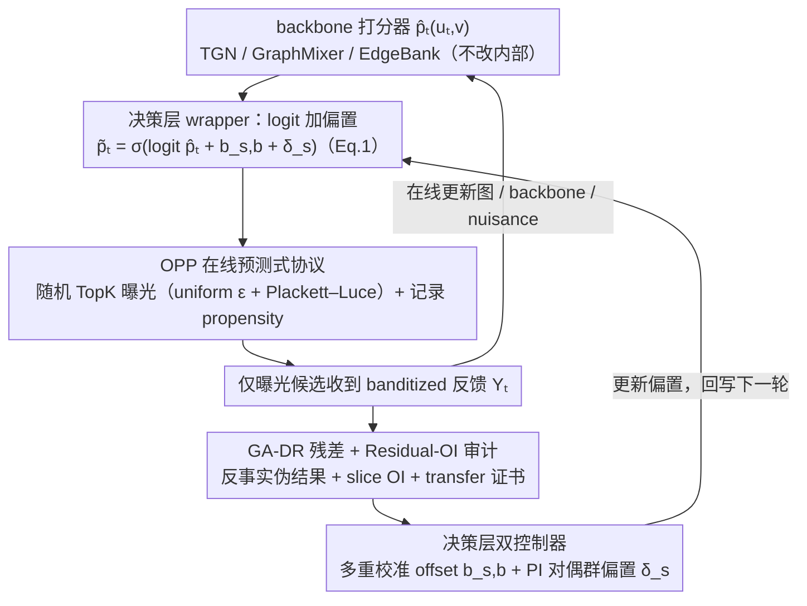

# COPF: An Online Framework for Deployment-Stable Counterfactual Fairness in Evolving Graphs

**会议**: ICML 2026  
**arXiv**: [2606.00700](https://arxiv.org/abs/2606.00700)  
**代码**: https://github.com/lsnnnnnnnn/COPF (有)  
**领域**: AI安全 / 公平性 / 在线推荐 / 图学习  
**关键词**: 反事实公平、performative prediction、双重稳健估计、在线多重校准、链路预测

## 一句话总结
COPF 把"演进图上的在线链路推荐"看成一个 performative 决策过程，在 backbone 打分器之外加一层 **决策层 wrapper**：用带显式探索的在线日志协议保证反事实可识别，用图感知双重稳健（GA-DR）估计器估计"曝光-未曝光"的反事实组间差距，再用 Residual-OI 审计 + PI primal–dual 控制器在线压制部署后出现的公平性 spike，理论上给出从插件式 OI 到真实反事实差距的 transfer 证书，在 TGB 与合成二部流上以可控的效用损失显著降低 Deploy 阶段的 worst-case TE 差距。

## 研究背景与动机

**领域现状**：在线链路推荐（"who to follow"、商品/内容推荐等）通常基于演进图上的链路预测 backbone（TGN、GraphMixer、EdgeBank 等）打分，然后按 Top-K 曝光给用户，用观察到的回访/点击数据继续训练。

**现有痛点**：这种 pipeline 是高度 *performative* 的——平台选择曝光哪些候选会改变后续观测到的边、改变图结构（如三角闭合、马太效应），从而改变后续训练数据。直接在日志上算公平性指标会被"曝光偏置"污染：某个群组被少曝光 → 观察到的正样本少 → 训练上又被压低，恶性循环。Mishler & Dalmasso 2022 也指出，许多 observable fairness 指标在 performative 环境里训练时满足，部署后就漂移。

**核心矛盾**：日志上的公平性 ≠ 反事实公平性。当 policy 更新时，曝光分布变了，"如果展示这条候选会发生什么 vs 不展示会发生什么"这个反事实量在普通日志里根本不可识别——既因为缺少 overlap，也因为图上的时间依赖和局部干扰让标准 IPW/DR 估计器失效。

**本文目标**：(a) 给出一个 *deployment-stable* 的反事实公平定义，部署前后可比较；(b) 让它能从一条在线流上被识别；(c) 给出在线审计 + 控制机制，把违规压下去而不大幅牺牲效用。

**切入角度**：把公平性目标定义在 **曝光的反事实效果** 上——对每个候选边 $(u_t,v)$ 比较"$D_t(v)=1$（曝光）" vs "$D_t(v)=0$（不曝光）"两个潜在结果 $Y_t^{(1)},Y_t^{(0)}$，然后跨组比较平均处理效应 $\tau_s = \mathbb{E}[Y^{(1)}-Y^{(0)}\mid A=s]$。这个量是"决策层"的——和具体 backbone 解耦，可以跨部署窗口比较。

**核心 idea**：用"显式探索 + propensity logging + 图感知双重稳健 + 残差-OI 审计 + PI 对偶控制器"五件套，把反事实公平做成一个可以挂在任何 backbone 外面的在线决策层。

## 方法详解

### 整体框架

COPF 解决的是"演进图上的在线链路推荐部署后公平指标会 spike"这个问题，做法是不动 backbone $\hat p_t(u_t,v)$ 的内部结构，只在打分和最终曝光之间插一层决策层 wrapper。它把每一轮决策看成一个 performative 过程：backbone 先给候选打分，COPF 在 logit 上加两个可学的偏置项 $\tilde p_t = \sigma(\mathrm{logit}(\hat p_t) + b_{s,b} + \delta_s)$（Eq.1），再用带显式探索的随机 TopK 采样决定曝光、同时记录 propensity，然后只对曝光的候选收到 banditized 反馈，并据此在线更新图、backbone、nuisance 估计与公平审计/控制器。整个运行流程对应 Algorithm 1（OPP Runner），分 Pre / Deploy / Post 三阶段：Pre 用大探索率 $\epsilon=0.20$ 暖机，Deploy/Post 切到 $\epsilon=0.02$ 以触发并观测 performative shift。

### 关键设计

**1. OPP 在线预测式协议：让反事实可识别**

公平性的真正目标定义在"曝光的反事实效果"上——对候选边比较 $D_t(v)=1$（曝光）与 $D_t(v)=0$（不曝光）两个潜在结果，但在一条单一的 performative 流里，这个反事实量默认是不可识别的：缺 overlap、图上有时间依赖和局部干扰。OPP 用五条规则把它做成 identifiable，是后续 DR 估计与审计的前置条件。OPP-0 保证时间顺序不泄漏；OPP-1 用 pre-decision 图 $G_{\le t}$ 在线构造候选集 $C_t$；OPP-2 是关键——用**混合策略**（uniform exploration 概率 $\epsilon$ + Plackett–Luce Top-K score 采样）让每个候选的边际曝光概率 $e_t(v)\ge \epsilon K/|C_t|>0$，同时记录 propensity（uniform 部分解析求、PL 部分用 128 次 Monte Carlo 估计后裁剪）；OPP-3 在线 cross-fit 更新 nuisance 与 backbone；OPP-4 在 rolling window 上做 prequential audit + control。Assumption 3.1 把 overlap、local ignorability、bounded local interference + temporal $\beta$-mixing 三个条件形式化。

这里的关键取舍是用 *policy-enforced overlap* 而非 *clipping-enforced overlap*：传统反事实公平方法（Kusner et al. 2017、Coston et al. 2020）依赖批量日志里恰好存在的 overlap，搬到 performative 在线场景就崩；COPF 用系统主动注入的探索保证 identifiability 真正成立，clipping 只用来吸收数值误差进 $\varepsilon_e$ nuisance 项（Lemma 4.2）。

**2. GA-DR 残差 + Residual-OI 审计：带证书的在线估计**

要在时间依赖 + 局部干扰下估计反事实公平差距，COPF 先定义图感知的自归一化双重稳健伪结果

$$\tilde\Gamma_t^{(a)}(u_t,v) = \hat\mu_{a,t}(W_t) + \frac{\mathbf{1}\{D_t(v)=a\}}{\hat e_t^{(a)}(v)}\big(Y_t-\hat\mu_{a,t}(W_t)\big),$$

配上图感知时间衰减权重做窗口平均 $\widehat{\mathbb{E}}_{\mathrm{GA},\mathcal W}$。用 DR 而非朴素 IPW 是因为后者在低 propensity 下方差爆炸、$\mu$-only 估计器在模型误设下有偏，DR 给"双重保险"；self-normalization + GA 权重把时间衰减与图局部结构（如 $k$-邻居子采样）直接编码进估计，否则后续 transfer bound 的 mixing 项会被污染。

在此之上构造两条残差序列：$\hat r^{(0)}=\tilde\Gamma^{(0)}-\hat p$（管校准）、$\hat r^{(\Delta)}=(\tilde\Gamma^{(1)}-\tilde\Gamma^{(0)})-\tau(W_t)$（管 TE parity）。Residual-OI 在 auditor 族 $\mathcal H$（实例化为 group × score-bucket × 可选 structural-role 的 slice 指示函数）上计算 $\widehat{\mathrm{OI}}_\mathcal{W}(r;\mathcal H)=\sup_{h\in\mathcal H}|\widehat{\mathbb{E}}_{\mathrm{GA},\mathcal W}[h_t r_t]|$。Lemma 4.1 把校准 / TE / Min 三种公平差距都线性化成残差的相关项，再除以最小 slice 质量即得 finite-sample 证书 $g_{\max}^{\mathrm{Cal}}\le (\varepsilon_0+\beta_0)/p_\min^{\mathrm{gb}}$、$g_{\mathrm{gap}}^{\mathrm{TE}}\le 2(\varepsilon_\Delta+\beta_\Delta)/p_\min^{\mathrm{g}}$。除以 slice mass 这一步让低质量小群组的证书自动放松，避免对极稀疏组发出过紧的虚假承诺。最后 Theorem 4.5 + Corollary 4.6 给出 noisy transfer：插件残差 OI 小 $\Rightarrow$ 真实反事实差距小，误差只到 nuisance 项 $C_1\varepsilon_e\varepsilon_\mu + C_2(\varepsilon_e^2+\varepsilon_\mu^2)$ 与 mixing 项 $C_3\sqrt{\tau_{\mathrm{mix}}\log|\mathcal H|/W_{\mathrm{eff}}}$，这正是把"插件式 OI"真正接到"真实反事实公平"上的关键一步。

**3. 决策层双控制器：多重校准 offset + PI 对偶群偏置**

审计出差距后要把它实际打回去，对应 Eq.(1) 里的两个加性 logit 调整，且都不重训 backbone。其中 $b_{s,b}$ 管细粒度校准：每轮在 DR residual buffer 上估计每个 slice 的 $\widehat{\mathbb{E}}[r^{(0)}\mid A=s,\hat p\in I]$，选 budget $B_{\mathrm{act}}$ 个最违规 slice 对 offset 做 clipped gradient step。$\delta_s$ 管粗粒度的 TE/Min 控制：在 $L_{\mathrm{win}}$ 窗口上计算 $(g_{\mathrm{gap}}^{\mathrm{TE}}, g_{\max}^{\mathrm{Cal}}, g^{\mathrm{Min}})$，每个约束维护一个 dual $\lambda$，由 soft violation $v_{\mathrm{TE}}=[g_{\mathrm{gap}}^{\mathrm{TE}}-\rho_{\mathrm{TE}}]_+$ 用 PI（比例+积分）更新驱动，群偏置由 Eq.(2) 给出

$$\delta_s = \mathrm{clip}\Big(\alpha\lambda_{\mathrm{TE}}(\bar\tau-\hat\tau_s) + \alpha'\lambda_{\mathrm{Min}}[\tau_{\min}-\hat\tau_s]_+\Big),$$

其中 $\bar\tau$ 是跨组平均效果、$\hat\tau_s$ 来自 GA-DR pseudo-outcome；Cal 维度 $\lambda_{\mathrm{Cal}}$ 用 hierarchical gating（先 TE/Min 达标再收紧 cal）默认关闭。两个控制器解耦是因为单用 multicalibration 只压 $r^{(0)}$ 校准、压不住 TE parity，单用 dual 控制器又会忽略 slice-level 校准——拆开让 $b_{s,b}$ 管"score bucket 内的局部修正"、$\delta_s$ 管"全组级别的曝光重分配"。这里还有一个关键安全设计：minimum-effect guardrail $g^{\mathrm{Min}}$ 把"任何组的平均处理效应不得低于 $\tau_{\min}$"作为硬约束，堵死"用降曝光达成 parity"（fairness-through-rationing）这种退化解；而且 offset 在 Pre 阶段只暖机、到 Deploy/Post 才真正生效。

### 损失函数 / 训练策略

整个目标是在线约束优化：最大化 ranking utility（MRR / Hits@10 / NDCG@10 / DeployHit@TopK），约束 $g_{\mathrm{gap}}^{\mathrm{TE}}\le \rho_{\mathrm{TE}}$、$g^{\mathrm{Min}}\le \rho_{\mathrm{Min}}$、可选 $g_{\max}^{\mathrm{Cal}}\le \rho_{\mathrm{Cal}}$。优化上 dual 用 PI 更新、primal 用 logit offset、nuisance $\hat\mu_a$ 在线 cross-fit。复杂度方面（Remark 4.7），靠增量邻域统计 + $k$-邻居子采样 + $B_{\mathrm{act}}$ 个 active auditor，每轮摊销开销 $O(|C_t|dL + |C_t|k + B_{\mathrm{act}})$。

## 实验关键数据

### 主实验

数据集：TGB 的 **tgbl-wiki**、**tgbl-review** + 一个 600 用户/4000 物品、200k 事件、注入组偏置的**合成二部流**。Backbones：EdgeBank / TGN / GraphMixer。3 阶段 Pre→Deploy→Post 各 20k 轮，TopK-Stochastic with $K=10$。3 seed 平均。

下表为最具说服力的"合成二部流 + GraphMixer"在 Deploy/Post 阶段的对比（mean，括号内 worst-case-in-phase）：

| 阶段 | 指标 | Base (GraphMixer) | Base + COPF | 变化 |
|------|------|-------------------|-------------|------|
| Deploy | NDCG@10 | 0.1417 | **0.1996** | ↑ +40.9% |
| Deploy | Hits@10 | 0.2952 | **0.4154** | ↑ +40.7% |
| Deploy | $g_{\mathrm{gap}}^{\mathrm{TE}}$ mean | 0.0103 | **0.0076** | ↓ -26% |
| Deploy | $g_{\mathrm{gap}}^{\mathrm{TE}}$ worst | 0.0477 | **0.0274** | ↓ -43% |
| Deploy | $g_{\max}^{\mathrm{Cal}}$ worst | 0.9178 | **0.7067** | ↓ -23% |
| Post | NDCG@10 | 0.1193 | **0.1768** | ↑ +48% |
| Post | $g_{\max}^{\mathrm{Cal}}$ mean | 0.5867 | **0.5076** | ↓ -13% |

TGB 真实流上的变化更小、更局部化（因为默认 ID-mod2 placebo split 本身就不带太强的组结构）：Wiki+TGN 上 PRE worst-case $g_{\mathrm{gap}}^{\mathrm{TE}}$ 从 0.0528 降到 0.0217、Deploy NDCG@10 0.2335→0.2365、Post 0.2219→0.2296、POST mean $g_{\mathrm{gap}}^{\mathrm{TE}}$ 0.0090→0.0067；但 POST $g_{\max}^{\mathrm{Cal}}$ 从 0.4727 升到 0.4892——作者据此把 $g_{\max}^{\mathrm{Cal}}$ 定位成"高方差诊断量"而非主目标，TE gap 才是 benefit-parity 的主指标。Review 上 TE gap 本来就极小（0.0030 量级），COPF 几乎不绑定（NDCG@10 0.0389→0.0392）。

### 消融实验

| 配置 | 关键观察 | 说明 |
|------|----------|------|
| Full COPF | 见上表 | Eq.(1) 双 offset + PI dual + 多重校准 + GA-DR + Residual-OI |
| TopK-Stochastic vs $\epsilon$-greedy | TopK-Stochastic 曲线更平滑 | 同样 exploration rate 下，PL 采样比硬贪婪噪声小 |
| Coverage-driven exploration（$p_{\mathrm{tar}}$ 扫） | 适度 coverage target 减少 slice starvation 而不显著伤 ranking | 防止小组样本不足导致 slice mass 过小 |
| 全窗口 vs certificate-aligned | 两条曲线高度吻合 | 主结论不是"挑了对自己有利的子总体" |
| ID-mod2 vs degree/activity split | 噪声水平不同，定性结论不变 | placebo 与结构相关划分都得到"COPF 在差距小时非绑定、差距大时主动控制" |

### 关键发现
- **COPF 的核心定位是 "non-binding when safe, active when violated"**：在 backbone 本身就公平的场景几乎不动；只有当 deployment 触发不稳定（如 GraphMixer + 合成偏置流）才显著介入，这是 deployment-stable 设计的预期行为。
- **Worst-case spike 压制比 mean 压制更明显**：Deploy 阶段 $g_{\mathrm{gap}}^{\mathrm{TE}}$ worst 降 43% 而 mean 只降 26%，说明 PI controller 的主要价值在压制 transient spike，这正是 performative shift 最危险的时刻。
- **效用和公平在合成流上同向**：NDCG@10 反而 +40%，并非 trade-off——原因是 GraphMixer + 偏置流下 base policy 陷入了"少曝光弱势组 → 弱势组训练信号弱 → 进一步少曝光"的恶性循环，COPF 通过 $\delta_s$ 强行注入曝光打破循环，同时改善了排序质量。
- **Calibration $g_{\max}^{\mathrm{Cal}}$ 在 banditized $Y^{(0)}\equiv 0$ 设定下方差极大**——作者诚实地把它降级为诊断量，主指标只承诺 TE gap，避免过度承诺。

## 亮点与洞察
- **把"反事实公平"做成决策层 wrapper** 是最干净的解耦——不挑 backbone（EdgeBank / TGN / GraphMixer 通吃），不挑训练目标（vs TGN-Adv / TGN-Reweight / TGN-Penalty 这些训练时干预方法），可以叠加在任何现有 fair-graph 工作之上。
- **"policy-enforced overlap" 而非 "clipping-enforced overlap"**：通过显式 uniform exploration 保证 $e_t(v)\ge \epsilon K/|C_t|$，再把数值误差吸收进 nuisance bound，这种把"识别性"内化进系统设计而非依赖事后假设的思路，比绝大多数 off-policy fairness 工作干净。
- **Minimum-effect guardrail 是 fairness-through-rationing 的优雅解药**：很多公平方法用"少曝光强势组"达成 parity，这其实是负和博弈。$g^{\mathrm{Min}}$ 直接以"任何组的平均处理效应不得低于 $\tau_{\min}$"为约束，把"用降低天花板换 parity"这条退路堵死，这个思路完全可以迁移到 RLHF / 推荐 / 广告分发的其他场景。
- **GA-DR + Residual-OI 的 mass-normalized 证书** 在小群组上自动放松，避免对低 slice mass 群体发"虚假紧 bound"——这是把统计严谨性翻译成系统行为的好例子。

## 局限与展望
- **作者承认**：(i) TGB 没真实 demographic，全靠合成 protected attribute（placebo ID-mod2 / degree-based），结论的"真实公平意义"受限；(ii) banditized $Y^{(0)}\equiv 0$ 反馈模型放大了 selection effect 但让 calibration 量很难解释；(iii) Assumption 4.3（plug-in Residual-OI 收敛率）是 *输入条件* 而非证明的速率，budgeted active-auditor 的收敛性分析留作 future work；(iv) bounded local interference 假设在长程信息传播（如病毒式扩散）下不一定成立。
- **额外发现**：(i) 论文没给 Base + COPF 在**多组**（$|\mathcal A|>2$）下的实验，所有实验都是二元分组；(ii) GA 权重的具体形式（time-decay 参数、$k$-邻居 hop）对结果的敏感性没有系统消融；(iii) PI controller 的 $(\alpha, \alpha')$、$L_{\mathrm{win}}$、$B_{\mathrm{act}}$ 等"控制参数"调参成本可能转嫁到使用者；(iv) compute cost 没给详细数字（"auditor on CPU"），在亿级流上是否可行不清楚。
- **具体改进**：把 group attribute 从 dyad-level 推广到 *path-level*（考虑多跳曝光的 indirect spillover）；引入 conformal-style 自适应阈值替代固定 $\rho_{\mathrm{TE}}$；把"显式探索成本"通过 contextual bandit upper-bound 量化，给出 utility-fairness pareto 的理论下界。

## 相关工作与启发
- **vs Dwork et al. 2025 (Any-Kernel OI on evolving graphs)**：本文沿用 OI / multicalibration 框架，但把审计对象从**真实观测残差**换成**反事实曝光残差** $r^{(\Delta)}$，并补上从插件到真值的 transfer 定理，这是把 OI 真正带进 performative 场景的关键一步。
- **vs Perdomo et al. 2020 (Performative Prediction)**：Perdomo 等关注 *stable point* 的存在性与收敛动力学，COPF 关注更工程化的"如何在 deployment shift 时不让公平指标 spike"，是 performative prediction 的 *fairness-side*应用。
- **vs Mishler & Dalmasso 2022**：他们指出 observable fairness 在 performative 环境失效，COPF 给出可行的反事实替代方案，并补上识别性 + 估计 + 控制全链路。
- **vs TGN-Adv / TGN-Reweight / TGN-Penalty (Dai & Wang 2020; Masrour et al. 2020; Li et al. 2022)**：这些是训练时去偏（修改 representation 或 loss），COPF 是部署时控制（修改 logit），可正交叠加。
- **vs Cao et al. 2025 (recommendation fairness over time)**：Cao 等做 post-hoc analysis on logged snapshots，COPF 做 deployment-time online control，互为补充。

## 评分
- 新颖性: ⭐⭐⭐⭐ 把 OI / DR / performative prediction / 在线控制四块用得到的东西缝合成一个 deployment-stable 框架，每块都有前驱但组合 + transfer 定理是新的。
- 实验充分度: ⭐⭐⭐ 3 个数据集 × 3 个 backbone × 3 个 seed 覆盖度尚可，但缺真实 demographic、缺多组实验、缺 compute 成本汇报；ablation 集中在 policy 和 reporting 而非 COPF 内部组件。
- 写作质量: ⭐⭐⭐⭐ 定义、定理、算法、协议层次清晰；诚实承认 $g_{\max}^{\mathrm{Cal}}$ 高方差并降级为诊断量；Lemma 4.1/4.2、Theorem 4.5、Corollary 4.6 串得很顺。
- 价值: ⭐⭐⭐⭐ "决策层 wrapper + 反事实公平 + transfer 证书"的设计模式可直接迁移到广告、内容、招聘排序等任何 performative 推荐场景，guardrail 思路尤其有借鉴价值。

<!-- RELATED:START -->

## 相关论文

- [\[NeurIPS 2025\] Fairness-Regularized Online Optimization with Switching Costs](../../NeurIPS2025/ai_safety/fairness-regularized_online_optimization_with_switching_costs.md)
- [\[ACL 2025\] Gender Inclusivity Fairness Index (GIFI): A Multilevel Framework](../../ACL2025/ai_safety/gifi_gender_fairness.md)
- [\[ICML 2026\] Fairness in Aggregation: Optimal Top-$k$ and Improved Full Ranking](fairness_in_aggregation_optimal_top-k_and_improved_full_ranking.md)
- [\[ICLR 2026\] ATEX-CF: Attack-Informed Counterfactual Explanations for Graph Neural Networks](../../ICLR2026/ai_safety/atex-cf_attack-informed_counterfactual_explanations_for_graph_neural_networks.md)
- [\[CVPR 2025\] Lyapunov Stable Graph Neural Flow](../../CVPR2025/ai_safety/lyapunov_stable_graph_neural_flow.md)

<!-- RELATED:END -->
