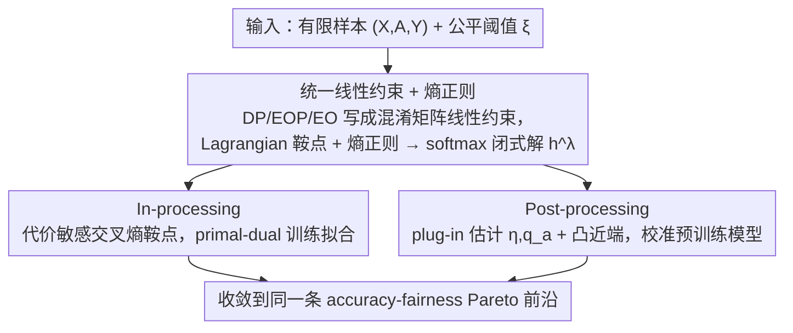

# Demystifying the Optimal Fair Classifier in Multi-Class Classification

**会议**: ICML 2026  
**arXiv**: [2606.00656](https://arxiv.org/abs/2606.00656)  
**代码**: 无  
**领域**: AI安全 / 公平性 / 多分类  
**关键词**: 公平分类, 多分类, Pareto前沿, In-processing, Post-processing

## 一句话总结
本文给出多分类公平分类问题中 Bayes 最优分类器的解析可处理形式（带熵正则的闭式解），并据此推出一对统一的算法 OptFair：训练阶段用 reduction 转化为代价敏感交叉熵的 saddle-point 优化，部署阶段用 plug-in 估计求解凸近端梯度问题，两者在理论上都收敛到 accuracy-fairness Pareto 前沿。

## 研究背景与动机

**领域现状**：群体公平性（DP、EOP、EO）已成为高风险决策（医疗、信贷、司法）中的标配约束。已有方法要么在训练时改目标（in-processing），要么在推理后改输出（post-processing），二者通常被独立设计。

**现有痛点**：（1）公平指标本质上**不可分解、不可微**，多分类下输出从标量变成单纯形上的向量，把二分类做法直接套过来非常笨拙；（2）in-processing 大多依赖**代理指标**（hinge/Adv loss），存在不可控的 surrogate gap，收敛不稳；（3）post-processing 要么只服务单一公平准则，要么没有显式刻画"最优分类器长什么样"，性能上限不清楚；（4）整个多分类公平学习领域**没有 Pareto 前沿的解析刻画**，掉点到底是算法弱还是问题本身决定的，无法回答。

**核心矛盾**：要"对多个公平准则、in/post 双阶段都通用、还能逼近最优"，必须先有一个**对多分类成立、对多种 DP/EOP/EO 都成立**的 Bayes 最优解析形式；否则各种实现只能各自摸黑做局部近似。

**本文目标**：分两步解决——先回答理论问题"最优多分类公平分类器到底是什么形态"；再给出 in-processing 与 post-processing 两个对应算法，并证明它们都收敛到上面那个最优解。

**切入角度**：把 DP/EOP/EO 都写成**群体特定混淆矩阵 $C^a$ 的线性约束** $|\sum_a \langle D^{a,k}, C^a(h) \rangle| \le \xi$，再用 Lagrangian 把约束打入目标；针对解析不可处理性，借鉴 entropic OT 的思路加入**熵正则** $E(h) = -\mathbb{E}_X [\sum_i h_i \log h_i]$，把 argmax 凸化成 softmax，得到闭式形式。

**核心 idea**：用熵正则化的 Lagrangian saddle-point 公式给出多分类公平最优分类器的 softmax 闭式解 $h^{\lambda^*}_i(x) \propto \exp(\beta^{\lambda^*}_i(x)/\tau)$，并把"训练拟合"和"推理校准"分别归约为代价敏感分类与凸近端优化，统一在 OptFair 框架下。

## 方法详解

### 整体框架

本文要解决的是"多分类下怎么找到、怎么逼近 accuracy-fairness 最优分类器"这一对理论+算法问题。做法是把原始约束优化 $\min_h R(h)$ s.t. $|D_k(h)| \le \xi$ 写成统一的 Lagrangian 鞍点 $L(h, \lambda) = R(h) + \lambda^\top D(h) - \xi \|\lambda\|_1$，先解析地刻画出最优分类器长什么样，再分训练态（in-processing）和部署态（post-processing）两条路去逼近它，并证明两者都收敛到同一条 Pareto 前沿。输入是 $(X, A, Y)$ 的有限样本与公平阈值 $\xi$，输出是一个 attribute-blind 的随机化分类器 $h: \mathcal{X} \to \Delta_m$。

### 关键设计

**1. 统一线性约束 + 熵正则：把含 $\arg\max$ 的最优解凸化成 softmax 闭式**

多分类公平最棘手的地方是公平指标不可分解、不可微，而且输出从标量变成单纯形上的向量。本文先把 DP/EOP/EO 等准则统一写成群体特定混淆矩阵 $C^a$ 的线性约束 $|\sum_a \langle D^{a,k}, C^a(h)\rangle| \le \xi$，这样多分类、多准则就能共用一份理论而不必逐个推导。对偶后 Theorem 4.2 给出无正则时的最优解 $h^*(x) \in \mathrm{conv}\{e_y : y \in \arg\max_j \beta^{\lambda^*}_j(x)\}$，其中决策向量 $\beta^{\lambda}(x) = \sum_a p_a(x)\, M(a,\lambda)^\top \eta(x,a)$，reweight 矩阵 $M(a,\lambda) = I - \frac{1}{\omega_a}\sum_k \lambda_k D^{a,k}$ 表示"若样本属于群体 $a$，每个真实-预测对要怎么加权才同时满足公平约束"。

但这个解含 $\arg\max$，对偶优化不可微。借鉴 entropic OT 的思路，对原问题加熵正则 $-\tau E(h)$，$\arg\max$ 就被凸化成 softmax：Theorem 4.3 给出闭式解 $h^{\lambda^*}_i(x) = \exp(\beta^{\lambda^*}_i(x)/\tau) / \sum_j \exp(\beta^{\lambda^*}_j(x)/\tau)$，对偶目标随之变成 $\min_\lambda \tau \mathbb{E}_X [\log \sum_j \exp(\beta^\lambda_j(X)/\tau)] + \xi\|\lambda\|_1$ 这种凸光滑+L1 的结构，标准近端方法一次就能求。温度 $\tau$ 控制随机程度：$\tau \to 0$ 退回硬 $\arg\max$（与 Theorem 4.2 一致），$\tau$ 适中则推理近似确定性、训练梯度光滑；二分类降维后该形式还能退回经典阈值规则（Menon & Williamson 2018），理论自洽。

**2. In-processing：把公平训练 reduction 成代价敏感交叉熵的鞍点问题**

训练阶段并不知道 $\eta, p_a$，所以"求 $\min_h L(h,\lambda)$"这步要约化成一个有显式 calibrated loss 的可微分类问题才能上 SGD。本文定义代价敏感损失 $\ell_{\mathrm{cal}}(y, f(x;\theta), a, \lambda) = -\sum_i [M'(a,\lambda)]_{y,i}\, \log \mathrm{softmax}_i(f(x;\theta))$，其中 $M'(a,\lambda) = M(a,\lambda) + \kappa \mathbf{1}_{m\times m}$ 加常数项保证每个 entry 严格为正，使其是一个合法的代价矩阵。Theorem 5.1 证明 $\arg\min_f \mathbb{E}[\ell_{\mathrm{cal}}]$ 诱导出的 $h^*(x;f)$ 与最优 $h^*(x;\beta^\lambda)$ 等价，即该损失对 inner min 是 calibrated 的——这正好补上了先前 in-processing 常用 hinge/adversary 代理目标、surrogate gap 不可控的短板。Algorithm 1 用标准 primal-dual：每轮跑 $R$ 步 $\theta$ 梯度，再做一步 $\lambda$ 的近端更新 $\lambda_{t+1} = \mathrm{prox}_{\eta_\lambda(\xi\|\cdot\|_1 + I_{\Lambda})}(\lambda_t + \eta_\lambda D(h_{t+1}))$。收敛性由 mixed Nash 分析（Theorem 5.2）保证：mixed strategy $(\bar h_T, \bar \lambda_T)$ 随迭代数 $T$ 增大收敛到 $\rho_T \le \bar\nu_T + uB_\Lambda \sqrt{K/T}$ 的近似平衡点，Theorem 5.3 再给出 $O(\gamma_d(N, m^2/\delta))$ 的泛化界，把"训练算法+数据规模 $\to$ 离 Pareto 前沿多远"量化清楚。

**3. Post-processing：plug-in 估计 + 凸近端，免重训校准任意预训练模型**

部署阶段已有预训练分数 $\hat\eta$，目标是不重训就输出一个公平校准后的概率分类器。本文额外训一个辅助模型 $\hat q_a(x) \approx P(A|X, Y)$，把 $\beta^\lambda$ 的样本估计 $\hat\beta^\lambda(x) = [\sum_a \mathrm{Diag}(\hat q_a(x))\, \hat M(a, \lambda)]^\top \hat\eta(x)$ 代回闭式 softmax（Eq. 15），最优 $\hat\lambda^*$ 通过解经验对偶 $\hat H(\lambda) = \hat f(\lambda) + \xi\|\lambda\|_1$ 得到。这里的关键好处是 $\hat q_a$ 解耦了"是否 attribute-blind"——传统 post-processing 要么推理时还得知道敏感属性、部署不友好，要么只服务单一准则，而这里推理时不需要真实属性。Proposition 5.5 证明 $\hat f(\lambda)$ 凸且 L-光滑，所以 Algorithm 2 直接对 $\lambda$ 做 proximal gradient descent 就能快速收敛到全局最优。误差由 Theorem 5.6 拆成三项 $\epsilon_1$（辅助模型偏差，含 $\|q_a - \hat q_a\|_1$）、$\epsilon_2$（有限样本）、$\epsilon_3$（频率估计偏差），调好 $\tau$ 后能拿到 $O(\sqrt\epsilon)$ 阶的最坏情形界。

### 损失函数 / 训练策略

In-processing 用 $\ell_{\mathrm{cal}}$（代价敏感交叉熵）+ primal-dual 优化：内层 $\eta_\theta$ 步学 $\theta$，外层 $\eta_\lambda = B_\Lambda / (u\sqrt{KT})$ 步用 prox 更新 $\lambda$，使其满足 $\|\lambda\|_1 \le B_\Lambda$。Post-processing 用 proximal gradient 解 $\hat H(\lambda)$。如需确定性分类器：in-processing 固定 $\bar\lambda$ 再跑一次 $\ell_{\mathrm{cal}}$ 收敛；post-processing 直接 $\arg\max h(x)$。温度 $\tau$ 取小值即可让 softmax 输出近乎 one-hot。

## 实验关键数据

### 主实验

四个标准公平基准（Adult / ENEM / ACSIncome / CelebA，后三者均为≥4 类多分类），分别在 DP 和 EO 两个准则下扫描 $\xi$ 画出 accuracy-fairness Pareto 曲线，越靠左上越好。

| 阶段 | 数据集 / 准则 | OptFair 表现 | 主要对照 |
|------|--------------|--------------|---------|
| In-proc | ENEM / DP | Pareto 前沿明显外推，同精度下 DP 比次优低 ~30% | ERM / AdvDebias / Weight-ERM / FairBatch / F-divergence |
| In-proc | ACSIncome / EO | 在 EO ≈ 0.1 时精度 ~0.47 显著高于基线（~0.42–0.44） | 同上 |
| Post-proc | CelebA / DP | 同 DP 下精度 ~0.74–0.76，优于 FairProjection、LinearPost、FRAPPÉ | 同 |
| Post-proc | Adult / EO | 全 trade-off 区间稳定贴在前沿外沿 | 同 |

定性结论：(1) in-processing 优势更明显，因其直接逼近理论 Pareto 前沿；(2) Adult/EO 上甚至出现公平约束**提升**精度的情况，原因是减少了固有偏差。

### 消融实验

ENEM/ACSIncome 上把 in-processing 训到一个公平阈值后再接 post-processing（In-Post-1 / In-Post-2，阈值不同），与单一阶段对照：

| 配置 | 说明 | 结果 |
|------|------|------|
| OptFair-in (only) | 仅 in-processing | 上界，最贴近 Pareto |
| OptFair-post (only) | 仅 post-processing | 与 in-only 接近，稍次 |
| In-Post-1 / In-Post-2 | 先 in 训到阈值再 post 校准 | 落在两者之间，**无叠加增益** |

### 关键发现

- In + Post 不叠加：in-processing 在表征层去偏，post-processing 只改输出分布，**两者作用域不同**，先后串接通常不会带来进一步提升，只是把两条曲线 interpolate。
- 在 Adult/EO 等场景，加入公平约束**反而提升精度**，说明数据本身的偏差会让 ERM 学到次优的分类边界，公平约束起到了正则化作用。
- 熵正则温度 $\tau$ 越小，输出越接近确定性，accuracy 上限越高但梯度越不稳；Theorem 5.6 已给出 $\tau$ 的最优阶以平衡 $\tau \log m$ 与 $1/\tau$ 项。

## 亮点与洞察

- **熵正则 + Lagrangian 的双重作用**：既让"最优公平分类器"从含 $\arg\max$ 的凸壳变成了 softmax 闭式（解析），又让对偶问题变成 convex + L-smooth + L1（可凸优化），这套思路其实可以迁移到任何"线性约束 + 不可微决策"的离散输出问题（rank/segmentation 公平等）。
- **In/Post 两个算法靠同一组 $\beta^\lambda, M(a,\lambda)$ 串起来**：意味着实际部署时可以训练阶段先用 in-processing 拿到一个 warm-start 的 $\bar\lambda$，部署阶段再继续用 post-processing 微调，工程上很优雅（即使消融显示精度上不叠加，工程灵活性是真）。
- **代价敏感损失**：把公平约束转成 calibrated cross-entropy，对 in-processing 社区是一个比 surrogate-based 损失更干净的范式——saddle-point 的对偶变量 $\lambda$ 自然给出每个 $(a, y, \hat y)$ 的代价权重，远比手动设计 reweighting 直观。

## 局限与展望

- **辅助模型 $\hat q_a$ 的质量决定 post-processing 上限**：Theorem 5.6 中 $\epsilon_1$ 包含 $\|q_a - \hat q_a\|_1$，当群体不平衡或属性预测困难时（如稀有种族交叉），post-processing 的最坏情形界会被这一项主导，实验里没有专门 stress-test 这一点。
- **图像 / 多模态数据上没法跑 In + Post 联合消融**：作者承认敏感属性难以直接喂入图像数据，所以 ablation 只在表格数据上做了——CelebA 这种"明显有性别属性"的数据其实应该可以做，论文回避了。
- **温度 $\tau$ 的选择缺少自动化**：实验里 $\tau$ 选小值是凭经验，没有 cross-validation 流程，也没分析对不同公平准则的最佳 $\tau$ 是否不同。
- **多准则联合 $K \ge 2$ 时的实际可控性**：理论支持 $K$ 个线性约束同时存在，但实验只演示单一准则的 trade-off；DP+EO 同时约束下的 Pareto 表面如何，未涉及。

## 相关工作与启发

- **vs Agarwal et al. 2018 (Reductions for binary fairness)**：本文是其多分类版本，但 inner loop 的 calibrated loss 从 0/1 importance-weighted 变成了 **cross-entropy 形式**（Theorem 5.1 的代价敏感 softmax），并把熵正则化引入对偶以保证可解性。
- **vs Xian & Zhao 2024 / Denis et al. 2024（多分类 post-processing）**：他们假设输出分布**连续**，且大多 attribute-aware；本文用 entropic relaxation 去掉连续性假设，并通过辅助模型 $\hat q_a$ 实现 attribute-blind 推理。
- **vs FairProjection (Alghamdi et al. 2022) / LinearPost / FRAPPÉ**：这些 post-processing 要么针对单一准则，要么缺乏对"最优分类器形态"的刻画；OptFair-post 把"最优解"直接写成闭式 softmax，于是其优化目标就是"逼近最优"而非"启发式校准"。
- **启发**：把"linear-constrained Bayes 最优 + entropic relaxation"作为通用模式可以用于排序公平、检索公平等其他场景；calibrated cost-sensitive loss 也可能替代 LLM 对齐里常用的 reward shaping。

## 评分
- 新颖性: ⭐⭐⭐⭐ 把熵正则化思路（OT 风格）引入多分类公平的 Bayes 最优刻画，并统一 in/post 两阶段，确实补上了一块理论空白
- 实验充分度: ⭐⭐⭐ 数据集和基线选得完整，但只跑了单一准则、缺多准则联合实验，且图像上的联合消融被回避
- 写作质量: ⭐⭐⭐⭐ Theorem-Algorithm-Experiment 三层对应清晰，notation 一致，Appendix 自洽
- 价值: ⭐⭐⭐⭐ 公平 ML 社区可直接复用这套 calibrated loss 和 plug-in 框架，对部署友好

<!-- RELATED:START -->

## 相关论文

- [\[ICML 2026\] Fair Decisions from Calibrated Scores: Achieving Optimal Classification While Satisfying Sufficiency](fair_decisions_from_calibrated_scores_achieving_optimal_classification_while_sat.md)
- [\[CVPR 2026\] Your Classifier Can Do More: Towards Balancing the Gaps in Classification, Robustness, and Generation](../../CVPR2026/ai_safety/your_classifier_can_do_more_towards_balancing_the.md)
- [\[ICML 2026\] Fair Dataset Distillation via Cross-Group Barycenter Alignment](fair_dataset_distillation_via_cross-group_barycenter_alignment.md)
- [\[ICML 2026\] Extending Fair Null-Space Projections for Continuous Attributes to Kernel Methods](extending_fair_null-space_projections_for_continuous_attributes_to_kernel_method.md)
- [\[ICML 2026\] Fairness in Aggregation: Optimal Top-$k$ and Improved Full Ranking](fairness_in_aggregation_optimal_top-k_and_improved_full_ranking.md)

<!-- RELATED:END -->
