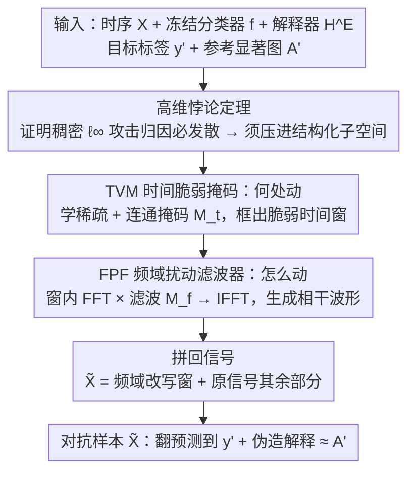

# Exposing Vulnerabilities in Explanation for Time Series Classifiers via Dual-Target Adversarial Attack

**会议**: ICML 2026  
**arXiv**: [2602.02763](https://arxiv.org/abs/2602.02763)  
**代码**: https://github.com/Bohan7/TSEF  
**领域**: 时间序列 / 可解释 AI / 对抗鲁棒性  
**关键词**: 时序解释器、对抗攻击、解释忠实性、频域扰动、双目标优化  

## 一句话总结
本文提出 TSEF——一个针对"时序分类器 + 解释器"联合系统的对偶目标攻击框架：通过学习"时间脆弱掩码 + 频域扰动滤波器"，在 $\ell_\infty$ 预算内同时把模型预测推到目标标签、又把解释推到攻击者指定的参考显著图，证明现有时序可解释流水线的"解释稳定 = 决策可信"假设根本不成立。

## 研究背景与动机

**领域现状**：医疗、金融、工业等高风险时序场景普遍采用"分类器 + 解释器"的可解释时序深度学习系统（ITSDLS）——分类器给预测、解释器（如 TimeX++、IG、感知扰动法）给一张 $T \times D$ 的显著图标注哪几个时间-通道对预测最重要。临床医生看 ECG 报警时，常常依靠这张显著图来"复核"模型的判断。

**现有痛点**：现有评估默认"解释稳定 = 模型可信"——把"解释在轻微扰动下不变"作为鲁棒性证据。同时对抗攻击文献只关心翻预测标签，而 vision/NLP 里的解释攻击（Ghorbani 2019、Zhang 2020、Ivankay 2022）又只散布或破坏归因，并没有同时强制"翻标签 + 伪造一张可信解释"的能力。

**核心矛盾**：当攻击者同时控制"模型说什么"和"为什么这样说"时，可解释性就从安全屏障变成了幌子。时序场景的两点特殊性让这种联合控制比 vision/NLP 更难——（1）**模式级控制**：时序模型对趋势、周期等结构敏感，逐点小噪声不足以稳定迁移到解释；（2）**高维悖论**：$T \times D$ 输入空间虽然给攻击留出大预算，但 $\ell_\infty$ 球内的稠密扰动会让归因质量按 $O(d - |\Omega|)$ 速率发散到目标区域之外，难以匹配稀疏连通的目标解释。

**本文目标**：证明时序解释器在对抗下不可信，给出第一个能在白盒下同时实现"目标分类 + 目标解释"的攻击算法，并提供量化指标揭示这一漏洞。

**切入角度**：从理论上证明"稠密 $\ell_\infty$ 步更新会让目标区域外归因质量随维度线性增长"（Theorem 4.1），由此推出必须把攻击限制在**结构化子空间**——只动少量"时间窗"+ 只动"频谱方向"，而不是逐点撒胡椒。

**核心 idea**：把攻击分解成"**何处动**（temporal vulnerability mask）"+"**怎么动**（frequency perturbation filter）"两个子问题，前者用稀疏 + 连通正则学一段连续时间窗，后者在 FFT 域改频谱再 IFFT 回去——天然产生趋势/周期级别的相干扰动，能同时驱动预测和解释。

## 方法详解

### 整体框架
TSEF 要解决的是一个双目标攻击问题：在白盒下攻击者完全访问冻结的分类器 $f$ 与解释器 $\mathcal{H}^E$，要在 $\ell_\infty$ 预算内找一个扰动 $\delta$，使对抗样本 $\tilde{\mathbf{X}} = \mathbf{X} + \delta$（$\|\delta\|_\infty \leq \epsilon$）既被预测成目标标签（$f(\tilde{\mathbf{X}}) = y'$），又让解释器输出贴近攻击者指定的参考显著图（$d(\mathcal{H}^E(\tilde{\mathbf{X}}), \mathbf{A}')$ 最小）。本文先用一条定理证明这件事不能靠逐点稠密扰动来做，再把攻击拆成"何处动"和"怎么动"两个嵌套子问题——内层学一个时间掩码 $\mathbf{M}_t \in [0,1]^{T \times D}$ 框出值得动手的时间-通道窗口，外层只在这个窗的 FFT 谱上学一个滤波器 $\mathbf{M}_f \in [0,2]^{K \times D}$ 来塑形扰动。最终对抗样本把"频域改写过的窗"和"原信号其余部分"拼回来：$\tilde{\mathbf{X}} = \mathcal{F}^{-1}(\mathcal{F}(\mathbf{M}_t \odot \mathbf{X}) \odot \mathbf{M}_f) + (1 - \mathbf{M}_t) \odot \mathbf{X}$。

### 关键设计

**1. 高维悖论的理论刻画：证明稠密攻击为何必然失败**

整个方法的出发点是先回答"为什么不能直接拿稠密 $\ell_\infty$ PGD 同时打预测和解释"。本文用一阶分析给出了 Theorem 4.1：考虑一次稠密 sign 步 $\delta = -\varepsilon \cdot \mathrm{sign}(g_c)$（$g_c$ 为分类损失梯度），并令 $\Omega$ 是参考解释的稀疏支撑（$|\Omega| \ll d$，即真正该被高亮的少数时间-通道）。定理证明目标区域之外的归因质量有一个随维度线性增长的下界 $\mathbb{E}[\|\mathbf{A}(\tilde{\mathbf{X}})\|_{1, \Omega^c}] \geq c \varepsilon (d - |\Omega|)$，进而 $\mathbb{E}[\|\mathbf{A}(\tilde{\mathbf{X}}) - \mathbf{A}'\|_1] \geq c \varepsilon (d - |\Omega|)$。这意味着在高维时序上，稠密扰动会把归因质量不可避免地撒到 $\Omega^c$ 上、离目标显著图越来越远。把这个实践直觉上升成定理后，"联合损失 + 单一 $\ell_\infty$ 球"这种 naive baseline 就被正式判了死刑，也直接给出了后两个模块的设计动机——必须把攻击压进一个结构化子空间，只动少量时间窗、只动频谱方向。

**2. Temporal Vulnerability Mask（TVM）：决定"何处动"**

TVM 负责在内层优化里学出一个稀疏且时间连通的掩码 $\mathbf{M}_t$，只允许在"最容易翻预测、又最能塑造目标解释"的时间-通道窗口里动手，从而把 $\ell_\infty$ 预算集中投放而非全局撒胡椒。它的内层损失同时含分类项 $\lambda_{\mathrm{cls}} L_{\mathrm{cls}}(f(\mathbf{X}'), y')$ 和解释项 $\lambda_{\mathrm{exp}} d(\mathcal{H}^E(\mathbf{X}'), \mathbf{A}')$，其中 $\mathbf{X}' = \mathbf{X} \odot (1 - \mathbf{M}_t)$——也就是"如果遮掉这段仍能把模型推向目标"就说明该段是脆弱区。在此之上加两条结构正则把掩码逼成一段连续窗：稀疏项用 KL 把每个位置的开启概率拉向先验 $r=0.3$，$\mathcal{L}_{\mathrm{spa}} = \frac{1}{TD} \sum \mathrm{KL}(\mathrm{Bern}(\mathbf{M}_t[t,d]) \| \mathrm{Bern}(r))$（对应互信息 $I(\mathbf{X}; M)$ 的变分上界，控制掩码不要全开）；连通项 $\mathcal{L}_{\mathrm{con}} = \frac{1}{TD} \sum (\mathbf{M}_t[t+1,d] - \mathbf{M}_t[t,d])^2$ 惩罚相邻时间步的跳变、鼓励连成片。优化上用 Gumbel-Sigmoid 加直通估计器让二值掩码可微，并对 $\mathbf{M}_t$ 走一个幅度无关的投影 sign 步 $\mathbf{M}_t \leftarrow \Pi_{[0,1]}(\mathbf{M}_t - \eta_t \mathrm{sign}(\nabla \mathcal{L}_t))$。这里用 sign 步而非普通梯度是关键：直接用梯度会被信号幅度大的位置主导（脉冲峰被误判为脆弱），sign 步让更新只看"对损失的方向贡献"而非"信号本身大小"，配合稀疏 + 连通约束，最终选出的是 ECG 里完整的"那段 QRS"，而不是散落的小点。

**3. Frequency Perturbation Filter（FPF）：决定"怎么动"**

FPF 负责在 TVM 框好的窗内做频域乘法滤波，让扰动落回时域时是连贯的趋势/周期波形，而不是逐点高频抖动——这正是解释器能稳定收敛到稀疏目标所需要的。具体做法是把窗内信号 $W = \mathbf{M}_t^* \odot \mathbf{X}$ 取 FFT 得 $\widehat{W}$，乘上滤波器 $\mathbf{M}_f$ 再 IFFT 回时域 $\widetilde{W} = \mathcal{F}^{-1}(\widehat{W} \odot \mathbf{M}_f)$，其中 $\mathbf{M}_f = 1$ 表示该频段不变、$<1$ 衰减、$>1$ 放大。滤波器参数化为 $\mathbf{M}_f = \Pi_{[0,2]}(1 + \alpha_{\mathrm{freq}} \tanh(\Theta_f))$，缩放因子 $\alpha_{\mathrm{freq}} = \gamma \epsilon' / (\|\Delta \mathbf{X}_{\mathrm{base}}\|_\infty + \tau)$ 自适应地把时域扰动压在 $\ell_\infty \leq \epsilon'$ 内（$\gamma = 0.98$ 是安全因子），并对复频谱强制共轭对称以保证 IFFT 回到实数信号；$\Theta_f$ 同样用 sign 步更新，使更新"能量无关"、避免高能频段主导梯度，从而聚焦于真正对联合目标有方向贡献的频段。这样设计的好处是：稠密 PGD 会在时域留下散乱噪声、解释器无法收敛到任何稀疏目标，而频域滤波天然产生持续若干时间步的相干波形（趋势项、低频包络）；再叠加 TVM 把扰动压进小窗，全局 $\ell_\infty$ 预算就被高效转换成局部强结构，配合解释损失即可把显著图精准"画"到参考位置。

### 损失函数 / 训练策略
两层交替优化：内层把 $\mathbf{M}_t$ 更新一轮选定脆弱窗 $\mathbf{M}_t^*$ 后传给外层；外层在窗固定的前提下优化频域参数 $\Theta_f$，目标为 $J_{\mathrm{atk}} = d(\mathcal{H}^E(\tilde{\mathbf{X}}), \mathbf{A}') + \lambda L_{\mathrm{cls}}(f(\tilde{\mathbf{X}}), y')$，如此交替直至收敛。解释距离 $d$ 可在 MSE / cos / KL 中任选；攻击样本只取分类器原本能正确分类的测试样本，以保证"翻转"确实发生。

## 实验关键数据

### 主实验
六个基准（合成：LowVar、SeqComb-UV、SeqComb-MV；真实：ECG、PAM、Epilepsy）× 三类解释器（TimeX++、TimeX、Integrated Gradients） × 七个 baseline（PGD、BlackTreeS、SFAttack、ADV²、Random/Local G/Global G 三种解释器扰动）。F1 / ASR 测分类攻击成功率；AUPRC / AUP / AUR 测解释攻击命中率（与参考显著图的对齐度）。下表节选 LowVar 在 TimeX++ 解释器下的对比：

| 方法 | F1↑ | ASR↑ | AUPRC↑ | AUP↑ | AUR↑ | 说明 |
|------|-----|------|--------|------|------|------|
| PGD | 0.833 | 0.846 | 0.258 | 0.194 | 0.318 | 翻预测但解释散布 |
| BlackTreeS | 0.728 | 0.740 | 0.361 | 0.271 | 0.375 | 同上 |
| ADV² | 0.777 | 0.795 | 0.617 | 0.522 | 0.609 | vision 联合攻击迁移 |
| Random | 0.014 | 0.014 | 0.786 | 0.643 | 0.730 | 不动预测 |
| **TSEF (Ours)** | **0.837** | **0.848** | **0.845** | **0.760** | **0.800** | 同时翻预测+塑造解释 |

ECG 上 TimeX++ 解释器的对比同样压制基线：

| 方法 | F1↑ | ASR↑ | AUPRC↑ | AUP↑ | AUR↑ |
|------|-----|------|--------|------|------|
| PGD | 0.902 | 0.946 | 0.639 | 0.715 | 0.431 |
| ADV² | 0.887 | 0.935 | 0.705 | 0.773 | 0.448 |
| **TSEF (Ours)** | **0.911** | **0.951** | **0.713** | **0.776** | **0.450** |

### 消融实验

按主流读法可拆解三个关键消融维度（论文 Section 5 + Appendix 整理）：

| 配置 | F1（分类）| AUPRC（解释）| 说明 |
|------|----------|-------------|------|
| TSEF 完整 | 高 | 高 | 时间掩码 + 频域滤波同时启用 |
| w/o TVM（在全时域做频域攻击）| 接近 | 显著下降 | 解释发散到无关时间步 |
| w/o FPF（仅时间掩码 + 时域 PGD）| 接近 | 中下降 | 时域噪声散乱，解释收敛慢 |
| w/o 稀疏 KL（$\mathcal{L}_{\mathrm{spa}}$）| 接近 | 下降 | 掩码趋于全开，等价于稠密攻击 |
| w/o 连通项（$\mathcal{L}_{\mathrm{con}}$）| 接近 | 下降 | 掩码碎片化，无法贴合连续目标区 |

### 关键发现
- **预测稳定性 ≠ 解释忠实性**：传统的 PGD/ADV² 即使 ASR ≈ 0.85 也无法把 AUPRC 推到 0.5 以上，证明解释器在标签翻转的同时仍可能保持"散布的、看似合理的"显著图——这正是临床场景里最危险的失败模式。
- **结构化扰动是必要条件**：Random 攻击的 AUPRC 高（0.786）但 ASR 为 0（因为它没攻击分类），普通 PGD 反过来——只有 TSEF 同时拿下两者，验证了"何处动 + 怎么动"分解的必要性。
- **跨解释器普遍漏洞**：TimeX、TimeX++、IG 三种结构截然不同的解释器都被同一框架攻破，说明这是"显著图作为可解释代理"这一范式的系统性脆弱点，不是某个特定解释器的实现 bug。
- **频域扰动的隐蔽性**：FFT 域改一两个频段后的 IFFT 信号在时域看起来仍像合理 ECG 波形（论文 Figure 1），但 P/Q/R/S 段的归因被精准重塑到攻击者指定位置，说明对抗医疗 AI 时甚至无需"明显的脉冲噪声"。

## 亮点与洞察
- **理论先行的攻击设计**：Theorem 4.1 把"为什么稠密攻击不行"用一行 $\Omega^c$ 上归因质量下界写明白，再用 TVM/FPF 直接绕开这个下界——这种"先证明不可能，再给出可能路径"的论证结构在对抗攻击文章里很罕见，可读性极强。
- **可迁移的攻击分解范式**：把"何处动"+"怎么动"分开学，本质是给攻击者引入了与防御者对称的结构先验。这一思路可以迁移到任何"信号 + 显著图"组合上——语音可解释模型、EEG 解释、视频时序定位等都可能复现类似漏洞。
- **直击可解释 AI 的核心假设**：本文不是"再次证明 DNN 可被攻击"，而是质疑"在可解释流水线下用户依据解释做决策"这一更深层假设。这个角度对医疗 / 金融 / 自动驾驶等强监管行业的"模型审计"流程有直接政策含义。

## 局限与展望
- 白盒威胁模型——需要梯度访问解释器，黑盒迁移性未做系统评估（论文承认这是未来方向）。
- 仅评估了 mask-based（TimeX/TimeX++）和 gradient-based（IG）解释器，对原型对比、反事实解释等家族未做实验。
- 自适应防御（如对抗训练时加入 TSEF 攻击）能否恢复解释忠实性是开放问题——本文只揭示漏洞、没提防御方案。
- 攻击需要逐样本两层优化，实时性差；若放到流式 ICU 监护场景需要进一步加速。
- 仅多元/单元时序，未覆盖图时序、跨模态时序（如视频 + 传感器）。

## 相关工作与启发
- **vs Ghorbani et al. 2019（vision 解释攻击）**: 他们证明图像解释可被扰动，但只做"扰乱"不做"指定目标"；本文是双目标（指定标签 + 指定显著图），且专门处理了时序高维悖论。
- **vs Ivankay et al. 2022（NLP 解释攻击）**: NLP 用离散 token 替换攻击，结构化得多；时序连续值 + $\ell_\infty$ 预算让稠密扰动天然发散，TSEF 的频域分解是对这种连续模态的针对性回应。
- **vs ADV² (Zhang et al. 2020)**: ADV² 也做联合预测-解释攻击但用统一 $\ell_\infty$ 球；本文在 SeqComb-UV / ECG 上 AUPRC 普遍高 0.05-0.10 pp，证明结构化子空间显著优于稠密优化。
- **vs Ding 2023 / Gu 2025（时序对抗）**: 它们只攻击预测、不控制解释；TSEF 在保持相近 ASR 的同时把解释推到任意指定位置，本质是把"对抗鲁棒性"和"可解释审计"两条线打通的第一篇。
- **vs Nguyen 2024（非自适应解释扰动）**: 他们用随机噪声测解释鲁棒性，TSEF 用自适应优化证明这种测试低估了真实威胁——一个把守门员当训练 dummy 的对手不能算真实评估。

## 评分
- 新颖性: ⭐⭐⭐⭐⭐ 第一篇真正同时控制时序"预测 + 解释"的攻击，理论与方法都新；高维悖论定理给了清晰的设计动机。
- 实验充分度: ⭐⭐⭐⭐⭐ 六数据集 × 三解释器 × 七基线（含三种解释扰动对照）覆盖全面，并提供 modular testbed 开源。
- 写作质量: ⭐⭐⭐⭐ 理论与算法部分流畅，掩码连通正则、频域自适应缩放等细节都讲得很清楚；个别符号（$\alpha_{\mathrm{freq}}$ 的计算窗）需要看附录才完全清楚。
- 价值: ⭐⭐⭐⭐⭐ 揭示了医疗/金融等高风险时序 AI 的系统性漏洞，对可解释 AI 评测协议有直接政策与工程含义，配套 testbed 可被防御方复用。

<!-- RELATED:START -->

## 相关论文

- [\[ICML 2025\] TIMING: Temporality-Aware Integrated Gradients for Time Series Explanation](../../ICML2025/ai_safety/timing_temporality-aware_integrated_gradients_for_time_series_explanation.md)
- [\[ICML 2026\] TimeGuard: Channel-wise Pool Training for Backdoor Defense in Time Series Forecasting](timeguard_channel-wise_pool_training_for_backdoor_defense_in_time_series_forecas.md)
- [\[AAAI 2026\] Rethinking Target Label Conditioning in Adversarial Attacks: A 2D Tensor-Guided Generative Approach](../../AAAI2026/ai_safety/rethinking_target_label_conditioning_in_adversarial_attacks_a_2d_tensor-guided_g.md)
- [\[AAAI 2026\] Angular Gradient Sign Method: Uncovering Vulnerabilities in Hyperbolic Networks](../../AAAI2026/ai_safety/angular_gradient_sign_method_uncovering_vulnerabilities_in_h.md)
- [\[NeurIPS 2025\] Dual-Flow: Transferable Multi-Target, Instance-Agnostic Attacks via In-the-wild Cascading Flow Optimization](../../NeurIPS2025/ai_safety/dual-flow_transferable_multi-target_instance-agnostic_attacks_via_in-the-wild_ca.md)

<!-- RELATED:END -->
